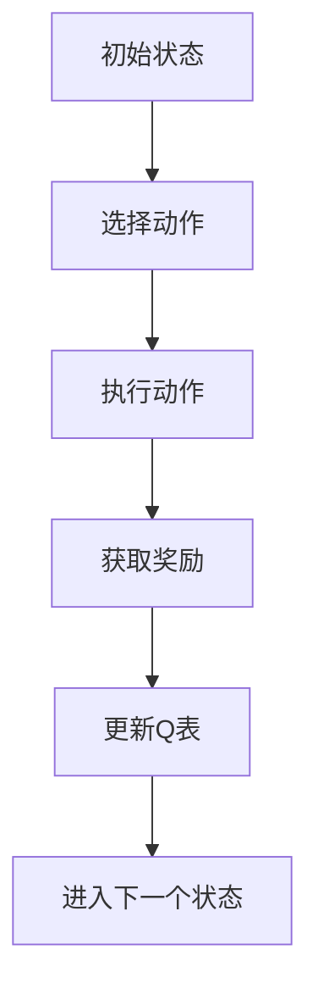
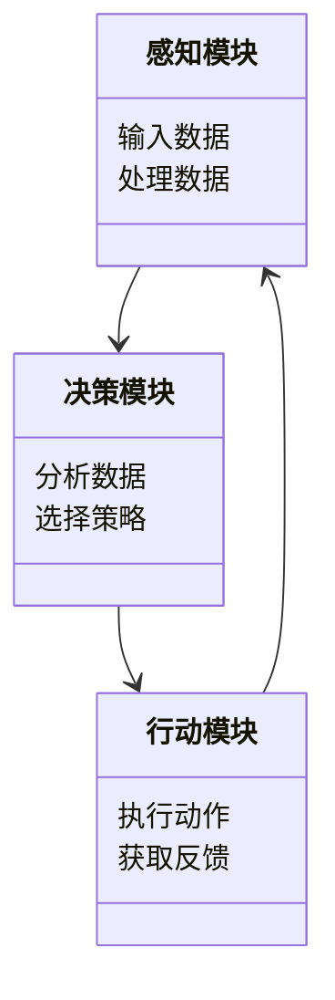
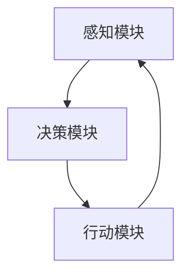
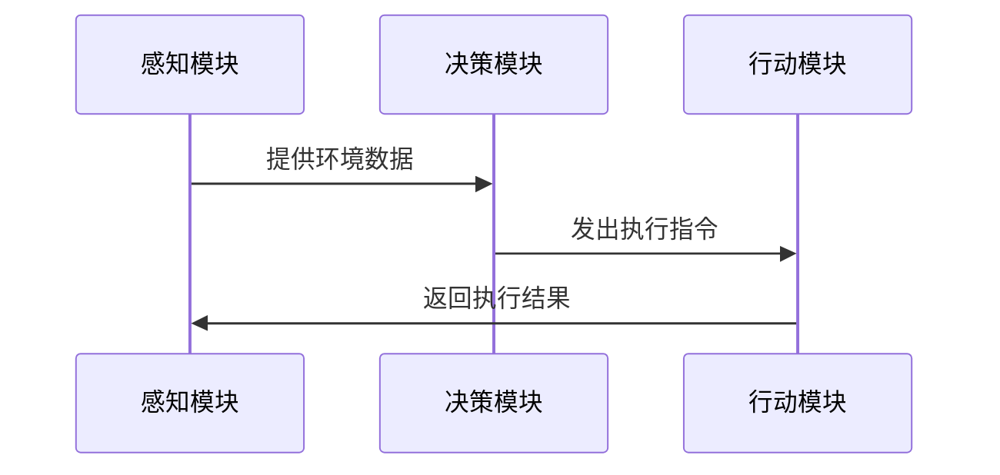

                 


# 构建AI Agent的概念抽象与泛化能力

> 关键词：AI Agent，概念抽象，泛化能力，算法原理，系统架构，项目实战

> 摘要：本文将深入探讨构建AI Agent的概念抽象与泛化能力。通过分析AI Agent的核心概念、算法原理、系统架构设计以及项目实战，帮助读者理解如何从理论到实践构建一个具备强大泛化能力的AI Agent系统。我们将涵盖从问题背景到系统实现的各个方面，结合具体案例和代码示例，全面解析构建AI Agent的关键技术与实践方法。

---

## 第一部分: AI Agent的基本概念与背景

### 第1章: AI Agent的基本概念与背景

#### 1.1 AI Agent的定义与特点

##### 1.1.1 AI Agent的定义
AI Agent（人工智能代理）是指能够感知环境、做出决策并采取行动以实现特定目标的智能体。与传统AI系统相比，AI Agent具有更强的自主性和适应性，能够在动态环境中完成复杂任务。

##### 1.1.2 AI Agent的核心特点
- **自主性**：AI Agent能够自主决策，无需外部干预。
- **反应性**：能够实时感知环境并做出反应。
- **目标导向**：所有行为都围绕实现特定目标展开。
- **适应性**：能够根据环境变化调整策略和行为。

##### 1.1.3 AI Agent与传统AI的区别
AI Agent不仅仅是一个静态的模型或算法，而是一个动态的、能够与环境交互的系统。它结合了感知、决策和行动的能力，形成了一个完整的智能体。

#### 1.2 AI Agent的发展背景

##### 1.2.1 人工智能技术的发展历程
人工智能技术经历了多次发展与停滞，近年来随着深度学习和强化学习的突破，AI Agent技术取得了显著进展。

##### 1.2.2 AI Agent出现的必然性
随着AI技术的进步，AI Agent的应用场景逐渐扩展，从简单的任务执行到复杂的决策问题，AI Agent的需求日益增长。

##### 1.2.3 当前AI Agent的应用场景
- **智能家居**：控制家中的设备，提供个性化的服务。
- **智能助手**：如Siri、Alexa等，帮助用户完成日常任务。
- **自动驾驶**：汽车作为AI Agent，在复杂环境中自主导航和决策。

---

### 第2章: AI Agent的核心概念与问题分析

#### 2.1 AI Agent的核心概念

##### 2.1.1 感知模块的原理
感知模块负责从环境中获取信息，例如通过传感器或API接口获取数据。

##### 2.1.2 决策模块的原理
决策模块基于感知到的信息，结合任务目标，选择最优的行动方案。

##### 2.1.3 行动模块的原理
行动模块根据决策结果执行具体动作，与环境进行交互。

#### 2.2 问题背景与描述

##### 2.2.1 AI Agent面临的主要问题
- **环境不确定性**：AI Agent需要在不确定的环境中做出决策。
- **任务复杂性**：复杂的任务需要多模块协同工作。
- **学习与适应**：需要不断学习以提高泛化能力。

##### 2.2.2 问题的边界与外延
AI Agent的问题不仅限于单任务，还需要处理多任务和复杂场景。

##### 2.2.3 问题的解决思路与目标
通过模块化设计和多学科技术的结合，构建一个具备泛化能力的AI Agent系统。

---

### 第3章: AI Agent的核心概念与联系

#### 3.1 核心概念原理

##### 3.1.1 感知模块的原理
感知模块通过传感器或API获取环境信息，例如图像、文本或数值数据。

##### 3.1.2 决策模块的原理
决策模块基于感知信息，结合任务目标，选择最优的行动方案。常用算法包括强化学习和决策树。

##### 3.1.3 行动模块的原理
行动模块根据决策结果执行具体动作，例如发送指令或调整参数。

#### 3.2 概念属性特征对比表

| 概念 | 属性 | 特征 |
|------|------|------|
| 感知模块 | 输入处理 | 多模态数据处理能力 |
| 决策模块 | 策略选择 | 基于状态的决策树 |
| 行动模块 | 执行动作 | 动作空间的多样性 |

#### 3.3 ER实体关系图

```mermaid
er
actor AI Agent
balt
  has 感知模块
  has 决策模块
  has 行动模块
  has 任务目标
  has 环境状态
```

---

## 第二部分: AI Agent的算法原理

### 第4章: AI Agent的算法原理

#### 4.1 算法原理概述

##### 4.1.1 强化学习算法
强化学习是一种通过试错机制来优化决策策略的方法。

##### 4.1.2 状态空间搜索
通过搜索状态空间，找到最优路径或解决方案。

#### 4.2 强化学习算法实现

##### 4.2.1 Q-Learning算法

```python
class QLearning:
    def __init__(self, state_space, action_space, learning_rate=0.1, gamma=0.9):
        self.q_table = defaultdict(lambda: np.zeros(len(action_space)))
        self.learning_rate = learning_rate
        self.gamma = gamma
        self.state_space = state_space
        self.action_space = action_space

    def choose_action(self, state):
        return np.random.choice(self.action_space, p=self.q_table[state] / sum(self.q_table[state]))

    def update_q_table(self, state, action, reward, next_state):
        self.q_table[state][self.action_space.index(action)] += self.learning_rate * (
            reward + self.gamma * max(self.q_table[next_state])
        )
```

##### 4.2.2 Q-Learning算法流程图



##### 4.2.3 数学模型

$$ Q(s, a) = Q(s, a) + \alpha (r + \gamma \max Q(s', a')) $$

其中：
- \( Q(s, a) \) 表示当前状态 \( s \) 下动作 \( a \) 的价值。
- \( \alpha \) 表示学习率。
- \( r \) 表示奖励。
- \( \gamma \) 表示折扣因子。
- \( s' \) 表示下一个状态。
- \( a' \) 表示下一个动作。

---

## 第三部分: AI Agent的系统架构设计

### 第5章: AI Agent的系统架构设计

#### 5.1 问题场景介绍

##### 5.1.1 问题描述
我们需要设计一个AI Agent，能够在复杂环境中完成特定任务。

##### 5.1.2 问题解决思路
通过模块化设计和多学科技术的结合，构建一个具备泛化能力的AI Agent系统。

#### 5.2 系统功能设计

##### 5.2.1 领域模型设计



##### 5.2.2 系统架构设计



#### 5.3 系统接口设计

##### 5.3.1 接口定义
- 输入接口：感知模块接收环境数据。
- 输出接口：行动模块执行动作。

##### 5.3.2 交互流程



---

## 第四部分: AI Agent的项目实战

### 第6章: AI Agent的项目实战

#### 6.1 环境安装与配置

##### 6.1.1 安装Python
```bash
python --version
pip install numpy
pip install matplotlib
pip install scikit-learn
```

##### 6.1.2 安装其他依赖
根据具体需求安装相关库。

#### 6.2 系统核心实现

##### 6.2.1 感知模块实现

```python
def perceive(environment):
    # 获取环境数据
    return environment.read_sensors()
```

##### 6.2.2 决策模块实现

```python
def decide(state, action_space):
    # 基于状态选择动作
    return action_space[np.argmax(state)]
```

##### 6.2.3 行动模块实现

```python
def act(action):
    # 执行动作
    return action.execute()
```

#### 6.3 代码实现与解读

##### 6.3.1 核心代码实现

```python
class AI_Agent:
    def __init__(self, environment):
        self.environment = environment
        self.perceive(environment)
        self.decide()
        self.act()

    def perceive(self, environment):
        self.state = environment.get_state()

    def decide(self):
        self.action = decide(self.state, self.action_space)

    def act(self):
        self.action.execute()
```

##### 6.3.2 代码应用解读
AI Agent通过感知模块获取环境信息，决策模块选择最优动作，行动模块执行动作，完成任务。

#### 6.4 实际案例分析

##### 6.4.1 案例介绍
设计一个AI Agent，用于智能客服系统，处理用户咨询。

##### 6.4.2 案例分析
AI Agent通过自然语言处理技术，理解用户需求，提供解决方案。

#### 6.5 项目小结

---

## 第五部分: 总结与展望

### 第7章: 总结与展望

#### 7.1 最佳实践 tips
- 确保数据质量，提高模型泛化能力。
- 定期更新模型，适应环境变化。
- 保持代码的可维护性和扩展性。

#### 7.2 小结
构建AI Agent需要从概念抽象到系统实现的全面考虑，通过模块化设计和多学科技术的结合，才能实现具备强大泛化能力的AI Agent系统。

#### 7.3 注意事项
- 数据质量和模型泛化能力是关键。
- 系统设计需要考虑可扩展性和可维护性。

#### 7.4 拓展阅读
推荐相关书籍和论文，深入学习AI Agent的理论与实践。

---

## 作者

**作者：AI天才研究院/AI Genius Institute & 禅与计算机程序设计艺术 /Zen And The Art of Computer Programming**

---

希望这篇文章能满足您的需求。如果需要进一步修改或补充，请随时告诉我。

