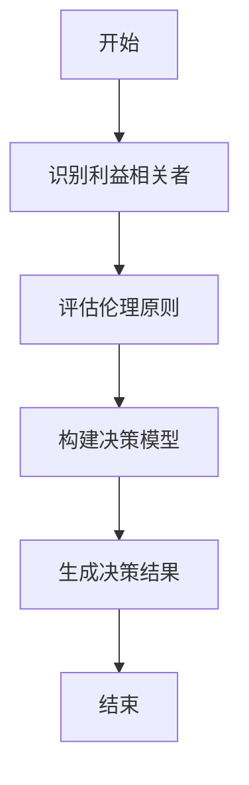
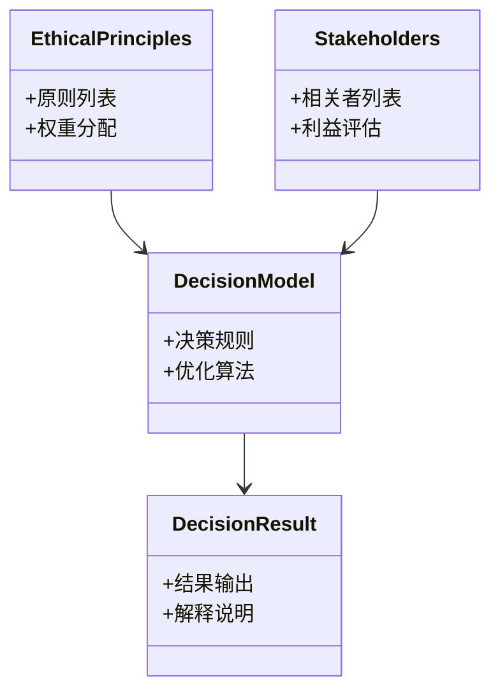
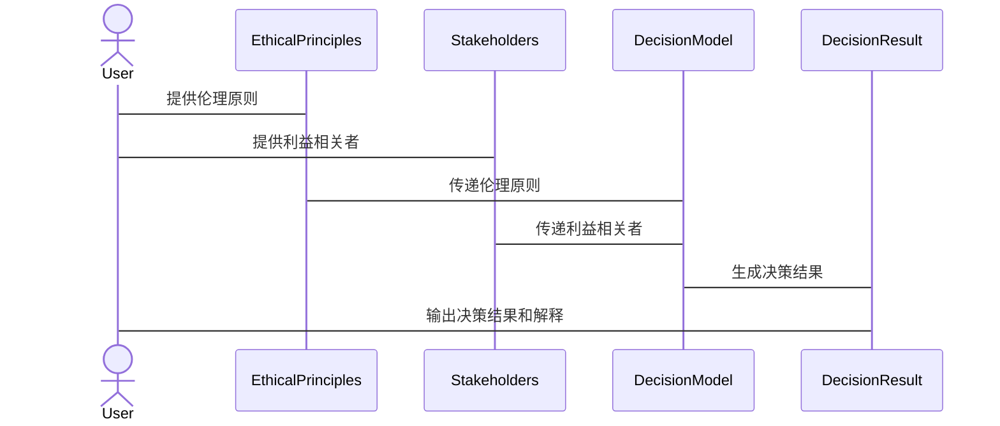

                 


# 构建AI Agent的道德决策框架

> 关键词：AI Agent，道德决策，伦理框架，系统架构，算法原理

> 摘要：本文系统地探讨了构建AI Agent道德决策框架的各个方面，从基础概念到算法实现，从系统架构到实际案例，详细分析了如何在AI Agent中融入道德决策框架，确保其在实际应用中符合伦理规范和用户期望。

---

## 第1章: AI Agent与道德决策框架的背景与基础

### 1.1 AI Agent的基本概念

#### 1.1.1 AI Agent的定义与分类
- **定义**：AI Agent（人工智能代理）是指能够感知环境、自主决策并执行任务的智能实体。
- **分类**：
  - **简单反射型Agent**：基于预设规则直接响应输入。
  - **基于模型的反应型Agent**：使用环境模型进行动态决策。
  - **目标驱动型Agent**：以特定目标为导向进行决策。
  - **实用驱动型Agent**：以效用函数为驱动进行优化决策。

#### 1.1.2 AI Agent的核心特征
- **自主性**：能够在没有外部干预的情况下自主运行。
- **反应性**：能够感知环境并实时调整行为。
- **目标导向性**：具有明确的目标或效用函数。
- **学习能力**：能够通过经验优化决策策略。

#### 1.1.3 AI Agent的应用场景与挑战
- **应用场景**：
  - 智能助手（如Siri、Alexa）。
  - 自动驾驶系统。
  - 医疗诊断辅助系统。
  - 金融投资决策系统。
- **挑战**：
  - 复杂环境下的不确定性。
  - 道德与伦理问题。
  - 安全与隐私问题。

### 1.2 道德决策的基本概念

#### 1.2.1 道德与伦理的定义
- **道德**：指个体或社会对行为的评价标准，通常与善恶相关。
- **伦理**：是道德原则的系统化表达，常用于规范职业行为。

#### 1.2.2 道德决策的特征与分类
- **特征**：
  - 目标导向性。
  - 权衡性。
  - 情境依赖性。
- **分类**：
  - 利益最大化决策。
  - 道义论决策。
  - 功利主义决策。

#### 1.2.3 道德决策在AI Agent中的重要性
- **重要性**：
  - 确保AI行为符合人类社会的伦理规范。
  - 提高AI系统的社会接受度。
  - 避免伦理争议带来的负面影响。

### 1.3 AI Agent道德决策的背景与问题背景

#### 1.3.1 AI Agent决策中的伦理问题
- **问题**：
  - **隐私问题**：AI Agent可能收集和处理大量个人数据。
  - **责任问题**：当AI Agent做出错误决策时，责任归属不明确。
  - **公平性问题**：AI决策可能引入偏见和不公平性。
  - **透明性问题**：AI决策过程缺乏可解释性。

#### 1.3.2 道德决策框架的必要性
- **必要性**：
  - 规范AI Agent的行为，确保其符合伦理标准。
  - 提供决策依据，避免伦理争议。
  - 提高AI系统的可信度和用户信任。

#### 1.3.3 当前AI Agent决策中的主要挑战
- **挑战**：
  - **伦理原则的多样性**：不同文化、社会背景下，伦理标准不同。
  - **利益相关者的多样性**：AI Agent的决策可能影响多个利益相关者。
  - **决策的动态性**：环境和条件的变化会影响决策的伦理评估。

### 1.4 本章小结

#### 1.4.1 核心概念总结
- AI Agent的核心特征包括自主性、反应性、目标导向性和学习能力。
- 道德决策的核心特征包括目标导向性、权衡性和情境依赖性。

#### 1.4.2 问题背景总结
- AI Agent在决策过程中可能面临隐私、责任、公平性和透明性等伦理问题。
- 构建道德决策框架是规范AI行为、提高社会接受度的关键。

#### 1.4.3 下一章的展望
- 下一章将重点分析道德决策框架的核心概念及其之间的联系。

---

## 第2章: 道德决策框架的核心概念与联系

### 2.1 道德决策框架的组成部分

#### 2.1.1 伦理原则
- **定义**：伦理原则是指导决策的基本准则，如诚实、公正、尊重和责任。
- **分类**：
  - **义务论**：基于义务和责任的决策。
  - **功利主义**：基于最大化整体利益的决策。
  - **道义论**：基于道德义务和规范的决策。

#### 2.1.2 利益相关者
- **定义**：在决策过程中可能受到影响的个体或群体。
- **分类**：
  - **直接利益相关者**：直接影响决策的结果。
  - **间接利益相关者**：间接受决策影响。
  - **中立利益相关者**：不受决策影响的个体。

#### 2.1.3 决策模型
- **定义**：决策模型是将伦理原则和利益相关者转化为具体决策的数学或逻辑模型。
- **分类**：
  - **基于规则的模型**：基于预设规则进行决策。
  - **基于效用的模型**：基于效用函数进行决策。
  - **基于案例的模型**：基于类似案例进行决策。

### 2.2 核心概念的对比分析

#### 2.2.1 伦理原则与法律规范的对比
- **伦理原则**：
  - 主要基于道德准则，具有一定的灵活性。
  - 可能因文化和社会背景而异。
- **法律规范**：
  - 具有强制性，通常由政府或权威机构制定。
  - 具有普遍性和统一性。

#### 2.2.2 利益相关者的特征对比
| 特征 | 直接利益相关者 | 间接利益相关者 | 中立利益相关者 |
|------|----------------|-----------------|-----------------|
| 影响程度 | 高 | 中 | 低 |
| 关注程度 | 高 | 中 | 低 |
| 决策参与度 | 高 | 中 | 无 |

#### 2.2.3 决策模型的类型对比
| 类型 | 基于规则的模型 | 基于效用的模型 | 基于案例的模型 |
|------|----------------|----------------|----------------|
| 描述 | 基于预设规则进行决策 | 基于效用函数进行优化 | 基于类似案例进行推理 |
| 优点 | 明确性高 | 灵活性高 | 可解释性高 |
| 缺点 | 灵活性低 | 计算复杂 | 可能缺乏普适性 |

### 2.3 实体关系图（ER图）与流程图

#### 2.3.1 ER实体关系图
```mermaid
graph TD
A[伦理原则] --> B[决策模型]
C[利益相关者] --> B
D[决策结果] <-- B
```

#### 2.3.2 道德决策流程图


### 2.4 本章小结

#### 2.4.1 核心概念总结
- 道德决策框架由伦理原则、利益相关者和决策模型三部分组成。
- 伦理原则是决策的基础，利益相关者是决策的参与者，决策模型是决策的实现方式。

#### 2.4.2 实体关系图与流程图的应用
- ER图展示了伦理原则、利益相关者和决策模型之间的关系。
- 流程图展示了道德决策的整体流程，从开始到结束。

#### 2.4.3 下一章的展望
- 下一章将重点分析道德决策框架的算法原理及其实现方式。

---

## 第3章: 道德决策框架的算法原理

### 3.1 基于伦理原则的决策算法

#### 3.1.1 伦理权重分配算法
- **定义**：根据伦理原则的重要性，分配不同的权重。
- **公式**：
  $$ \text{伦理权重} = \sum_{i=1}^{n} w_i \cdot p_i $$
  其中，\( w_i \) 是第 \( i \) 个伦理原则的权重，\( p_i \) 是第 \( i \) 个伦理原则的评估值。

#### 3.1.2 决策树构建算法
- **定义**：通过构建决策树，将伦理原则和利益相关者转化为具体的决策规则。
- **步骤**：
  1. 确定决策目标。
  2. 选择根节点的特征。
  3. 分割数据，构建子节点。
  4. 递归构建决策树。
  5. 剪枝优化。

#### 3.1.3 基于规则的推理算法
- **定义**：通过预设的伦理规则进行推理和决策。
- **规则示例**：
  - 如果行为可能损害利益相关者，则优先选择损害最小的方案。

### 3.2 基于利益相关者的决策算法

#### 3.2.1 利益相关者识别算法
- **定义**：识别在决策过程中可能受到影响的个体或群体。
- **方法**：
  - 基于特征的识别方法。
  - 基于上下文的识别方法。

#### 3.2.2 利益评估算法
- **定义**：评估不同利益相关者的利益影响程度。
- **方法**：
  - 基于权重的评估方法。
  - 基于案例的评估方法。

#### 3.2.3 多目标优化算法
- **定义**：在多个利益相关者之间进行权衡，找到最优解。
- **公式**：
  $$ \text{总效用} = \sum_{i=1}^{n} w_i \cdot u_i $$
  其中，\( w_i \) 是第 \( i \) 个利益相关者的权重，\( u_i \) 是第 \( i \) 个利益相关者的效用值。

### 3.3 基于决策模型的数学公式

#### 3.3.1 伦理权

---

## 第4章: 道德决策框架的系统分析与架构设计

### 4.1 问题场景介绍

#### 4.1.1 问题背景
- 在一个复杂的环境中，AI Agent需要根据伦理原则和利益相关者进行决策。

#### 4.1.2 问题描述
- AI Agent需要在多个利益相关者之间进行权衡，确保决策符合伦理规范。

### 4.2 系统功能设计

#### 4.2.1 领域模型设计


#### 4.2.2 系统架构设计
```mermaid
graph TD
A[EthicalPrinciples] --> B[DecisionModel]
C[Stakeholders] --> B
D[DecisionResult] <-- B
```

#### 4.2.3 接口设计
- **输入接口**：接收环境感知数据和伦理约束条件。
- **输出接口**：输出决策结果和解释说明。

#### 4.2.4 交互设计


### 4.3 本章小结

#### 4.3.1 系统功能总结
- 系统功能包括伦理原则识别、利益相关者评估和决策模型构建。

#### 4.3.2 架构设计总结
- 系统架构由伦理原则、利益相关者、决策模型和决策结果四个部分组成。

#### 4.3.3 下一章的展望
- 下一章将重点分析道德决策框架的项目实战及其应用。

---

## 第5章: 道德决策框架的项目实战

### 5.1 环境安装与配置

#### 5.1.1 开发环境
- **编程语言**：Python
- **框架**：TensorFlow、PyTorch
- **工具**：Mermaid、Graphviz

#### 5.1.2 安装依赖
- 使用pip安装所需的库：
  ```bash
  pip install mermaid-python graphviz
  ```

### 5.2 核心代码实现

#### 5.2.1 伦理原则识别代码
```python
def identify_ethical_principles(context):
    principles = [
        "诚实",
        "公正",
        "尊重",
        "责任"
    ]
    return [p for p in principles if p in context]
```

#### 5.2.2 利益相关者评估代码
```python
def assess_stakeholders(stakeholders, decision):
    impact = {}
    for stakeholder in stakeholders:
        impact[stakeholder] = calculate_impact(stakeholder, decision)
    return impact
```

#### 5.2.3 决策模型构建代码
```python
class DecisionModel:
    def __init__(self, principles, stakeholders):
        self.principles = principles
        self.stakeholders = stakeholders
        self.weights = self.calculate_weights()

    def calculate_weights(self):
        # 简单的权重分配，可根据具体需求调整
        return {p: 1 for p in self.principles}
```

#### 5.2.4 决策结果生成代码
```python
def generate_decision(decision_model):
    principles = decision_model.principles
    stakeholders = decision_model.stakeholders
    weights = decision_model.weights
    # 假设使用简单的加权求和方法
    decision = sum([weights[p] for p in principles]) / len(principles)
    return decision
```

### 5.3 代码应用解读与分析

#### 5.3.1 伦理原则识别
- **代码解读**：函数`identify_ethical_principles`根据上下文识别适用的伦理原则。
- **分析**：该函数通过简单过滤的方式识别伦理原则，实际应用中可能需要更复杂的逻辑。

#### 5.3.2 利益相关者评估
- **代码解读**：函数`assess_stakeholders`评估每个利益相关者在决策中的影响。
- **分析**：该函数通过调用`calculate_impact`函数，评估每个利益相关者的影响程度。

#### 5.3.3 决策模型构建
- **代码解读**：`DecisionModel`类初始化时，接收伦理原则和利益相关者，并计算权重。
- **分析**：权重计算部分目前使用简单的方法，实际应用中可能需要更复杂的算法。

#### 5.3.4 决策结果生成
- **代码解读**：函数`generate_decision`根据决策模型生成最终决策。
- **分析**：该函数使用简单的加权求和方法生成决策，实际应用中可能需要更复杂的优化算法。

### 5.4 实际案例分析

#### 5.4.1 案例背景
- **场景**：自动驾驶汽车在紧急情况下需要做出决策。
- **问题**：在可能的碰撞中，如何权衡乘客和其他道路使用者的利益。

#### 5.4.2 案例分析
- **伦理原则**：诚实、公正、尊重、责任。
- **利益相关者**：乘客、行人、其他驾驶员。
- **决策模型**：基于伦理原则和利益相关者构建决策模型，生成最优决策。

#### 5.4.3 案例总结
- **总结**：通过伦理决策框架，自动驾驶汽车可以在紧急情况下做出符合伦理的决策，减少伤害并提高社会接受度。

### 5.5 本章小结

#### 5.5.1 项目实现总结
- 通过代码实现，详细展示了伦理决策框架的构建过程。
- 包括伦理原则识别、利益相关者评估、决策模型构建和决策结果生成。

#### 5.5.2 案例分析总结
- 通过实际案例分析，验证了伦理决策框架的有效性和实用性。

#### 5.5.3 注意事项
- 在实际应用中，需要根据具体场景调整算法和权重。
- 需要定期评估和优化决策框架，确保其适应性。

---

## 第6章: 总结与展望

### 6.1 总结
- 本文系统地探讨了构建AI Agent道德决策框架的各个方面。
- 从背景介绍到算法实现，从系统架构到项目实战，全面分析了如何在AI Agent中融入道德决策框架。

### 6.2 未来展望
- **伦理原则的动态调整**：随着社会的发展，伦理原则需要动态调整。
- **利益相关者的多样性管理**：如何在复杂的利益相关者中找到最优解。
- **决策过程的透明性与可解释性**：提高决策过程的透明性和可解释性，增强用户信任。

### 6.3 最佳实践Tips
- **伦理原则的明确性**：确保伦理原则的明确性和可操作性。
- **利益相关者的全面性**：充分识别和评估所有利益相关者。
- **决策过程的可解释性**：确保决策过程透明，便于用户理解和信任。

---

## 作者信息

作者：AI天才研究院/AI Genius Institute & 禅与计算机程序设计艺术 /Zen And The Art of Computer Programming

---

**本文为原创内容，转载请注明出处。**

