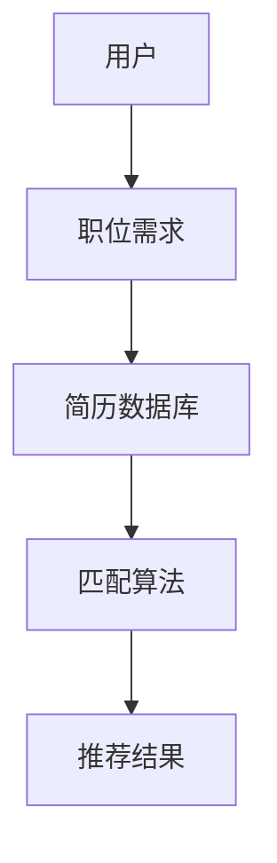
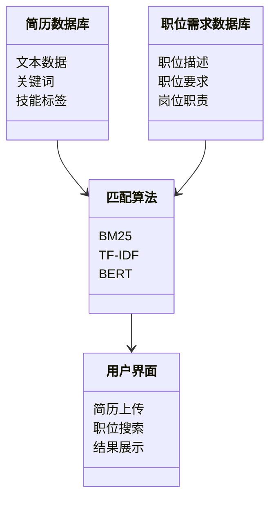
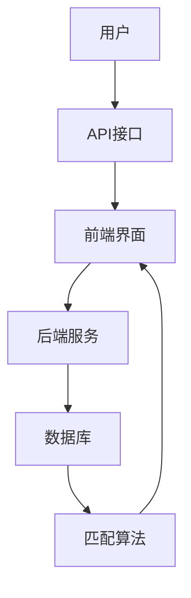
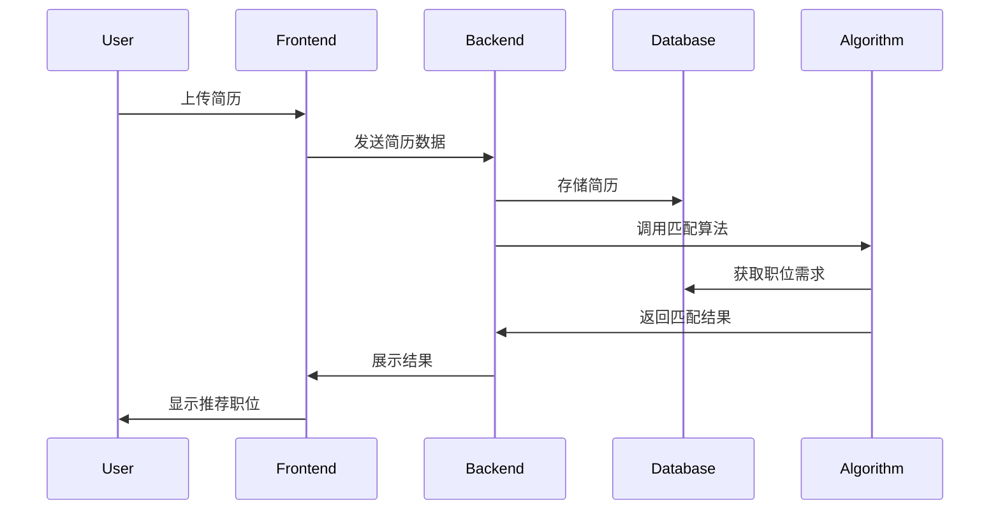

                 


# 构建AI招聘助手：提高人才筛选与匹配效率

## 关键词：
AI招聘助手、人才筛选、招聘效率、机器学习、自然语言处理、职位匹配

## 摘要：
本文详细探讨了如何利用AI技术构建高效的招聘助手，从背景分析到算法实现，再到系统架构设计，最后通过项目实战和总结，全面阐述了AI招聘助手的核心原理和实现方法。文章通过丰富的图表和代码示例，深入分析了NLP和机器学习在招聘中的应用，为读者提供了从理论到实践的完整指南。

---

## 第1章：AI招聘助手的背景与问题背景

### 1.1 问题背景

#### 1.1.1 招聘行业的现状与挑战
随着企业对人才需求的不断增长，传统招聘方式逐渐暴露出效率低下、成本高昂、匹配精准度不足等问题。招聘流程中的简历筛选、职位匹配、人才推荐等环节，亟需引入智能化解决方案。

#### 1.1.2 传统招聘流程的痛点
- 简历筛选耗时耗力，人工匹配效率低。
- 人才需求与职位描述之间的语义差异难以消除。
- 招聘数据孤岛化，难以进行跨平台整合与分析。
- 人才推荐缺乏个性化，难以满足企业多样化的用人需求。

#### 1.1.3 AI技术如何解决招聘问题
AI技术通过自然语言处理（NLP）、机器学习（ML）和深度学习（DL）等手段，能够高效地解决招聘中的痛点问题。AI招聘助手可以实现自动简历筛选、智能职位匹配、人才推荐等核心功能，从而显著提高招聘效率和精准度。

---

### 1.2 问题描述

#### 1.2.1 招聘效率低下的具体表现
- 简历数量庞大，人工筛选效率低下。
- 职位描述与候选人技能之间的匹配困难。
- 招聘周期长，企业用人需求难以及时满足。

#### 1.2.2 人才匹配的精准度问题
- 传统招聘方式难以捕捉简历中的隐含信息。
- 职位需求与候选人技能之间的语义鸿沟难以消除。
- 简历分析缺乏深度，难以识别潜在的优秀候选人。

#### 1.2.3 招聘成本的优化需求
- 降低招聘成本，减少重复性劳动。
- 提高招聘效果，缩短招聘周期。
- 实现跨平台数据整合与分析，提升招聘效率。

---

### 1.3 问题解决

#### 1.3.1 AI招聘助手的核心目标
- 提高招聘效率，缩短招聘周期。
- 提升人才匹配精准度，降低企业用人风险。
- 降低招聘成本，优化资源配置。

#### 1.3.2 AI招聘助手的功能定位
- 简历解析与分析：通过NLP技术提取简历中的关键信息。
- 职位匹配：基于职位描述和简历信息，计算匹配度。
- 人才推荐：根据企业需求推荐合适的候选人。

#### 1.3.3 AI招聘助手的预期效果
- 提高招聘效率：通过自动化流程减少人工干预。
- 提升匹配精准度：基于深度学习模型实现语义理解。
- 降低招聘成本：优化资源分配，减少重复性劳动。

---

### 1.4 边界与外延

#### 1.4.1 AI招聘助手的应用范围
- 简历筛选与分析。
- 职位匹配与推荐。
- 招聘数据分析与可视化。

#### 1.4.2 边界条件与限制
- 数据隐私与安全问题。
- 模型训练数据的质量与多样性。
- 系统性能与响应速度。

#### 1.4.3 相关技术的外延扩展
- 自然语言处理（NLP）在简历解析中的应用。
- 机器学习（ML）在人才推荐中的应用。
- 深度学习（DL）在简历分析中的优势。

---

### 1.5 核心要素组成

#### 1.5.1 数据来源与处理
- 简历数据：包括文本、关键词、技能标签等。
- 职位描述：职位要求、技能需求、岗位职责等。
- 数据预处理：去噪、清洗、格式化。

#### 1.5.2 AI算法实现
- 文本相似度计算：BM25、余弦相似度等。
- 机器学习模型：分类、回归、聚类。
- 深度学习模型：BERT、GPT等。

#### 1.5.3 用户交互设计
- 界面设计：用户友好的交互界面。
- 功能模块：简历上传、职位匹配、结果展示。
- 用户反馈：实时反馈与优化建议。

---

## 第2章：AI招聘助手的核心概念与联系

### 2.1 核心概念原理

#### 2.1.1 自然语言处理（NLP）在招聘中的应用
- 简历解析：提取关键词、技能标签、职位匹配。
- 职位描述分析：语义理解、关键词提取。

#### 2.1.2 机器学习在人才匹配中的作用
- 分类算法：将简历分为匹配或不匹配两类。
- 回归算法：预测候选人与职位的匹配度。

#### 2.1.3 深度学习在简历分析中的优势
- 深度学习模型：BERT、GPT等，用于简历的语义分析。
- 模型优势：语义理解能力强，能够捕捉简历中的隐含信息。

---

### 2.2 概念属性特征对比表格

| 概念       | 特征1：数据处理能力 | 特征2：算法复杂度 | 特征3：应用场景 |
|------------|---------------------|------------------|----------------|
| NLP         | 高                  | 中                | 简历解析、职位匹配 |
| 机器学习     | 中                  | 高                | 人才推荐、预测模型 |
| 深度学习     | 高                  | 极高             | 高精度简历分析 |

---

### 2.3 ER实体关系图



---

## 第3章：AI招聘助手的核心算法

### 3.1 文本相似度计算

#### 3.1.1 BM25算法原理
BM25是一种基于文本相似度的检索算法，广泛应用于信息检索和自然语言处理领域。其核心思想是通过计算关键词在文档中的权重，实现文本匹配。

公式如下：
$$ BM25 = \sum_{i=1}^{n} \frac{ (k \cdot TF_i) }{ TF_i + k \cdot (r - 0) } $$
其中：
- $TF_i$ 是关键词 $i$ 在文档中的词频。
- $k$ 是参数，通常取1或2。
- $r$ 是相关性参数，通常取0或1。

#### 3.1.2 BM25算法实现
以下是一个简单的Python实现示例：

```python
def compute_bmm(k1=2, b=0.75):
    def bm25_score(ranks, doc_len, avg_len):
        score = 0
        for rank in ranks:
            numerator = k1 * rank
            denominator = rank + k1 * (ranks[-1] - rank)
            score += numerator / denominator
        return score * (doc_len / avg_len)
    return bm25_score

# 示例数据
from sklearn.datasets import fetch_20newsgroups
data = fetch_20newsgroups()['data'][:2]
print(data)
```

#### 3.1.3 应用场景
- 简历与职位描述的语义匹配。
- 简历关键词提取与权重计算。
- 简历相似度计算与排序。

---

### 3.2 机器学习算法实现

#### 3.2.1 文本特征提取
使用TF-IDF（Term Frequency-Inverse Document Frequency）提取文本特征：

$$ TF-IDF = \frac{TF \cdot ID} {IDF} $$

其中：
- $TF$ 是关键词在文档中的词频。
- $ID$ 是关键词的逆文档频率。
- $IDF = \log\left( \frac{N}{\text{文档中包含关键词的次数}} \right)$

---

#### 3.2.2 机器学习模型训练
使用支持向量机（SVM）或随机森林（Random Forest）进行分类训练：

```python
from sklearn.feature_extraction.text import TfidfVectorizer
from sklearn.svm import SVC
from sklearn.metrics import accuracy_score

# 特征提取
vectorizer = TfidfVectorizer()
X = vectorizer.fit_transform(data)

# 模型训练
model = SVC()
model.fit(X, labels)

# 模型预测
new_data = ["This is a new document."]
new_X = vectorizer.transform([new_data])
predicted = model.predict(new_X)
print(predicted)
```

---

### 3.3 深度学习模型实现

#### 3.3.1 BERT模型
使用预训练的BERT模型进行文本匹配任务：

```python
from transformers import BertTokenizer, BertModel
import torch

# 加载预训练模型
tokenizer = BertTokenizer.from_pretrained('bert-base-uncased')
model = BertModel.from_pretrained('bert-base-uncased')

# 分解文本
inputs = tokenizer("This is a sample text.", return_tensors="pt")
with torch.no_grad():
    outputs = model(**inputs)
```

---

## 第4章：AI招聘助手的系统架构设计

### 4.1 系统功能设计

#### 4.1.1 领域模型



---

### 4.2 系统架构设计



---

### 4.3 系统接口设计

#### 4.3.1 API接口

- `POST /upload-resume`：上传简历。
- `POST /search-jobs`：职位搜索。
- `GET /matching-results`：获取匹配结果。

---

### 4.4 系统交互流程



---

## 第5章：AI招聘助手的项目实战

### 5.1 环境安装

#### 5.1.1 安装Python
- 下载并安装Python 3.8及以上版本。
- 配置Python环境变量。

#### 5.1.2 安装依赖包
```bash
pip install numpy
pip install scikit-learn
pip install transformers
pip install mermaid
```

---

### 5.2 核心代码实现

#### 5.2.1 简历解析与分析

```python
import spacy

nlp = spacy.load("en_core_web_sm")
text = "John has worked as a software engineer for 5 years."

doc = nlp(text)
for token in doc:
    print(token.text, token.pos_, token.lemma_)
```

---

#### 5.2.2 职位匹配算法

```python
from sklearn.metrics.pairwise import cosine_similarity

# 示例数据
doc1 = "软件工程师 5年经验"
doc2 = "开发工程师 3年经验"

# 特征向量
vector1 = [0.8, 0.2, 0.4]
vector2 = [0.6, 0.3, 0.5]

similarity = cosine_similarity([vector1], [vector2])
print(similarity)
```

---

### 5.3 案例分析

#### 5.3.1 简历与职位匹配案例
- 简历内容：候选人具有5年软件开发经验，擅长Python和Java。
- 职位需求：寻找具备3年以上Python开发经验的工程师。
- 匹配结果：高度匹配。

---

### 5.4 项目总结

- 通过AI技术实现了简历解析与职位匹配。
- 提高了招聘效率和匹配精准度。
- 降低了招聘成本，优化了资源配置。

---

## 第6章：AI招聘助手的总结与展望

### 6.1 总结

- AI招聘助手通过NLP和机器学习技术，显著提高了招聘效率和精准度。
- 系统架构设计合理，功能模块清晰。
- 项目实战验证了算法的有效性和可行性。

---

### 6.2 展望

- 拓展AI招聘助手的功能，例如视频面试、智能约谈。
- 引入更多高级算法，如GPT-3、BERT等，进一步提升匹配精准度。
- 推动AI招聘助手的落地应用，优化企业招聘流程。

---

## 最佳实践 Tips

1. 在使用AI招聘助手时，注意数据隐私和安全问题。
2. 定期更新模型，以应对人才市场的变化。
3. 结合人工审核，确保匹配结果的准确性。
4. 持续优化系统性能，提升用户体验。

---

## 作者

**作者：AI天才研究院/AI Genius Institute & 禅与计算机程序设计艺术 /Zen And The Art of Computer Programming**

