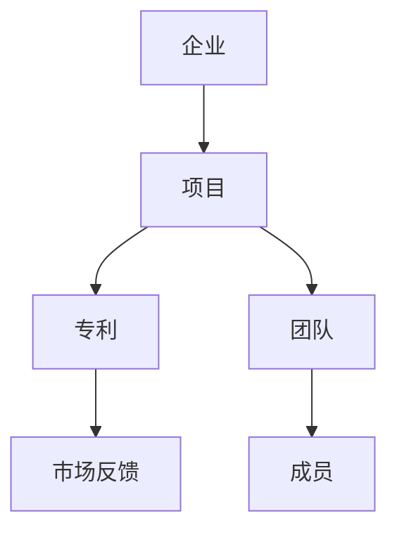
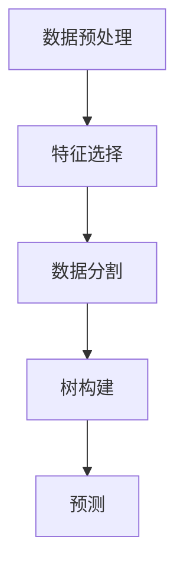
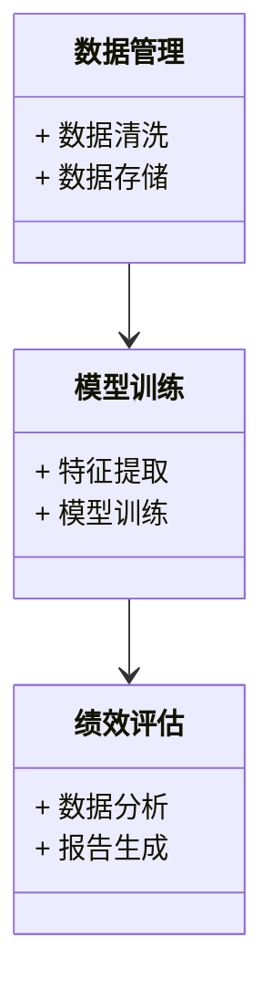

                 


# 《构建AI驱动的企业创新绩效评估系统》

---

## 关键词

- AI驱动
- 企业创新
- 绩效评估
- 算法原理
- 系统架构

---

## 摘要

本文探讨了如何利用人工智能技术构建企业创新绩效评估系统。首先，分析了传统绩效评估的局限性，并提出了AI驱动的创新绩效评估的必要性。接着，详细阐述了系统的核心概念、算法原理、数学模型和系统架构设计。通过实际案例分析，展示了系统的实现过程，并总结了最佳实践和注意事项。

---

## 第一部分: 背景与概述

### 第1章: 问题背景与目标

#### 1.1 企业创新绩效评估的挑战

企业在追求创新的过程中，绩效评估是衡量创新成果的重要手段。然而，传统的绩效评估方法存在以下问题：

- **评估指标单一**：传统方法通常仅关注财务指标，而忽略了创新过程中的其他关键因素，如研发投入、团队协作、市场反馈等。
- **数据处理复杂**：企业创新涉及大量非结构化数据，如专利申请、项目文档、市场反馈等，传统的评估方法难以高效处理这些数据。
- **评估周期长**：传统评估方法通常需要大量人工分析，导致评估周期较长，难以及时指导企业创新活动。

AI驱动的创新绩效评估系统通过引入机器学习和自然语言处理技术，能够高效地处理多源异构数据，实时评估创新绩效，从而帮助企业更快地做出决策。

#### 1.2 问题描述与目标

企业创新绩效评估的目标是通过量化的方式，评估企业在创新活动中的表现。AI驱动的创新绩效评估系统需要实现以下目标：

- **数据集成**：整合企业内部和外部的多源数据，包括专利数据、项目文档、市场反馈等。
- **智能分析**：利用机器学习算法，对数据进行深度分析，提取关键指标。
- **实时评估**：根据分析结果，实时生成绩效评估报告。

系统的核心问题是如何将多源异构数据转化为可量化的绩效指标，并通过AI技术实现高效分析。

#### 1.3 系统的目标与范围

系统的范围包括：

- **数据范围**：整合企业内部的项目数据、专利数据、财务数据，以及外部的市场数据、竞争对手数据等。
- **功能范围**：实现数据清洗、特征提取、模型训练、绩效评估、报告生成等功能。
- **用户范围**：系统用户包括企业高管、项目经理、数据分析师等。

通过以上分析，我们可以明确系统的目标和范围。

---

### 第2章: 系统的边界与外延

#### 2.1 系统边界

系统的边界是指数据输入和输出的范围：

- **数据输入**：系统接受企业内部和外部的多源数据，包括文本数据、结构化数据等。
- **数据输出**：系统输出绩效评估报告、关键指标分析、趋势预测等。

系统与外部系统的接口包括：

- 与企业内部的ERP系统对接，获取财务数据。
- 与专利数据库对接，获取专利信息。
- 与市场调研系统对接，获取市场反馈数据。

#### 2.2 系统的外延

系统的外延是指功能扩展的可能性：

- **功能扩展**：未来可以扩展到人才评估、风险评估等功能。
- **数据扩展**：未来可以引入更多外部数据源，如行业报告、学术论文等。
- **应用场景扩展**：未来可以在更多行业推广，如科技企业、制造业等。

---

## 第二部分: 核心概念与联系

### 第3章: 核心概念解析

#### 3.1 AI驱动的定义与属性

AI驱动的核心特征包括：

- **数据驱动**：依赖大量数据进行模型训练。
- **智能分析**：通过机器学习算法自动提取特征。
- **实时反馈**：根据最新数据实时更新评估结果。

AI驱动的属性对比：

| 属性       | 描述                                       |
|------------|------------------------------------------|
| 数据类型    | 支持结构化和非结构化数据                   |
| 计算能力    | 高性能计算                                |
| 可解释性    | 可能较低                                  |

#### 3.2 企业创新绩效评估的实体关系

以下是企业创新绩效评估的实体关系图：



---

### 第4章: 核心概念的联系

#### 4.1 AI与企业创新的关联

AI通过以下方式赋能企业创新：

- **数据挖掘**：从海量数据中提取有价值的信息。
- **预测分析**：预测创新趋势和潜在风险。
- **自动化评估**：实时评估创新绩效，提供反馈。

#### 4.2 概念属性特征对比表

以下是核心概念的属性特征对比：

| 概念       | 属性1 | 属性2 | 属性3 |
|------------|--------|--------|--------|
| AI驱动     | 数据驱动 | 智能分析 | 实时反馈 |
| 企业创新    | 目标导向 | 资源密集 | 风险较高 |
| 绩效评估    | 客观性 | 可量性 | 可比性 |

---

## 第三部分: 算法原理与数学模型

### 第5章: 算法原理

#### 5.1 监督学习算法

##### 5.1.1 线性回归模型

线性回归模型的数学公式为：

$$ y = \beta_0 + \beta_1x + \epsilon $$

其中，$y$ 是目标变量，$x$ 是自变量，$\beta_0$ 和 $\beta_1$ 是回归系数，$\epsilon$ 是误差项。

##### 5.1.2 决策树算法

决策树算法的流程如下：



##### 5.1.3 支持向量机（SVM）

SVM 的核心思想是将数据映射到高维空间，并在高维空间中找到一个超平面，使得正负样本分开。

#### 5.2 无监督学习算法

##### 5.2.1 K-means聚类

K-means 聚类的算法步骤如下：

1. 随机选择 K 个初始质心。
2. 计算每个数据点到质心的距离，将其归类到最近的质心。
3. 计算新的质心位置。
4. 重复步骤 2 和 3，直到质心位置不再变化。

##### 5.2.2 t-SNE降维

t-SNE 是一种用于降维的算法，适用于将高维数据映射到二维或三维空间。

---

## 第四部分: 系统分析与架构设计

### 第6章: 系统分析

#### 6.1 问题场景介绍

系统需要解决以下问题：

- 如何整合多源数据？
- 如何高效处理非结构化数据？
- 如何实时生成绩效评估报告？

#### 6.2 系统功能设计

以下是系统功能设计的领域模型类图：



#### 6.3 系统架构设计

以下是系统的分层架构图：


---

## 第五部分: 项目实战

### 第7章: 项目实战

#### 7.1 环境安装

需要安装以下环境：

- Python 3.8+
- scikit-learn
- pandas
- numpy
- jieba

#### 7.2 核心代码实现

以下是核心代码示例：

```python
import pandas as pd
from sklearn.feature_extraction.text import TfidfVectorizer
from sklearn.linear_model import LinearRegression

# 数据加载
data = pd.read_csv('innovation.csv')

# 特征提取
vectorizer = TfidfVectorizer()
X = vectorizer.fit_transform(data['description'])

# 模型训练
model = LinearRegression()
model.fit(X, data['score'])

# 预测
new_data = pd.DataFrame({'description': ['创新项目']})
new_X = vectorizer.transform(new_data['description'])
预测结果 = model.predict(new_X)
```

#### 7.3 案例分析与解读

通过以上代码，我们可以实现对企业创新项目的绩效评估。

---

## 第六部分: 最佳实践

### 第8章: 最佳实践

#### 8.1 小结

AI驱动的企业创新绩效评估系统通过整合多源数据，利用机器学习算法，实现了高效、实时的绩效评估。

#### 8.2 注意事项

- 数据质量是关键。
- 算法选择需要根据具体场景。
- 系统需要定期更新。

#### 8.3 拓展阅读

- 《机器学习实战》
- 《深度学习入门》
- 《企业创新管理》

---

## 作者

作者：AI天才研究院 & 禅与计算机程序设计艺术

