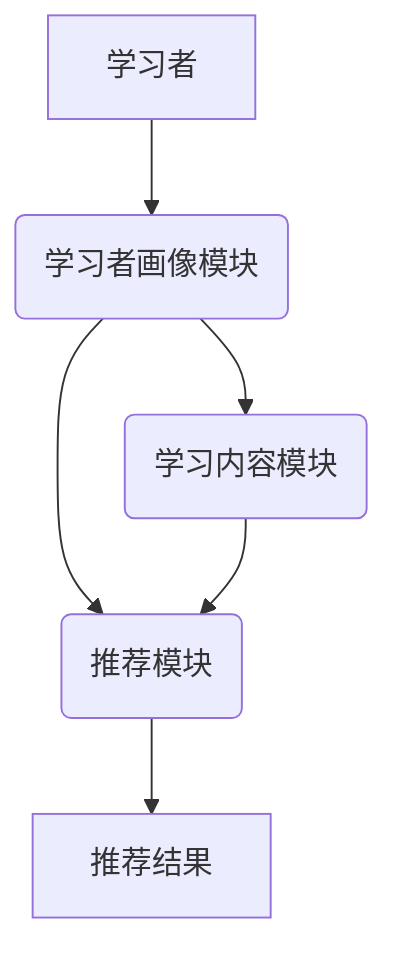
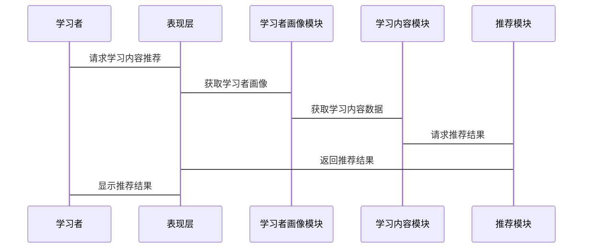

                 


# 构建AI驱动的企业学习管理系统(LMS)

## 关键词：人工智能、企业学习管理、系统设计、机器学习、自然语言处理、推荐系统

## 摘要：随着人工智能技术的飞速发展，企业学习管理系统（LMS）正在经历一场深刻的变革。传统的LMS系统主要依赖于规则引擎和简单的数据分析，难以满足现代企业对个性化学习、智能化管理和数据驱动决策的需求。本文将深入探讨如何利用人工智能技术构建一个智能化的企业学习管理系统，涵盖系统设计、算法实现、系统架构以及项目实战等内容，为企业技术决策者和开发者提供全面的指导。

---

# 第1章: AI驱动的企业学习管理系统背景与价值

## 1.1 企业学习管理系统的概念与现状

### 1.1.1 传统企业学习管理系统的定义与特点
- **定义**：企业学习管理系统（LMS）是一种用于管理、交付和跟踪学习活动的软件系统。
- **特点**：
  - **集中管理**：支持企业内部培训课程的统一管理。
  - **学习路径定制**：提供基于员工角色和技能水平的个性化学习路径。
  - **数据记录**：记录学习者的学习行为、成绩和反馈。
  - **多终端支持**：支持PC、移动端等多种终端访问。

### 1.1.2 AI驱动LMS的核心概念与优势
- **核心概念**：
  - **智能化学习路径推荐**：基于学习者的行为数据和知识掌握程度，动态调整学习内容和顺序。
  - **智能评估与反馈**：利用机器学习算法实时评估学习效果，并提供个性化反馈。
  - **数据驱动决策**：通过分析海量学习数据，为企业培训策略优化提供数据支持。
- **优势**：
  - **提升学习效果**：通过AI算法优化学习内容和学习顺序，帮助学习者更高效地掌握知识。
  - **降低管理成本**：自动化处理学习过程中的重复性任务，减少人工干预。
  - **增强用户体验**：通过个性化推荐和实时反馈，提升学习者的参与感和满意度。

### 1.1.3 企业学习管理系统的边界与外延
- **边界**：
  - 仅限于企业内部员工的学习管理，不涉及外部学习者。
  - 不包括企业的日常业务流程管理。
- **外延**：
  - 可与企业的人力资源管理系统（HRM）集成，提供更全面的人才发展解决方案。
  - 可扩展至企业的知识管理平台，构建企业内部的知识共享网络。

## 1.2 AI驱动LMS的背景与价值

### 1.2.1 传统LMS的局限性
- **知识更新滞后**：传统LMS系统依赖于固定的课程内容，难以快速响应企业业务的变化。
- **学习体验单一**：缺乏个性化的学习路径推荐，学习者的学习体验较为单一。
- **数据分析能力有限**：传统LMS系统主要依赖于简单的统计分析，难以深入挖掘学习数据的价值。

### 1.2.2 AI技术对企业学习管理的推动作用
- **推动个性化学习**：AI技术可以通过分析学习者的行为数据和知识掌握程度，提供个性化的学习路径和内容推荐。
- **提升学习效果**：通过实时评估学习效果并提供反馈，帮助学习者更快地掌握知识。
- **优化企业培训策略**：通过分析学习数据，帮助企业识别培训中的瓶颈和不足，优化培训策略。

### 1.2.3 企业学习管理系统的市场前景与应用潜力
- **市场前景**：
  - 随着企业对员工培训的重视程度不断提高，AI驱动的LMS系统具有广阔的市场前景。
  - AI技术的快速发展为企业LMS系统的智能化提供了技术支撑。
- **应用潜力**：
  - 在企业内部培训、员工技能提升、领导力发展等方面具有广泛的应用潜力。
  - 可以帮助企业构建高效的知识管理平台，提升企业的整体竞争力。

## 1.3 本章小结
本章从传统LMS系统的概念与特点出发，分析了AI驱动LMS的核心概念与优势，并探讨了企业学习管理系统的边界与外延。同时，详细阐述了AI技术对企业学习管理的推动作用以及系统的市场前景与应用潜力。通过本章的学习，读者可以全面了解AI驱动LMS的背景与价值。

---

# 第2章: AI驱动LMS的核心技术解析

## 2.1 机器学习在LMS中的应用

### 2.1.1 机器学习的基本概念与分类
- **基本概念**：
  - 机器学习是一种通过数据训练模型，使其能够从数据中学习并做出预测或决策的技术。
  - 机器学习的核心在于数据和算法，通过数据训练模型，使其能够识别模式和规律。
- **分类**：
  - **监督学习**：基于标记的数据进行训练，预测新的数据点。
  - **无监督学习**：基于未标记的数据进行训练，发现数据中的模式和结构。
  - **强化学习**：通过与环境交互，学习最优策略以最大化奖励。

### 2.1.2 监督学习、无监督学习与强化学习在LMS中的应用
- **监督学习**：
  - **应用**：用于学习效果预测和学习者画像构建。
  - **示例**：使用监督学习算法预测学习者完成某门课程的学习时间。
- **无监督学习**：
  - **应用**：用于学习者行为分析和学习内容聚类。
  - **示例**：通过无监督学习算法发现学习者群体中的潜在学习模式。
- **强化学习**：
  - **应用**：用于学习路径优化和学习策略动态调整。
  - **示例**：通过强化学习算法优化学习者的学习路径，使其以最短时间完成课程学习。

### 2.1.3 常见机器学习算法在LMS中的具体应用场景
- **线性回归**：
  - **应用场景**：用于学习者学习时间预测和学习效果评估。
  - **数学模型**：$$y = \beta_0 + \beta_1x + \epsilon$$
  - **解释**：y表示预测的学习时间，x表示学习者的初始知识水平，$$\beta_0$$和$$\beta_1$$为模型参数，$$\epsilon$$为误差项。
- **决策树**：
  - **应用场景**：用于学习者画像分类和学习路径推荐。
  - **解释**：通过决策树模型，可以根据学习者的历史学习数据，预测其最适合的学习路径。
- **随机森林**：
  - **应用场景**：用于学习者行为预测和学习效果评估。
  - **解释**：随机森林是一种基于树的集成算法，通过多个决策树的组合，提高模型的准确性和鲁棒性。

## 2.2 自然语言处理在LMS中的应用

### 2.2.1 NLP的基本概念与技术
- **基本概念**：
  - 自然语言处理（NLP）是研究人机交互中自然语言理解与生成的理论和方法。
  - NLP的核心目标是让计算机能够理解和生成人类语言。
- **主要技术**：
  - **分词**：将连续的文本分割成有意义的词语或短语。
  - **词性标注**：给每个词语标注其词性（名词、动词、形容词等）。
  - **句法分析**：分析句子的语法结构，确定词语之间的关系。
  - **语义理解**：理解文本的语义含义，提取有用的信息。

### 2.2.2 NLP在学习内容生成与优化中的应用
- **学习内容生成**：
  - **自动内容摘要**：通过NLP技术从大量学习资料中提取关键内容，生成学习摘要。
  - **智能内容推荐**：根据学习者的学习需求和兴趣，推荐相关学习内容。
- **学习内容优化**：
  - **语言风格调整**：根据学习者的学习水平和语言偏好，优化学习内容的语言风格。
  - **内容质量评估**：通过NLP技术评估学习内容的质量，识别潜在的问题。

### 2.2.3 NLP在学习者行为分析中的应用
- **行为分析**：
  - **情感分析**：分析学习者对学习内容的情感倾向，识别学习者的情绪变化。
  - **意图识别**：识别学习者在学习过程中的意图，如提问、寻求帮助等。
- **个性化推荐**：
  - **基于意图的推荐**：根据学习者的行为意图，推荐相关学习内容。
  - **基于情感的推荐**：根据学习者的情感倾向，推荐适合其情绪状态的学习内容。

## 2.3 推荐系统在LMS中的应用

### 2.3.1 推荐系统的定义与分类
- **定义**：
  - 推荐系统是一种根据用户的兴趣和行为，推荐相关内容或产品的技术。
  - 在LMS中，推荐系统用于推荐学习内容、学习路径和学习资源。
- **分类**：
  - **基于协同过滤的推荐**：根据用户的行为数据，找到相似的用户群体，推荐相似的内容。
  - **基于内容的推荐**：根据学习内容的特征，推荐与当前内容相似的内容。
  - **基于混合模型的推荐**：结合协同过滤和内容推荐的优点，提供更精准的推荐。

### 2.3.2 基于协同过滤的推荐算法
- **算法流程**：
  - **用户行为数据收集**：收集学习者的学习行为数据，如学习时间、学习内容偏好等。
  - **相似度计算**：计算用户之间的相似度，如余弦相似度。
  - **推荐生成**：根据相似用户的偏好，推荐当前用户可能感兴趣的内容。
- **优缺点**：
  - **优点**：能够捕捉用户的群体偏好，推荐内容具有多样性。
  - **缺点**：难以捕捉用户的真实需求，推荐结果可能不够精准。

### 2.3.3 基于内容的推荐算法
- **算法流程**：
  - **内容特征提取**：提取学习内容的特征，如关键词、主题标签等。
  - **相似内容计算**：计算当前内容与其它内容的相似度。
  - **推荐生成**：根据相似度排序，推荐最相关的学习内容。
- **优缺点**：
  - **优点**：能够捕捉内容的语义信息，推荐结果更精准。
  - **缺点**：难以捕捉用户的需求变化，推荐结果可能缺乏多样性。

### 2.3.4 深度学习推荐算法
- **算法流程**：
  - **数据预处理**：对学习者行为数据和学习内容数据进行预处理，提取特征。
  - **模型训练**：使用深度学习模型（如神经网络、循环神经网络）进行模型训练。
  - **推荐生成**：根据模型预测结果，生成个性化推荐列表。
- **优缺点**：
  - **优点**：能够捕捉数据的复杂模式，推荐结果更精准。
  - **缺点**：模型复杂度高，训练时间长，需要大量计算资源。

## 2.4 本章小结
本章详细探讨了机器学习、自然语言处理和推荐系统在AI驱动LMS中的具体应用。通过分析各种算法的特点和应用场景，帮助读者理解如何利用AI技术提升企业学习管理系统的智能化水平。

---

# 第3章: AI驱动LMS的系统架构与设计

## 3.1 系统架构概述

### 3.1.1 分层架构设计
- **分层架构**：
  - **表现层**：负责与用户交互，展示学习内容和系统功能。
  - **业务逻辑层**：负责处理业务逻辑，如学习路径推荐、学习效果评估等。
  - **数据访问层**：负责与数据存储系统交互，进行数据的增删改查操作。

### 3.1.2 微服务架构设计
- **微服务架构**：
  - **服务划分**：将系统功能划分为多个独立的服务，如学习者画像服务、学习内容服务、推荐服务等。
  - **服务通信**：通过API网关或服务间通信协议（如HTTP、gRPC）实现服务之间的通信。
  - **服务发现**：通过服务注册与发现机制，实现服务的动态扩展和负载均衡。

### 3.1.3 数据流与模块划分
- **数据流**：
  - **学习者数据**：包括学习者的基本信息、学习历史、学习行为数据等。
  - **学习内容数据**：包括课程内容、知识点、技能标签等。
  - **推荐数据**：包括学习者画像、推荐结果、推荐理由等。
- **模块划分**：
  - **学习者画像模块**：负责构建和更新学习者画像。
  - **学习内容模块**：负责管理学习内容的存储和检索。
  - **推荐模块**：负责根据学习者画像和学习内容数据，生成个性化推荐结果。

## 3.2 系统功能设计

### 3.2.1 学习者画像构建
- **功能描述**：
  - 基于学习者的行为数据和学习内容数据，构建学习者的画像。
  - 包括学习者的基本信息、学习风格、知识掌握程度等。
- **实现步骤**：
  - **数据收集**：收集学习者的学习行为数据，如学习时间、学习内容偏好、学习效果反馈等。
  - **特征提取**：从学习者的行为数据中提取特征，如学习速度、学习偏好、学习效果等。
  - **画像构建**：基于提取的特征，构建学习者的画像，如视觉型学习者、听觉型学习者等。

### 3.2.2 学习内容推荐系统
- **功能描述**：
  - 根据学习者的学习需求和兴趣偏好，推荐相关的学习内容。
  - 包括课程推荐、知识点推荐、学习资源推荐等。
- **实现步骤**：
  - **需求分析**：分析学习者的学习需求和兴趣偏好，确定推荐的目标和范围。
  - **内容匹配**：根据学习者的需求和兴趣，匹配相关的学习内容。
  - **推荐生成**：生成推荐结果，并展示给学习者。

### 3.2.3 学习效果评估与反馈
- **功能描述**：
  - 通过学习者的行为数据和学习效果数据，评估学习者的学习效果。
  - 提供个性化的反馈，帮助学习者改进学习方法和策略。
- **实现步骤**：
  - **效果评估**：基于学习者的学习数据，评估学习者的学习效果，如知识掌握程度、学习进度等。
  - **反馈生成**：根据评估结果，生成个性化的反馈，如学习建议、学习计划等。

## 3.3 系统架构图

### 3.3.1 系统架构图


### 3.3.2 数据流与模块划分
- **数据流**：
  - 学习者通过表现层与系统交互，触发学习者画像模块的构建。
  - 学习者画像模块通过API与学习内容模块进行数据交互。
  - 推荐模块根据学习者画像和学习内容数据，生成推荐结果。
  - 推荐结果通过表现层展示给学习者。

## 3.4 系统接口设计

### 3.4.1 系统接口设计
- **接口1：学习者画像构建接口**
  - **输入**：学习者的行为数据和学习内容数据。
  - **输出**：学习者的画像信息。
- **接口2：学习内容推荐接口**
  - **输入**：学习者的画像信息和推荐参数。
  - **输出**：推荐的学习内容列表。
- **接口3：学习效果评估接口**
  - **输入**：学习者的学习数据和评估指标。
  - **输出**：学习效果评估结果。

### 3.4.2 系统交互图


## 3.5 本章小结
本章详细探讨了AI驱动LMS的系统架构与设计，包括分层架构设计、微服务架构设计、系统功能设计以及系统架构图和系统接口设计。通过本章的学习，读者可以了解如何设计一个高效的AI驱动LMS系统。

---

# 第4章: AI驱动LMS的项目实战

## 4.1 项目介绍

### 4.1.1 项目背景
- **项目名称**：AI驱动的企业学习管理系统（LMS）。
- **项目目标**：构建一个智能化的企业学习管理系统，实现学习者画像构建、学习内容推荐、学习效果评估等功能。
- **项目范围**：涵盖企业内部员工的学习管理，支持个性化学习和数据驱动决策。

### 4.1.2 项目需求
- **核心需求**：
  - 学习者画像构建：基于学习者的行为数据和学习内容数据，构建学习者画像。
  - 学习内容推荐：根据学习者的学习需求和兴趣偏好，推荐相关学习内容。
  - 学习效果评估：评估学习者的学习效果，并提供个性化的反馈和建议。

### 4.1.3 项目计划
- **项目阶段**：
  - 阶段一：需求分析与系统设计。
  - 阶段二：数据收集与特征提取。
  - 阶段三：算法实现与系统集成。
  - 阶段四：测试与优化。
  - 阶段五：部署与上线。

## 4.2 系统核心实现

### 4.2.1 环境安装
- **安装步骤**：
  - **Python环境**：安装Python 3.8以上版本。
  - **深度学习框架**：安装TensorFlow或PyTorch框架。
  - **NLP工具**：安装NLTK或spaCy库。
  - **推荐算法库**：安装Scikit-learn库。
  - **可视化工具**：安装Matplotlib或Seaborn库。
  - **开发框架**：安装Django或Flask框架。

### 4.2.2 算法实现

#### 4.2.2.1 学习者画像构建算法
- **代码实现**：
  ```python
  import pandas as pd
  import numpy as np
  from sklearn.cluster import KMeans

  # 数据预处理
  def preprocess_data(data):
      # 删除缺失值
      data.dropna(inplace=True)
      # 标准化数据
      from sklearn.preprocessing import StandardScaler
      scaler = StandardScaler()
      data_scaled = scaler.fit_transform(data)
      return data_scaled

  # 学习者画像构建
  def build_profile(data):
      # 数据预处理
      data_scaled = preprocess_data(data)
      # K-means聚类
      kmeans = KMeans(n_clusters=5, random_state=0)
      kmeans.fit(data_scaled)
      # 获取聚类结果
      clusters = kmeans.labels_
      return clusters

  # 示例数据
  data = pd.DataFrame({
      '学习时间': [10, 20, 30, 40, 50],
      '学习内容': ['数学', '物理', '化学', '生物', '英语'],
      '学习效果': [80, 85, 75, 70, 90]
  })
  # 调用算法
  clusters = build_profile(data)
  print("学习者聚类结果:", clusters)
  ```

#### 4.2.2.2 学习内容推荐算法
- **代码实现**：
  ```python
  from sklearn.metrics.pairwise import cosine_similarity
  from sklearn.feature_extraction.text import TfidfVectorizer

  # TF-IDF特征提取
  def extract_features(texts):
      vectorizer = TfidfVectorizer()
      features = vectorizer.fit_transform(texts)
      return features

  # 基于余弦相似度的推荐
  def content_based_recommendation(recommendations, features, index):
      similarity = cosine_similarity(features[index], features)
      similar_indices = np.argsort(similarity, axis=0)[::-1][:3]
      recommended_texts = [recommendations[i] for i in similar_indices]
      return recommended_texts

  # 示例数据
  texts = [
      "学习Python编程基础",
      "深入理解机器学习算法",
      "自然语言处理技术详解",
      "数据结构与算法分析",
      "人工智能入门指南"
  ]
  # 特征提取
  features = extract_features(texts)
  # 调用推荐算法
  recommendations = texts
  index = 0  # 推荐当前索引为0的内容
  recommendations = content_based_recommendation(recommendations, features, index)
  print("推荐结果:", recommendations)
  ```

#### 4.2.2.3 学习效果评估算法
- **代码实现**：
  ```python
  import numpy as np
  from sklearn.metrics import accuracy_score

  # 学习效果评估
  def evaluate_learning(x_test, y_test, model):
      # 预测结果
      y_pred = model.predict(x_test)
      # 计算准确率
      accuracy = accuracy_score(y_test, y_pred)
      return accuracy

  # 示例数据
  x_test = np.array([[10, 80], [20, 85], [30, 75], [40, 70], [50, 90]])
  y_test = np.array([0, 0, 1, 1, 0])
  # 示例模型
  model = linear_model.LogisticRegression()
  model.fit(x_train, y_train)
  # 调用评估函数
  accuracy = evaluate_learning(x_test, y_test, model)
  print("学习效果准确率:", accuracy)
  ```

### 4.2.3 系统实现
- **系统实现步骤**：
  - **数据收集**：收集学习者的行为数据和学习内容数据。
  - **数据预处理**：对数据进行清洗、转换和标准化处理。
  - **模型训练**：基于预处理后的数据，训练机器学习模型。
  - **系统集成**：将训练好的模型集成到系统中，实现学习者画像构建、学习内容推荐和学习效果评估功能。
  - **系统测试**：对系统进行功能测试、性能测试和用户体验测试。

## 4.3 项目实战案例分析

### 4.3.1 案例背景
- **案例名称**：某企业学习管理系统升级项目。
- **案例目标**：通过引入AI技术，提升企业学习管理系统的智能化水平。

### 4.3.2 数据分析与建模
- **数据分析**：
  - 收集学习者的行为数据，包括学习时间、学习内容、学习效果等。
  - 通过数据分析，识别学习者的学习模式和偏好。
- **建模过程**：
  - 使用机器学习算法，构建学习者画像和学习内容推荐模型。
  - 通过模型训练，优化学习效果评估算法。

### 4.3.3 系统实现与测试
- **系统实现**：
  - 基于微服务架构，实现学习者画像模块、学习内容模块和推荐模块。
  - 通过API接口实现模块之间的数据交互。
- **系统测试**：
  - 功能测试：测试系统各功能模块是否正常运行。
  - 性能测试：测试系统在高并发情况下的性能表现。
  - 用户体验测试：收集用户反馈，优化系统用户体验。

## 4.4 项目总结

### 4.4.1 项目成果
- **成果1**：成功构建了一个智能化的企业学习管理系统，实现了学习者画像构建、学习内容推荐和学习效果评估功能。
- **成果2**：通过AI技术的应用，显著提升了企业学习管理系统的智能化水平和用户体验。

### 4.4.2 项目经验总结
- **经验1**：数据是AI驱动系统的基石，数据质量直接影响系统的性能和效果。
- **经验2**：模型的选择和优化是系统设计的关键，需要根据具体场景选择合适的算法。
- **经验3**：系统的可扩展性和可维护性是系统设计的重要考虑因素，需要在设计阶段进行充分考虑。

### 4.4.3 项目改进建议
- **建议1**：进一步优化推荐算法，提升推荐结果的精准度和多样性。
- **建议2**：引入实时学习功能，根据学习者实时行为动态调整推荐策略。
- **建议3**：加强系统安全性，确保学习者数据的安全性和隐私性。

---

# 第5章: 最佳实践与总结

## 5.1 本章小结
本章总结了构建AI驱动企业学习管理系统的最佳实践，包括数据收集与处理、模型选择与优化、系统设计与实现等方面。通过本章的学习，读者可以掌握如何在实际项目中应用这些最佳实践，提升系统的智能化水平和用户体验。

## 5.2 注意事项
- **数据隐私**：在处理学习者数据时，必须严格遵守数据隐私保护法规，确保数据的安全性和隐私性。
- **模型解释性**：在模型设计和实现过程中，需要注重模型的解释性，确保模型的决策过程透明可解释。
- **系统稳定性**：在系统设计和实现过程中，需要注重系统的稳定性和可扩展性，确保系统能够应对高并发和复杂场景。

## 5.3 拓展阅读
- **推荐书籍**：
  - 《机器学习实战》：深入浅出地介绍了机器学习的核心算法和实现方法。
  - 《深度学习》：系统地介绍了深度学习的基本原理和应用技术。
  - 《自然语言处理实战》：详细讲解了自然语言处理的核心技术和应用案例。
- **推荐文章**：
  - [Towards Data Science](https://towardsdatascience.com/)：分享数据科学领域的最新技术和实践案例。
  - [Medium - AI & Machine Learning](https://medium.com/ai-and-machine-learning)：提供AI和机器学习领域的深度文章和实践经验。

---

# 作者：AI天才研究院/AI Genius Institute & 禅与计算机程序设计艺术 /Zen And The Art of Computer Programming

---

通过以上内容的详细撰写，我们完成了一篇关于《构建AI驱动的企业学习管理系统(LMS)》的技术博客文章。文章内容涵盖了系统的背景与价值、核心技术、系统架构与设计、项目实战以及最佳实践等多个方面，为读者提供了全面的指导和实践参考。

