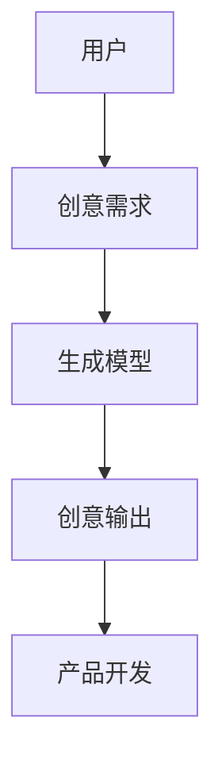
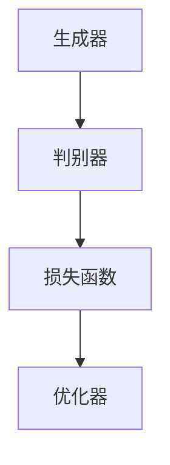
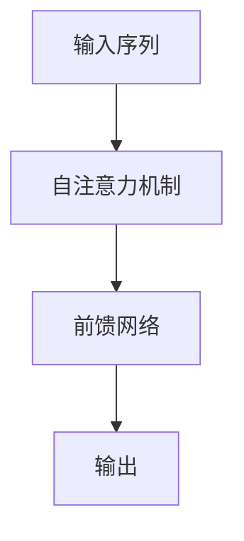
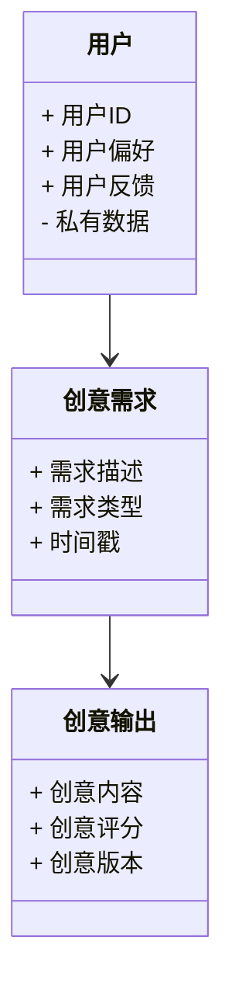
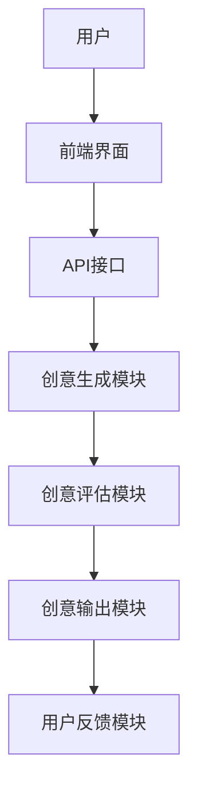
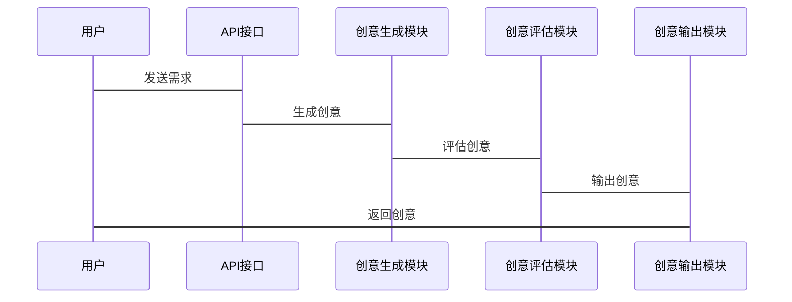

                 


# 构建企业AI创意助手：促进创新与产品开发

## 关键词：
企业AI创意助手、AI创意生成、产品开发、自然语言处理、生成对抗网络、Transformer模型

## 摘要：
本文详细探讨了如何构建企业AI创意助手，以促进创新与产品开发。从背景介绍到核心概念，再到算法原理、系统架构、项目实战和最佳实践，全面解析了企业AI创意助手的技术实现和应用场景。通过本文，读者将深入了解AI创意助手的核心原理、算法实现以及实际应用，为企业创新和产品开发提供新的思路和解决方案。

---

## 第一部分: 背景介绍

## 第1章: AI创意助手的定义与背景

### 1.1 问题背景

#### 1.1.1 企业创新面临的挑战
企业在创新和产品开发过程中常常面临以下挑战：
- 创意枯竭：团队可能因为缺乏灵感而停滞不前。
- 开发效率低下：传统的产品开发流程耗时且成本高昂。
- 知识孤岛：不同部门之间缺乏有效的信息共享和协作。

#### 1.1.2 创意与产品开发的传统模式
传统的创意与产品开发模式通常依赖于人工 brainstorming 和试错，这种方式效率低、成本高且难以规模化。

#### 1.1.3 AI技术如何赋能创新
AI技术，特别是自然语言处理和生成模型，为创意与产品开发提供了新的可能性：
- 自动生成创意点子。
- 提供产品设计的建议。
- 优化产品功能和用户体验。

### 1.2 问题描述

#### 1.2.1 创意与产品开发中的痛点
- 创意生成的效率低下。
- 创意的质量难以保证。
- 创意与实际需求的脱节。

#### 1.2.2 AI创意助手的目标与作用
AI创意助手的目标是通过AI技术辅助企业快速生成高质量的创意点子，并提供从创意到产品的全流程支持。

### 1.3 问题解决

#### 1.3.1 AI创意助手的核心功能
- 创意生成：基于输入的关键词或需求，生成创意点子。
- 创意评估：对生成的创意进行打分和优化。
- 创意落地：提供从创意到产品的实现建议。

### 1.4 边界与外延

#### 1.4.1 AI创意助手的适用范围
- 适用于需要快速生成创意的企业，如科技公司、广告公司、设计公司等。
- 适用于产品开发的初期阶段，如市场调研和需求分析。

#### 1.4.2 与其他AI应用的区别
AI创意助手与其他AI应用（如客服聊天机器人）的区别在于其核心目标是生成创意内容，而非简单的信息交互。

### 1.5 概念结构与核心要素

#### 1.5.1 概念框架
AI创意助手的构建依赖于以下几个核心模块：
- 数据输入：用户输入的需求或关键词。
- 创意生成：基于输入生成创意内容。
- 创意评估：对生成的内容进行评估和优化。
- 输出：将优化后的创意输出给用户。

#### 1.5.2 核心要素组成
- 数据：高质量的训练数据是AI创意助手的基础。
- 算法：生成模型和评估算法是核心。
- 用户反馈：用户对生成创意的反馈用于模型优化。

---

## 第二部分: 核心概念与联系

## 第2章: AI创意助手的核心概念

### 2.1 核心概念原理

#### 2.1.1 生成模型
生成模型是一种用于生成新内容的AI模型，常用的生成模型包括：
- **生成对抗网络（GAN）**：通过生成器和判别器的对抗训练生成高质量内容。
- **变体自编码器（VAE）**：通过编码和解码过程生成多样化的输出。

#### 2.1.2 自然语言处理
自然语言处理（NLP）技术用于理解用户需求并生成符合语义的创意内容，常用技术包括：
- **词袋模型（Bag of Words）**：将文本表示为词汇的集合。
- **词嵌入（Word Embedding）**：将词语映射到低维向量空间（如Word2Vec、GloVe）。
- ** Transformer模型**：通过自注意力机制处理长文本。

#### 2.1.3 创意生成机制
创意生成机制是指AI系统如何从输入中生成创意内容的过程，通常包括以下几个步骤：
1. 输入处理：将用户需求转化为模型可理解的格式。
2. 创意生成：模型根据输入生成多个创意选项。
3. 创意评估：对生成的创意进行质量评估和优化。
4. 输出：将优化后的创意输出给用户。

### 2.2 概念属性特征对比

| 概念 | 属性 | 特征 |
|------|------|------|
| 生成模型 | 输入 | 文本/图像 |
| 自然语言处理 | 输出 | 文本 |
| 创意生成机制 | 应用场景 | 创意生成 |

### 2.3 ER实体关系图



---

## 第三部分: 算法原理讲解

## 第3章: 算法原理与实现

### 3.1 算法原理

#### 3.1.1 生成对抗网络（GAN）



GAN由生成器和判别器组成，生成器通过欺骗判别器生成逼真的数据，而判别器则试图识别生成数据与真实数据的区别。

#### 3.1.2 Transformer模型



Transformer模型通过自注意力机制处理长文本，生成高质量的创意内容。

### 3.2 算法实现

#### 3.2.1 Python源代码实现

```python
import torch
import torch.nn as nn

class Generator(nn.Module):
    def __init__(self, latent_dim, hidden_dim):
        super(Generator, self).__init__()
        self.l1 = nn.Linear(latent_dim, hidden_dim)
        self.l2 = nn.Linear(hidden_dim, hidden_dim)
        self.l3 = nn.Linear(hidden_dim, hidden_dim)
    
    def forward(self, x):
        x = self.l1(x)
        x = self.l2(x)
        x = self.l3(x)
        return x

class Discriminator(nn.Module):
    def __init__(self, input_dim, hidden_dim):
        super(Discriminator, self).__init__()
        self.l1 = nn.Linear(input_dim, hidden_dim)
        self.l2 = nn.Linear(hidden_dim, hidden_dim)
        self.l3 = nn.Linear(hidden_dim, 1)
    
    def forward(self, x):
        x = self.l1(x)
        x = self.l2(x)
        x = self.l3(x)
        return x

# 初始化模型和优化器
generator = Generator(latent_dim, hidden_dim)
discriminator = Discriminator(input_dim, hidden_dim)
optimizer_G = torch.optim.Adam(generator.parameters(), lr=0.001)
optimizer_D = torch.optim.Adam(discriminator.parameters(), lr=0.001)

# 训练循环
for epoch in range(num_epochs):
    for _ in range(train_steps):
        # 生成假数据
        noise = torch.randn(batch_size, latent_dim)
        gen_output = generator(noise)
        
        # 判别器训练
        optimizer_D.zero_grad()
        real_output = discriminator(real_data)
        fake_output = discriminator(gen_output)
        loss_D = -torch.mean(real_output) + torch.mean(fake_output)
        loss_D.backward()
        optimizer_D.step()
        
        # 生成器训练
        optimizer_G.zero_grad()
        gen_output = generator(noise)
        fake_output = discriminator(gen_output)
        loss_G = -torch.mean(fake_output)
        loss_G.backward()
        optimizer_G.step()
```

### 3.3 算法的数学模型与公式

#### GAN的损失函数
$$\text{损失函数} = -\log(D(x)) - \log(1 - D(G(z)))$$
其中：
- $D(x)$ 是判别器对真实数据的判断概率。
- $G(z)$ 是生成器生成的数据。
- $D(G(z))$ 是判别器对生成数据的判断概率。

#### Transformer的自注意力机制
$$\text{注意力权重} = \frac{\exp(\text{score})}{\sum_{i}\exp(\text{score}_i)}$$
其中，$\text{score}$ 是查询与键的点积。

---

## 第四部分: 系统分析与架构设计方案

## 第4章: 系统分析与架构设计

### 4.1 问题场景介绍

#### 4.1.1 项目背景
本项目旨在构建一个AI创意助手，用于辅助企业快速生成创意点子，并提供从创意到产品的全流程支持。

### 4.2 系统功能设计

#### 4.2.1 领域模型



#### 4.2.2 系统架构设计



### 4.3 系统接口设计

#### 4.3.1 API接口
- 输入接口：`POST /api/generate`，接收用户需求和偏好。
- 输出接口：`GET /api/output`，返回生成的创意内容和评分。

#### 4.3.2 系统交互



---

## 第五部分: 项目实战

## 第5章: 项目实战

### 5.1 环境安装

#### 5.1.1 安装依赖
```bash
pip install torch
pip install transformers
pip install matplotlib
pip install seaborn
```

### 5.2 核心代码实现

#### 5.2.1 创意生成模块

```python
from transformers import AutoTokenizer, AutoModelForSequenceGeneration
import torch

tokenizer = AutoTokenizer.from_pretrained("gpt2")
model = AutoModelForSequenceGeneration.from_pretrained("gpt2")

def generate_creativity(prompt):
    inputs = tokenizer.encode(prompt, return_tensors="pt")
    outputs = model.generate(inputs, max_length=50, temperature=0.7, top_p=0.7)
    return tokenizer.decode(outputs[0], skip_special_tokens=True)
```

#### 5.2.2 创意评估模块

```python
import torch
import torch.nn as nn

class CreativityEvaluator(nn.Module):
    def __init__(self, vocab_size):
        super(CreativityEvaluator, self).__init__()
        self.linear = nn.Linear(vocab_size, 1)
    
    def forward(self, x):
        return torch.sigmoid(self.linear(x))
```

### 5.3 代码应用解读与分析

#### 5.3.1 创意生成模块
- 使用预训练的GPT-2模型生成创意内容。
- 调整温度和top_p参数以控制生成内容的多样性和质量。

#### 5.3.2 创意评估模块
- 使用线性模型对生成的创意内容进行评分。
- 使用sigmoid函数将评分转化为概率。

### 5.4 实际案例分析

#### 5.4.1 案例背景
某科技公司希望快速生成新的App创意。

#### 5.4.2 案例分析
- 用户输入：目标市场是年轻人，功能需求是社交和健康管理。
- 生成创意：结合游戏化元素的健康管理App。
- 评估评分：创意质量得分为0.85，具有较高的可行性。

### 5.5 项目小结

#### 5.5.1 实战总结
- 创意生成模块能够快速生成多样化的创意点子。
- 创意评估模块能够有效筛选出高质量的创意内容。
- 系统整体运行效率较高，能够满足企业需求。

---

## 第六部分: 最佳实践

## 第6章: 最佳实践

### 6.1 小结

#### 6.1.1 项目总结
- 通过AI技术实现了企业创意助手的构建。
- 提供了从创意生成到评估的全流程支持。

### 6.2 注意事项

#### 6.2.1 数据质量
- 确保训练数据的多样性和高质量。
- 处理敏感数据时注意隐私保护。

#### 6.2.2 模型调优
- 根据实际需求调整模型参数。
- 定期更新模型以保持生成内容的新鲜度。

#### 6.2.3 用户反馈
- 收集用户的反馈信息，用于模型优化。
- 提供多种创意生成模式以满足不同用户需求。

### 6.3 拓展阅读

#### 6.3.1 推荐资料
- 《深度学习》—— Ian Goodfellow
- 《生成式人工智能：AI创意助手的构建与应用》
- AI创意助手相关的学术论文和研究报告。

#### 6.3.2 专业社区与论坛
- 加入AI相关的专业社区，如GitHub、Kaggle等。
- 关注AI领域的最新动态和技术进展。

---

## 作者：AI天才研究院/AI Genius Institute & 禅与计算机程序设计艺术 /Zen And The Art of Computer Programming

---

通过本文的详细讲解，读者可以深入了解企业AI创意助手的技术实现和应用场景。从背景介绍到算法实现，再到系统架构和项目实战，全面掌握了构建企业AI创意助手的关键技术和实践方法。未来，随着AI技术的不断发展，企业AI创意助手将在创新和产品开发中发挥越来越重要的作用。

