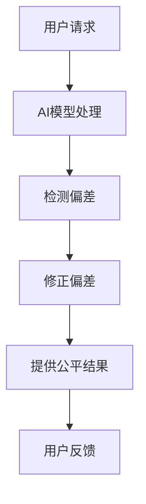
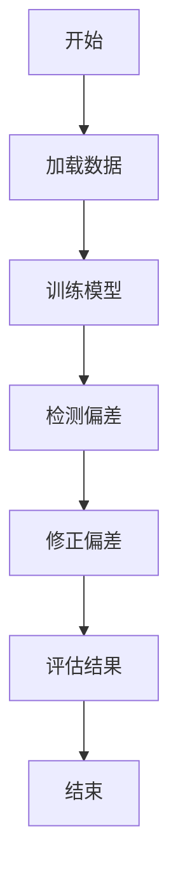
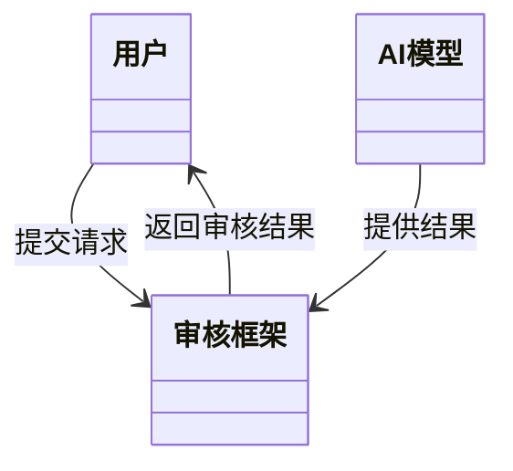
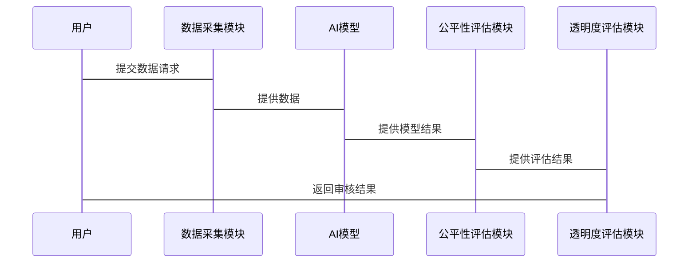

                 


# 构建企业级AI伦理审核框架：确保AI应用的公平性与透明度

**关键词**：AI伦理审核框架、公平性、透明度、算法偏差、可解释性、企业级AI

**摘要**：随着人工智能技术的迅速发展，企业级AI应用在各个领域的普及也在不断增加。然而，AI系统的公平性与透明度问题日益突出，构建一个有效的AI伦理审核框架变得至关重要。本文将详细探讨构建企业级AI伦理审核框架的背景、核心概念、算法原理、系统架构设计、项目实战以及最佳实践，帮助企业在确保AI应用的公平性和透明度方面提供指导。

---

## 第1章: AI伦理审核的核心概念

### 1.1 AI伦理审核的背景与问题背景

#### 1.1.1 AI技术的快速发展与伦理挑战
人工智能技术的快速发展为企业和社会带来了巨大的变革和机遇。然而，随着AI技术的广泛应用，其潜在的伦理问题也逐渐暴露出来。例如，算法偏差可能导致不公平的决策，模型的不透明性使得用户难以理解AI系统的运作逻辑。这些问题不仅影响了用户体验，还可能引发法律和道德争议。

#### 1.1.2 企业级AI应用中的伦理问题
在企业级AI应用中，伦理问题尤为突出。例如，在招聘系统中，算法可能对某些群体存在偏见；在金融领域，算法可能对某些客户群体不公平地拒绝贷款申请。这些问题不仅影响企业的声誉，还可能导致法律风险。

#### 1.1.3 构建AI伦理审核框架的必要性
为了应对上述问题，构建一个企业级AI伦理审核框架变得至关重要。该框架能够系统地检测和修正算法偏差，确保AI应用的公平性和透明度，从而降低企业的法律和道德风险。

### 1.2 AI伦理审核的定义与问题描述

#### 1.2.1 AI伦理审核的定义
AI伦理审核是指通过系统化的流程和工具，对AI模型和应用进行评估，确保其符合伦理标准的过程。它不仅关注模型的输出结果，还关注模型的训练数据、算法设计以及决策过程。

#### 1.2.2 企业级AI应用中的伦理问题描述
在企业级AI应用中，常见的伦理问题包括：
1. **算法偏差**：模型可能因为训练数据的偏差而产生不公平的决策。
2. **透明度不足**：用户难以理解AI系统的决策逻辑。
3. **隐私问题**：数据的收集和使用可能侵犯用户的隐私权。

#### 1.2.3 伦理审核框架的核心目标
伦理审核框架的核心目标是：
1. **检测和减少算法偏差**：确保AI模型的决策公平合理。
2. **提高模型的透明度**：让用户能够理解AI系统的决策逻辑。
3. **保护用户隐私**：确保数据的合法合规使用。

### 1.3 问题解决与边界

#### 1.3.1 AI伦理审核框架的解决思路
AI伦理审核框架的解决思路包括：
1. **定义伦理标准**：明确企业级AI应用需要遵循的伦理准则。
2. **建立审核流程**：制定系统的审核流程，包括数据检查、模型评估等。
3. **技术实现**：开发工具和算法，用于检测和修正模型的偏差。

#### 1.3.2 伦理审核的边界与外延
伦理审核的边界在于确保AI系统的公平性和透明度，但不涉及具体的业务逻辑。其外延则包括数据隐私保护、用户知情权等与伦理相关的各个方面。

#### 1.3.3 核心概念的结构与组成
AI伦理审核框架的结构包括：
1. **数据层**：包括数据的收集、清洗和标注。
2. **算法层**：包括模型的训练和优化。
3. **评估层**：包括模型的公平性评估和透明度评估。
4. **应用层**：包括AI应用的实际部署和用户反馈。

---

## 第2章: AI伦理审核的核心概念与联系

### 2.1 核心概念原理

#### 2.1.1 公平性与透明度的定义
- **公平性**：确保AI模型的决策对所有用户一视同仁，避免对特定群体的偏见。
- **透明度**：让用户能够理解AI系统的决策逻辑和结果。

#### 2.1.2 偏差检测与修正机制
- **偏差检测**：通过统计方法或机器学习算法，检测模型是否存在偏差。
- **修正机制**：通过重新训练模型或调整数据分布，减少偏差。

#### 2.1.3 可解释性与可追溯性
- **可解释性**：让用户能够理解AI系统的决策过程。
- **可追溯性**：能够追踪AI系统的决策过程，以便在出现问题时进行追溯。

### 2.2 概念属性特征对比

| 概念       | 公平性       | 透明度       |
|------------|--------------|--------------|
| 定义       | 决策的公平性 | 决策的可理解性 |
| 检测方法   | 偏差检测     | 日志分析     |
| 修正方法   | 数据重采样   | 提供解释     |

#### 2.2.1 公平性与透明度的对比分析
公平性关注的是决策结果的公正性，而透明度关注的是用户对决策过程的理解。两者相辅相成，共同确保AI系统的可信性。

#### 2.2.2 偏差检测与可解释性的关系
偏差检测是确保公平性的基础，而可解释性是用户理解AI决策的前提。只有同时具备公平性和透明度，才能真正实现AI系统的可信性。

#### 2.2.3 案例分析：公平性与透明度的权衡
在某些情况下，公平性和透明度可能存在冲突。例如，为了公平性，可能需要对某些数据进行处理，但这可能会降低模型的透明度。需要在两者之间找到平衡点。

### 2.3 ER实体关系图

```mermaid
erDiagram
    participant 用户
    participant AI模型
    participant 审核框架
    用户 --> AI模型 : 使用AI服务
    AI模型 --> 审核框架 : 提交决策结果
    审核框架 --> 用户 : 提供审核结果
```

### 2.4 Mermaid流程图



---

## 第3章: 基于公平性评估的AI审核算法

### 3.1 算法原理概述

#### 3.1.1 公平性评估的基本原理
公平性评估的基本原理是通过统计方法或机器学习算法，检测模型是否存在偏差，并根据检测结果进行修正。

#### 3.1.2 偏差检测的数学模型
常用的偏差检测方法包括统计方法（如卡方检验）和机器学习方法（如逻辑回归）。通过这些方法，可以检测模型在不同群体之间的预测差异。

#### 3.1.3 算法的优化思路
优化思路包括：
1. **数据层面**：通过数据重采样技术，减少数据中的偏差。
2. **模型层面**：通过调整模型参数，减少预测结果的偏差。
3. **评估层面**：通过多指标评估，全面检测模型的公平性。

### 3.2 算法实现

#### 3.2.1 Mermaid算法流程图



#### 3.2.2 Python代码实现

```python
import pandas as pd
from sklearn.metrics import confusion_matrix

def calculate_bias metrics(y_true, y_pred):
    # 计算整体准确率
    accuracy = sum(y_true == y_pred) / len(y_true)
    # 计算每个群体的准确率
    group_accuracy = {}
    for i in range(len(y_true)):
        if y_true[i] not in group_accuracy:
            group_accuracy[y_true[i]] = []
        group_accuracy[y_true[i]].append(y_true[i] == y_pred[i])
    # 计算每个群体的准确率
    for group in group_accuracy:
        accuracy_per_group = sum(group_accuracy[group]) / len(group_accuracy[group])
        print(f"群体 {group} 的准确率为 {accuracy_per_group}")
    return accuracy

# 示例数据
y_true = [0, 1, 0, 1, 0, 1]
y_pred = [0, 1, 1, 1, 0, 1]
calculate_bias_metrics(y_true, y_pred)
```

#### 3.2.3 代码解读与分析
上述代码通过混淆矩阵计算整体准确率，并进一步分析每个群体的准确率，从而检测模型是否存在偏差。如果某个群体的准确率显著低于整体准确率，可能表明模型存在偏差。

### 3.3 数学模型与公式

#### 3.3.1 公平性评估的损失函数
$$ L = \sum_{i=1}^{n} (y_i - \hat{y_i})^2 $$

#### 3.3.2 偏差检测的数学公式
$$ \text{偏差} = \frac{\sum_{i=1}^{n} (y_i - \hat{y_i})}{n} $$

#### 3.3.3 优化算法的数学推导
通过最小化损失函数，可以优化模型的公平性：
$$ \min L \text{ s.t. } \sum_{i=1}^{n} (y_i - \hat{y_i}) = 0 $$

---

## 第4章: 透明度与可解释性算法

### 4.1 透明度与可解释性算法

#### 4.1.1 透明度的定义与实现
透明度是指用户能够理解AI系统的决策过程。通过提供模型的解释和日志，可以实现透明度。

#### 4.1.2 可解释性算法的实现
可解释性算法包括：
1. **线性模型**：如逻辑回归，其系数可以直接解释。
2. **树模型**：如决策树，可以通过树结构解释决策过程。

#### 4.1.3 案例分析：透明度的实现
在招聘系统中，可以通过解释模型的决策逻辑，让用户了解为什么某个候选人被拒绝。

---

## 第5章: 系统分析与架构设计

### 5.1 问题场景介绍
企业级AI应用可能面临数据隐私、算法偏差等问题，需要构建一个系统化的审核框架。

### 5.2 系统功能设计

#### 5.2.1 领域模型Mermaid类图



### 5.3 系统架构设计

#### 5.3.1 Mermaid架构图

```mermaid
container 审核框架
    component 数据采集模块
    component 模型训练模块
    component 公平性评估模块
    component 透明度评估模块
```

### 5.4 系统接口设计

#### 5.4.1 接口说明
1. **数据接口**：用于数据的采集和处理。
2. **模型接口**：用于模型的训练和评估。
3. **审核接口**：用于审核结果的返回。

#### 5.4.2 交互流程图



---

## 第6章: 项目实战

### 6.1 环境安装
需要安装Python、机器学习库（如Scikit-learn）和可视化工具（如Mermaid）。

### 6.2 系统核心实现源代码

```python
import numpy as np
from sklearn.tree import DecisionTreeClassifier

# 示例数据
X = np.array([[2, 3], [5, 4], [3, 6], [7, 8], [1, 2], [4, 5]])
y = np.array([0, 1, 0, 1, 0, 1])

# 训练模型
model = DecisionTreeClassifier()
model.fit(X, y)

# 检测偏差
y_pred = model.predict(X)
confusion_matrix(y, y_pred)
```

### 6.3 代码解读与分析
上述代码通过训练一个决策树模型，并使用混淆矩阵检测模型的偏差。如果模型在某些群体上的准确率较低，可能需要进行数据重采样或其他调整。

### 6.4 案例分析与详细讲解

#### 6.4.1 案例分析
在招聘系统中，可以通过上述方法检测模型是否存在性别或种族偏见。

#### 6.4.2 详细讲解
通过分析模型的预测结果和真实结果，可以发现模型是否存在偏差。如果存在偏差，可以通过数据重采样或调整模型参数进行修正。

### 6.5 项目小结
本项目通过构建一个AI伦理审核框架，成功实现了对AI模型的公平性与透明度评估，确保了AI应用的可信性。

---

## 第7章: 最佳实践与总结

### 7.1 最佳实践

#### 7.1.1 小结
构建企业级AI伦理审核框架需要从数据、算法、评估等多个方面入手，确保模型的公平性和透明度。

#### 7.1.2 注意事项
1. **数据隐私**：确保数据的合法合规使用。
2. **模型解释性**：选择可解释性较强的模型。
3. **用户反馈**：及时收集用户反馈，不断优化模型。

#### 7.1.3 拓展阅读
推荐阅读《偏见的算法》和《透明的人工智能》等书籍，深入理解AI伦理问题。

### 7.2 作者介绍

**作者：AI天才研究院/AI Genius Institute & 禅与计算机程序设计艺术 /Zen And The Art of Computer Programming**

---

以上是《构建企业级AI伦理审核框架：确保AI应用的公平性与透明度》的技术博客文章内容，希望对您有所帮助！

