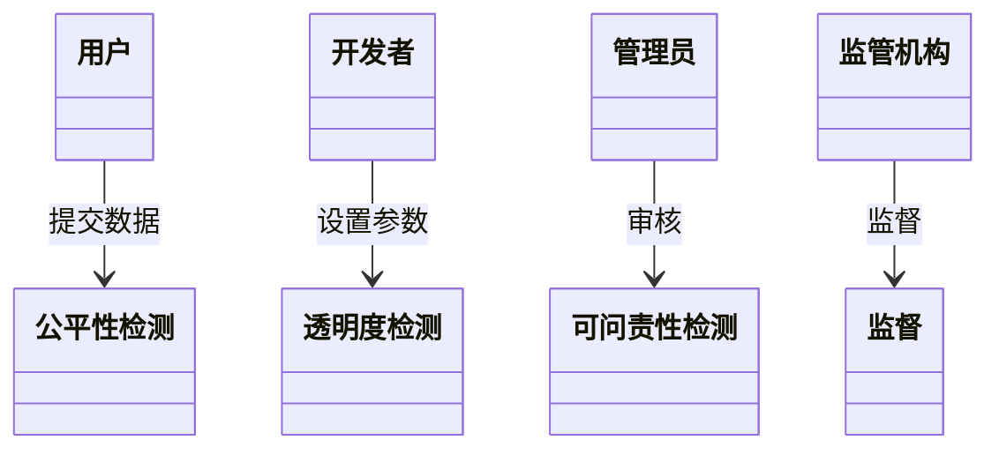

                 


# 构建企业级AI伦理审核框架：确保AI应用的公平性、透明度与可问责性

## 关键词：AI伦理审核，企业级框架，公平性，透明度，可问责性，伦理审核框架，AI伦理

## 摘要：  
随着人工智能技术的快速发展，AI应用在企业中的普及也带来了诸多伦理挑战。本文旨在构建一个企业级AI伦理审核框架，确保AI应用的公平性、透明度与可问责性。通过系统化的分析与设计，本文将详细阐述该框架的核心概念、算法原理、系统架构及实现方法，并结合实际案例进行分析，为企业级AI应用的伦理审核提供理论与实践指导。

---

# 第一章: AI伦理审核框架的背景与意义

## 1.1 问题背景与挑战

### 1.1.1 AI技术的快速发展与应用  
人工智能技术近年来取得了突破性进展，广泛应用于医疗、金融、招聘、司法等领域。然而，AI系统的决策过程往往缺乏透明性，且可能存在算法偏见，导致伦理问题频发。

### 1.1.2 AI应用中的伦理问题  
AI系统的决策可能对个人或社会产生重大影响，例如偏见导致的不公平待遇、算法“黑箱”带来的透明度缺失，以及责任归属不清等问题。

### 1.1.3 企业级AI应用的特殊性  
企业级AI应用通常涉及大量数据和复杂决策，其伦理问题可能影响企业声誉和法律合规性，因此需要构建系统化的伦理审核框架。

## 1.2 AI伦理审核框架的定义与目标

### 1.2.1 框架的核心概念  
AI伦理审核框架是一种用于评估和确保AI系统公平性、透明度与可问责性的系统化方法。

### 1.2.2 框架的目标与作用  
框架的目标是通过检测和缓解算法偏见、提高模型可解释性、明确责任归属，确保AI应用的伦理合规性。

### 1.2.3 框架的边界与外延  
框架聚焦于AI系统的伦理审核，但不包括技术实现细节和具体业务逻辑。

## 1.3 伦理审核框架的核心要素

### 1.3.1 公平性  
确保AI系统对所有用户一视同仁，避免基于种族、性别等特征的歧视。

### 1.3.2 透明度  
要求AI系统的决策过程可解释，用户能够理解系统如何做出决策。

### 1.3.3 可问责性  
明确AI系统及相关主体的责任归属，确保出现问题时能够追责。

## 1.4 本章小结  
本章介绍了AI伦理审核框架的背景、目标和核心要素，为后续章节的深入分析奠定了基础。

---

# 第二章: 公平性、透明度与可问责性

## 2.1 公平性

### 2.1.1 公平性定义与衡量标准  
公平性是指AI系统在决策过程中对所有用户群体的公平对待。衡量标准包括结果公平性和过程公平性。

### 2.1.2 偏见检测与缓解方法  
- **偏见检测**：通过统计方法或机器学习模型检测数据中的偏见。
- **偏见缓解**：通过重新采样、调整模型参数等方式减少偏见。

### 2.1.3 案例分析：公平性在招聘系统中的应用  
在招聘系统中，若算法偏好某一性别，可通过重新采样数据或调整模型参数来消除偏见。

## 2.2 透明度

### 2.2.1 透明度的层次与实现方式  
透明度分为数据透明、模型透明和决策透明三个层次。

### 2.2.2 可解释性模型的构建  
通过使用线性模型或树模型等可解释性较强的模型，提高决策过程的透明度。

### 2.2.3 案例分析：透明度在金融领域的应用  
在信用评分系统中，通过解释模型的决策逻辑，增强用户的信任。

## 2.3 可问责性

### 2.3.1 可问责性的定义与实现  
可问责性是指在出现问题时，能够明确责任归属并采取相应措施。

### 2.3.2 责任分配与追踪机制  
通过记录系统日志和操作流程，明确各方责任。

### 2.3.3 案例分析：可问责性在自动驾驶中的应用  
在自动驾驶系统中，通过记录驾驶数据和操作日志，明确责任归属。

## 2.4 公平性、透明度与可问责性的相互关系与协同  
三者相互依存，公平性需要透明度支持，透明度需要可问责性保障，可问责性依赖公平性和透明度实现。

## 2.5 本章小结  
本章详细分析了公平性、透明度与可问责性的定义、实现方法及相互关系，为后续章节的设计提供了理论依据。

---

# 第三章: AI伦理审核框架的核心概念与联系

## 3.1 核心概念原理

### 3.1.1 公平性原理  
通过统计方法和机器学习模型检测和缓解偏见。

### 3.1.2 透明度原理  
通过可解释性模型和日志记录提高决策过程的透明度。

### 3.1.3 可问责性原理  
通过记录操作日志和明确责任分配实现可问责性。

## 3.2 核心概念属性特征对比

| **属性**     | **公平性**       | **透明度**       | **可问责性**       |
|--------------|------------------|------------------|--------------------|
| **定义**     | 决策的公平性     | 决策过程的透明性 | 责任的明确性       |
| **实现方法** | 检测和缓解偏见   | 提高可解释性     | 记录日志和责任分配 |
| **案例**     | 招聘系统         | 金融信用评分     | 自动驾驶系统       |

## 3.3 ER实体关系图架构

```mermaid
erDiagram
    actor 用户
    actor 开发者
    actor 管理员
    actor 监管机构
    database 系统日志
    database 用户数据
    database 模型参数
    database 决策记录
    用户 --> 系统日志: 记录操作
    开发者 --> 模型参数: 设置参数
    管理员 --> 系统日志: 审核
    监管机构 --> 决策记录: 监督
```

## 3.4 本章小结  
本章通过对比分析和ER图展示了AI伦理审核框架的核心概念及其关系。

---

# 第四章: 算法原理与数学模型

## 4.1 偏见检测算法

### 4.1.1 基于统计的方法  
通过统计不同群体的决策结果差异，检测偏见。

### 4.1.2 基于机器学习的方法  
使用分类模型预测偏见。

### 4.1.3 案例分析：Word Embedding偏见检测  
通过分析词嵌入模型中性别相关的词汇，检测偏见。

## 4.2 可解释性模型

### 4.2.1 SHAP值  
SHAP（Shapley Additive exPlanations）值用于解释模型的预测结果。

### 4.2.2 LIME解释  
LIME（Local Interpretable Model-agnostic Explanations）用于解释单个预测结果。

### 4.2.3 案例分析：树模型的可解释性  
通过树模型的决策路径解释预测结果。

## 4.3 责任分配算法

### 4.3.1 责任分配模型  
根据各方的贡献度分配责任。

### 4.3.2 基于贡献度的分配方法  
通过计算各方对最终决策的贡献度，确定责任比例。

### 4.3.3 案例分析：自动驾驶责任分配  
根据传感器数据和系统日志，确定责任归属。

## 4.4 数学模型与公式

### 4.4.1 偏见检测的统计公式  
$$ p = \frac{\text{目标群体的负面决策数}}{\text{目标群体的总决策数}} $$

### 4.4.2 SHAP值计算公式  
$$ \text{SHAP}(i) = \sum_{j} \phi_j(i) $$

### 4.4.3 责任分配的数学模型  
$$ \text{责任比例} = \frac{\text{贡献度}}{\sum \text{贡献度}} \times 100\% $$

## 4.5 本章小结  
本章详细讲解了偏见检测、可解释性模型和责任分配算法的原理与实现方法。

---

# 第五章: 系统分析与架构设计方案

## 5.1 问题场景介绍

### 5.1.1 企业级AI应用的伦理风险  
AI系统的决策可能对企业和用户造成重大影响。

### 5.1.2 框架的应用场景  
适用于企业内部的AI应用审核和优化。

## 5.2 项目介绍

### 5.2.1 项目目标  
构建一个可扩展的企业级AI伦理审核框架。

### 5.2.2 项目范围  
涵盖公平性、透明度与可问责性的检测与优化。

### 5.2.3 项目团队  
包括数据科学家、软件工程师和伦理学家。

## 5.3 系统功能设计

### 5.3.1 领域模型  


### 5.3.2 功能模块划分  
- 公平性检测模块
- 透明度检测模块
- 可问责性检测模块

### 5.3.3 用户角色与权限  
- 用户：提交数据
- 开发者：设置模型参数
- 管理员：审核结果
- 监管机构：监督

## 5.4 系统架构设计


## 5.5 本章小结  
本章通过系统分析和架构设计，为AI伦理审核框架的实现提供了理论基础。

---

# 第六章: 项目实战

## 6.1 环境安装

### 6.1.1 安装Python  
```bash
python --version
pip install --upgrade pip
```

### 6.1.2 安装依赖  
```bash
pip install scikit-learn shap lime
```

## 6.2 系统核心实现源代码

### 6.2.1 公平性检测代码  
```python
from sklearn.metrics import accuracy_score
import pandas as pd

def detect_bias(X, y, sensitive_attribute):
    # 按敏感属性分组
    grouped = pd.DataFrame(X).groupby(sensitive_attribute)
    # 计算每组的准确性
    accuracies = {}
    for name, group in grouped:
        accuracies[name] = accuracy_score(y[group.index], y[group.index])
    return accuracies
```

### 6.2.2 可解释性模型代码  
```python
import shap

explainer = shap.TreeExplainer(model)
shap_values = explainer.shap_values(X)
```

### 6.2.3 责任分配代码  
```python
def calculate Responsibility(X, model, threshold):
    # 计算每个特征的贡献度
    contributions = {}
    for i in range(len(X.columns)):
        contributions[X.columns[i]] = abs(shap_values[i][0])
    # 根据贡献度分配责任
    total = sum(contributions.values())
    responsibility = {k: v/total for k, v in contributions.items()}
    return responsibility
```

## 6.3 代码应用解读与分析  
通过上述代码，可以实现偏见检测、模型解释和责任分配。

## 6.4 实际案例分析  
以招聘系统为例，通过代码检测性别偏见并优化模型。

## 6.5 项目小结  
本章通过实战案例展示了AI伦理审核框架的具体实现方法。

---

# 第七章: 最佳实践与注意事项

## 7.1 最佳实践

### 7.1.1 定期审核  
定期对AI系统进行伦理审核，确保持续合规。

### 7.1.2 透明化沟通  
向用户和利益相关者透明化AI系统的决策过程。

### 7.1.3 培训与教育  
对相关人员进行伦理审核框架的培训和教育。

## 7.2 小结  
构建企业级AI伦理审核框架是一项复杂的系统工程，需要企业内外部的共同努力。

## 7.3 注意事项  
- 数据隐私保护
- 模型的实时更新
- 相关法律法规的遵守

## 7.4 拓展阅读  
推荐阅读相关书籍和论文，深入理解AI伦理问题。

---

# 结语

通过本文的系统分析和实践指导，企业可以构建一个完善的AI伦理审核框架，确保AI应用的公平性、透明度与可问责性。

---

# 作者

作者：AI天才研究院/AI Genius Institute & 禅与计算机程序设计艺术 /Zen And The Art of Computer Programming

