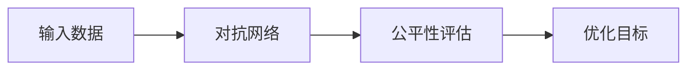
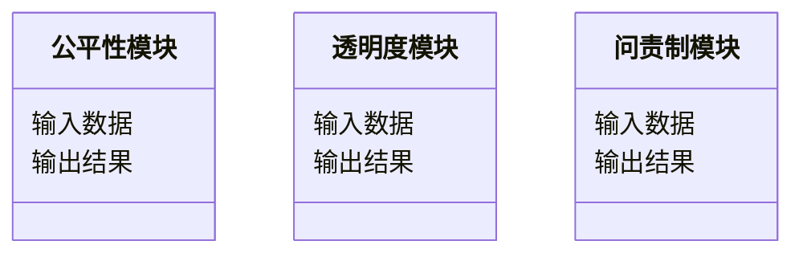

                 


# 构建企业级AI伦理框架：确保AI应用的公平性、透明度与问责制

## 关键词：企业级AI、伦理框架、公平性、透明度、问责制、AI系统设计、技术伦理

## 摘要：  
随着人工智能技术的快速发展，企业级AI应用在各个领域中变得越来越普遍。然而，AI系统的决策过程可能引入偏见、不透明性和责任不清的问题。为了确保AI系统的公平性、透明度和问责制，构建一个企业级AI伦理框架变得至关重要。本文将从背景、核心概念、算法原理、系统架构设计、项目实战和总结等多方面详细阐述如何构建企业级AI伦理框架，确保AI应用的伦理合规性。

---

## 第一部分: 企业级AI伦理框架的背景与核心概念

### 第1章: AI伦理框架的背景与重要性

#### 1.1 人工智能的快速发展与挑战  
人工智能技术近年来取得了飞速发展，广泛应用于医疗、金融、教育、交通等领域。然而，AI系统的决策过程可能带来以下挑战：  
- **偏见问题**：AI系统可能基于训练数据中的偏见做出不公平的决策。  
- **透明度不足**：复杂的AI模型（如深度学习模型）通常被视为“黑箱”，用户难以理解其决策逻辑。  
- **责任不清**：当AI系统引发问题时，责任归属往往难以确定。  

#### 1.2 企业级AI伦理框架的必要性  
为了应对上述挑战，企业级AI伦理框架的构建至关重要：  
- **公平性**：确保AI系统在决策过程中不歧视特定群体。  
- **透明度**：让用户理解AI系统的决策逻辑。  
- **问责制**：明确AI系统及其开发者的责任归属。  

#### 1.3 本章小结  
本章通过分析人工智能技术的快速发展及其带来的挑战，强调了构建企业级AI伦理框架的必要性。

---

### 第2章: 公平性、透明度与问责制的核心概念

#### 2.1 公平性  
- **定义与特征**：公平性是指AI系统在决策过程中不歧视任何特定群体。  
- **实现方式**：通过算法优化和数据清洗，消除训练数据中的偏见。  
- **与多样性关系**：公平性需要在尊重多样性的前提下实现。  

#### 2.2 透明度  
- **定义与层次**：透明度是指AI系统的决策逻辑对用户可解释和可理解。  
- **实现方式**：通过可解释性模型和用户友好的解释界面实现。  
- **与用户信任关系**：透明度是建立用户信任的关键因素。  

#### 2.3 问责制  
- **定义与特征**：问责制是指明确AI系统及其开发者的责任归属。  
- **实现方式**：通过日志记录和可追溯性设计实现。  
- **与企业治理关系**：问责制是企业治理的重要组成部分。  

#### 2.4 核心概念的联系与对比  
- **对比表格**：  
| 概念 | 定义 | 实现方式 | 关键作用 |  
|------|------|----------|----------|  
| 公平性 | 不歧视特定群体 | 算法优化 | 建立信任 |  
| 透明度 | 决策逻辑可理解 | 可解释性模型 | 建立信任 |  
| 问责制 | 明确责任归属 | 日志记录 | 企业治理 |  

- **ER实体关系图**：  
```mermaid
er
    actor: 用户
    system: AI系统
    attribute: 公平性
    attribute: 透明度
    attribute: 问责制
    relation: 实现
```

#### 2.5 本章小结  
本章详细阐述了公平性、透明度和问责制的核心概念，并通过对比表格和ER图展示了它们之间的关系。

---

## 第二部分: AI伦理框架的算法原理

### 第3章: 公平性算法

#### 3.1 基于对抗训练的公平性算法  
- **实现步骤**：  
  1. 构建对抗网络，分别代表公平性和偏见。  
  2. 通过对抗训练优化模型，消除偏见。  
- **流程图**：  


#### 3.2 基于可解释性的公平性算法  
- **实现方式**：通过可解释性模型（如线性模型）实现公平性评估。  

#### 3.3 公平性算法的数学模型  
$$ P(y|x) = \frac{P(x)P(y)}{P(x|y)} $$  

---

### 第4章: 透明度算法

#### 4.1 基于可解释模型的透明度算法  
- **实现步骤**：  
  1. 选择可解释性模型（如线性回归）。  
  2. 通过解释性工具（如SHAP值）解释模型决策逻辑。  

#### 4.2 透明度算法的数学公式  
$$ T(x) = \sum_{i=1}^{n} w_i x_i $$  

---

### 第5章: 问责制算法

#### 5.1 基于日志分析的问责制算法  
- **实现步骤**：  
  1. 记录AI系统的决策日志。  
  2. 分析日志以追溯决策责任。  

#### 5.2 问责制算法的数学模型  
$$ A(x) = \max_{\theta} \frac{1}{N}\sum_{i=1}^{N} f(x_i, \theta) $$  

---

## 第三部分: AI伦理框架的系统分析与架构设计

### 第6章: 问题场景介绍

#### 6.1 公平性、透明度与问责制的实现需求  
- 公平性：消除AI系统中的偏见。  
- 透明度：让用户理解AI决策逻辑。  
- 问责制：明确AI系统责任归属。  

#### 6.2 企业级AI系统的功能需求  
- 公平性检测：识别和消除偏见。  
- 透明度解释：生成可理解的决策解释。  
- 问责制日志：记录AI系统决策过程。  

---

### 第7章: 系统功能设计

#### 7.1 领域模型设计  


---

## 第四部分: 项目实战

### 第8章: 环境安装与系统实现

#### 8.1 环境安装  
- 安装Python、TensorFlow、Keras等工具。  

#### 8.2 核心实现代码  
```python
import tensorflow as tf
from tensorflow.keras import layers

# 公平性检测模型
def fairness_model():
    model = tf.keras.Sequential()
    model.add(layers.Dense(64, activation='relu'))
    model.add(layers.Dense(1, activation='sigmoid'))
    return model

# 透明度解释工具
def explainability_tool():
    import shap
    explainer = shap.DeepExplainer(fairness_model(), ...)
    return explainer

# 问责制日志记录
def accountability_logger():
    import logging
    logger = logging.getLogger('AI Accountability')
    return logger
```

---

## 第五部分: 总结与展望

### 第9章: 总结

#### 9.1 本章小结  
本文详细阐述了构建企业级AI伦理框架的核心概念、算法原理和系统架构设计，并通过实际案例展示了如何在项目中实现公平性、透明度和问责制。

#### 9.2 未来展望  
未来，随着AI技术的进一步发展，企业级AI伦理框架需要更加智能化和动态化，以应对更复杂的伦理挑战。

---

## 作者：AI天才研究院/AI Genius Institute & 禅与计算机程序设计艺术 /Zen And The Art of Computer Programming

---

以上是文章的完整目录结构和详细内容。如果您需要进一步修改或补充，请随时告诉我！

