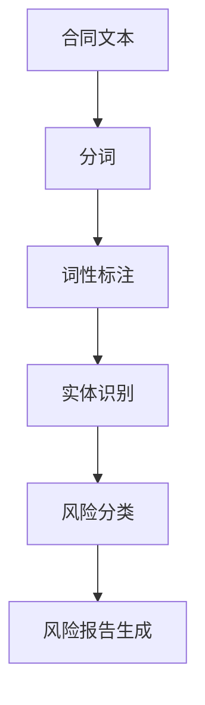
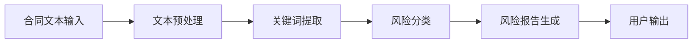

                 


# 《构建企业级AI合同管理系统：风险识别与优化》

---

## 关键词

企业级AI合同管理、风险识别、系统优化、自然语言处理（NLP）、深度学习模型

---

## 摘要

在企业运营中，合同管理是核心业务流程之一，涉及法律合规、财务风险控制等多个方面。随着企业规模的扩大和业务复杂性的增加，传统的合同管理方式逐渐暴露出效率低下、风险识别不及时等问题。基于人工智能（AI）的合同管理系统能够通过自然语言处理（NLP）和深度学习模型，自动识别合同中的潜在风险，并优化管理流程，从而提升企业的运营效率和风险管理能力。本文将详细探讨如何构建一个企业级的AI合同管理系统，重点分析风险识别的核心原理和优化策略，结合实际案例和技术实现，为企业提供可行的解决方案。

---

## 第1章 企业级AI合同管理系统概述

### 1.1 问题背景与需求分析

#### 1.1.1 合同管理在企业中的重要性

合同是企业对外合作和内部管理的重要法律文件，直接关系到企业的合规性、财务安全和商业信誉。传统合同管理依赖人工操作，存在效率低、易出错、风险识别不及时等问题。随着企业规模的扩大和业务的复杂化，合同数量激增，人工管理的局限性日益显现。

#### 1.1.2 当前合同管理中的痛点与挑战

- **效率低下**：人工审核合同耗时长，尤其是在处理大量合同时，效率难以满足需求。
- **风险识别不及时**：传统方法难以快速识别合同中的潜在法律风险和条款漏洞。
- **数据孤岛**：合同信息分散，难以与其他业务系统（如ERP、CRM）无缝集成，影响数据的充分利用。
- **合规性问题**：合同条款需符合国家法律法规，人工审查容易出现疏漏。

#### 1.1.3 AI技术在合同管理中的应用价值

人工智能技术，特别是自然语言处理（NLP）和深度学习，能够快速处理大量文本数据，自动识别关键信息和潜在风险，显著提升合同管理的效率和准确性。

---

### 1.2 问题描述与目标设定

#### 1.2.1 合同管理中的风险识别问题

合同中的潜在风险包括条款模糊、法律术语误用、责任分配不明确等问题。传统的合同审查需要法律专业人士逐条分析，耗时且容易遗漏关键点。

#### 1.2.2 系统优化的目标与关键指标

- **目标**：构建一个基于AI的合同管理系统，能够自动识别合同中的风险点，优化审批流程，提高管理效率。
- **关键指标**：
  - 风险识别准确率：系统能够准确识别合同中的潜在法律风险。
  - 处理效率：系统能够在较短时间内完成大量合同的审查和风险评估。
  - 系统稳定性：系统能够长时间稳定运行，支持高并发访问。

---

### 1.3 问题解决与实现路径

#### 1.3.1 AI技术在合同管理中的核心应用

- **自然语言处理（NLP）**：用于从合同文本中提取关键信息，如合同条款、责任分配、违约条款等。
- **深度学习模型**：用于分类合同类型、识别潜在风险，并预测合同履行的可能性。

#### 1.3.2 系统架构与功能设计

- **输入模块**：接收合同文本，支持多种格式（如PDF、Word）。
- **处理模块**：利用NLP技术提取关键信息，通过深度学习模型进行风险评估。
- **输出模块**：生成风险报告，提供优化建议。

---

### 1.4 系统边界与外延

#### 1.4.1 系统功能边界

- **输入**：合同文本、合同模板。
- **输出**：风险报告、合同优化建议。
- **不包含**：合同生成和审批流程的具体执行，仅提供风险识别和优化建议。

#### 1.4.2 系统与外部系统的交互

- **外部系统**：ERP、CRM、OA系统。
- **交互方式**：通过API接口进行数据传输，支持与其他系统的集成。

---

### 1.5 概念结构与核心要素

#### 1.5.1 系统核心要素分析

- **合同文本**：输入到系统的合同文件。
- **NLP模型**：用于提取合同中的关键信息。
- **深度学习模型**：用于分类和风险评估。
- **风险报告**：系统生成的分析结果。

#### 1.5.2 系统功能模块分解

- **文本预处理模块**：清理合同文本，提取关键词。
- **风险识别模块**：基于NLP和深度学习模型识别潜在风险。
- **报告生成模块**：生成风险报告，提供优化建议。

---

## 第2章 AI合同管理系统的核心概念

### 2.1 风险识别的核心原理

#### 2.1.1 合同风险的定义与分类

- **定义**：合同中的条款或内容可能引发的法律或经济损失。
- **分类**：
  - **合规性风险**：合同内容不符合法律法规。
  - **履行风险**：合同履行的可能性较低。
  - **责任风险**：责任分配不明确或不公平。

#### 2.1.2 基于NLP的风险识别模型

- **流程图**：
  ```mermaid
  graph TD
      A[合同文本输入] --> B[文本预处理]
      B --> C[关键词提取]
      C --> D[风险分类]
      D --> E[风险报告生成]
  ```

---

### 2.2 系统优化的关键

#### 2.2.1 优化策略

- **模型优化**：通过训练数据的增强和模型参数的调整，提升风险识别的准确率。
- **流程优化**：简化合同审查流程，减少人工干预。

---

## 第3章 算法原理讲解

### 3.1 基于NLP的风险识别模型

#### 3.1.1 算法流程图



#### 3.1.2 Python核心代码实现

```python
import spacy

# 加载预训练的NLP模型
nlp = spacy.load("en_core_web_sm")

# 定义风险分类函数
def identify_risk(text):
    doc = nlp(text)
    risks = []
    for token in doc:
        if token.pos_ in ["NOUN", "PROPN"]:
            risks.append(token.text)
    return risks

# 示例合同文本
contract_text = "This contract is subject to governing law of England."

# 调用风险分类函数
risks = identify_risk(contract_text)
print("Potential risks identified:", risks)
```

#### 3.1.3 数学模型与公式

- **概率计算公式**：
  $$
  P(\text{风险存在}) = \frac{\text{历史数据中的风险案例数}}{\text{总案例数}}
  $$

---

## 第4章 系统分析与架构设计方案

### 4.1 系统架构设计

#### 4.1.1 系统架构图



#### 4.1.2 系统功能设计

- **领域模型类图**：
  ```mermaid
  classDiagram
      class ContractManager {
          String text;
          List<String> risks;
      }
      class NLPProcessor {
          void process(ContractManager cm);
      }
      class RiskClassifier {
          void classify(ContractManager cm);
      }
      ContractManager o1 --> NLPProcessor o2
      ContractManager o1 --> RiskClassifier o3
  ```

---

## 第5章 项目实战

### 5.1 环境安装

- **Python**：3.8及以上版本
- **Spacy**：用于NLP处理
- **TensorFlow/Keras**：用于深度学习模型

### 5.2 核心代码实现

#### 5.2.1 合同文本预处理

```python
import spacy

nlp = spacy.load("en_core_web_sm")

def preprocess_text(text):
    doc = nlp(text)
    cleaned_text = " ".join([token.text for token in doc if not token.is_stop])
    return cleaned_text
```

#### 5.2.2 风险识别模型

```python
from tensorflow.keras.models import Sequential
from tensorflow.keras.layers import Dense

# 定义模型
model = Sequential()
model.add(Dense(64, activation='relu', input_dim=100))
model.add(Dense(1, activation='sigmoid'))
model.compile(optimizer='adam', loss='binary_crossentropy', metrics=['accuracy'])
```

---

## 第6章 总结与展望

### 6.1 总结

本文详细探讨了构建企业级AI合同管理系统的各个方面，包括背景分析、核心概念、算法原理、系统架构和项目实战。通过结合NLP和深度学习技术，能够显著提升合同管理的效率和准确性，为企业降低风险、优化流程提供有力支持。

### 6.2 展望

未来，随着AI技术的不断进步，合同管理系统将更加智能化和自动化。通过引入更复杂的深度学习模型和大数据分析技术，系统将能够更好地识别潜在风险，并提供更加个性化的优化建议。

---

## 作者：AI天才研究院 & 禅与计算机程序设计艺术

---

**说明**：以上内容仅为示例，实际撰写时需根据具体需求调整内容深度和结构。

