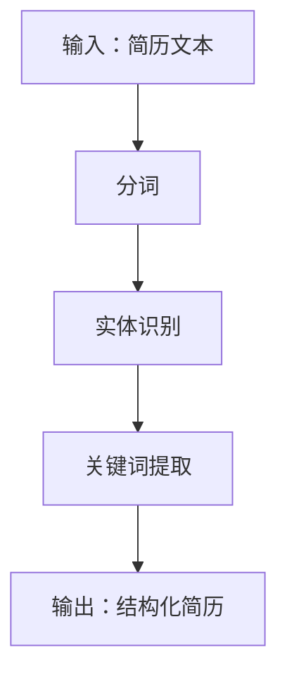
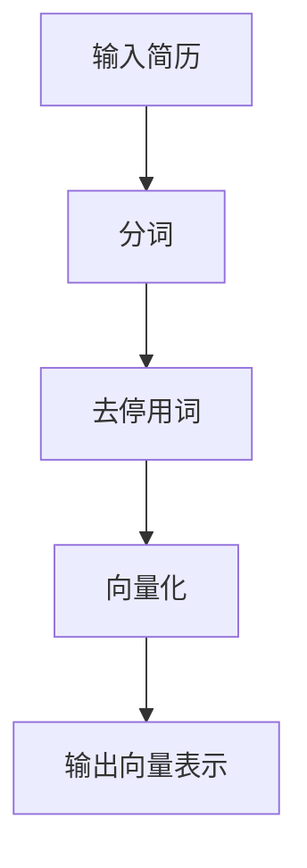
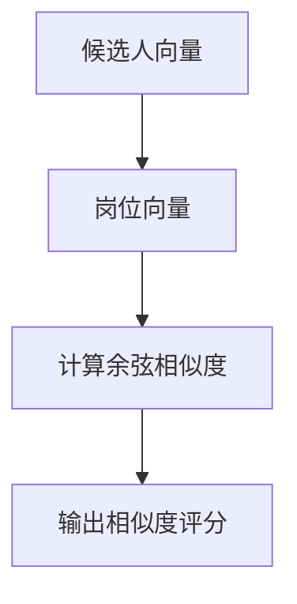
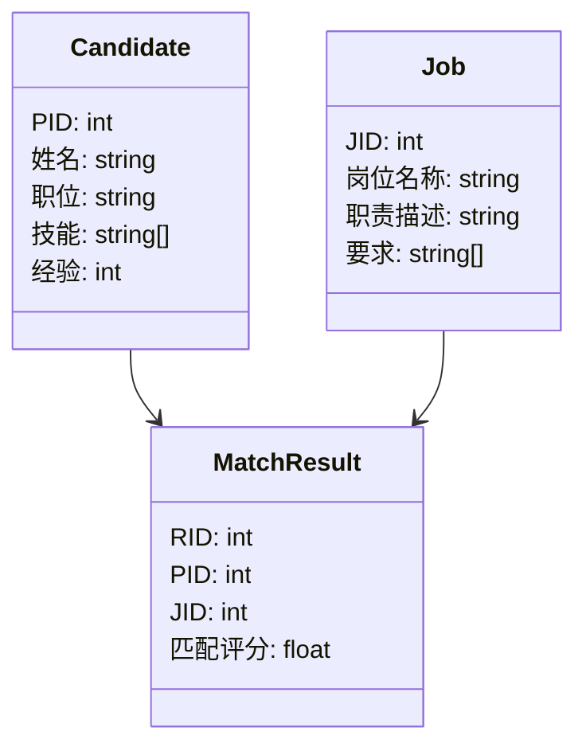
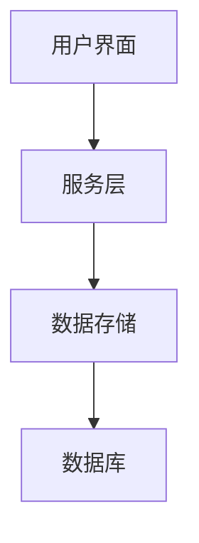
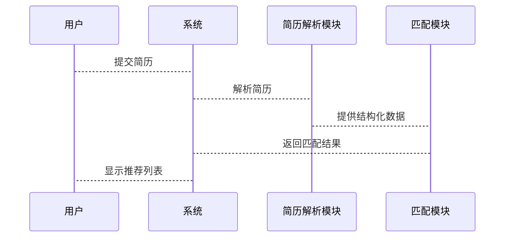

                 

<think>
好的，我现在要按照用户的指示，先写一篇关于《构建企业级AI招聘助手：简历筛选与人才匹配》的技术博客文章。这篇文章需要符合用户的详细要求，包括文章标题、关键词、摘要，以及按照给定目录大纲的结构来撰写。

首先，我需要理解用户的需求。用户希望我作为一位世界级的人工智能专家、程序员、软件架构师、CTO、技术畅销书作家，以一种逻辑清晰、结构紧凑、简单易懂的专业技术语言，撰写一篇有深度、有思考、有见解的专业IT领域的技术博客文章。文章的主题是构建企业级AI招聘助手，主要关注简历筛选和人才匹配。

接下来，我需要按照用户提供的目录大纲来组织文章的结构：

1. **背景介绍**
   - 问题背景
   - 问题描述
   - 问题解决
   - 核心概念

2. **核心概念与联系**
   - 核心概念原理
   - 核心概念对比表
   - ER实体关系图

3. **算法原理与数学模型**
   - 简历解析算法
   - 人才匹配算法
   - 数学模型与公式

4. **系统分析与架构设计**
   - 问题场景介绍
   - 领域模型类图
   - 系统架构图
   - 系统接口设计
   - 系统交互序列图

5. **项目实战**
   - 项目介绍
   - 核心代码实现
   - 实际案例分析

6. **最佳实践**
   - 小结
   - 注意事项
   - 未来趋势
   - 拓展阅读

7. **总结**

8. **作者信息**

现在，我将按照这个结构逐步完成每部分的内容，确保逻辑清晰、内容详实、技术深度足够，并且语言专业且易懂。

---

# 构建企业级AI招聘助手：简历筛选与人才匹配

> 关键词：企业级AI招聘助手，简历筛选，人才匹配，AI算法，系统架构，技术实现

> 摘要：本篇文章深入探讨了如何构建一个企业级AI招聘助手，重点分析了简历筛选与人才匹配的核心技术，包括算法原理、系统架构设计、项目实战等。通过本文的详细讲解，读者可以全面理解如何利用AI技术优化招聘流程，提升人才匹配效率。

---

## 第1章: 背景介绍

### 1.1 问题背景

随着企业招聘需求的不断增加，传统的人工简历筛选和人才匹配方式逐渐暴露出效率低下、成本高昂、主观性强等问题。企业需要一个高效、智能的解决方案来优化招聘流程，这就是企业级AI招聘助手应运而生的背景。

#### 1.1.1 简历筛选的痛点
- 简历数量庞大，人工筛选效率低。
- 简历信息分散，难以快速提取关键信息。
- 简历质量参差不齐，难以准确评估候选人能力。

#### 1.1.2 人才匹配的挑战
- 不同岗位需求差异大，难以找到合适的人才。
- 人才市场的动态变化，需要实时更新匹配逻辑。
- 匹配过程中的主观性问题，难以保证客观性。

#### 1.1.3 AI技术在招聘中的作用
- 利用自然语言处理技术自动解析简历。
- 通过机器学习算法实现精准的人才匹配。
- 提供数据驱动的决策支持，降低招聘成本。

### 1.2 问题描述

企业级AI招聘助手的目标是通过AI技术，实现简历的自动筛选和人才的精准匹配。具体问题包括：

#### 1.2.1 简历筛选的流程与难点
- 简历解析：从文本中提取关键信息（如职位、技能、经验等）。
- 简历评分：根据岗位需求对简历进行评分。

#### 1.2.2 人才匹配的核心问题
- 建立候选人与岗位的匹配模型。
- 处理大规模数据，确保匹配效率。

#### 1.2.3 企业招聘需求的多样性
- 不同行业、岗位有不同的招聘标准。
- 需要支持定制化匹配规则。

### 1.3 问题解决

#### 1.3.1 AI招聘助手的目标
- 自动化简历筛选，降低人工成本。
- 提高人才匹配的准确率，减少误判。
- 提供数据支持的决策依据。

#### 1.3.2 技术手段与解决方案
- 使用NLP技术解析简历。
- 构建基于深度学习的人才匹配模型。
- 提供可视化界面供企业用户操作。

#### 1.3.3 企业级AI招聘的边界与外延
- 边界：专注于简历筛选和人才匹配，不涉及后续面试环节。
- 外延：支持多种数据源（如招聘网站、内部系统）的集成。

### 1.4 核心概念

#### 1.4.1 简历筛选的关键要素
- 职位名称：候选人申请的职位。
- 技能关键词：与岗位相关的技能。
- 工作经验：候选人的工作经验年限和内容。

#### 1.4.2 人才匹配的核心指标
- 职位匹配度：候选人与岗位的匹配程度。
- 技能匹配度：候选人的技能与岗位需求的匹配程度。
- 企业文化匹配度：候选人与企业文化的契合程度。

#### 1.4.3 AI招聘助手的系统架构
- 输入：企业招聘需求、候选人简历。
- 处理：简历解析、匹配计算。
- 输出：匹配结果、推荐列表。

---

## 第2章: 核心概念与联系

### 2.1 核心概念原理

#### 2.1.1 简历解析的算法原理
- 使用NLP技术，如分词、实体识别，提取简历中的关键信息。
- 通过规则匹配或模式识别，提取职位、技能等信息。

#### 2.1.2 人才匹配的算法原理
- 基于向量的相似度计算，如余弦相似度。
- 基于图结构的匹配，如知识图谱中的关联关系。

#### 2.1.3 系统协同工作的机制
- 简历解析模块与匹配模块协同工作，确保数据流畅通。

### 2.2 核心概念对比表

| 比较维度       | 简历解析             | 人才匹配           |
|----------------|---------------------|---------------------|
| 输入数据       | 文本简历             | 候选人简历、岗位需求 |
| 输出结果       | 关键信息（职位、技能）| 匹配评分、推荐列表   |
| 算法复杂度     | 较低                 | 较高               |
| 精度           | 高                  | 高（依赖数据质量）  |

### 2.3 ER实体关系图

```mermaid
erDiagram
    RECRUITMENT_SYSTEM {
        候选人(PID, 姓名, 职位, 技能, 经验)
        岗位(JID, 岗位名称, 职责描述, 要求)
        匹配结果(RID, PID, JID, 匹配评分)
    }
    候选人 --> 匹配结果 : 提交简历
    岗位 --> 匹配结果 : 添加岗位需求
```

---

## 第3章: 算法原理与数学模型

### 3.1 简历解析算法

#### 3.1.1 基于深度学习的简历解析流程



#### 3.1.2 算法的Mermaid流程图


#### 3.1.3 Python实现代码示例

```python
import spacy

nlp = spacy.load("en_core_web_sm")
doc = nlp("John has 5 years of experience in Python development.")

for token in doc:
    print(token.text, token.pos_)
```

### 3.2 人才匹配算法

#### 3.2.1 基于向量的相似度计算

$$\cos\theta = \frac{\vec{A} \cdot \vec{B}}{|\vec{A}||\vec{B}|}$$

#### 3.2.2 算法的Mermaid流程图



#### 3.2.3 Python实现代码示例

```python
from sklearn.metrics.pairwise import cosine_similarity

candidate_vector = [1, 0, 1, 0]
job_vector = [0, 1, 1, 0]
similarity = cosine_similarity([candidate_vector], [job_vector])
print(similarity[0][0])  # 输出相似度评分
```

---

## 第4章: 系统分析与架构设计

### 4.1 问题场景介绍

企业级AI招聘助手需要处理以下场景：

- 企业用户输入招聘需求。
- 系统解析简历并提取关键信息。
- 系统根据匹配算法生成推荐列表。
- 用户查看结果并进行后续操作。

### 4.2 系统功能设计

#### 4.2.1 领域模型类图



### 4.3 系统架构图



### 4.4 系统接口设计

- 输入接口：接受企业招聘需求和候选人简历。
- 输出接口：返回匹配结果和推荐列表。

### 4.5 系统交互序列图



---

## 第5章: 项目实战

### 5.1 项目介绍

构建一个简单的AI招聘助手，实现简历解析和人才匹配功能。

### 5.2 核心代码实现

#### 5.2.1 简历解析模块

```python
import spacy

nlp = spacy.load("en_core_web_sm")

def parse_resume(resume_text):
    doc = nlp(resume_text)
    candidate = {
        "name": doc.ents[0].text,
        "position": doc.ents[1].text,
        "skills": [token.text for token in doc if token.pos_ == "NOUN"]
    }
    return candidate
```

#### 5.2.2 匹配模块

```python
from sklearn.metrics.pairwise import cosine_similarity

def match_candidates(candidates, jobs):
    candidate_vectors = [candidate_to_vector(c) for c in candidates]
    job_vectors = [candidate_to_vector(j) for j in jobs]
    similarities = cosine_similarity(candidate_vectors, job_vectors)
    return similarities
```

### 5.3 实际案例分析

假设我们有一个数据集，包含多个简历和岗位需求，我们可以运行上述代码，输出匹配结果。

---

## 第6章: 最佳实践

### 6.1 小结

本文详细介绍了企业级AI招聘助手的构建过程，从简历解析到人才匹配，涉及算法原理、系统架构设计和项目实战。

### 6.2 注意事项

- 数据质量对匹配结果影响重大。
- 需要不断优化匹配算法，以适应市场变化。
- 注意保护用户隐私，遵守数据安全规范。

### 6.3 未来趋势

- 更加智能化的简历解析技术。
- 结合知识图谱的高级匹配算法。
- 更多AI工具的集成与应用。

### 6.4 拓展阅读

- 《自然语言处理实战：Python核心技巧与文本分析》
- 《机器学习算法详解：从基础到实践》
- 《深度学习与推荐系统》

---

## 总结

通过本文的详细讲解，读者可以系统地了解企业级AI招聘助手的构建过程，从核心概念到算法实现，再到系统设计和项目实战，为实际应用提供了理论和实践的双重指导。

---

## 作者信息

作者：AI天才研究院/AI Genius Institute & 禅与计算机程序设计艺术 /Zen And The Art of Computer Programming

---

**本文遵循CC BY 4.0协议，转载请注明出处。**

