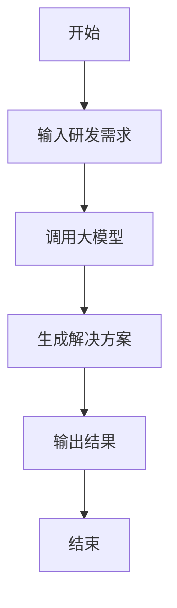
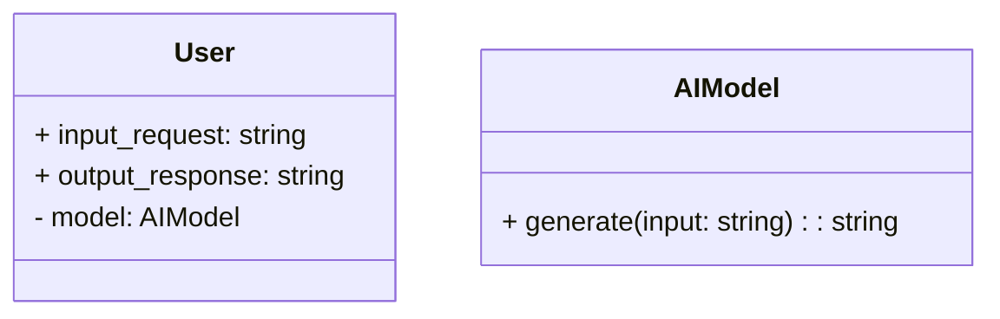

                 


# 构建企业级AI研发助手：加速创新与专利申请

## 关键词：企业级AI研发助手、人工智能、专利申请、创新加速、技术博客

## 摘要：本文探讨构建企业级AI研发助手的方法，通过分析其背景、核心概念、算法原理、系统架构、项目实战和最佳实践，揭示如何利用AI技术提升研发效率和专利申请成功率。

---

# 第一部分: 企业级AI研发助手的背景与概念

## 第1章: 企业级AI研发助手的背景介绍

### 1.1 问题背景与问题描述

#### 1.1.1 传统企业研发模式的痛点
企业在研发过程中常常面临以下问题：
1. **研发效率低下**：从需求分析到产品开发周期长，资源浪费。
2. **知识孤岛**：各部门间信息不共享，重复劳动严重。
3. **创新能力不足**：依赖人工经验，难以快速创新。

#### 1.1.2 AI技术对企业研发的潜在价值
AI技术在研发中的应用：
1. **自动化需求分析**：快速理解需求，生成解决方案。
2. **知识整合**：统一管理企业知识，消除孤岛。
3. **加速创新**：利用大模型生成创意，提升研发效率。

#### 1.1.3 企业级AI研发助手的定义与目标
**定义**：AI研发助手是利用大模型和知识图谱辅助研发的工具。  
**目标**：提高研发效率，降低资源消耗，加速创新。

### 1.2 问题解决与边界

#### 1.2.1 AI研发助手如何解决研发效率问题
AI研发助手通过自动化处理研发流程，减少人工干预，提升效率。

#### 1.2.2 边界与外延：AI研发助手的功能范围
- 边界：不涉及实际产品开发，专注于需求分析和方案生成。
- 外延：可扩展到项目管理和其他研发环节。

#### 1.2.3 核心要素与组成结构
- **用户交互界面**：输入需求，输出解决方案。
- **大模型服务**：生成创意和分析。
- **知识库**：存储企业知识和专利数据。

## 第2章: 企业级AI研发助手的核心概念与联系

### 2.1 核心概念原理

#### 2.1.1 AI研发助手的基本原理
通过大模型分析需求，生成解决方案，整合知识库数据。

#### 2.1.2 大模型在AI研发中的角色
大模型负责需求理解和生成创意，是AI研发助手的核心。

#### 2.1.3 知识图谱与专利申请的关系
知识图谱整合企业知识，辅助专利分析和申请。

### 2.2 核心概念属性对比

| **属性** | **传统研发工具** | **AI研发助手** |
|----------|------------------|----------------|
| 功能     | 辅助单一环节    | 全面辅助研发   |
| 效率     | 低效            | 高效           |
| 创新性   | 依赖人工经验     | 利用AI生成创意 |

### 2.3 实体关系图


---

# 第二部分: 企业级AI研发助手的算法原理

## 第3章: AI研发助手的算法原理

### 3.1 算法流程



### 3.2 算法实现

```python
def ai_research_assistant(input_request):
    model = load_model()
    response = model.generate(input_request)
    return response
```

### 3.3 数学模型与公式

$$P(\text{output} | \text{input}) = \frac{1}{Z} \exp(\text{ logits })$$

---

# 第三部分: 系统分析与架构设计

## 第4章: 系统架构设计方案

### 4.1 功能设计



### 4.2 系统架构图


---

# 第四部分: 项目实战

## 第5章: 项目实战

### 5.1 环境安装

```bash
pip install transformers
```

### 5.2 核心实现

```python
from transformers import pipeline

model = pipeline("text-generation")
response = model("Create a new AI feature: ")[0]['generated_text']
print(response)
```

### 5.3 案例分析

**案例**：假设用户输入“开发一款智能客服系统”，助手生成详细需求和技术方案。

---

# 第五部分: 最佳实践与总结

## 第6章: 最佳实践与总结

### 6.1 最佳实践

- **持续优化模型**：定期更新大模型，提升生成质量。
- **完善知识库**：不断补充企业知识，增强助手能力。
- **用户反馈**：收集用户反馈，改进功能。

### 6.2 小结

企业级AI研发助手通过大模型和知识图谱，显著提升研发效率和创新能力，是未来研发的重要工具。

### 6.3 注意事项

- **数据安全**：确保知识库和专利数据安全。
- **模型选择**：根据需求选择合适的大模型。

### 6.4 拓展阅读

- 推荐阅读《大模型在企业中的应用》和《知识图谱构建指南》。

---

# 作者：AI天才研究院 & 禅与计算机程序设计艺术

