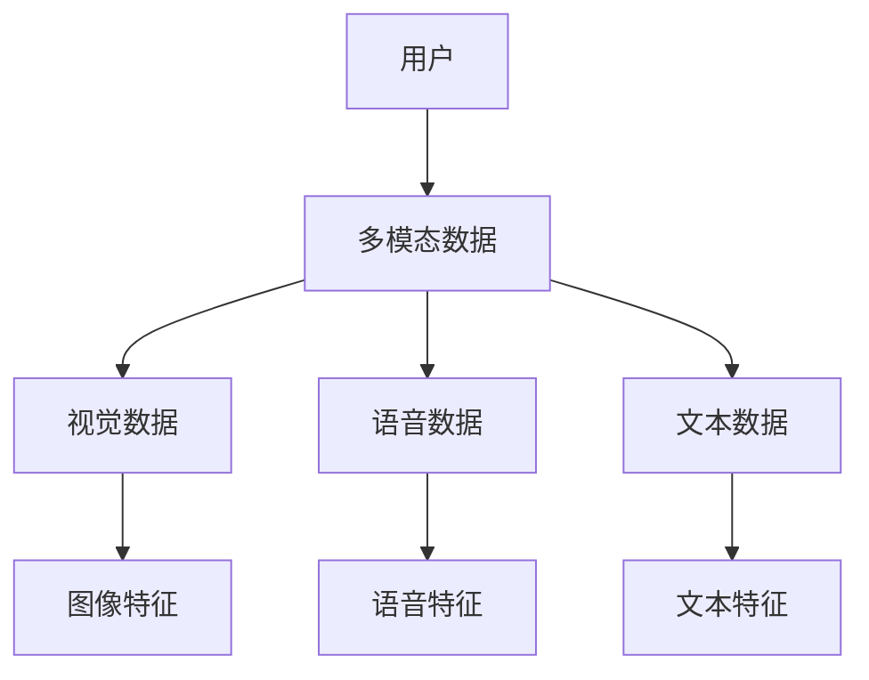
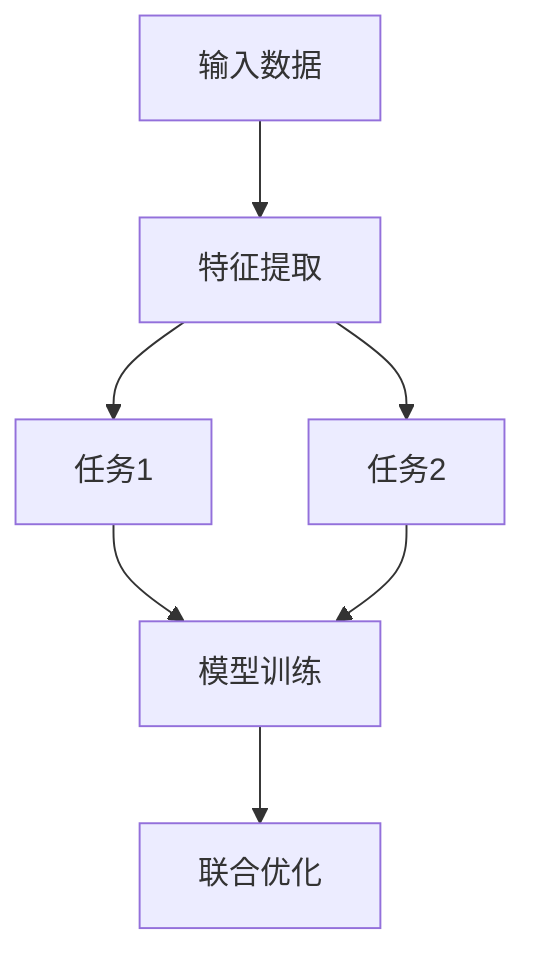

                 

# 构建企业级多模态AI平台：整合视觉、语音与文本的综合分析系统

> 关键词：多模态AI，企业级平台，视觉处理，语音识别，文本分析，数据融合

> 摘要：本文详细探讨了构建企业级多模态AI平台的核心理念、技术架构、算法原理以及实现方法。通过整合视觉、语音和文本数据，结合深度学习技术，构建一个能够处理多种数据类型的智能分析系统。文章从问题背景、核心概念、算法原理、系统架构、项目实战到最佳实践，全面阐述了构建多模态AI平台的全过程。

---

## 第一部分: 企业级多模态AI平台的背景与核心概念

### 第1章: 多模态AI平台的背景与问题背景

#### 1.1 问题背景

##### 1.1.1 当前企业AI应用的痛点
现代企业面临着数据多样化、信息复杂化的挑战。传统的单模态AI技术（如仅处理文本或仅处理图像）难以满足企业对多维度数据综合分析的需求。例如，企业需要通过图像识别、语音分析和文本挖掘等多种技术结合，才能实现更精准的客户行为分析或产品缺陷检测。

##### 1.1.2 多模态数据整合的必要性
在企业实际应用场景中，数据往往是多模态的。例如，客服系统中可能同时涉及客户的语音、表情和文本记录。通过整合这些数据，企业可以更全面地理解客户的需求，提升服务质量。

##### 1.1.3 多模态AI平台的定义与目标
多模态AI平台是指能够同时处理和分析多种数据类型（如视觉、语音和文本）的智能系统。其目标是通过整合不同模态的数据，提供更全面、更智能的分析结果，帮助企业实现数据驱动的决策。

#### 1.2 问题描述

##### 1.2.1 多模态数据的复杂性
多模态数据的处理涉及多种数据格式和特征，数据之间的关联性和一致性需要进行复杂的预处理和对齐。

##### 1.2.2 跨模态数据融合的挑战
不同模态的数据具有不同的特征和表示方式，如何有效地将它们融合在一起，是多模态AI的核心挑战之一。

##### 1.2.3 企业级AI平台的建设需求
企业级AI平台需要具备高可用性、高扩展性和高安全性，能够支持大规模数据处理和实时分析。

#### 1.3 问题解决思路

##### 1.3.1 多模态数据处理的核心思路
通过统一的数据格式和标准化的处理流程，将不同模态的数据进行预处理和特征提取，为后续的分析和建模提供基础。

##### 1.3.2 跨模态分析的技术路线
采用多任务学习和模态对齐技术，构建能够同时处理多种数据类型的学习框架，实现跨模态数据的联合分析。

##### 1.3.3 平台架构的设计原则
采用模块化设计，确保平台的可扩展性和灵活性，同时通过高效的计算框架（如TensorFlow、PyTorch）支持大规模数据处理。

#### 1.4 边界与外延

##### 1.4.1 多模态AI平台的边界
多模态AI平台专注于数据处理和分析，不涉及具体业务逻辑的实现。其边界包括数据输入、特征提取、模型训练和结果输出。

##### 1.4.2 相关领域的区别与联系
多模态AI与单模态AI的主要区别在于数据处理的多样性。与分布式计算和大数据处理的区别在于，多模态AI更关注数据的融合与分析。

##### 1.4.3 平台功能的扩展性
多模态AI平台可以通过模块化设计，轻松扩展新的数据源和分析功能，适应企业业务的动态变化。

#### 1.5 核心要素与概念结构

##### 1.5.1 核心概念的组成
多模态AI平台的核心概念包括：多模态数据处理、跨模态分析、数据融合与对齐、模型训练与优化。

##### 1.5.2 概念之间的关系
各核心概念之间存在相互依赖和相互促进的关系。例如，数据融合与对齐是跨模态分析的基础，而模型训练与优化则是实现精准分析的关键。

##### 1.5.3 概念结构的可视化
通过层次化的概念图，展示多模态AI平台的核心要素及其关系。

---

### 第2章: 多模态AI的核心概念与联系

#### 2.1 多模态数据的基本概念

##### 2.1.1 视觉数据的特征
视觉数据主要指图像和视频，其特征包括颜色、纹理、形状和空间关系等。

##### 2.1.2 语音数据的特征
语音数据的特征包括音调、语速、音量和语调等，可以通过语音信号处理技术提取。

##### 2.1.3 文本数据的特征
文本数据的特征包括词汇、语法、语义和上下文关系等。

#### 2.2 多模态数据的处理方式

##### 2.2.1 各模态数据的处理流程
视觉数据的处理流程包括图像采集、预处理、特征提取和目标检测；语音数据的处理流程包括信号采集、降噪、特征提取和语音识别；文本数据的处理流程包括文本清洗、分词、语义分析和情感计算。

##### 2.2.2 跨模态数据融合的实现方式
跨模态数据融合可以通过特征级融合、决策级融合和语义级融合等方式实现。

##### 2.2.3 数据预处理的标准化方法
数据预处理包括归一化、数据清洗、特征选择和数据增强等步骤。

#### 2.3 多模态AI的核心原理

##### 2.3.1 多模态学习的基本原理
多模态学习通过联合学习多个模态的数据，提升模型的表达能力和鲁棒性。

##### 2.3.2 跨模态对齐的实现方法
跨模态对齐通过将不同模态的数据映射到同一特征空间，实现数据之间的对齐和融合。

##### 2.3.3 多模态模型的优势与局限
多模态模型的优势在于能够综合利用多种数据信息，局限性在于模型复杂性和计算成本较高。

#### 2.4 多模态数据的特征对比

##### 2.4.1 各模态数据的特征对比表格
| 数据模态 | 特征类型 | 典型特征 |
|----------|----------|----------|
| 视觉数据 | 颜色      | RGB值     |
| 语音数据 | 音调      | 频率      |
| 文本数据 | 词汇      | 单词/短语 |

##### 2.4.2 数据特征的可视化分析
通过可视化工具（如Matplotlib）绘制不同模态数据的特征分布图，帮助理解数据特征的差异性和相似性。

##### 2.4.3 特征提取的关键技术
特征提取的关键技术包括主成分分析（PCA）、t-分布邻域嵌入（t-SNE）和自动编码器（AE）等。

#### 2.5 ER实体关系图架构

---

### 第3章: 多模态AI平台的算法原理

#### 3.1 多模态模型的训练方法

##### 3.1.1 多任务学习的实现流程

##### 3.1.2 跨模态对齐的优化策略
跨模态对齐的优化策略包括对比学习、对抗训练和自监督学习等。

##### 3.1.3 模型训练的数学公式

$$L = \lambda_1 L_1 + \lambda_2 L_2$$

其中，$L_1$和$L_2$分别是对任务1和任务2的损失函数，$\lambda_1$和$\lambda_2$是对应的权重系数。

---

## 以上是文章的完整目录结构和部分正文内容。如果需要完整的文章内容，请继续指示！

