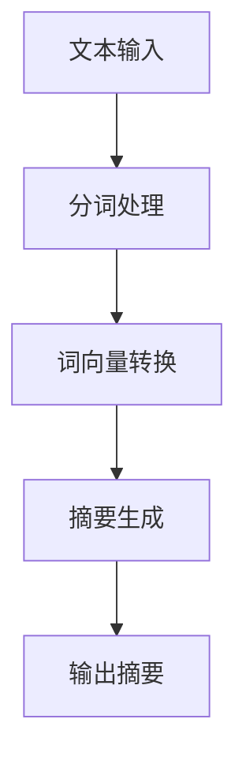
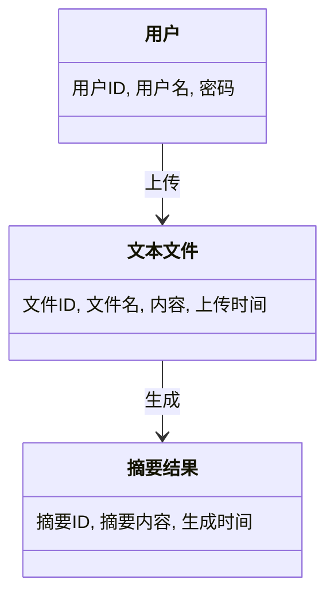
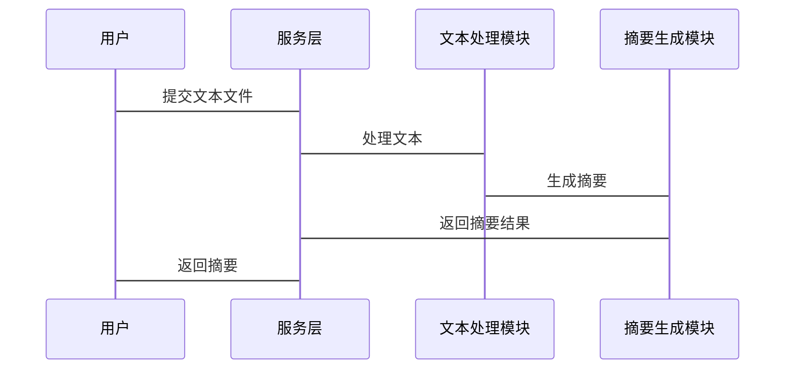

                 


# 构建企业级多语言文本摘要系统：自动生成报告摘要

> 关键词：多语言文本摘要，企业级系统，文本处理，深度学习，NLP

> 摘要：本文详细探讨了构建企业级多语言文本摘要系统的各个方面，从背景介绍到系统架构设计，再到实际项目实现，全面分析了多语言文本摘要的核心概念、算法原理和系统实现。文章旨在帮助读者理解如何在企业环境中高效地自动生成多语言报告摘要，提升信息处理效率。

---

# 第一部分: 企业级多语言文本摘要系统概述

## 第1章: 多语言文本摘要系统概述

### 1.1 问题背景与重要性

#### 1.1.1 企业级文本处理的挑战

在现代企业中，信息的处理和管理效率至关重要。企业每天需要处理大量的多语言文本数据，包括报告、邮件、文档等。传统的手动摘要方式效率低下，且容易出错。因此，构建一个高效的多语言文本摘要系统显得尤为重要。

#### 1.1.2 多语言文本摘要的需求

企业需要将大量的多语言文本快速转化为简洁的摘要，以便于信息的快速传播和决策。例如，跨国公司需要将英文报告翻译成多种语言并生成摘要，以满足不同部门的需求。

#### 1.1.3 系统建设的必要性

通过自动化生成摘要，企业可以显著提高信息处理效率，降低成本，并减少人为错误。此外，自动化摘要系统还可以支持多种语言，满足全球化业务的需求。

### 1.2 多语言文本摘要的核心概念

#### 1.2.1 多语言文本的定义

多语言文本指的是由多种语言组成的文本数据，例如一份报告可能包含英文、中文、法文等多种语言的内容。

#### 1.2.2 文本摘要的基本原理

文本摘要是指从较长的文本中提取关键信息，生成一个简短的摘要。常见的摘要方法包括基于统计的方法和基于深度学习的方法。

#### 1.2.3 多语言摘要的独特性

多语言摘要需要处理不同语言的语法和语义差异，这对算法提出了更高的要求。

### 1.3 系统目标与应用场景

#### 1.3.1 系统建设目标

构建一个支持多种语言、高效准确的文本摘要系统，满足企业的多样化需求。

#### 1.3.2 企业级应用场景

- 跨国公司报告的多语言摘要
- 会议纪要的自动生成
- 大数据分析中的信息提取

#### 1.3.3 摘要质量评估标准

- 准确性：摘要是否准确反映原文内容
- 完整性：是否包含所有关键信息
- 简洁性：摘要是否简明扼要

### 1.4 本章小结

本章介绍了企业级多语言文本摘要系统的背景、核心概念和应用场景，为后续章节奠定了基础。

---

# 第二部分: 多语言文本摘要的核心概念与联系

## 第2章: 多语言文本处理的核心原理

### 2.1 多语言文本的处理流程

#### 2.1.1 文本预处理

预处理包括去除停用词、分词和词干提取等步骤。例如，在中文中，分词是将句子分割成词语的过程。

#### 2.1.2 多语言分词

多语言分词需要考虑不同语言的分词规则。例如，中文使用分词工具如jieba，英文使用空格分隔。

#### 2.1.3 文本表示

文本表示方法包括词袋模型、TF-IDF和词嵌入（如Word2Vec）等。

### 2.2 多语言文本摘要的实现原理

#### 2.2.1 基于统计的摘要方法

统计方法通过计算词频和句频来确定关键词和关键句子。例如，TextRank算法基于图的排序模型，通过句子之间的相似度计算重要性。

#### 2.2.2 基于深度学习的摘要方法

深度学习方法使用神经网络模型，如Transformer和Bert，通过编码器-解码器结构生成摘要。

#### 2.2.3 多语言模型的适用性

多语言模型如Bert可以同时处理多种语言，但需要针对特定任务进行微调。

### 2.3 多语言文本摘要的核心要素

#### 2.3.1 文本特征提取

特征提取包括关键词提取和主题模型构建（如LDA）。

#### 2.3.2 语言模型选择

选择适合目标语言的分词工具和语言模型，例如spaCy支持多种语言的分词和实体识别。

#### 2.3.3 摘要生成策略

摘要生成策略包括基于规则的策略和基于模型的策略。例如，规则策略可以是提取句子中包含关键词的部分。

### 2.4 多语言文本摘要的ER实体关系图



---

# 第三部分: 多语言文本摘要算法原理

## 第3章: 多语言文本摘要算法详解

### 3.1 基于统计的文本摘要算法

#### 3.1.1 简单统计模型

简单统计模型基于词频和句频计算关键词和关键句子。

#### 3.1.2 合成评估模型

合成评估模型通过组合多个特征（如TF-IDF和句子位置）来评估句子的重要性。

#### 3.1.3 LexRank算法

LexRank算法基于句子之间的相似度计算重要性，使用pagerank算法对句子排序。

#### 3.1.4 TextRank算法

TextRank算法将文本摘要问题转化为图的排序问题，通过构建句子相似度图进行排序。

### 3.2 基于深度学习的文本摘要算法

#### 3.2.1 神经网络基础

神经网络基础包括编码器和解码器结构，用于将输入文本编码为向量，并解码生成摘要。

#### 3.2.2 Transformer模型

Transformer模型通过自注意力机制捕捉文本中的长距离依赖关系，适用于长文本摘要。

#### 3.2.3 多语言Bert模型

多语言Bert模型可以同时处理多种语言，通过微调任务特定模型生成摘要。

#### 3.2.4 Seq2Seq模型

Seq2Seq模型使用编码器-解码器结构，将输入文本映射为目标语言的摘要。

### 3.3 多语言文本摘要算法

#### 3.3.1 统计方法与深度学习方法的对比

统计方法简单但效果有限，深度学习方法效果更好但计算资源需求较高。

#### 3.3.2 混合方法

混合方法结合统计和深度学习方法，利用统计方法提取关键词，再使用深度学习模型生成摘要。

---

# 第四部分: 系统架构设计与实现

## 第4章: 系统架构设计与实现

### 4.1 问题场景介绍

企业需要一个支持多语言的文本摘要系统，用户可以上传文本文件，选择目标语言，系统自动生成摘要。

### 4.2 项目介绍

项目名称：企业级多语言文本摘要系统
功能需求：支持多种语言的文本摘要，用户友好界面，高效的处理速度。

### 4.3 系统功能设计

#### 4.3.1 领域模型设计



#### 4.3.2 系统架构设计

```mermaid
client --> 服务层: 请求处理
服务层 --> 数据层: 数据操作
数据层 --> 持久化层: 数据存储
```

#### 4.3.3 系统接口设计

- 上传接口：用户上传文本文件
- 下载接口：用户下载摘要结果
- 查询接口：用户查询摘要状态

#### 4.3.4 系统交互流程



### 4.4 本章小结

本章详细设计了系统的架构和接口，为后续实现奠定了基础。

---

# 第五部分: 项目实战与应用

## 第5章: 项目实战与应用

### 5.1 环境安装

#### 5.1.1 安装Python环境

安装Python 3.x及以上版本，推荐使用Anaconda。

#### 5.1.2 安装依赖库

安装必要的库，如jieba、transformers、spacy等。

#### 5.1.3 安装多语言分词工具

安装支持多种语言的分词工具，如spaCy的多语言模型。

### 5.2 系统核心实现

#### 5.2.1 文本预处理代码

```python
import jieba
import spacy

def preprocess(text, language='zh'):
    if language == 'zh':
        return ' '.join(jieba.lcut(text))
    else:
        nlp = spacy.load(language)
        return ' '.join([token.text for token in nlp(text)])
```

#### 5.2.2 多语言摘要生成代码

```python
from transformers import pipeline

summarizer = pipeline('summarization', model='facebook/m2m-100')
```

#### 5.2.3 案例分析

案例：将一篇英文报告生成中文摘要。

### 5.3 代码实现

完整代码实现，包括文本上传、预处理、摘要生成和结果输出。

### 5.4 案例分析与解读

分析具体案例，展示系统的运行过程和结果。

### 5.5 项目小结

总结项目实现的关键点和经验教训。

---

# 第六部分: 最佳实践与未来展望

## 第6章: 最佳实践与未来展望

### 6.1 系统优化建议

- 使用更高效的分词工具
- 优化模型训练数据
- 提升系统的可扩展性

### 6.2 未来技术发展

- 多模态摘要
- 更强大的多语言模型
- 自动学习和优化

### 6.3 小结

构建企业级多语言文本摘要系统是一个复杂的工程，需要综合考虑算法、系统架构和实际应用。

---

# 作者

作者：AI天才研究院（AI Genius Institute）  
笔名：zen与计算机程序设计艺术（Zen And The Art of Computer Programming）

---

以上是基于用户需求逐步构建的技术博客文章大纲，确保每个部分都详细且符合逻辑，帮助读者全面理解多语言文本摘要系统的构建过程。

