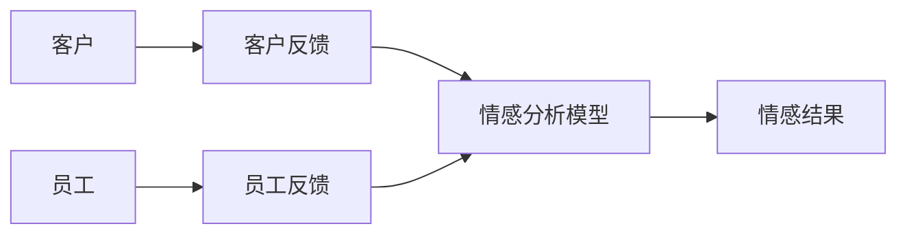

                 

# 构建企业级情感分析平台：深入理解客户与员工

## 关键词：情感分析、自然语言处理、机器学习、企业级系统、客户满意度、员工反馈分析

## 摘要：  
情感分析作为自然语言处理（NLP）领域的重要分支，能够帮助企业深入理解客户和员工的情感需求，从而优化产品和服务，提升企业效率。本文从情感分析的核心概念、算法原理、系统架构到项目实战，全面阐述构建企业级情感分析平台的关键技术与实践方法。通过本文，读者将能够理解情感分析在企业中的价值，并掌握如何利用相关技术解决实际问题。

---

## 第一部分: 情感分析平台背景与基础

## 第1章: 情感分析平台概述

### 1.1 情感分析的定义与背景  
情感分析（Sentiment Analysis）是一种自然语言处理技术，旨在识别和分析文本中表达的情感倾向。随着企业对客户体验和员工满意度的重视，情感分析逐渐成为帮助企业优化决策的重要工具。

#### 1.1.1 情感分析的定义  
情感分析通过分析文本数据，判断其情感倾向（如正面、负面或中性），并提取情感强度（如情感的程度）。  

#### 1.1.2 情感分析的应用场景  
- **客户反馈分析**：分析客户对产品或服务的评价，识别客户满意度。  
- **社交媒体监控**：监测品牌声誉，及时发现负面舆情。  
- **员工反馈分析**：分析员工对公司的看法，优化内部管理。  

#### 1.1.3 情感分析在企业中的价值  
- 提高客户满意度。  
- 优化产品设计和服务流程。  
- 提升员工工作效率和满意度。  

### 1.2 企业级情感分析的核心目标  
企业级情感分析不仅仅是识别情感，还需要结合业务目标，提供可操作的洞察。  

#### 1.2.1 深入理解客户情感需求  
通过分析客户反馈，识别客户的真实需求和痛点。  

#### 1.2.2 提升员工工作效率  
通过分析员工反馈，识别员工的工作压力和满意度，优化工作流程。  

#### 1.2.3 优化企业决策流程  
基于情感分析结果，制定更有针对性的业务策略。  

### 1.3 情感分析的边界与外延  
情感分析虽然功能强大，但也有一些局限性。  

#### 1.3.1 情感分析的边界  
- 仅适用于结构化文本数据。  
- 无法处理复杂的情感混合场景。  

#### 1.3.2 情感分析的外延  
- 支持多语言情感分析。  
- 支持实时情感分析。  

#### 1.3.3 情感分析与其他技术的关系  
情感分析与文本挖掘、自然语言处理（NLP）、机器学习等技术密切相关。  

### 1.4 情感分析的核心要素组成  
企业级情感分析平台通常由以下要素组成：  

#### 1.4.1 数据来源  
- 客户评价、社交媒体评论、员工反馈等。  

#### 1.4.2 分析模型  
- 基于机器学习的情感分类模型。  

#### 1.4.3 结果展示  
- 可视化报告、实时监控界面等。  

---

## 第2章: 情感分析的核心概念与联系  

### 2.1 情感分析的核心概念  
理解情感分析的核心概念是构建平台的基础。  

#### 2.1.1 文本数据  
文本数据是情感分析的基础，包括客户评论、员工反馈等。  

#### 2.1.2 情感倾向  
情感倾向是文本中表达的情感方向，如正面、负面或中性。  

#### 2.1.3 情感强度  
情感强度是情感的强烈程度，如“非常喜欢”比“喜欢”强度更高。  

### 2.2 情感分析的核心原理  
情感分析通过文本预处理、特征提取和分类模型实现情感识别。  

#### 2.2.1 文本表示方法  
- **词袋模型**：将文本表示为词频向量。  
- **词嵌入模型**：如Word2Vec，将词表示为低维向量。  
- **神经网络模型**：如LSTM和Transformer，捕捉文本的上下文关系。  

#### 2.2.2 情感分类算法  
- **朴素贝叶斯分类**：基于概率论的情感分类。  
- **支持向量机（SVM）**：基于几何的分类算法。  
- **神经网络分类**：基于深度学习的分类模型。  

#### 2.2.3 情感传播机制  
情感传播机制用于将情感信息从局部传播到全局，如情感扩散网络。  

### 2.3 情感分析的核心属性特征对比  
通过对比不同特征，选择最适合的特征提取方法。  

#### 2.3.1 情感强度对比  
- 强调情感的强烈程度。  

#### 2.3.2 情感类别对比  
- 情感类别包括正面、负面和中性。  

#### 2.3.3 情感来源对比  
- 情感来源包括客户和员工反馈。  

### 2.4 情感分析的ER实体关系图  
通过ER图描述情感分析的核心实体关系。  

---

## 第3章: 情感分析的算法原理  

### 3.1 情感分析的文本表示方法  
文本表示是情感分析的关键步骤。  

#### 3.1.1 词袋模型  
词袋模型将文本表示为词频向量。  

#### 3.1.2 词嵌入模型  
词嵌入模型将词表示为低维向量，捕捉词义信息。  

#### 3.1.3 神经网络模型  
神经网络模型通过深度学习捕捉文本的上下文关系。  

### 3.2 情感分析的特征提取  
特征提取是情感分类的重要步骤。  

#### 3.2.1 词频统计  
通过统计词频提取特征。  

#### 3.2.2 语义特征提取  
通过词嵌入模型提取语义特征。  

#### 3.2.3 上下文特征提取  
通过上下文捕捉情感信息。  

### 3.3 情感分析的分类算法  
分类算法是情感分析的核心。  

#### 3.3.1 朴素贝叶斯分类  
基于概率论的分类算法。  

#### 3.3.2 支持向量机  
基于几何的分类算法。  

#### 3.3.3 神经网络分类  
基于深度学习的分类算法。  

### 3.4 情感分析的算法流程图  
情感分析的典型流程如下：  

---

## 第4章: 情感分析的数学模型与公式  

### 4.1 情感分析的文本表示模型  

#### 4.1.1 词袋模型公式  
$$
\text{词袋模型} = \{x_i\}_{i=1}^n
$$  

#### 4.1.2 TF-IDF公式  
$$
\text{TF-IDF}(t, d) = \text{TF}(t, d) \times \text{IDF}(t)
$$  

### 4.2 情感分类的数学模型  

#### 4.2.1 朴素贝叶斯分类公式  
$$
P(c|x) = \frac{P(x|c)P(c)}{P(x)}
$$  

#### 4.2.2 支持向量机分类公式  
$$
y = \text{sign}(\sum_{i=1}^n \alpha_i y_i x_i \cdot x + b)
$$  

### 4.3 情感强度预测的数学模型  

#### 4.3.1 线性回归公式  
$$
y = \beta_0 + \beta_1x
$$  

---

## 总结  

企业级情感分析平台是理解客户和员工情感需求的重要工具。通过本文的详细介绍，读者可以掌握情感分析的核心概念、算法原理和系统架构。未来，随着深度学习技术的进步，情感分析将更加智能化和精准化，为企业创造更大的价值。

---

## 作者：  
AI天才研究院/AI Genius Institute  
禅与计算机程序设计艺术/Zen And The Art of Computer Programming

