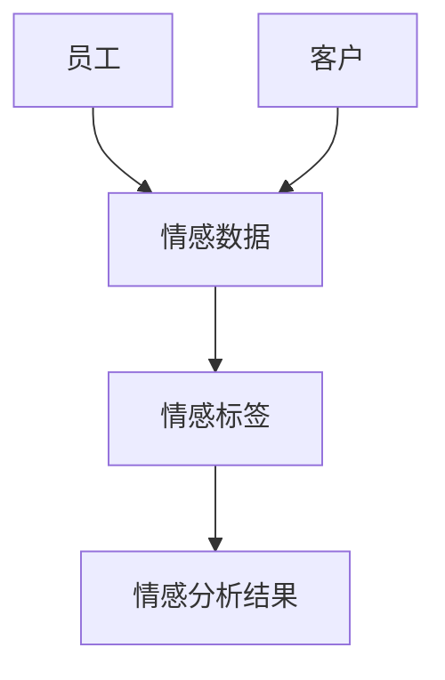
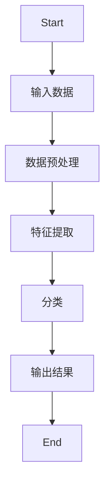
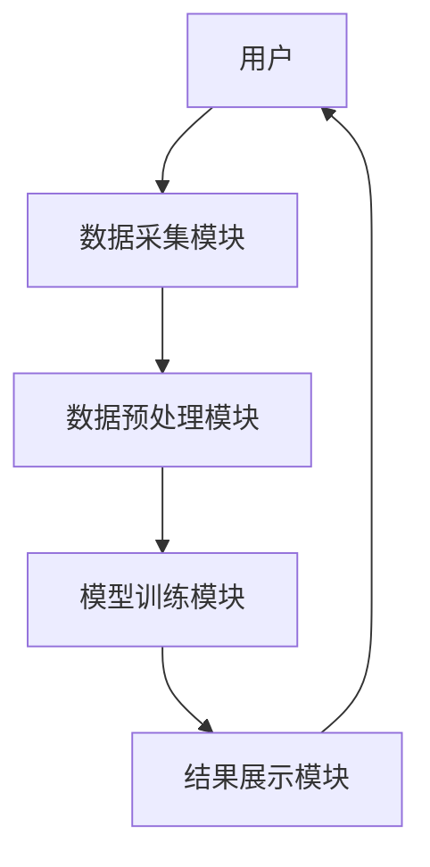

                 


# 构建企业级情感计算平台：员工幸福感与客户满意度分析

---

## 关键词：
- 情感计算，员工幸福感，客户满意度，机器学习，自然语言处理，系统架构

---

## 摘要：
本文详细探讨了构建企业级情感计算平台的方法，重点分析了员工幸福感和客户满意度的评估与优化。通过自然语言处理和机器学习技术，结合情感计算算法，本文提出了一种高效的系统架构设计，并通过实际案例展示了平台的实现与应用。文章内容涵盖情感计算的核心概念、算法原理、系统架构设计以及项目实战，为企业的智能化管理提供了理论与实践指导。

---

# 第一部分：情感计算平台概述

## 第1章：情感计算与企业应用背景

### 1.1 情感计算的定义与核心概念

情感计算（Affective Computing）是一种通过计算机技术来识别、理解和模拟人类情感的新兴领域。它结合了自然语言处理、机器学习和数据挖掘等技术，能够从文本、语音和图像中提取情感信息，进而分析个体或群体的情感状态。

- **情感计算的核心概念**：
  - **情感识别**：从输入数据中识别出情感倾向（如正面、负面、中性）。
  - **情感分析**：对情感进行深度分析，挖掘情感背后的原因和关联。
  - **情感反馈**：根据情感分析结果，提供相应的反馈或建议。

- **情感计算与企业价值**：
  - 通过分析员工和客户的情感数据，企业可以更好地优化内部管理和外部服务。
  - 提高员工幸福感和客户满意度，进而提升企业的整体竞争力。

### 1.2 员工幸福感与客户满意度分析的背景

员工幸福感和客户满意度是企业发展的两大核心指标。员工幸福感高的团队通常更具创造力和凝聚力，而客户满意度高的企业更容易获得客户忠诚和市场份额。

- **员工幸福感的重要性**：
  - 影响员工的工作效率和创造力。
  - 影响企业的整体氛围和文化。

- **客户满意度的关键作用**：
  - 直接关系到客户的回购率和口碑传播。
  - 通过客户满意度分析，企业可以优化产品和服务体验。

### 1.3 情感计算在企业中的应用场景

- **员工情感分析**：
  - 通过分析员工的邮件、聊天记录等文本数据，识别员工的情感状态。
  - 帮助企业管理者发现潜在的情绪问题，及时采取措施。

- **客户情感分析**：
  - 通过分析客户的反馈、评价和社交媒体数据，评估客户的情感倾向。
  - 支持企业优化客户服务策略，提升客户满意度。

---

# 第二部分：情感计算的核心概念与原理

## 第2章：情感计算的核心概念与联系

### 2.1 情感计算的核心概念

- **情感分析的基本原理**：
  - 情感分析是通过自然语言处理技术，对文本中的情感进行分类的过程。
  - 常用的分类方法包括基于规则的方法和基于机器学习的方法。

- **情感计算的输入与输出**：
  - **输入**：文本数据、语音数据或图像数据。
  - **输出**：情感标签（如正面、负面、中性）或情感强度（如非常正面、轻微负面）。

- **情感计算的分类与特征**：
  - **分类**：二分类（正面/负面）或多分类（正面、中性、负面）。
  - **特征**：情感强度、情感类型、情感上下文。

### 2.2 情感计算的实体关系分析

- **实体关系图（ER图）**：
  - 实体：员工、客户、情感数据、情感标签。
  - 关系：员工提交情感数据，客户提交情感数据，情感数据与情感标签相关联。



### 2.3 情感计算的流程图分析



---

# 第三部分：情感计算的算法原理

## 第3章：情感计算的算法原理

### 3.1 情感计算的文本预处理

- **文本清洗与分词**：
  - 去除停用词、标点符号和数字。
  - 分词：将文本分割成单词或短语。

- **停用词处理与词干提取**：
  - 停用词：如“and”、“the”等对情感分析无贡献的词汇。
  - 词干提取：保留单词的核心部分，如“running”变为“run”。

- **文本向量化方法**：
  - TF-IDF：计算每个词在文本中的重要性。
  - 词嵌入：如Word2Vec，将词转化为向量表示。

### 3.2 情感计算的特征提取

- **基于TF-IDF的特征提取**：
  - 通过TF-IDF权重选择重要特征词。

- **基于词嵌入的特征提取**：
  - 使用预训练的词嵌入模型（如GloVe、Word2Vec）提取词向量。

- **情感倾向特征的提取**：
  - 通过情感词典（如SentiWordNet）提取情感倾向特征。

### 3.3 情感计算的分类模型

- **基于机器学习的分类模型**：
  - 线性回归、逻辑回归、支持向量机（SVM）。
  - 适用于小规模数据，分类效果较好。

- **基于深度学习的分类模型**：
  - 卷积神经网络（CNN）、循环神经网络（RNN）、Transformer模型（如BERT）。
  - 适用于大规模数据，分类效果更优。

- **模型评估与优化**：
  - 使用准确率、召回率、F1分数评估模型性能。
  - 通过网格搜索优化模型参数。

### 3.4 情感计算的数学模型

- **基于线性回归的情感计算模型**：
  $$ y = \beta_0 + \beta_1x_1 + \beta_2x_2 + \dots + \beta_nx_n $$
  其中，\( y \) 是情感标签，\( x_i \) 是特征向量。

- **基于支持向量机的情感分类模型**：
  $$ \text{maximize} \quad \sum_{i=1}^n \alpha_i y_i (w \cdot x_i + b) $$
  $$ \text{subject to} \quad \sum_{i=1}^n \alpha_i y_i = 0, \quad 0 \leq \alpha_i \leq C $$

---

# 第四部分：情感计算平台的系统架构与设计

## 第4章：情感计算平台的系统架构设计

### 4.1 系统功能模块划分

- **数据采集模块**：
  - 采集员工和客户的文本数据。
  - 数据来源包括邮件、聊天记录、客户评价等。

- **数据预处理模块**：
  - 清洗和分词数据。
  - 提取特征词和词向量。

- **模型训练模块**：
  - 使用机器学习或深度学习模型进行情感分类。
  - 调优模型参数，优化分类效果。

- **结果展示模块**：
  - 展示情感分析结果。
  - 提供可视化图表和报告。

### 4.2 系统架构设计

- **模块化设计**：
  - 每个功能模块独立开发，便于维护和扩展。

- **微服务架构**：
  - 数据采集、预处理、模型训练和结果展示模块分别作为独立的服务。

- **高可用性设计**：
  - 使用负载均衡和容错机制，确保系统稳定运行。

### 4.3 系统接口设计

- **数据接口**：
  - REST API接口，用于接收和发送数据。

- **模型接口**：
  - 提供情感分类API，供其他系统调用。

- **结果展示接口**：
  - 提供可视化数据接口，展示情感分析结果。

### 4.4 系统交互流程图



---

# 第五部分：情感计算平台的项目实战

## 第5章：情感计算平台的项目实战

### 5.1 环境搭建与数据准备

- **开发环境安装**：
  - 安装Python、Jupyter Notebook、scikit-learn、TensorFlow等工具。

- **数据集获取与预处理**：
  - 下载员工和客户评价数据集。
  - 清洗数据，去除无效数据。

- **数据集划分与标注**：
  - 将数据集划分为训练集、验证集和测试集。
  - 标注情感标签（正面、负面、中性）。

### 5.2 系统核心实现源代码

```python
# 情感计算模型实现

from sklearn.feature_extraction.text import TfidfVectorizer
from sklearn.svm import SVC
from sklearn.pipeline import Pipeline

# 数据预处理
def preprocess(text):
    # 分词
    words = text.split()
    # 停用词处理
    stopwords = set(["the", "and", "or", ...])
    filtered_words = [word for word in words if word not in stopwords]
    return ' '.join(filtered_words)

# 模型训练
pipeline = Pipeline([
    ('tfidf', TfidfVectorizer()),
    ('svm', SVC())
])

pipeline.fit(X_train, y_train)

# 模型预测
y_pred = pipeline.predict(X_test)

# 模型评估
from sklearn.metrics import accuracy_score, f1_score
print("Accuracy:", accuracy_score(y_test, y_pred))
print("F1 Score:", f1_score(y_test, y_pred, average='macro'))
```

### 5.3 实际案例分析

- **员工幸福感分析案例**：
  - 数据来源：员工反馈表。
  - 分析结果：识别出员工压力大的部门，提供优化建议。

- **客户满意度分析案例**：
  - 数据来源：客户评价表。
  - 分析结果：找出客户满意度低的原因，优化产品和服务。

### 5.4 项目小结

- **项目总结**：
  - 成功构建了情感计算平台，能够有效分析员工和客户的情感数据。
  - 提供了可视化的结果展示，便于企业管理者理解和应用。

---

# 第六部分：最佳实践与拓展阅读

## 6.1 最佳实践 tips

- **数据质量**：
  - 确保数据的完整性和准确性。
  - 数据预处理是关键，直接影响模型性能。

- **模型选择**：
  - 根据数据规模和复杂度选择合适的模型。
  - 深度学习模型适合大规模数据，机器学习模型适合小规模数据。

- **结果解释**：
  - 提供可解释的结果，便于业务理解。
  - 可视化工具可以帮助用户更好地理解情感分析结果。

## 6.2 小结

本文详细介绍了构建企业级情感计算平台的方法，涵盖了情感计算的核心概念、算法原理、系统架构设计以及项目实战。通过实际案例分析，展示了平台的应用价值和优势。

## 6.3 注意事项

- 情感计算模型的泛化能力有限，需要根据具体场景进行调整。
- 情感数据的隐私保护需要注意，确保数据安全和合规性。

## 6.4 拓展阅读

- **相关书籍**：
  - 《情感计算：人工智能的新前沿》
  - 《机器学习实战》

- **技术博客**：
  - TensorFlow官方博客
  - PyTorch官方博客

---

# 作者：AI天才研究院 & 禅与计算机程序设计艺术

---

**本文由AI天才研究院撰写，转载请注明出处。**

