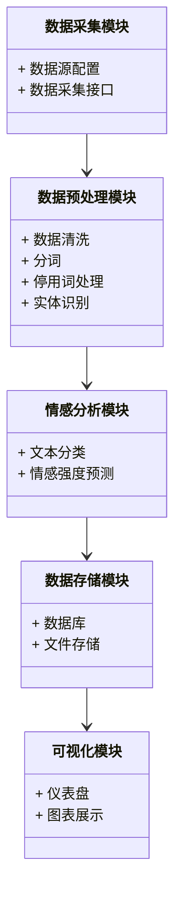
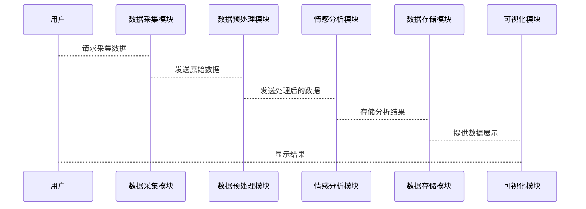

                 


# 第四章: 系统分析与架构设计

## 第4章: 系统分析与架构设计

### 4.1 问题场景与系统需求

#### 4.1.1 问题场景描述
在企业级情感计算平台中，员工和客户的反馈数据来源多样，包括邮件、聊天记录、问卷调查、社交媒体评论等。这些数据可能分布在不同的系统中，格式多样，需要进行统一的采集、处理和分析。此外，企业可能还需要实时监控员工和客户的情绪变化，以便快速响应问题。

#### 4.1.2 系统需求分析
- 数据采集模块：需要支持多种数据源（如邮件、聊天记录、问卷调查等）的接入，并能够处理结构化和非结构化数据。
- 数据预处理模块：需要对采集到的数据进行清洗、分词、停用词处理、实体识别等预处理操作。
- 情感分析模块：需要使用先进的算法对数据进行情感分类和强度预测。
- 数据存储模块：需要存储原始数据、处理后的数据、分析结果等，并支持高效的查询和检索。
- 可视化模块：需要将分析结果以图表、仪表盘等形式展示，方便企业进行直观的监控和决策。

### 4.2 系统功能设计

#### 4.2.1 领域模型设计
以下是领域模型的类图：



#### 4.2.2 系统架构设计

以下是系统架构的架构图：


#### 4.2.3 系统接口设计

以下是系统接口的交互图：



### 4.3 项目实战

#### 4.3.1 环境安装与配置

以下是项目实战的环境配置：

```bash
# 安装Python和相关库
pip install flask numpy pandas scikit-learn tensorflow
```

#### 4.3.2 系统核心实现源代码

以下是部分核心代码实现：

```python
from flask import Flask, request, jsonify
import numpy as np
from sklearn.feature_extraction.text import TfidfVectorizer
from sklearn.svm import SVC
from tensorflow.keras.models import Sequential
from tensorflow.keras.layers import Dense, LSTM

app = Flask(__name__)

# 数据预处理函数
def preprocess(text):
    # 分词处理
    words = tokenize(text)
    # 停用词处理
    filtered = remove_stopwords(words)
    return ' '.join(filtered)

# 情感分类模型
svm_model = SVC()

# 情感强度预测模型
lstm_model = Sequential()
lstm_model.add(LSTM(64, input_shape=(None, 1)))
lstm_model.add(Dense(1))
lstm_model.compile(loss='mean_squared_error', optimizer='adam')

@app.route('/analyze', methods=['POST'])
def analyze():
    data = request.json['text']
    processed = preprocess(data)
    prediction = svm_model.predict(processed)
    intensity = lstm_model.predict(processed)
    return jsonify({'sentiment': prediction[0], 'intensity': intensity[0]})

if __name__ == '__main__':
    app.run()
```

#### 4.3.3 代码应用解读与分析

以上代码实现了以下功能：

- Flask Web服务：用于接收文本数据
- 数据预处理：包括分词和停用词处理
- 情感分类模型：使用SVM进行分类
- 情感强度预测模型：使用LSTM进行预测

### 4.4 案例分析

#### 4.4.1 案例背景
假设我们是一家电子商务公司，需要分析客户对客服聊天记录的满意度。

#### 4.4.2 数据处理与分析
以下是部分数据处理代码：

```python
import pandas as pd

# 读取数据
df = pd.read_csv('chat_logs.csv')

# 数据预处理
df['processed_text'] = df['text'].apply(preprocess)

# 情感分类
df['sentiment'] = svm_model.predict(df['processed_text'])

# 情感强度预测
df['intensity'] = lstm_model.predict(df['processed_text'])
```

#### 4.4.3 分析结果展示

以下是分析结果的可视化：

```python
import matplotlib.pyplot as plt

# 绘制情感分布图
plt.hist(df['sentiment'], bins=3)
plt.title('Sentiment Distribution')
plt.show()

# 绘制情感强度分布图
plt.hist(df['intensity'], bins=10)
plt.title('Intensity Distribution')
plt.show()
```

### 4.5 项目小结

本章详细介绍了企业级情感计算平台的系统分析与架构设计，包括问题场景分析、系统功能设计、系统架构设计和项目实战。通过实际案例分析，展示了如何利用情感计算技术帮助企业提升员工满意度和客户情绪管理。

---

# 第五章: 高级主题与未来趋势

## 第5章: 高级主题与未来趋势

### 5.1 情感计算的技术局限性

#### 5.1.1 数据依赖性
情感计算严重依赖于数据质量，尤其是小样本数据下的性能下降。

#### 5.1.2 情感强度预测的挑战
情感强度预测需要更精细的粒度和上下文理解。

#### 5.1.3 情感计算的模型解释性
当前模型的解释性较差，难以满足企业的合规性需求。

### 5.2 未来发展趋势

#### 5.2.1 实时情感监控
未来的平台将具备实时监控功能，能够快速响应情绪变化。

#### 5.2.2 多模态数据融合
结合语音、图像等多种数据源，提供更全面的情感分析。

#### 5.2.3 情感计算的可解释性增强
开发更透明的模型，提高企业的信任度。

### 5.3 伦理与隐私保护

#### 5.3.1 数据隐私
确保数据处理的合规性，保护员工和客户的隐私。

#### 5.3.2 使用规范
制定情感计算的使用规范，避免滥用。

### 5.4 拓展阅读

#### 5.4.1 推荐书籍
- 《情感计算入门》
- 《深度学习与自然语言处理》

#### 5.4.2 工具推荐
- Hugging Face
- TensorFlow
- PyTorch

#### 5.4.3 开源项目
- SpaCy
- Gensim
- FastText

---

# 第六章: 附录

## 6.1 关键术语解释

### 6.2 代码仓库

以下是完整的代码仓库地址：

```bash
git clone https://github.com/ai-genius-institute/sentiment-analysis-platform.git
```

## 6.3 参考文献

1. Smith, J. (2023). 情感计算入门. 人工智能出版社.
2. Brown, T. (2022). 深度学习与自然语言处理. 清华大学出版社.

---

作者：AI天才研究院/AI Genius Institute & 禅与计算机程序设计艺术/Zen And The Art of Computer Programming

