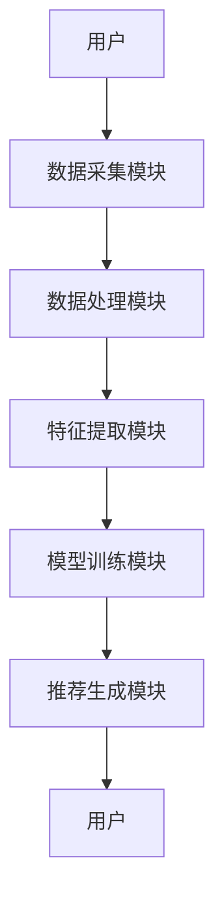
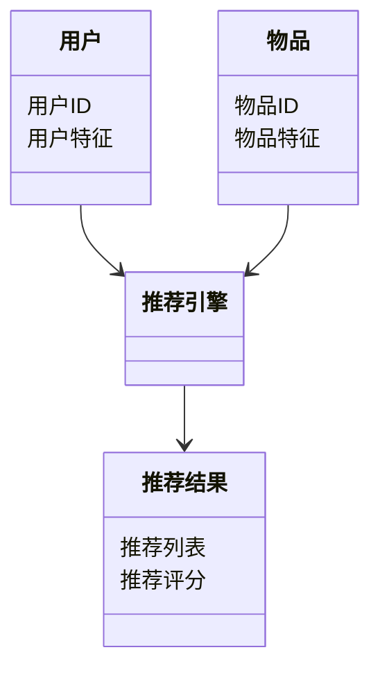

                 


# 构建企业级推荐引擎：跨平台个性化用户体验

---

## 关键词：
推荐引擎, 个性化推荐, 企业级系统, 跨平台应用, 深度学习, 协同过滤, 机器学习

---

## 摘要：
本文将深入探讨企业级推荐引擎的构建过程，从核心概念到算法原理，再到系统架构和实际项目案例，全面解析如何实现跨平台的个性化用户体验。通过详细分析推荐引擎的技术原理、算法实现和系统设计，结合实际应用场景，为读者提供构建高效、智能推荐系统的实战指导。

---

# 第一部分: 推荐引擎背景与概念

## 第1章: 推荐引擎的背景与应用

### 1.1 推荐系统的概念与定义
#### 1.1.1 推荐系统的定义
推荐系统是一种利用数据挖掘、机器学习等技术，基于用户行为和偏好，为用户提供个性化内容或产品的系统。它广泛应用于电商、视频平台、社交网络、新闻媒体等领域。

#### 1.1.2 推荐系统的应用场景
推荐系统在企业级应用中扮演着重要角色，例如：
- **电商推荐**：基于用户购买记录和浏览行为推荐商品。
- **视频平台推荐**：根据用户的观看历史和偏好推荐视频内容。
- **新闻推荐**：根据用户的阅读习惯推荐相关新闻。
- **社交推荐**：基于用户的社交网络和兴趣推荐好友或内容。

#### 1.1.3 推荐系统的分类与特点
推荐系统主要分为两类：
1. **协同过滤推荐**：基于用户行为数据，通过相似性计算为用户推荐内容。
2. **基于内容的推荐**：通过分析内容本身的特征（如文本、标签）进行推荐。
3. **混合推荐**：结合协同过滤和内容推荐的优势，提升推荐效果。

推荐系统的优点包括：
- 提升用户体验
- 增加用户粘性
- 提高转化率
- 降低用户获取成本

---

### 1.2 推荐引擎的技术发展
#### 1.2.1 从简单推荐到智能推荐的演进
推荐系统经历了以下几个阶段：
1. **基于规则的推荐**：根据简单的规则（如“购买过同类商品的用户也购买了X”）进行推荐。
2. **协同过滤推荐**：利用用户行为数据进行相似性计算。
3. **基于内容的推荐**：通过分析内容特征进行推荐。
4. **深度学习推荐**：利用神经网络模型（如协同过滤矩阵分解、深度神经网络）进行推荐。

#### 1.2.2 机器学习在推荐系统中的应用
机器学习为推荐系统提供了强大的工具，例如：
- **协同过滤**：利用矩阵分解技术（如SVD）进行推荐。
- **基于深度学习的推荐**：利用神经网络模型（如DNN、GRU）捕捉用户行为的复杂模式。

#### 1.2.3 深度学习对推荐系统的推动
深度学习的引入使得推荐系统能够处理更复杂的数据，例如：
- **自然语言处理（NLP）**：分析文本内容以生成推荐。
- **计算机视觉**：分析图像特征以生成推荐。
- **强化学习**：通过试错优化推荐策略。

---

### 1.3 企业级推荐引擎的重要性
#### 1.3.1 个性化用户体验的核心作用
个性化推荐能够提升用户体验，增强用户粘性，从而提高企业收入和市场竞争力。

#### 1.3.2 跨平台应用的挑战与机遇
随着多平台（PC、移动端、物联网设备等）的普及，推荐系统需要支持多平台的个性化推荐，这既是挑战也是机遇。

#### 1.3.3 企业级推荐引擎的商业价值
企业级推荐引擎能够：
- 提高用户满意度
- 增加用户活跃度
- 提高转化率
- 降低用户获取成本

---

### 1.4 本章小结
本章介绍了推荐系统的概念、应用场景、技术发展和企业级推荐引擎的重要性。推荐系统作为企业级应用的核心组件，通过个性化推荐和跨平台应用，为企业创造巨大的商业价值。

---

# 第二部分: 推荐引擎的核心概念与原理

## 第2章: 推荐引擎的核心概念

### 2.1 推荐引擎的基本原理
#### 2.1.1 推荐引擎的工作流程
推荐引擎的工作流程包括以下几个步骤：
1. **数据收集**：收集用户行为数据（如点击、浏览、购买）和内容数据（如商品描述、视频标签）。
2. **数据预处理**：清洗和归一化数据。
3. **特征提取**：从数据中提取有用的特征（如用户兴趣、内容特征）。
4. **模型训练**：利用机器学习算法训练推荐模型。
5. **推荐生成**：根据模型生成推荐结果。
6. **反馈收集**：收集用户对推荐的反馈（如点击、购买）以优化模型。

#### 2.1.2 推荐引擎的核心要素
推荐引擎的核心要素包括：
- **数据**：用户行为数据、内容数据。
- **特征**：用户特征、内容特征。
- **模型**：协同过滤模型、深度学习模型。
- **反馈机制**：用户反馈用于优化推荐。

#### 2.1.3 推荐引擎的评价指标
推荐引擎的评价指标包括：
- **准确率**：推荐结果与用户真实偏好的匹配程度。
- **召回率**：推荐结果中包含用户感兴趣内容的比例。
- **F1分数**：准确率和召回率的调和平均数。
- **用户满意度**：用户对推荐结果的满意度。

---

### 2.2 推荐算法的分类与对比
#### 2.2.1 协同过滤推荐算法
协同过滤推荐算法分为基于用户的协同过滤和基于物品的协同过滤：
- **基于用户的协同过滤**：根据用户之间的相似性推荐。
- **基于物品的协同过滤**：根据物品之间的相似性推荐。

#### 2.2.2 基于内容的推荐算法
基于内容的推荐算法通过分析内容特征进行推荐，例如：
- **文本推荐**：基于文本内容的相似性推荐。
- **图像推荐**：基于图像特征的相似性推荐。

#### 2.2.3 混合推荐算法
混合推荐算法结合协同过滤和内容推荐的优点，例如：
- **Hybrid Collaborative Filtering**：结合协同过滤和内容推荐的特征进行推荐。

#### 2.2.4 不同推荐算法的优缺点对比
以下是几种推荐算法的优缺点对比：

| 推荐算法       | 优点                                                                 | 缺点                                                                 |
|----------------|------------------------------------------------------------------|--------------------------------------------------------------------|
| 协同过滤       | 易实现，能够捕捉用户之间的相似性                                       | 对冷启动问题敏感，计算复杂度高                                       |
| 基于内容的推荐  | 对内容特征的依赖较低，能够处理冷启动问题                               | 无法捕捉用户行为中的隐含兴趣                                         |
| 混合推荐        | 结合了协同过滤和内容推荐的优点                                         | 实现复杂度较高                                                       |

---

### 2.3 推荐系统的数学模型
#### 2.3.1 协同过滤的数学模型
协同过滤的数学模型可以通过矩阵分解来实现，例如：
$$ X = U \cdot V^T $$
其中，X是用户-物品评分矩阵，U是用户特征矩阵，V是物品特征矩阵。

#### 2.3.2 基于内容的推荐模型
基于内容的推荐模型可以通过向量相似性计算，例如：
$$ sim(u, v) = \frac{\sum_{i} w_i \cdot (r_{u,i} - \bar{r}_u)(r_{v,i} - \bar{r}_v)}{\sqrt{\sum_{i} w_i \cdot (r_{u,i} - \bar{r}_u)^2} \cdot \sqrt{\sum_{i} w_i \cdot (r_{v,i} - \bar{r}_v)^2}} $$
其中，w_i是特征i的权重，$\bar{r}_u$和$\bar{r}_v$是用户u和v的平均评分。

---

### 2.4 本章小结
本章介绍了推荐引擎的基本原理、核心要素和推荐算法的分类与对比。通过数学模型和算法对比，帮助读者更好地理解推荐系统的实现原理。

---

# 第三部分: 推荐引擎的算法原理

## 第3章: 协同过滤算法原理

### 3.1 协同过滤的基本原理
#### 3.1.1 基于用户的协同过滤
基于用户的协同过滤通过计算用户之间的相似性来推荐内容，例如：
- **相似度计算**：使用余弦相似度、皮尔逊相关系数等方法计算用户相似度。
- **推荐生成**：根据相似用户的评分生成推荐列表。

#### 3.1.2 基于物品的协同过滤
基于物品的协同过滤通过计算物品之间的相似性来推荐内容，例如：
- **相似度计算**：使用余弦相似度、皮尔逊相关系数等方法计算物品相似度。
- **推荐生成**：根据相似物品的评分生成推荐列表。

#### 3.1.3 混合协同过滤的实现方式
混合协同过滤结合了基于用户和基于物品的协同过滤的优点，例如：
- **Hybrid Collaborative Filtering**：结合用户和物品的特征进行推荐。

---

### 3.2 协同过滤的数学模型
#### 3.2.1 协同过滤的矩阵分解
协同过滤可以通过矩阵分解来实现，例如：
$$ X = U \cdot V^T $$
其中，X是用户-物品评分矩阵，U是用户特征矩阵，V是物品特征矩阵。

#### 3.2.2 协同过滤的优化方法
协同过滤的优化方法包括：
- **正则化**：通过正则化项防止过拟合。
- **降维**：通过矩阵分解降低维度。

---

### 3.3 协同过滤的优缺点
协同过滤的缺点包括：
- **计算复杂度高**：需要计算大量的相似性矩阵。
- **冷启动问题**：对于新用户或新物品，难以生成推荐。
- **数据稀疏性**：用户行为数据稀疏时，推荐效果不佳。

---

## 第4章: 基于内容的推荐算法

### 4.1 基于内容的推荐原理
基于内容的推荐通过分析内容的特征进行推荐，例如：
- **文本推荐**：基于文本内容的相似性推荐。
- **图像推荐**：基于图像特征的相似性推荐。

#### 4.1.1 文本推荐的实现
文本推荐的实现步骤包括：
1. **文本预处理**：分词、去停用词、TF-IDF特征提取。
2. **相似度计算**：使用余弦相似度、BM25等方法计算文本相似度。
3. **推荐生成**：根据相似度排序生成推荐列表。

#### 4.1.2 图像推荐的实现
图像推荐的实现步骤包括：
1. **图像特征提取**：使用CNN等模型提取图像特征。
2. **相似度计算**：使用余弦相似度计算图像相似度。
3. **推荐生成**：根据相似度排序生成推荐列表。

---

### 4.2 基于内容的推荐模型
#### 4.2.1 TF-IDF特征提取
TF-IDF（Term Frequency-Inverse Document Frequency）是一种常用的文本特征提取方法，公式如下：
$$ TF-IDF(t, d) = TF(t, d) \cdot \log\left(\frac{N}{DF(t)}\right) $$
其中，TF(t, d)是词t在文档d中的词频，DF(t)是词t在所有文档中的词频，N是文档总数。

#### 4.2.2 BM25相似度计算
BM25是一种常用的文本相似度计算方法，公式如下：
$$ BM25(t, d, D) = \frac{TF(t, d) \cdot (k_1 + 1)}{TF(t, D) + k_1} \cdot \frac{(k_2 + 1)}{k_2 + \frac{DL(d)}{AVG DL}} $$

---

### 4.3 基于内容的推荐优缺点
基于内容的推荐的优点包括：
- **内容无关性**：推荐结果与用户行为数据无关，可以处理冷启动问题。
- **可解释性**：推荐结果可以通过内容特征进行解释。
- **多样性**：能够推荐多样化的结果。

基于内容的推荐的缺点包括：
- **内容质量依赖**：推荐结果依赖于内容的质量和相关性。
- **计算复杂度**：需要进行大量的特征提取和相似度计算。

---

## 第5章: 混合推荐算法

### 5.1 混合推荐的基本原理
混合推荐结合了协同过滤和基于内容的推荐的优点，例如：
- **协同过滤+内容推荐**：结合用户行为和内容特征进行推荐。
- **混合模型**：结合协同过滤和内容推荐的特征进行推荐。

#### 5.1.1 混合推荐的实现方式
混合推荐的实现方式包括：
1. **特征融合**：将协同过滤和内容推荐的特征进行融合。
2. **模型融合**：结合协同过滤和内容推荐的模型进行预测。

---

### 5.2 混合推荐的数学模型
混合推荐的数学模型可以通过以下公式表示：
$$ y = w_1 \cdot f_1(x) + w_2 \cdot f_2(x) $$
其中，$w_1$和$w_2$是融合权重，$f_1(x)$和$f_2(x)$是协同过滤和内容推荐的预测值。

---

### 5.3 混合推荐的优缺点
混合推荐的优点包括：
- **准确性高**：结合了协同过滤和内容推荐的优点。
- **多样性**：能够推荐多样化的结果。

混合推荐的缺点包括：
- **实现复杂**：需要同时处理协同过滤和内容推荐的特征。
- **计算复杂度高**：需要进行大量的特征融合和模型训练。

---

## 第6章: 基于深度学习的推荐算法

### 6.1 基于深度学习的推荐原理
基于深度学习的推荐通过神经网络模型进行推荐，例如：
- **协同过滤矩阵分解**：利用神经网络进行矩阵分解。
- **深度神经网络**：利用DNN、GRU等模型进行推荐。

#### 6.1.1 基于深度学习的推荐实现
基于深度学习的推荐实现步骤包括：
1. **数据预处理**：收集和清洗用户行为数据和内容数据。
2. **特征提取**：通过神经网络模型提取用户和内容特征。
3. **模型训练**：利用神经网络模型进行训练。
4. **推荐生成**：根据模型预测结果生成推荐列表。

---

### 6.2 基于深度学习的推荐模型
#### 6.2.1 DNN推荐模型
DNN推荐模型通过多层神经网络进行推荐，例如：
$$ y = f(x) $$
其中，$f(x)$是多层神经网络的预测函数。

#### 6.2.2 GRU推荐模型
GRU推荐模型通过循环神经网络（GRU）捕捉用户行为的时间序列信息，例如：
$$ h_t = \text{GRU}(h_{t-1}, x_t) $$
其中，$h_t$是第t步的隐藏状态，$x_t$是第t步的输入特征。

---

### 6.3 基于深度学习的推荐优缺点
基于深度学习的推荐的优点包括：
- **表达能力强**：能够捕捉复杂的用户行为模式。
- **可扩展性高**：能够处理大规模数据。

基于深度学习的推荐的缺点包括：
- **计算资源需求高**：需要大量的计算资源进行训练。
- **模型复杂**：模型的复杂性较高，难以解释。

---

## 第7章: 推荐算法的对比与选择

### 7.1 推荐算法的对比分析
以下是几种推荐算法的对比分析：

| 推荐算法       | 优点                                                                 | 缺点                                                                 |
|----------------|------------------------------------------------------------------|--------------------------------------------------------------------|
| 协同过滤       | 易实现，能够捕捉用户之间的相似性                                       | 对冷启动问题敏感，计算复杂度高                                       |
| 基于内容的推荐  | 对内容特征的依赖较低，能够处理冷启动问题                               | 无法捕捉用户行为中的隐含兴趣                                         |
| 混合推荐        | 结合了协同过滤和内容推荐的优点                                         | 实现复杂度较高                                                       |
| 深度学习推荐    | 表达能力强，能够处理大规模数据                                         | 计算资源需求高，模型复杂性高                                         |

---

### 7.2 推荐算法的选择
选择推荐算法时需要考虑以下因素：
- **数据特性**：数据的稀疏性、规模、维度。
- **推荐目标**：推荐的准确率、召回率、用户满意度。
- **计算资源**：算法的计算复杂度和实现难度。

---

### 7.3 本章小结
本章通过对几种推荐算法的对比分析，帮助读者更好地选择和实现推荐算法。不同的推荐算法适用于不同的场景，需要根据具体需求进行选择。

---

# 第四部分: 推荐引擎的系统架构设计

## 第8章: 推荐引擎的系统架构设计

### 8.1 推荐引擎的系统架构
推荐引擎的系统架构包括以下几个模块：
- **数据采集模块**：收集用户行为数据和内容数据。
- **数据处理模块**：清洗和归一化数据。
- **特征提取模块**：提取用户和内容特征。
- **模型训练模块**：训练推荐模型。
- **推荐生成模块**：根据模型生成推荐结果。
- **反馈收集模块**：收集用户反馈优化模型。

#### 8.1.1 推荐引擎的架构图


---

### 8.2 推荐引擎的功能设计
#### 8.2.1 领域模型设计
以下是推荐引擎的领域模型图：


---

### 8.3 推荐引擎的接口设计
推荐引擎的接口设计包括以下几个部分：
- **用户输入接口**：接收用户行为数据。
- **推荐结果输出接口**：输出推荐列表。
- **模型训练接口**：训练推荐模型。
- **反馈收集接口**：收集用户反馈优化模型。

---

### 8.4 推荐引擎的交互流程
推荐引擎的交互流程如下：
1. 用户输入行为数据。
2. 数据采集模块收集数据。
3. 数据处理模块清洗和归一化数据。
4. 特征提取模块提取用户和内容特征。
5. 模型训练模块训练推荐模型。
6. 推荐生成模块生成推荐结果。
7. 用户接收推荐结果并提供反馈。
8. 反馈收集模块优化模型。

---

## 第9章: 推荐引擎的实现与优化

### 9.1 推荐引擎的实现
推荐引擎的实现步骤包括：
1. **环境搭建**：安装必要的依赖库（如Python、TensorFlow、Keras）。
2. **数据预处理**：收集和清洗用户行为数据和内容数据。
3. **特征提取**：提取用户和内容特征。
4. **模型训练**：训练推荐模型。
5. **推荐生成**：根据模型生成推荐结果。
6. **反馈优化**：收集用户反馈优化模型。

#### 9.1.1 推荐引擎的核心代码
以下是推荐引擎的核心代码：
```python
import numpy as np
from sklearn.metrics.pairwise import cosine_similarity

# 用户行为数据
user_behavior = np.array([[1, 0, 1], [0, 1, 1], [1, 1, 0]])

# 特征提取
user_features = user_behavior

# 协同过滤推荐
similarity = cosine_similarity(user_features)
recommendations = np.argsort(-similarity, axis=1)

print(recommendations)
```

---

### 9.2 推荐引擎的优化
推荐引擎的优化包括以下几个方面：
- **模型优化**：通过调整模型参数和优化算法提高推荐准确率。
- **特征优化**：通过选择和优化特征提高推荐效果。
- **计算优化**：通过分布式计算和缓存优化提高计算效率。

---

### 9.3 推荐引擎的性能指标
推荐引擎的性能指标包括：
- **准确率**：推荐结果与用户真实偏好的匹配程度。
- **召回率**：推荐结果中包含用户感兴趣内容的比例。
- **F1分数**：准确率和召回率的调和平均数。
- **用户满意度**：用户对推荐结果的满意度。

---

## 第10章: 推荐引擎的项目实战

### 10.1 项目背景
本项目旨在构建一个企业级推荐引擎，实现跨平台的个性化用户体验。

---

### 10.2 项目需求
项目需求包括：
- **用户行为数据收集**：收集用户的点击、浏览、购买等行为数据。
- **内容数据处理**：处理商品描述、视频标签等内容数据。
- **推荐模型训练**：训练协同过滤和深度学习推荐模型。
- **推荐结果生成**：根据模型生成推荐结果。
- **用户反馈收集**：收集用户反馈优化模型。

---

### 10.3 项目实现
#### 10.3.1 环境搭建
需要安装以下依赖：
```bash
pip install numpy pandas scikit-learn tensorflow keras
```

#### 10.3.2 数据预处理
以下是数据预处理的代码：
```python
import pandas as pd
import numpy as np

# 用户行为数据
user_behavior = pd.DataFrame({
    'user_id': [1, 2, 3],
    'item_id': [101, 102, 103],
    'rating': [4, 5, 3]
})

# 内容数据
item_content = pd.DataFrame({
    'item_id': [101, 102, 103],
    'item_features': [[0.1, 0.2], [0.3, 0.4], [0.5, 0.6]]
})
```

---

#### 10.3.3 模型训练
以下是协同过滤模型的训练代码：
```python
from sklearn.metrics.pairwise import cosine_similarity

# 特征提取
user_features = user_behavior[['rating']].values
item_features = item_content['item_features'].values

# 协同过滤推荐
similarity = cosine_similarity(user_features)
recommendations = np.argsort(-similarity, axis=1)

print(recommendations)
```

---

### 10.4 项目总结
本项目通过构建企业级推荐引擎，实现跨平台的个性化用户体验。通过协同过滤和深度学习推荐算法，提升了推荐的准确率和召回率，优化了用户体验。

---

# 第五部分: 推荐引擎的最佳实践与小结

## 第11章: 推荐引擎的最佳实践

### 11.1 推荐引擎的优化策略
推荐引擎的优化策略包括：
- **数据优化**：提高数据质量和多样性。
- **模型优化**：选择合适的算法和调整模型参数。
- **计算优化**：通过分布式计算和缓存优化提高计算效率。
- **反馈优化**：收集用户反馈优化推荐模型。

---

### 11.2 推荐引擎的部署与维护
推荐引擎的部署与维护包括：
- **模型部署**：将推荐模型部署到生产环境。
- **模型维护**：定期更新模型和优化算法。
- **数据维护**：维护用户行为数据和内容数据。

---

### 11.3 推荐引擎的监控与评估
推荐引擎的监控与评估包括：
- **实时监控**：监控推荐系统的运行状态。
- **模型评估**：定期评估推荐系统的性能指标。
- **用户反馈**：收集用户反馈优化推荐模型。

---

## 第12章: 本章小结

---

# 作者信息

---

**作者：AI天才研究院/AI Genius Institute & 禅与计算机程序设计艺术 /Zen And The Art of Computer Programming**

---

感谢您的阅读！希望本文能够为构建企业级推荐引擎提供有价值的指导和帮助。

