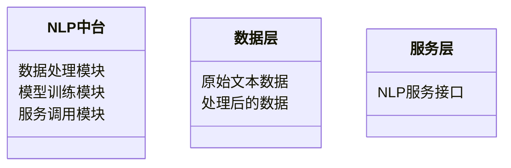
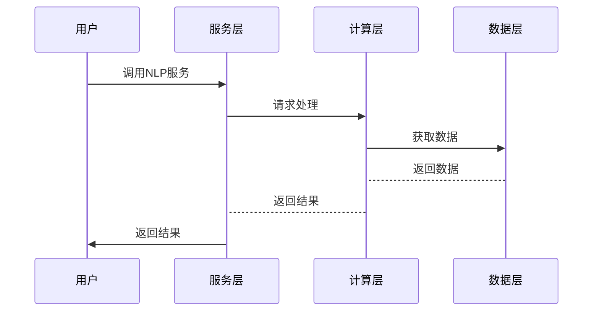

                 


# 构建企业级自然语言处理中台：多语言、多领域支持

## 关键词：自然语言处理，企业级中台，多语言支持，多领域应用，NLP架构，机器学习

## 摘要：  
本文详细探讨了构建企业级自然语言处理中台的背景、核心概念、算法原理、系统架构以及实际项目实现。通过分析多语言和多领域支持的技术挑战，结合具体的系统设计与实现方案，为读者提供一个全面的视角，帮助他们理解如何构建一个高效、灵活且可扩展的NLP中台。本文还通过实际案例分析和代码实现，展示了NLP中台在企业级应用中的具体应用场景和实现细节。

---

# 第一部分: 企业级自然语言处理中台背景与概念

## 第1章: 自然语言处理中台的背景与价值

### 1.1 自然语言处理中台的背景介绍

#### 1.1.1 从传统NLP到企业级中台的演进  
传统的自然语言处理（NLP）技术通常针对特定任务（如文本分类、实体识别）进行开发，缺乏统一的架构和灵活性。随着企业对智能化需求的增加，NLP技术的应用场景逐渐扩展到客服、营销、风控等领域。然而，不同领域的NLP任务需求差异大，重复开发和资源浪费问题日益突出。因此，企业级NLP中台的提出，旨在通过统一的架构和模块化设计，实现多语言、多领域的NLP能力复用，降低开发成本，提高效率。

#### 1.1.2 当前企业NLP应用的挑战  
企业在实际应用中面临以下NLP相关挑战：  
1. **多语言支持**：企业可能需要处理多种语言（如中文、英文、日语等），而传统NLP系统通常针对单一语言设计。  
2. **多领域适应**：不同业务领域的NLP任务需求差异大（如金融领域的风险预警与医疗领域的病历分析差异显著）。  
3. **数据隐私与安全**：企业内部数据通常涉及敏感信息，如何在跨部门、跨领域中台中保护数据隐私是一个重要问题。  
4. **模型可解释性**：复杂的NLP模型在企业级应用中需要更高的可解释性，以满足监管和业务需求。  

#### 1.1.3 NLP中台的定义与核心价值  
**定义**：NLP中台是一个支持多语言、多领域的统一NLP能力平台，通过模块化设计和灵活的架构，为企业提供可复用的NLP服务。  
**核心价值**：  
1. **降低重复开发成本**：统一架构支持多种NLP任务，减少重复开发。  
2. **提高开发效率**：通过模块化设计，快速构建新业务场景的NLP能力。  
3. **支持多语言和多领域**：通过统一平台实现多种语言和领域的NLP任务。  
4. **增强数据安全**：通过集中化管理，确保数据隐私和安全。  

### 1.2 NLP中台的技术基础  

#### 1.2.1 多语言处理的必要性  
企业可能需要处理多种语言的文本数据（如多语言客服系统、跨国企业文档处理）。传统的单语言NLP系统无法满足这种需求，因此需要构建支持多语言的NLP中台。  

#### 1.2.2 多领域支持的挑战与解决方案  
不同领域的NLP任务需求差异大，例如：  
- **金融领域**：需要处理股票名称、公司名称等专有名词。  
- **医疗领域**：需要处理疾病名称、药物名称等专业术语。  
为解决这一问题，NLP中台需要通过领域适配模块，支持不同领域的NLP任务需求。  

#### 1.2.3 企业级NLP的架构特点  
企业级NLP中台的架构通常具有以下特点：  
1. **模块化设计**：将NLP任务分解为可复用的模块（如分词、实体识别、语义理解）。  
2. **高可用性**：通过分布式架构和负载均衡，确保系统稳定运行。  
3. **扩展性**：支持新增语言和领域的快速接入。  

---

## 第2章: NLP中台的核心概念与原理  

### 2.1 NLP中台的核心概念  

#### 2.1.1 NLP中台的定义与组成  
NLP中台由以下几部分组成：  
1. **数据处理模块**：负责文本数据的预处理（如分词、停用词处理）。  
2. **模型训练模块**：支持多语言、多领域的模型训练与优化。  
3. **服务调用模块**：提供API接口，供上层应用调用NLP服务。  
4. **领域适配模块**：支持不同领域的NLP任务需求。  

#### 2.1.2 多语言支持的实现机制  
多语言支持的实现机制包括：  
1. **跨语言迁移学习**：利用多语言预训练模型（如mBert）进行迁移训练。  
2. **语言特征提取**：针对不同语言的特点，设计专门的特征提取模块。  

#### 2.1.3 多领域适应的灵活性  
多领域适应的灵活性体现在以下方面：  
1. **领域适配模块**：通过参数微调，适应不同领域的NLP任务需求。  
2. **领域知识库**：构建领域知识库，辅助NLP任务的处理。  

### 2.2 NLP中台的架构分析  

#### 2.2.1 分层架构设计  
NLP中台通常采用分层架构：  
1. **数据层**：存储原始文本数据和处理后的数据。  
2. **计算层**：负责文本数据的处理和模型训练。  
3. **服务层**：提供NLP服务的API接口。  

#### 2.2.2 模块化设计原则  
模块化设计原则包括：  
1. **模块独立性**：各模块之间尽量解耦，便于维护和扩展。  
2. **模块复用性**：通过模块复用，降低开发成本。  

#### 2.2.3 高可用性与扩展性  
高可用性与扩展性实现方式：  
1. **分布式架构**：通过分布式部署，提高系统的可用性和性能。  
2. **负载均衡**：通过负载均衡技术，分担系统的压力。  

### 2.3 核心概念对比分析  

#### 2.3.1 多语言与多领域的对比表格  
以下是一个对比表格：  

| **维度** | **多语言支持** | **多领域支持** |  
|----------|----------------|----------------|  
| **实现难度** | 较高（需要处理不同语言的语法和词汇差异） | 较高（需要处理不同领域的业务逻辑差异） |  
| **资源需求** | 较高（需要多语言数据和模型） | 较高（需要领域知识库和标注数据） |  

#### 2.3.2 实体关系图（ER图）分析  
以下是NLP中台的ER图：  

```mermaid
erdDiagram
    中台系统 <|-- 数据层: 存储原始文本数据
    中台系统 <|-- 计算层: 负责文本处理和模型训练
    中台系统 <|-- 服务层: 提供NLP服务接口
```

#### 2.3.3 模块间交互关系（Mermaid流程图）  
以下是模块间交互关系的Mermaid流程图：  


---

## 第3章: NLP中台的算法原理与数学模型  

### 3.1 模型训练与优化  

#### 3.1.1 神经网络训练流程（Mermaid流程图）  
以下是神经网络训练流程的Mermaid流程图：  


#### 3.1.2 模型调优策略  
模型调优策略包括：  
1. **超参数调优**：通过网格搜索或随机搜索优化模型参数。  
2. **早停策略**：在验证集上监控损失，防止过拟合。  
3. **学习率衰减**：通过调整学习率，提高模型收敛速度。  

#### 3.1.3 预训练与微调的数学模型  
以下是预训练与微调的数学模型：  

预训练目标函数：  
$$ L_{pre} = \sum_{i=1}^{n} \text{交叉熵}(y_i, y_{pred}) $$  

微调目标函数：  
$$ L_{fine} = \lambda L_{pre} + (1-\lambda) L_{task} $$  

### 3.2 多语言处理算法  

#### 3.2.1 多语言模型的训练策略  
多语言模型的训练策略包括：  
1. **跨语言迁移学习**：利用多语言预训练模型进行迁移训练。  
2. **语言特征提取**：提取语言特有的特征（如停用词、语序特征）。  

#### 3.2.2 跨语言迁移学习的数学模型  
以下是跨语言迁移学习的数学模型：  

跨语言迁移损失函数：  
$$ L_{transfer} = \alpha L_{src} + (1-\alpha) L_{tgt} $$  

#### 3.2.3 多语言分词算法实现  
以下是多语言分词算法的实现代码：  

```python
def multi_language_segmentation(texts):
    for text in texts:
        segmented = segmentor(text)
        yield segmented
```

### 3.3 领域自适应算法  

#### 3.3.1 领域适配的数学模型  
以下是领域适配的数学模型：  

领域适配损失函数：  
$$ L_{adapt} = \beta L_{task} + (1-\beta) L_{domain} $$  

#### 3.3.2 领域迁移的实现步骤  
领域迁移的实现步骤包括：  
1. **数据预处理**：对目标领域的数据进行清洗和标注。  
2. **模型微调**：在目标领域数据上进行参数微调。  
3. **模型评估**：通过验证集评估模型的迁移效果。  

#### 3.3.3 领域自适应的代码示例  
以下是领域自适应的代码示例：  

```python
def领域自适应训练：
    for batch in训练数据：
        输入模型
        计算损失
        反向传播
        更新参数
    return 最优模型
```

### 3.4 数学模型与公式  

#### 3.4.1 损失函数的数学表达式  
以下是损失函数的数学表达式：  

交叉熵损失函数：  
$$ L = -\sum_{i=1}^{n} y_i \log(p_i) $$  

#### 3.4.2 优化器的数学模型  
以下是优化器的数学模型：  

梯度下降优化器：  
$$ \theta_{new} = \theta_{old} - \eta \frac{\partial L}{\partial \theta} $$  

---

# 第四部分: NLP中台的系统分析与架构设计  

## 第4章: 系统分析与架构设计方案  

### 4.1 问题场景介绍  

#### 4.1.1 问题背景  
企业需要构建一个支持多语言、多领域的NLP中台，以满足不同业务场景的需求。  

#### 4.1.2 问题描述  
企业内部存在多个业务部门，每个部门都有自己的NLP需求，导致重复开发和资源浪费。  

### 4.2 项目介绍  

#### 4.2.1 项目目标  
项目目标包括：  
1. 构建一个支持多语言、多领域的NLP中台。  
2. 提供灵活的NLP服务接口，支持快速开发。  

#### 4.2.2 项目范围  
项目范围包括：  
1. 数据处理模块：支持多种语言的文本处理。  
2. 模型训练模块：支持多领域的模型训练。  
3. 服务调用模块：提供NLP服务接口。  

### 4.3 系统功能设计  

#### 4.3.1 领域模型（Mermaid类图）  
以下是领域模型的Mermaid类图：  



#### 4.3.2 系统架构设计（Mermaid架构图）  
以下是系统架构设计的Mermaid架构图：  


### 4.4 系统接口设计  

#### 4.4.1 API接口定义  
以下是NLP服务接口的定义：  

```python
class NLPService:
    def 分词(self, text):
        pass
    def 实体识别(self, text):
        pass
    def 语义理解(self, text):
        pass
```

### 4.5 系统交互设计（Mermaid序列图）  

以下是系统交互设计的Mermaid序列图：  



---

# 第五部分: 项目实战与最佳实践  

## 第5章: 项目实战  

### 5.1 环境安装  

#### 5.1.1 安装依赖  
安装Python和必要的库：  
```bash
pip install numpy
pip install tensorflow
pip install transformers
```

### 5.2 系统核心实现  

#### 5.2.1 数据处理模块实现  
以下是数据处理模块的实现代码：  

```python
def preprocess(text):
    # 分词
    words = tokenizer(text)
    # 去停用词
    filtered_words = [word for word in words if word not in stop_words]
    return filtered_words
```

#### 5.2.2 模型训练模块实现  
以下是模型训练模块的实现代码：  

```python
def train_model(train_data):
    model = build_model()
    for epoch in range(num_epochs):
        for batch in train_data:
            inputs, labels = process_batch(batch)
            loss = model.compute_loss(inputs, labels)
            model.backward(loss)
            model.update_parameters()
    return model
```

### 5.3 案例分析与详细讲解  

#### 5.3.1 多语言场景案例  
以下是多语言场景的案例分析：  
- **场景**：跨国企业需要处理中文、英文、日语等多种语言的客服请求。  
- **实现**：通过多语言分词模块和实体识别模块，支持多种语言的文本处理。  

#### 5.3.2 多领域场景案例  
以下是多领域场景的案例分析：  
- **场景**：金融领域的风险预警和医疗领域的病历分析。  
- **实现**：通过领域适配模块，分别对金融和医疗领域的数据进行处理和分析。  

### 5.4 项目小结  

---

## 第六部分: 最佳实践与总结  

## 第6章: 最佳实践  

### 6.1 小结  
通过构建企业级NLP中台，企业可以实现多语言、多领域的NLP能力复用，降低开发成本，提高效率。  

### 6.2 注意事项  
在实际应用中，需要注意以下几点：  
1. **数据隐私**：确保数据的安全性和隐私性。  
2. **模型可解释性**：提高模型的可解释性，满足监管需求。  
3. **性能优化**：通过分布式架构和负载均衡，提高系统性能。  

### 6.3 拓展阅读  
推荐以下拓展阅读内容：  
1. 《Deep Learning》—— Ian Goodfellow  
2. 《自然语言处理入门》—— 郭铁宁  

---

# 结语  

企业级自然语言处理中台的构建是一个复杂但极具价值的工程。通过模块化设计和灵活的架构，企业可以实现多语言、多领域的NLP能力复用，降低开发成本，提高效率。未来，随着NLP技术的不断发展，企业级NLP中台将发挥更大的作用。

---

**作者：AI天才研究院/AI Genius Institute & 禅与计算机程序设计艺术 /Zen And The Art of Computer Programming**

