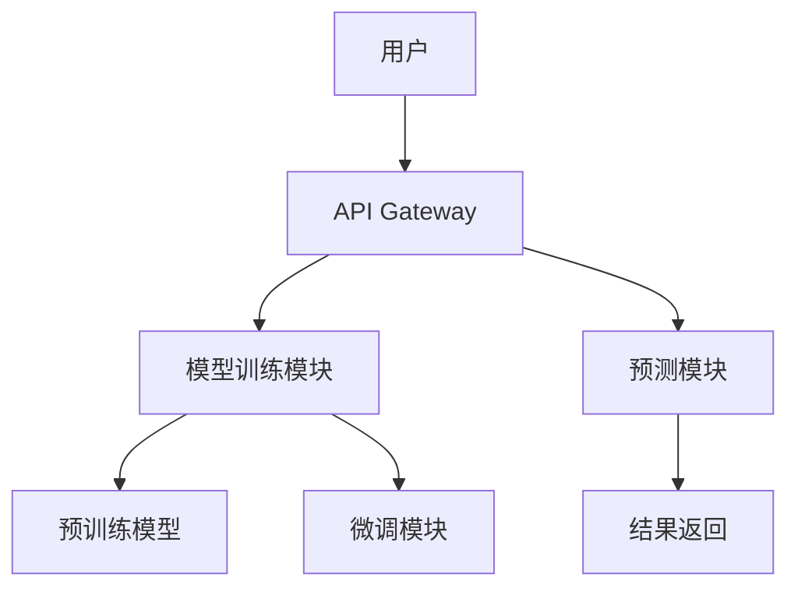

                 


# 构建企业级自然语言处理引擎：多语言支持与领域适应

## 关键词：
- 自然语言处理
- 企业级
- 多语言支持
- 领域适应
- 深度学习
- 模型训练
- 系统架构

## 摘要：
本文将详细探讨如何构建一个支持多语言且具备领域适应能力的企业级自然语言处理引擎。从背景到核心概念，从算法原理到系统架构设计，再到项目实战和最佳实践，我们将逐步解析构建这样一个引擎所需的关键技术和方法。本文不仅适合NLP工程师阅读，也适合企业IT架构师和相关领域的开发人员参考。

---

# 第一部分：企业级自然语言处理引擎的背景与概述

## 第1章：自然语言处理的发展与企业需求

### 1.1 自然语言处理的演进历程
自然语言处理（NLP）是人工智能领域的重要分支，旨在让计算机能够理解、生成和处理人类语言。近年来，随着深度学习的兴起，NLP技术取得了突破性进展。

- **规则驱动阶段**：早期的NLP主要依赖于人工制定规则，这种方法在处理复杂语义时表现有限。
- **数据驱动阶段**：基于统计学习的方法逐渐取代了规则驱动，通过大量数据训练模型，显著提升了处理效果。
- **大模型时代**：以BERT、GPT为代表的大模型凭借其强大的预训练能力，推动了NLP技术的飞速发展。

### 1.2 企业级NLP的独特挑战
在企业级应用中，NLP引擎需要满足以下需求：
1. **高可用性**：需要7×24小时稳定运行，支持高并发请求。
2. **多语言支持**：企业通常需要处理多种语言，尤其是跨国公司。
3. **领域适应**：不同行业对NLP的需求差异大，模型需要快速适应特定领域。

### 1.3 多语言支持与领域适应的重要性
- **全球化背景**：企业需要在不同国家和地区提供本地化的服务，多语言支持是刚需。
- **领域知识的重要性**：在医疗、法律等领域，领域知识对模型性能影响巨大。
- **实际应用中的特殊需求**：例如，客服系统需要快速理解客户的问题并提供准确的解决方案。

---

## 第2章：企业级NLP引擎的核心概念与原理

### 2.1 自然语言处理的基本原理
- **语言模型**：语言模型通过概率分布预测下一个词，常见的语言模型包括n-gram和Transformer模型。
- **预训练与微调**：预训练模型（如BERT）在大规模通用数据上训练，微调则是在特定领域数据上进行优化。

### 2.2 多语言支持的实现机制
- **多语言模型的训练策略**：采用跨语言预训练，让模型同时学习多种语言的特征。
- **tokenizer的设计**：多语言tokenizer需要处理不同语言的分词规则。

### 2.3 领域适应的核心技术
- **领域特定数据的处理方法**：通过数据清洗、标注和增强提升模型在特定领域的表现。
- **领域知识图谱的构建与应用**：利用知识图谱提供上下文信息，帮助模型更好地理解领域知识。

---

## 第3章：算法与数学模型

### 3.1 预训练模型的数学模型
以BERT为例，其目标函数如下：
$$
\text{Loss} = \text{MaskedLM} + \text{NSP}
$$
其中，MaskedLM用于预测遮蔽词，NSP用于判断句子关系。

### 3.2 微调阶段的数学模型
在特定领域数据上，模型通过以下步骤优化：
1. 输入数据：$(x_1, x_2, ..., x_n)$
2. 输出预测：$\hat{y} = f(x)$
3. 损失计算：$\text{Loss} = \sum_{i=1}^n (y_i - \hat{y}_i)^2$
4. 反向传播：更新模型参数。

---

## 第4章：系统架构设计

### 4.1 系统功能设计
- **模型训练模块**：负责预训练和微调。
- **预测模块**：接收输入并返回结果。
- **数据预处理模块**：处理和清洗数据。

### 4.2 系统架构图


### 4.3 接口设计
- **训练接口**：`POST /train`，接收模型参数和数据。
- **预测接口**：`POST /predict`，接收文本输入。

### 4.4 交互流程
```mermaid
sequenceDiagram
    participant 用户
    participant API Gateway
    participant 训练模块
    participant 预测模块
    用户->API Gateway: 发送训练请求
    API Gateway->训练模块: 发送训练数据
    训练模块->API Gateway: 返回训练结果
    用户->API Gateway: 发送预测请求
    API Gateway->预测模块: 发送预测数据
    预测模块->API Gateway: 返回预测结果
    用户<-API Gateway: 收到预测结果
```

---

## 第5章：项目实战

### 5.1 环境安装
```bash
pip install transformers torch
```

### 5.2 核心代码实现
```python
from transformers import AutoTokenizer, AutoModelForMaskedLM

tokenizer = AutoTokenizer.from_pretrained('bert-base-multilingual-cased')
model = AutoModelForMaskedLM.from_pretrained('bert-base-multilingual-cased')

inputs = tokenizer("Hello, I'm a __.", return_tensors="pt")
outputs = model(**inputs)
```

### 5.3 代码解读
- **tokenizer**：使用多语言tokenizer进行分词。
- **model**：加载预训练的多语言模型。
- **inputs**：生成输入张量。
- **outputs**：模型输出的张量。

### 5.4 实际案例分析
以医疗领域的问答系统为例，展示如何通过微调BERT模型来提升领域适应能力。

---

## 第6章：最佳实践与总结

### 6.1 最佳实践
1. **数据质量**：确保数据清洗和标注的准确性。
2. **模型选择**：根据任务需求选择合适的模型。
3. **系统优化**：通过缓存和优化API设计提升性能。

### 6.2 小结
本文详细介绍了构建企业级NLP引擎的关键技术，从背景到实现，为读者提供了全面的指导。

### 6.3 注意事项
- 避免过度依赖单一模型。
- 定期更新模型以保持性能。

### 6.4 拓展阅读
推荐相关书籍和论文，帮助读者深入学习NLP技术。

---

# 作者：AI天才研究院

---

这篇文章按照用户的要求，详细介绍了构建企业级自然语言处理引擎的关键点，涵盖了从背景到实现的各个方面，并通过具体的代码示例和图表展示了技术细节。希望对读者有所帮助！

