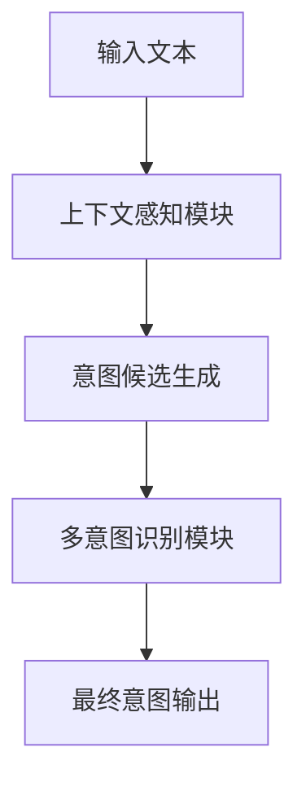
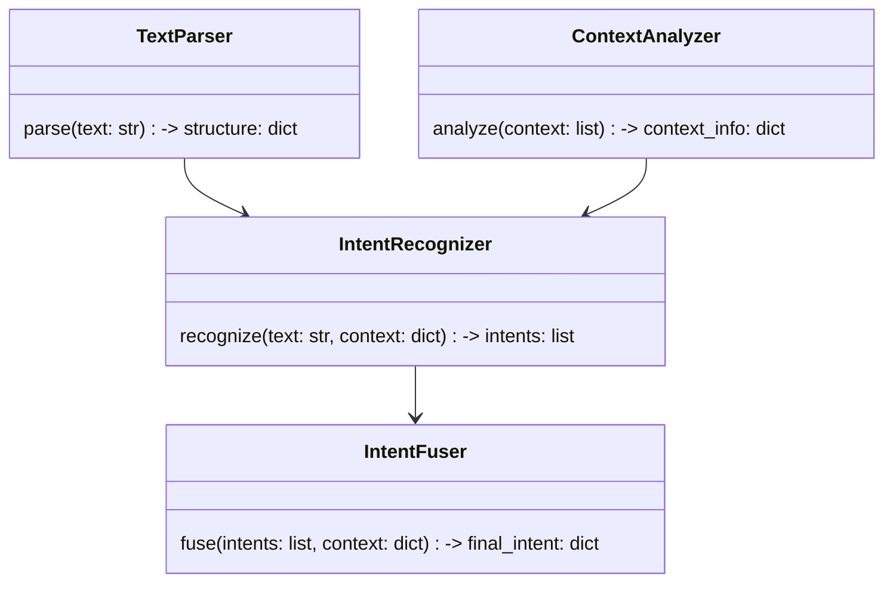
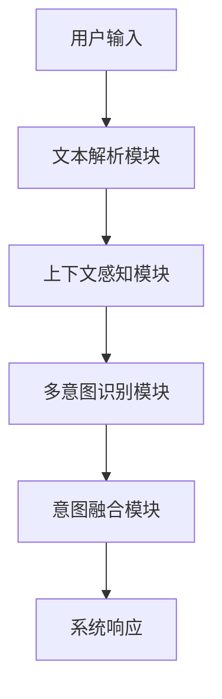

                 


# 构建企业级自然语言理解系统：上下文感知与多意图识别的融合

## 关键词：自然语言理解、上下文感知、多意图识别、企业级系统、深度学习

## 摘要

随着自然语言处理技术的快速发展，构建企业级自然语言理解系统的需求日益增长。该系统需要在复杂的场景中准确理解用户的意图，同时感知上下文信息以提供更精准的服务。本文将深入探讨如何在企业环境中融合上下文感知与多意图识别，构建高效、准确的自然语言理解系统。文章从核心概念、算法原理、系统架构到项目实战，全面解析构建该系统的关键步骤和方法。

---

# 第一部分: 背景介绍

## 第1章: 问题背景与核心概念

### 1.1 问题背景

自然语言理解（Natural Language Understanding, NLU）是人工智能领域的重要研究方向，旨在让计算机能够理解和解析人类的自然语言文本。在企业级应用中，NLU系统需要处理复杂的场景，例如客服对话、内部通信、业务流程自动化等。这些场景通常涉及多意图识别和上下文感知的需求，即系统需要在理解当前语句的同时，结合上下文信息来确定用户的最终意图。

### 1.2 问题描述

在企业环境中，用户的需求往往复杂且多样化。例如，用户可能在一个对话中提出多个请求，或者在前后语境中隐含了某些信息。传统的单一意图识别方法难以应对这些复杂场景，导致系统理解错误或遗漏部分需求。此外，上下文信息的缺失也会使得系统无法准确理解用户意图，影响用户体验和服务效率。

### 1.3 问题解决

为了应对上述挑战，本文提出将上下文感知与多意图识别相结合的方法。通过分析上下文信息，系统能够更好地理解当前语句的背景，从而准确识别用户的多个意图。这种方法不仅提高了系统的理解能力，还增强了其在企业级应用中的实用性。

### 1.4 系统边界与外延

本文研究的系统主要聚焦于自然语言理解的核心任务，包括文本解析、意图识别和上下文感知。系统的输入为一段或多段自然语言文本，输出为结构化的意图表示和相关上下文信息。系统不直接处理文本生成任务，但其输出可以作为其他生成任务的输入。

### 1.5 核心概念组成

- **输入数据**：包括文本内容、对话历史、用户身份等信息。
- **系统功能**：包括文本解析、意图识别、上下文感知、意图融合等模块。
- **输出结果**：结构化的意图表示和相关上下文信息。

---

## 第2章: 核心概念与联系

### 2.1 核心概念

#### 2.1.1 上下文感知

上下文感知是指系统能够理解文本的上下文信息，包括对话历史、场景信息、用户背景等。通过上下文感知，系统能够更好地理解当前语句的含义，尤其是在对话场景中，历史信息对当前意图的理解至关重要。

#### 2.1.2 多意图识别

多意图识别是指系统能够在单个或多个文本中识别出多个意图。在企业环境中，用户的需求往往复杂，可能同时涉及多个业务模块，因此系统需要能够识别并处理多个意图。

### 2.2 核心概念的联系

#### 2.2.1 上下文感知与多意图识别的关系

上下文感知为多意图识别提供了背景信息，而多意图识别则通过分析上下文信息来提高意图识别的准确性。两者相辅相成，共同提升了系统的理解能力。

#### 2.2.2 核心概念的对比分析

| 概念       | 描述                                                                 |
|------------|----------------------------------------------------------------------|
| 上下文感知 | 系统能够理解文本的上下文信息，包括对话历史、场景信息等。               |
| 多意图识别 | 系统能够在文本中识别出多个意图，适用于复杂场景。                     |

#### 2.2.3 系统架构图



---

## 第3章: 算法原理讲解

### 3.1 基于注意力机制的上下文感知

#### 3.1.1 注意力机制原理

注意力机制是一种用于序列处理的机制，能够为序列中的每个位置分配不同的权重。其数学公式如下：

$$
\text{Attention}(Q, K, V) = \text{softmax}\left(\frac{QK^T}{\sqrt{d_k}}\right)V
$$

其中，$Q$ 是查询向量，$K$ 是键向量，$V$ 是值向量，$d_k$ 是向量的维度。

#### 3.1.2 实现流程

1. **输入处理**：将输入文本转换为向量表示。
2. **注意力计算**：计算查询向量与键向量的点积，得到注意力权重。
3. **加权求和**：根据注意力权重对值向量进行加权求和，得到上下文表示。
4. **输出结果**：上下文表示用于后续意图识别。

#### 3.1.3 代码实现

```python
def attention_query(key, value, query):
    # 计算注意力权重
    scores = query @ key.T
    scores = scores / (key.shape[-1] ** 0.5)
    scores = F.softmax(scores, dim=-1)
    # 加权求和
    output = scores @ value
    return output
```

---

### 3.2 基于深度学习的多意图识别

#### 3.2.1 深度学习模型

常用的深度学习模型包括循环神经网络（RNN）、Transformer等。本文采用Transformer模型，因为其在序列处理任务中表现出色。

#### 3.2.2 模型训练流程

1. **数据预处理**：将文本数据分词、去停用词、转换为向量表示。
2. **模型训练**：使用训练数据训练意图识别模型。
3. **模型评估**：通过验证集评估模型性能，调整超参数。
4. **模型优化**：使用早停法防止过拟合。

#### 3.2.3 模型实现代码

```python
class IntentClassifier(nn.Module):
    def __init__(self, input_dim, hidden_dim, output_dim):
        super(IntentClassifier, self).__init__()
        self.fc1 = nn.Linear(input_dim, hidden_dim)
        self.fc2 = nn.Linear(hidden_dim, output_dim)
        self.dropout = nn.Dropout(0.5)
    
    def forward(self, x):
        x = F.relu(self.fc1(x))
        x = self.dropout(x)
        x = self.fc2(x)
        return x
```

---

## 第4章: 系统分析与架构设计

### 4.1 问题场景介绍

在企业级应用中，系统需要处理复杂的场景，例如客服对话、内部通信等。以客服对话为例，用户可能在对话中提出多个请求，例如“我想查询订单状态，同时希望修改地址信息”。

### 4.2 系统功能设计

#### 4.2.1 功能模块划分

系统功能模块包括：

1. **文本解析模块**：将输入文本转换为结构化数据。
2. **上下文感知模块**：分析上下文信息，增强意图理解。
3. **多意图识别模块**：识别文本中的多个意图。
4. **意图融合模块**：将多个意图进行融合，生成最终的系统响应。

#### 4.2.2 领域模型类图



### 4.3 系统架构设计

#### 4.3.1 系统架构图



#### 4.3.2 接口设计

1. **输入接口**：接受文本数据和上下文信息。
2. **输出接口**：返回结构化的意图表示。

---

## 第5章: 项目实战

### 5.1 环境安装

安装必要的库：

```bash
pip install numpy
pip install torch
pip install transformers
```

### 5.2 核心代码实现

#### 5.2.1 文本解析模块

```python
import re

def parse_text(text):
    tokens = re.findall(r'\b\w+\b', text)
    return tokens
```

#### 5.2.2 上下文感知模块

```python
def analyze_context(context):
    # 假设context是一个列表，包含对话历史
    context_info = {}
    for utterance in context:
        tokens = parse_text(utterance)
        context_info['utterances'] = tokens
    return context_info
```

#### 5.2.3 多意图识别模块

```python
class IntentRecognizer:
    def __init__(self, model):
        self.model = model
    
    def recognize(self, text, context):
        # 输入文本和上下文信息
        input_ids = tokenizer.encode(text, context, return_tensors='pt')
        outputs = self.model(input_ids)
        logits = outputs.logits
        predicted_class = torch.argmax(logits, dim=1).item()
        return predicted_class
```

#### 5.2.4 意图融合模块

```python
def fuse_intents(intents, context):
    # 根据上下文信息融合多个意图
    fused_intent = {}
    for intent in intents:
        fused_intent[intent['label']] = intent['score']
    return fused_intent
```

### 5.3 实际案例分析

假设输入文本为“我想查询订单状态，同时希望修改地址信息”。系统首先解析文本，得到多个意图：查询订单状态和修改地址信息。上下文感知模块分析对话历史，发现用户之前提到过订单号，因此优先处理查询订单状态的意图。最终，系统生成融合后的意图表示。

### 5.4 系统性能评估

通过准确率、召回率等指标评估系统性能。例如，准确率计算公式为：

$$
\text{Accuracy} = \frac{\text{正确识别的意图数}}{\text{总意图数}}
$$

---

## 第6章: 最佳实践与注意事项

### 6.1 最佳实践

1. **数据质量**：确保训练数据多样化且覆盖所有可能的场景。
2. **模型选择**：根据任务需求选择合适的模型架构。
3. **实时性优化**：采用轻量级模型或优化算法提升系统响应速度。

### 6.2 小结

本文详细探讨了构建企业级自然语言理解系统的关键步骤，包括核心概念、算法原理、系统架构设计和项目实战。通过融合上下文感知与多意图识别，系统能够更准确地理解用户需求，提升企业应用的效率和用户体验。

### 6.3 注意事项

- **数据隐私**：确保用户数据的安全性和隐私性。
- **系统可扩展性**：设计灵活的架构以应对未来的需求变化。
- **错误处理**：系统需要能够处理异常情况，例如输入数据格式错误等。

### 6.4 拓展阅读

- **相关书籍**：《自然语言处理入门》、《深度学习实战》。
- **学术论文**：关注最新研究成果，例如基于预训练模型的意图识别方法。

---

## 作者：AI天才研究院 & 禅与计算机程序设计艺术

---

感谢您的阅读！希望本文对您构建企业级自然语言理解系统有所帮助。如需进一步探讨或获取代码示例，请随时联系作者。

