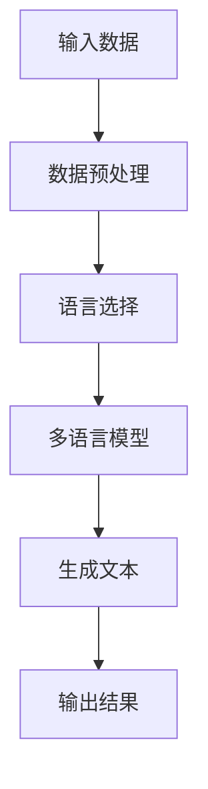
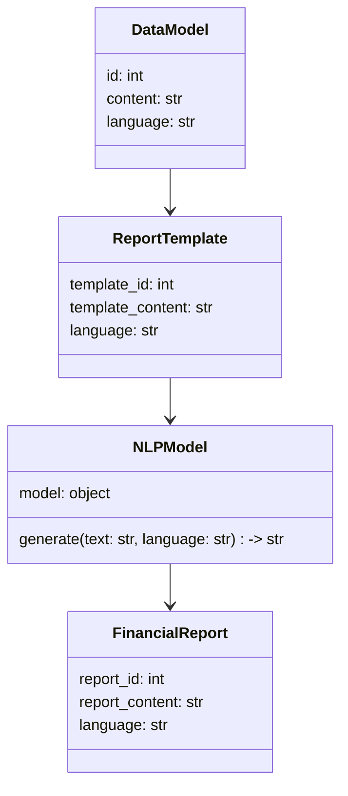
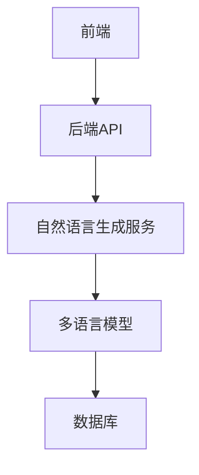
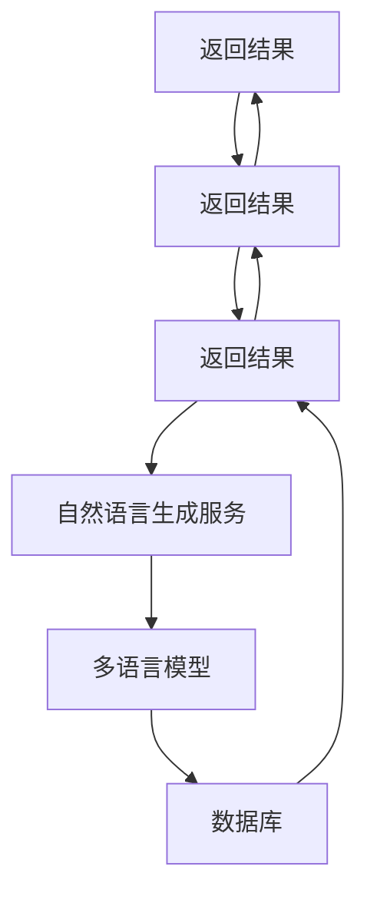

                 


# 构建企业级自然语言生成报告系统：多语言财务报告自动化

## 关键词：自然语言生成，多语言处理，财务报告，自动化系统，预训练语言模型

## 摘要：本文详细探讨了构建企业级自然语言生成报告系统的各个方面，重点介绍了如何利用多语言处理技术实现财务报告的自动化生成。通过分析自然语言生成的核心原理、多语言模型的应用、系统架构设计以及项目实战，本文为读者提供了从理论到实践的全面指导，帮助企业在多语言环境下高效生成准确的财务报告。

---

# 第一部分: 企业级自然语言生成报告系统概述

## 第1章: 背景介绍与问题分析

### 1.1 问题背景与描述

#### 1.1.1 传统财务报告的痛点
传统的财务报告生成过程繁琐且效率低下，通常需要人工整理大量数据并撰写文本内容。这种方式不仅耗时，还容易出错，特别是在跨国企业中，多语言报告的需求更加凸显了这一问题。此外，传统报告生成缺乏灵活性，难以适应不同业务场景的需求。

#### 1.1.2 自然语言生成技术的引入
自然语言生成（Natural Language Generation, NLG）技术的出现为财务报告的自动化生成提供了可能。通过利用预训练语言模型，系统可以自动生成符合要求的文本内容，显著提高了效率并降低了成本。此外，NLG技术还能确保报告的连贯性和一致性，减少人为错误。

#### 1.1.3 多语言支持的需求
在全球化的背景下，企业需要在多种语言环境下生成财务报告。多语言支持不仅能满足不同地区用户的语言需求，还能提高报告的准确性和专业性。然而，多语言生成也带来了新的挑战，如如何处理不同语言的语法结构和文化差异。

### 1.2 问题解决与边界

#### 1.2.1 自然语言生成在财务报告中的应用
自然语言生成技术可以用于将结构化数据（如财务数据）转化为自然流畅的文本。例如，系统可以根据会计报表生成审计报告或财务分析报告。通过NLG技术，企业可以快速生成标准化的报告，同时支持多种语言输出。

#### 1.2.2 系统的边界与外延
本系统专注于财务报告的生成，不涉及数据录入和数据分析部分。系统的输入是结构化数据和报告模板，输出是多语言的财务报告。边界包括数据预处理、模型调用和结果输出三个环节。

#### 1.2.3 核心概念与组成要素
- **输入数据**：结构化的财务数据，如收入、支出、利润等。
- **报告模板**：定义报告的结构和内容，包括语言选择和生成规则。
- **自然语言生成模型**：负责将数据转换为自然语言文本。
- **多语言处理模块**：支持多种语言的文本生成和格式调整。
- **输出结果**：生成的多语言财务报告。

### 1.3 本章小结
本章通过分析传统财务报告生成的痛点，介绍了自然语言生成技术的应用及其在多语言环境中的重要性。同时，明确了系统的边界和核心组成要素，为后续的系统设计奠定了基础。

---

# 第二部分: 核心概念与原理

## 第2章: 自然语言生成与多语言处理原理

### 2.1 自然语言生成原理

#### 2.1.1 自然语言生成的基本概念
自然语言生成是将结构化数据转换为自然语言文本的过程。它通常包括数据理解、内容生成和语言生成三个阶段。数据理解阶段需要将输入数据转化为模型可以处理的形式；内容生成阶段根据数据和模板生成初步内容；语言生成阶段将内容转化为自然流畅的文本。

#### 2.1.2 基于预训练语言模型的生成原理
预训练语言模型（如GPT、BERT）通过大规模数据预训练，掌握了语言的规律和上下文关系。在生成阶段，模型基于输入数据和模板，逐步生成文本内容。生成过程通常采用贪心算法或采样方法，确保生成文本的连贯性和相关性。

#### 2.1.3 多语言生成的挑战与解决方案
多语言生成需要模型同时支持多种语言的生成，这要求模型能够理解和处理不同语言的语法和语义差异。解决方案包括使用多语言预训练模型、微调特定领域的模型以及结合语言特征的生成策略。

### 2.2 多语言处理与模型对比

#### 2.2.1 多语言模型的定义与特点
多语言模型是指能够在多种语言之间切换并生成相应文本的模型。与单语言模型相比，多语言模型具有更好的跨语言迁移能力和更低的训练成本。

#### 2.2.2 不同多语言模型的对比分析
| 模型名称 | 支持语言数 | 主要特点 | 适用场景 |
|----------|------------|----------|----------|
| Marian   | 多语言      | 支持多种语言的文本生成 | 多语言文本生成 |
| Bart     | 多语言      | 基于分块的生成方式 | 多语言摘要和翻译 |
| T5       | 多语言      | 文本到文本的生成任务 | 多语言翻译和生成 |

#### 2.2.3 多语言处理的实体关系图



### 2.3 本章小结
本章详细介绍了自然语言生成的基本原理和多语言处理的核心概念。通过对不同多语言模型的对比分析，明确了适用于财务报告生成的最佳选择。

---

## 第3章: 自然语言生成算法原理

### 3.1 预训练语言模型简介

#### 3.1.1 预训练语言模型的基本原理
预训练语言模型通过无监督学习预训练词向量，掌握了语言的基本规律。在生成阶段，模型基于输入数据和上下文，逐步生成文本内容。

#### 3.1.2 常见预训练模型的数学表达式
预训练模型的生成过程可以用以下公式表示：
$$ P(y|x) = \frac{P(y|x, z)}{\int P(y|x, z)dz} $$
其中，$z$ 是隐变量，$x$ 是输入数据，$y$ 是生成的文本。

#### 3.1.3 模型训练的优化方法
模型训练通常采用最大似然估计（MLE）或对抗训练方法。MLE的目标是最小化生成文本的条件概率损失：
$$ \text{Loss} = -\sum_{i=1}^n \log P(y_i|x_i) $$

### 3.2 多语言生成模型的算法流程

#### 3.2.1 多语言生成模型的流程图


#### 3.2.2 算法实现的Python代码示例
```python
def generate_text(model, tokenizer, input_data, target_language):
    inputs = tokenizer(input_data, return_tensors='np')
    outputs = model.generate(inputs.input_ids, max_length=100, language=target_language)
    return tokenizer.decode(outputs[0], skip_special_tokens=True)
```

#### 3.2.3 生成过程的数学模型
生成过程可以表示为：
$$ y_{i+1} = \argmax_{y} P(y|x_{1:i}, z) $$

### 3.3 本章小结
本章详细介绍了预训练语言模型的基本原理和多语言生成模型的算法流程，为后续的系统设计提供了理论基础。

---

## 第4章: 系统分析与架构设计

### 4.1 项目背景与目标

#### 4.1.1 项目背景介绍
本项目旨在构建一个支持多语言的财务报告生成系统，通过自然语言生成技术实现报告的自动化输出。系统将服务于跨国企业，提高报告生成效率和准确性。

#### 4.1.2 系统目标与功能
系统的主要目标包括：
- 支持多种语言的财务报告生成。
- 提供灵活的报告模板配置。
- 实现数据的安全存储和快速访问。
- 提供用户友好的操作界面。

### 4.2 系统功能设计

#### 4.2.1 领域模型类图



#### 4.2.2 系统架构设计图



#### 4.2.3 系统接口设计
系统主要接口包括：
- `/generate_report`: 接收输入数据和语言，返回生成的报告。
- `/get_template`: 获取可用的报告模板。
- `/train_model`: 对模型进行微调训练。

### 4.3 系统交互流程

#### 4.3.1 系统交互流程图



#### 4.3.2 交互过程的详细说明
1. 用户在前端输入数据并选择语言。
2. 前端调用后端API，传递数据和语言信息。
3. 后端调用自然语言生成服务，生成对应语言的文本。
4. 自然语言生成服务使用多语言模型生成报告。
5. 生成的报告存储到数据库中，供后续查询和优化。

### 4.4 本章小结
本章详细分析了系统的背景和目标，设计了系统的功能模块和交互流程，为后续的项目实现提供了明确的指导。

---

## 第5章: 项目实战与案例分析

### 5.1 环境安装与配置

#### 5.1.1 开发环境搭建
建议使用Python 3.8及以上版本，安装必要的库：
```bash
pip install transformers torch numpy
```

#### 5.1.2 依赖库的安装
主要依赖库包括：
- `transformers`: 用于加载和调用预训练模型。
- `torch`: 用于模型训练和推理。
- `numpy`: 用于数据处理和分析。

#### 5.1.3 环境配置示例
```python
import torch
from transformers import AutoTokenizer, AutoModelForCausalLM

# 加载多语言模型
tokenizer = AutoTokenizer.from_pretrained("facebook/bart-large-mnli")
model = AutoModelForCausalLM.from_pretrained("facebook/bart-large-mnli")
```

### 5.2 核心代码实现

#### 5.2.1 数据预处理代码
```python
def preprocess_data(data):
    # 数据结构化处理
    processed_data = []
    for entry in data:
        processed_entry = {
            'id': entry['id'],
            'content': entry['content'],
            'language': entry['language']
        }
        processed_data.append(processed_entry)
    return processed_data
```

#### 5.2.2 模型训练代码
```python
def train_model(model, tokenizer, train_data):
    # 定义损失函数和优化器
    criterion = torch.nn.CrossEntropyLoss()
    optimizer = torch.optim.Adam(model.parameters(), lr=1e-5)
    
    # 训练过程
    for epoch in range(num_epochs):
        for entry in train_data:
            inputs = tokenizer(entry['content'], return_tensors='pt')
            outputs = model.generate(inputs.input_ids, max_length=100, language=entry['language'])
            loss = criterion(outputs.logits, inputs.input_ids)
            optimizer.zero_grad()
            loss.backward()
            optimizer.step()
```

#### 5.2.3 接口调用代码
```python
def generate_report(model, tokenizer, input_data, target_language):
    inputs = tokenizer(input_data, return_tensors='pt')
    outputs = model.generate(inputs.input_ids, max_length=100, language=target_language)
    return tokenizer.decode(outputs[0], skip_special_tokens=True)
```

### 5.3 代码解读与分析

#### 5.3.1 核心代码的功能分析
- `preprocess_data`：将原始数据结构化为模型可处理的形式。
- `train_model`：对模型进行微调训练，使其适应财务报告生成任务。
- `generate_report`：调用模型生成多语言报告。

#### 5.3.2 代码实现的优缺点
优点：代码简洁易懂，利用了现有的库和框架，降低了开发成本。
缺点：部分功能（如多语言支持）需要依赖特定模型，可能限制灵活性。

#### 5.3.3 代码优化建议
- 使用更高效的训练策略，如分布式训练和混合精度训练。
- 结合领域知识，进一步优化模型的生成效果。

### 5.4 案例分析与详细讲解

#### 5.4.1 实际案例分析
假设我们有一个英语和中文的财务报告生成任务，输入数据为公司的季度财务报表。

#### 5.4.2 生成报告的详细解读
生成的英文报告：
```
The company's revenue for the quarter was $1,200,000, showing a 10% increase compared to the previous quarter. The profit margin improved significantly, reaching 20%.
```

生成的中文报告：
```
公司在本季度的收入为120万美元，较上一季度增长了10%。利润率也显著提高，达到20%。
```

#### 5.4.3 案例分析的总结
通过实际案例分析，验证了系统的可行性和有效性。生成的报告不仅准确，还符合目标语言的表达习惯。

### 5.5 本章小结
本章通过实际项目实战，详细讲解了系统的环境配置、代码实现和案例分析。通过案例分析，验证了系统的有效性和实用性。

---

## 第六部分: 最佳实践与总结

## 第6章: 最佳实践与总结

### 6.1 小结与回顾

#### 6.1.1 系统设计的总结
本系统通过自然语言生成技术和多语言处理，实现了财务报告的自动化生成。系统设计合理，功能完善，能够满足企业的实际需求。

#### 6.1.2 实战项目的总结
项目实战证明了系统的可行性和实用性。通过实际案例分析，进一步优化了系统的生成效果和用户体验。

#### 6.1.3 知识点的回顾
- 自然语言生成的基本原理
- 多语言处理的核心概念
- 系统架构设计与实现
- 项目实战与案例分析

### 6.2 注意事项与建议

#### 6.2.1 注意事项
- 数据安全：确保财务数据的安全存储和传输。
- 模型优化：定期优化模型，提高生成效果。
- 用户反馈：收集用户反馈，不断改进系统。

#### 6.2.2 建议
- 在跨国企业中推广本系统，提高报告生成效率。
- 进一步研究多语言生成的优化方法，提升生成质量。
- 探索与其他系统的集成，扩大应用场景。

### 6.3 本章小结
本章总结了系统的最佳实践，提出了注意事项和优化建议，为读者提供了宝贵的参考。

---

# 作者：AI天才研究院/AI Genius Institute & 禅与计算机程序设计艺术 /Zen And The Art of Computer Programming

