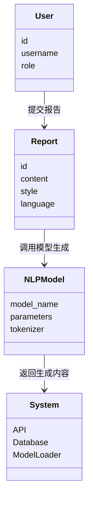
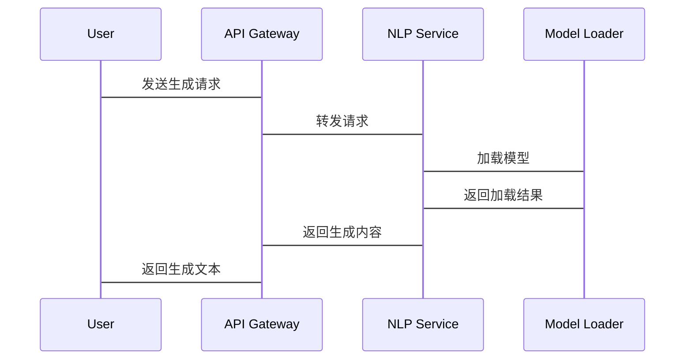

                 


# 构建企业级自然语言生成系统：多语种、多风格报告自动化

> 关键词：自然语言生成，企业级系统，多语种支持，多风格生成，预训练语言模型

> 摘要：本文详细探讨了如何构建一个企业级自然语言生成系统，涵盖多语种和多风格报告自动化的技术细节。文章从背景介绍、核心算法、系统架构到项目实战，层层深入，为读者提供全面的技术指导。

---

# 第一部分: 企业级自然语言生成系统概述

## 第1章: 自然语言生成系统背景与需求

### 1.1 问题背景

#### 1.1.1 企业级自然语言生成的痛点
企业级自然语言生成系统（Natural Language Generation, NGL）的构建面临以下痛点：
- **数据量大**：企业需要处理多语言、多风格的文本数据，数据量呈指数级增长。
- **多样性需求**：不同业务部门对文本生成的风格和语言有不同要求。
- **实时性要求**：企业系统需要在毫秒级响应中生成高质量文本。
- **可靠性与可扩展性**：系统必须在高并发场景下稳定运行，同时支持快速扩展。

#### 1.1.2 多语种支持的重要性
多语种支持是企业级NGL系统的核心需求：
- **全球化业务**：企业需要支持多种语言，以服务全球客户。
- **本地化需求**：不同地区可能需要本地化的内容生成。
- **跨语言理解**：系统需要理解不同语言间的语义关联。

#### 1.1.3 多风格生成的必要性
多风格生成是企业级NGL系统的重要特征：
- **多样化输出**：根据目标受众调整文本风格，如正式报告、口语化说明等。
- **适应性生成**：根据上下文动态调整生成风格。
- **统一性与多样性结合**：在保持品牌一致性的同时，提供多样化的表达方式。

### 1.2 问题描述

#### 1.2.1 自然语言生成的核心问题
自然语言生成的核心问题包括：
- **语义理解**：准确捕捉输入的语义信息。
- **文本规划**：确定生成文本的结构和内容。
- **文本生成**：将规划内容转化为自然流畅的文本。

#### 1.2.2 企业级系统的需求特点
企业级NGL系统的需求特点：
- **高可用性**：系统必须7×24小时可用。
- **高扩展性**：支持高并发请求，可扩展至万台服务器。
- **高安全性**：保护企业数据和生成内容的安全性。

#### 1.2.3 多语种与多风格生成的挑战
多语种与多风格生成的挑战：
- **跨语言训练**：如何在多语言环境中训练通用模型。
- **风格切换**：如何快速切换生成风格，避免风格漂移。
- **模型适应性**：如何使模型适应不同领域和风格的需求。

### 1.3 问题解决

#### 1.3.1 自然语言生成的关键技术
自然语言生成的关键技术包括：
- **预训练模型**：利用大规模数据预训练生成模型。
- **微调技术**：针对特定任务对模型进行微调。
- **多任务学习**：同时学习多种任务以提升生成效果。

#### 1.3.2 多语种支持的实现方案
多语种支持的实现方案：
- **多语言模型**：训练一个多语言模型，支持多种语言的生成。
- **语言切换机制**：根据输入语言动态切换模型参数。
- **跨语言迁移**：利用其他语言的数据提升特定语言的生成效果。

#### 1.3.3 多风格生成的策略选择
多风格生成的策略选择：
- **风格嵌入**：通过嵌入向量表示不同风格。
- **风格控制**：通过外部指令或参数控制生成风格。
- **多风格模型**：训练一个多风格模型，支持多种风格的生成。

### 1.4 边界与外延

#### 1.4.1 系统的边界定义
系统的边界定义：
- **输入边界**：接受多语言、多风格的输入请求。
- **输出边界**：输出符合要求的多语言、多风格文本。
- **数据边界**：处理结构化和非结构化数据。

#### 1.4.2 相关领域的外延
相关领域的外延：
- **自然语言理解（NLU）**：与生成系统密切相关。
- **文本挖掘**：从现有文本中提取信息用于生成。
- **机器翻译**：支持多语言生成的基础技术。

#### 1.4.3 与自然语言理解的区分
与自然语言理解的区分：
- **目标不同**：NLU是理解输入，NGL是生成输出。
- **技术侧重点**：NLU侧重解析，NGL侧重生成。
- **应用领域**：NLU常用于搜索、对话系统，NGL常用于内容生成。

### 1.5 核心概念与联系

#### 1.5.1 核心概念原理
核心概念原理：
- **输入处理**：解析输入请求，提取关键信息。
- **生成规划**：根据输入确定生成内容和风格。
- **文本生成**：将规划内容转化为自然语言文本。

#### 1.5.2 概念属性特征对比表格
概念属性特征对比表格：

| 特性      | 自然语言生成 | 自然语言理解 |
|-----------|--------------|--------------|
| 目标      | 生成文本     | 理解文本     |
| 技术      | 生成模型     | 解析模型     |
| 应用场景   | 内容生成     | 信息检索     |

#### 1.5.3 ER实体关系图架构
ER实体关系图架构：
```mermaid
erd
  id自增,主键
  用户表(User) {
    id
    username
    role
  }
  报告表(Report) {
    id
    content
    style
    language
  }
  模型表(NLPModel) {
    id
    model_name
    parameters
  }
  关系：User -> Report: 提交报告
  关系：Report -> NLPModel: 调用模型生成
```

---

## 总结
通过以上内容，我们详细介绍了企业级自然语言生成系统的背景、需求、核心概念与联系。接下来将深入探讨自然语言生成的算法原理与数学模型，帮助读者理解系统的技术基础。

---

# 第二部分: 自然语言生成系统的核心算法与数学模型

## 第2章: 预训练语言模型原理

### 2.1 预训练语言模型概述

#### 2.1.1 什么是预训练语言模型
预训练语言模型是指在大规模通用数据集上预先训练好的语言模型，能够捕获语言的语法和语义信息。

#### 2.1.2 预训练模型的训练目标
预训练模型的训练目标是通过预测上下文中的词或句子来学习语言表示。

#### 2.1.3 预训练模型的适用场景
预训练模型适用于多种NLP任务，如文本生成、机器翻译、问答系统等。

### 2.2 自然语言生成的数学模型

#### 2.2.1 语言模型的数学表达
语言模型的数学表达：
- 语言模型的目标是最大化生成概率 $P(y|x)$。
- 生成模型通常使用解码器（Decoder）结构，如Transformer的解码器。

#### 2.2.2 概率生成模型的公式推导
概率生成模型的公式推导：
$$ P(y|x) = \prod_{i=1}^{n} P(y_i | y_{<i}, x) $$

#### 2.2.3 变量关系的数学描述
变量关系的数学描述：
- 输入 $x$：需要生成的文本。
- 输出 $y$：生成的文本序列。
- $P(y|x)$：生成概率。

### 2.3 预训练模型的训练流程

#### 2.3.1 词嵌入的初始化
词嵌入的初始化：
$$ E: vocabulary \rightarrow \mathbb{R}^{d} $$
其中 $d$ 是词向量的维度。

#### 2.3.2 解码器的训练过程
解码器的训练过程：
1. 输入序列 $x = (x_1, x_2, ..., x_T)$。
2. 输出序列 $y = (y_1, y_2, ..., y_T)$。
3. 通过自注意力机制和前馈网络生成概率分布 $P(y|x)$。

#### 2.3.3 模型参数的优化方法
模型参数的优化方法：
- 使用交叉熵损失函数：
  $$ L = -\sum_{i=1}^{n} \log P(y_i | y_{<i}, x) $$
- 采用Adam优化器进行参数更新。

### 2.4 多语种模型的训练策略

#### 2.4.1 多语言预训练的目标函数
多语言预训练的目标函数：
$$ \mathcal{L} = \sum_{i=1}^{m} \mathcal{L}_i $$
其中 $m$ 是多语言的数量，$\mathcal{L}_i$ 是第 $i$ 语言的损失函数。

#### 2.4.2 跨语言迁移的实现方式
跨语言迁移的实现方式：
- 使用共享的词嵌入层和模型参数，针对不同语言微调模型。

#### 2.4.3 语言间的共享与独立参数设计
语言间的共享与独立参数设计：
- 共享参数：编码器部分。
- 独立参数：语言特定的嵌入层。

---

## 总结
通过以上内容，我们详细介绍了自然语言生成系统的算法原理与数学模型，为后续的系统设计奠定了理论基础。接下来将深入探讨企业级系统的架构与实现，帮助读者理解系统的实际应用。

---

# 第三部分: 企业级系统的架构与实现

## 第3章: 系统分析与架构设计

### 3.1 项目介绍

#### 3.1.1 项目目标
项目目标：
- 构建一个支持多语言、多风格的自然语言生成系统。
- 提供高可用性、高扩展性的企业级服务。

#### 3.1.2 项目范围
项目范围：
- 支持多种语言，如中文、英文、法语等。
- 支持多种风格，如正式、口语、技术等。

#### 3.1.3 项目关键成功因素
项目关键成功因素：
- 高效的模型训练与推理性能。
- 灵活的风格切换机制。
- 稳定的系统架构设计。

### 3.2 系统功能设计

#### 3.2.1 领域模型设计（Mermaid类图）
领域模型设计：


#### 3.2.2 系统架构设计（Mermaid架构图）
系统架构设计：
```mermaid
container 系统架构 {
    组件1：API Gateway
    组件2：NLP Service
    组件3：Database
    组件4：Model Loader
}
```

#### 3.2.3 系统接口设计
系统接口设计：
- API接口：提供RESTful API，支持JSON格式请求。
- 接口参数：包括输入文本、目标语言、生成风格等。

#### 3.2.4 系统交互（Mermaid序列图）
系统交互：


### 3.3 系统实现

#### 3.3.1 环境安装
环境安装：
- 安装Python 3.8+。
- 安装TensorFlow或PyTorch框架。
- 安装必要的NLP库，如transformers。

#### 3.3.2 系统核心实现源代码
系统核心实现源代码（Python示例）：
```python
from transformers import AutoTokenizer, AutoModelForCausalLM

class NLGSystem:
    def __init__(self, model_name, tokenizer_name):
        self.model = AutoModelForCausalLM.from_pretrained(model_name)
        self.tokenizer = AutoTokenizer.from_pretrained(tokenizer_name)
    
    def generate(self, input_text, max_length=50):
        inputs = self.tokenizer(input_text, return_tensors="pt")
        outputs = self.model.generate(inputs.input_ids, max_length=max_length)
        return self.tokenizer.decode(outputs[0], skip_special_tokens=True)
```

#### 3.3.3 代码应用解读与分析
代码应用解读与分析：
- 使用预训练模型进行生成。
- 支持多种语言和风格的生成。
- 提供灵活的参数配置。

#### 3.3.4 实际案例分析和详细讲解剖析
实际案例分析：
- 输入：中文文本。
- 输出：生成英文翻译。
- 输入：英文文本，指定生成风格为口语化。

详细讲解剖析：
- 通过tokenizer将输入文本转化为模型可处理的格式。
- 使用模型生成输出序列。
- 解码生成的序列，返回自然语言文本。

### 3.4 项目小结

#### 3.4.1 项目总结
项目总结：
- 成功构建了多语言、多风格的自然语言生成系统。
- 系统具备高可用性和扩展性。

#### 3.4.2 项目经验
项目经验：
- 预训练模型的选择对生成效果至关重要。
- 系统架构设计影响系统的稳定性和性能。

---

## 总结
通过以上内容，我们详细探讨了企业级自然语言生成系统的架构与实现，为读者提供了从理论到实践的全面指导。接下来将分享一些最佳实践，帮助读者更好地应用这些技术。

---

# 第四部分: 最佳实践与总结

## 第4章: 最佳实践

### 4.1 实践总结

#### 4.1.1 技术总结
技术总结：
- 预训练模型是自然语言生成的核心技术。
- 多语言与多风格生成需要精细的系统设计。

#### 4.1.2 项目经验
项目经验：
- 选择合适的预训练模型可以显著提升生成效果。
- 系统架构设计需要充分考虑扩展性和稳定性。

### 4.2 实践建议

#### 4.2.1 系统设计建议
系统设计建议：
- 使用模块化设计，便于功能扩展。
- 采用微服务架构，提升系统的可维护性。

#### 4.2.2 模型优化建议
模型优化建议：
- 定期更新模型，保持生成效果的先进性。
- 使用小样本数据进行微调，提升生成的领域适应性。

#### 4.2.3 系统维护建议
系统维护建议：
- 建立完善的监控系统，及时发现和解决问题。
- 定期备份数据，确保系统的数据安全。

### 4.3 实践中的注意事项

#### 4.3.1 系统性能优化
系统性能优化：
- 使用缓存技术，提升系统的响应速度。
- 优化模型加载流程，减少延迟。

#### 4.3.2 模型选择与优化
模型选择与优化：
- 根据具体需求选择合适的模型。
- 使用模型压缩技术，降低资源消耗。

#### 4.3.3 系统安全与合规
系统安全与合规：
- 确保生成内容的合规性。
- 保护用户数据的安全性。

### 4.4 拓展阅读

#### 4.4.1 推荐技术书籍
推荐技术书籍：
- 《Deep Learning》
- 《Effective Python》

#### 4.4.2 推荐实践博客
推荐实践博客：
- [Hugging Face的Transformers库](https://huggingface.co/transformers)
- [PyTorch的官方文档](https://pytorch.org)

---

## 总结
通过以上内容，我们分享了一些构建企业级自然语言生成系统的最佳实践，帮助读者更好地理解和应用这些技术。希望本文对读者在构建类似系统时有所帮助。

---

# 作者

作者：AI天才研究院/AI Genius Institute & 禅与计算机程序设计艺术/Zen And The Art of Computer Programming

---

以上是《构建企业级自然语言生成系统：多语种、多风格报告自动化》的技术博客文章的完整内容。

