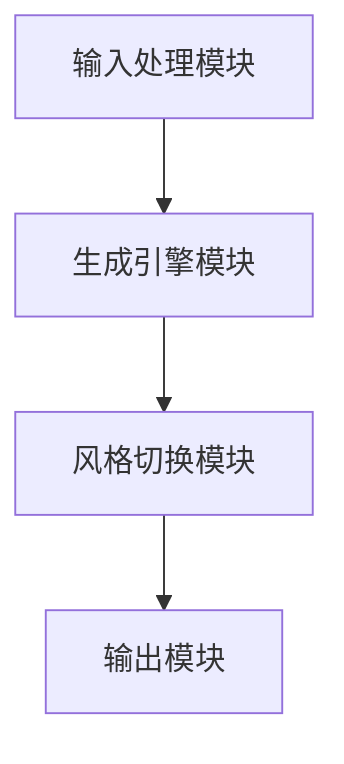
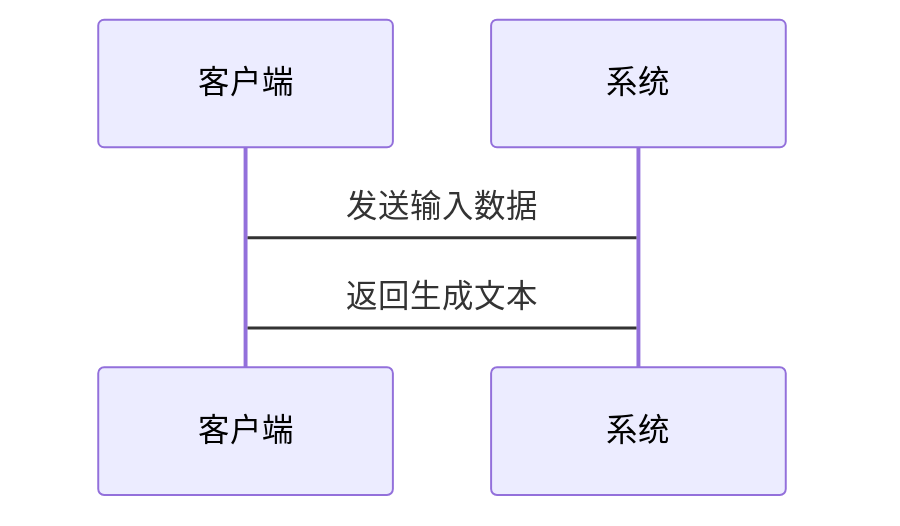

                 


# 《构建企业级自然语言生成系统：多语言、多风格报告自动化》

## 关键词：企业级自然语言生成、多语言、多风格报告生成、机器学习、NLP、深度学习

## 摘要：本文详细探讨了构建企业级自然语言生成系统的各个方面，包括多语言和多风格报告生成的核心技术、系统架构设计、项目实战以及最佳实践。文章从基础概念到高级算法，从系统架构到实际应用，全面解析了如何高效构建企业级自然语言生成系统，帮助读者掌握从理论到实践的关键步骤。

---

## 第一部分：自然语言生成系统概述

### 第1章：自然语言生成技术概述

#### 1.1 自然语言生成的背景与意义

- **1.1.1 自然语言生成的定义**  
  自然语言生成（Natural Language Generation, NGL）是自然语言处理（NLP）中的一个分支，旨在将结构化的数据或信息转换为人类可读的文本。它在企业级应用中具有重要意义，如自动生成报告、新闻、客服回复等。

- **1.1.2 自然语言生成的发展历程**  
  自然语言生成技术经历了从基于规则的系统到统计模型，再到当前基于深度学习的生成模型的演变。近年来，大语言模型（如GPT系列）的出现极大地推动了生成技术的进步。

- **1.1.3 企业级应用中的重要性**  
  在企业级应用中，NGL可以提高效率、降低成本，同时提升用户体验。例如，自动生成销售报告、市场分析、客服回复等。

#### 1.2 问题背景与描述

- **1.2.1 传统文本生成的局限性**  
  传统基于规则的生成系统灵活性差，难以处理复杂场景；统计模型生成的文本质量有限，且难以扩展到多语言或多风格场景。

- **1.2.2 企业级应用中的需求**  
  企业需要生成文本具备多样性和准确性，支持多语言和多种风格（正式、非正式、简洁、详细等）。

- **1.2.3 多语言与多风格生成的必要性**  
  全球化背景下，企业需要支持多种语言，同时根据不同场景调整文本风格，以满足不同用户或客户的需求。

#### 1.3 问题解决与边界

- **1.3.1 多语言生成的解决方案**  
  使用多语言模型（如多语言BERT）或通过微调单语言模型实现。

- **1.3.2 多风格生成的技术路径**  
  基于风格转移模型或生成式模型（如GAN、VAE）实现风格切换。

- **1.3.3 系统的边界与外延**  
  系统专注于生成高质量、多语言、多风格的文本，不涉及文本理解或输入数据的处理。

#### 1.4 核心概念与组成

- **1.4.1 输入、输出与生成模型**  
  输入：结构化数据或关键词；输出：自动生成的文本；生成模型：如Transformer、GPT等。

- **1.4.2 多语言与多风格的核心要素**  
  - 多语言：支持多种语言模型，具备跨语言生成能力。  
  - 多风格：支持多种风格切换，生成符合特定场景需求的文本。

- **1.4.3 系统架构与模块划分**  
  - 输入处理模块：接收输入数据并进行预处理。  
  - 生成引擎模块：基于输入生成文本。  
  - 风格切换模块：根据需求调整生成文本的风格。

---

## 第二部分：多语言与多风格生成原理

### 第2章：多语言生成原理

#### 2.1 多语言模型结构

- **2.1.1 多语言模型的架构**  
  使用共享参数的多语言模型，如多语言BERT，可以在训练时同时处理多种语言，提升跨语言生成能力。

- **2.1.2 语言嵌入机制**  
  每种语言都有特定的嵌入向量，模型通过学习这些向量实现跨语言生成。

- **2.1.3 跨语言注意力机制**  
  在生成过程中，模型可以根据上下文语言信息调整注意力权重，生成目标语言的文本。

#### 2.2 多风格生成原理

- **2.2.1 风格切换的技术**  
  基于风格向量的生成方法，如通过在生成模型中引入风格向量来控制文本风格。

- **2.2.2 风格向量的引入**  
  风格向量可以是预定义的类别向量（如正式、非正式）或从数据中学习得到的潜在向量。

- **2.2.3 风格迁移方法**  
  使用对抗训练（GAN）或变分自编码器（VAE）等方法实现风格迁移。

#### 2.3 多语言与多风格的结合

- **2.3.1 联合训练策略**  
  在训练过程中同时优化多语言和多风格生成目标，提升模型的通用性和适应性。

- **2.3.2 跨语言风格迁移**  
  在生成目标语言文本时，同时考虑风格信息，实现跨语言风格迁移。

- **2.3.3 模型的适应性调整**  
  根据具体需求对模型进行微调或参数调整，以适应不同的生成场景。

---

## 第三部分：企业级NLP系统关键技术

### 第3章：数据预处理与特征提取

#### 3.1 数据清洗与标注

- **3.1.1 数据清洗方法**  
  去除噪声数据、处理缺失值、统一数据格式等。

- **3.1.2 标注策略**  
  根据生成任务需求，对数据进行分类、分词、实体识别等标注。

- **3.1.3 数据增强技术**  
  使用同义词替换、句式变化等技术扩展训练数据，提升模型的泛化能力。

#### 3.2 特征提取与表示

- **3.2.1 词向量表示**  
  使用Word2Vec、GloVe等技术将词语映射为向量表示。

- **3.2.2 语法分析**  
  基于句法树或依存关系图分析文本结构，提取语法特征。

- **3.2.3 领域知识表示**  
  结合领域知识库（如行业术语、专业词汇）提升生成文本的准确性。

### 第4章：模型训练与优化

#### 4.1 模型训练策略

- **4.1.1 分阶段训练**  
  先在大规模通用数据上预训练，再在特定领域数据上微调。

- **4.1.2 跨任务学习**  
  在训练过程中同时学习多个任务（如文本生成、文本分类），提升模型的多任务处理能力。

- **4.1.3 知识蒸馏技术**  
  使用大模型的知识蒸馏小模型，提升小模型的生成能力。

#### 4.2 模型调优方法

- **4.2.1 参数优化**  
  使用Adam、SGD等优化器调整模型参数，提升生成质量。

- **4.2.2 模型压缩**  
  使用剪枝、知识蒸馏等技术压缩模型，降低计算成本。

- **4.2.3 预测结果的后处理**  
  对生成结果进行语法检查、风格调整等后处理，提升文本质量。

---

## 第四部分：系统架构与设计

### 第5章：系统架构设计

#### 5.1 模块划分与功能设计

- **5.1.1 输入处理模块**  
  接收输入数据并进行预处理，如数据清洗、格式转换等。

- **5.1.2 生成引擎模块**  
  基于预处理后的数据生成文本，支持多语言和多风格生成。

- **5.1.3 风格切换模块**  
  根据需求调整生成文本的风格，支持风格向量输入或用户指定的风格参数。

#### 5.2 系统架构图



### 第6章：接口设计与实现

#### 6.1 API设计规范

- **输入接口**  
  - 输入数据格式：结构化数据或关键词。  
  - 输入参数：语言、风格、生成长度等。

- **输出接口**  
  - 输出格式：文本内容，支持多种格式（如JSON、XML）。  
  - 输出参数：生成文本、生成时间、错误信息等。

#### 6.2 接口设计图



---

## 第五部分：项目实战

### 第7章：项目实战

#### 7.1 环境搭建

- **安装依赖**  
  安装Python、TensorFlow、Keras等开发工具和库。

- **配置环境**  
  配置GPU加速、下载预训练模型等。

#### 7.2 核心实现

```python
import tensorflow as tf
from tensorflow.keras import layers

# 定义多语言模型
def build_multilingual_model():
    inputs = layers.Input(shape=(None,))
    embeddings = layers.Embedding(input_dim=..., output_dim=...)(inputs)
    x = layers.Bidirectional(layers.LSTM(64))(embeddings)
    outputs = layers.Dense(32, activation='relu')(x)
    return Model(inputs=inputs, outputs=outputs)

# 定义风格切换模块
def build_style_switcher():
    inputs = layers.Input(shape=(None,))
    embeddings = layers.Embedding(input_dim=..., output_dim=...)(inputs)
    x = layers.LSTM(64)(embeddings)
    outputs = layers.Dense(2, activation='softmax')(x)
    return Model(inputs=inputs, outputs=outputs)
```

#### 7.3 代码应用解读与分析

- **代码解读**  
  以上代码定义了多语言模型和风格切换模块，通过Keras构建模型，实现文本生成和风格切换功能。

- **关键点分析**  
  - 多语言模型通过双向LSTM提取文本特征，风格切换模块通过LSTM和全连接层实现风格分类。  
  - 模型可以进一步优化，如引入风格向量或使用更复杂的生成模型（如GPT）。

#### 7.4 实际案例分析

- **案例一：多语言生成**  
  输入：关键词“销售报告”，语言选择“中文”、“英文”、“法语”。  
  输出：对应语言的销售报告文本。

- **案例二：多风格生成**  
  输入：关键词“产品介绍”，风格选择“正式”、“非正式”。  
  输出：对应风格的产品介绍文本。

#### 7.5 项目小结

- 项目实现了多语言、多风格的自然语言生成系统，具备良好的扩展性和灵活性。  
- 在实际应用中，可以根据具体需求对模型进行微调或参数调整，提升生成效果。

---

## 第六部分：最佳实践与总结

### 第8章：最佳实践与总结

#### 8.1 最佳实践

- **数据处理**  
  确保数据质量，进行充分的数据清洗和标注，使用数据增强技术扩展数据。

- **模型选择**  
  根据任务需求选择合适的模型架构，如使用预训练的大模型（GPT、Bert）进行微调，或自定义模型进行特定任务优化。

- **系统优化**  
  使用分布式训练、模型压缩等技术优化系统性能，降低计算成本。

#### 8.2 小结

- 本文系统地介绍了企业级自然语言生成系统的构建过程，包括多语言、多风格生成的核心技术、系统架构设计和项目实战。  
- 通过理论与实践结合，帮助读者掌握从设计到实现的关键步骤。

#### 8.3 注意事项

- **数据隐私**  
  在处理企业数据时，需注意数据隐私和安全问题，确保符合相关法律法规。

- **模型泛化能力**  
  在微调模型时，需注意避免过拟合，确保模型具备良好的泛化能力。

#### 8.4 未来趋势

- **多模态生成**  
  结合图像、语音等多模态信息，实现更复杂的生成任务。  
- **可解释性增强**  
  提升生成模型的可解释性，便于用户理解和控制生成过程。  
- **实时生成优化**  
  提高生成速度和响应时间，满足实时应用的需求。

---

## 作者：AI天才研究院 & 禅与计算机程序设计艺术

---

以上是《构建企业级自然语言生成系统：多语言、多风格报告自动化》的技术博客文章的详细内容，涵盖了从基础概念到系统设计、项目实战的各个方面，适合企业级系统开发人员、NLP工程师及相关领域读者阅读。

