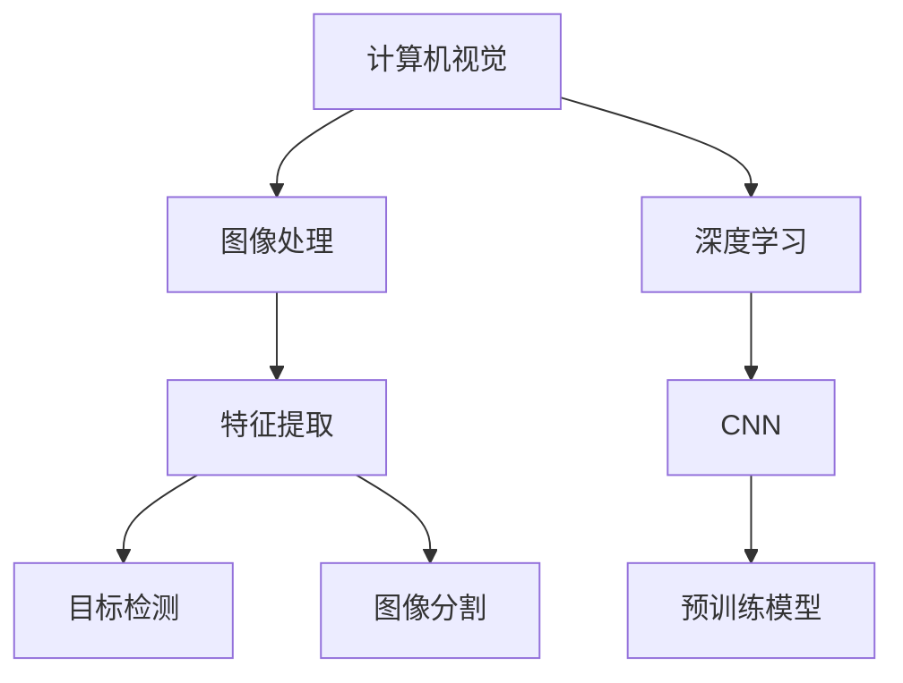
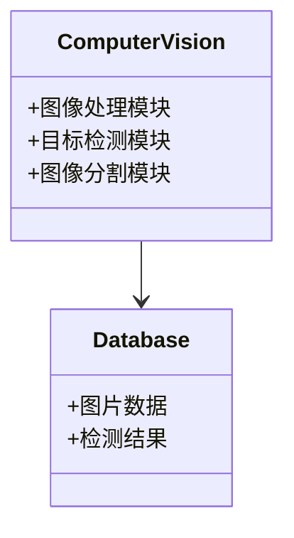
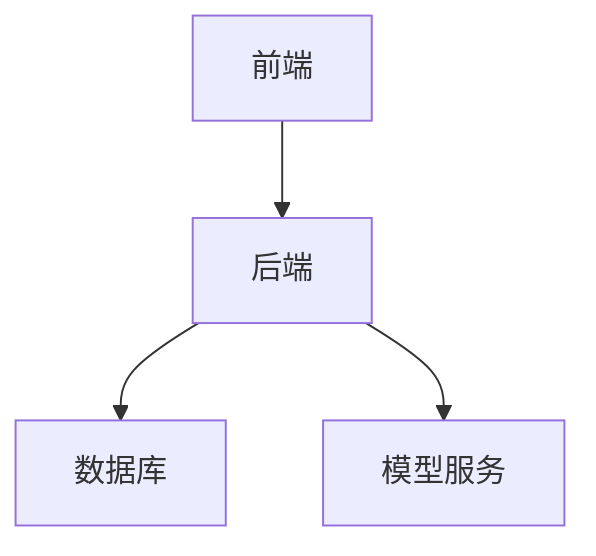
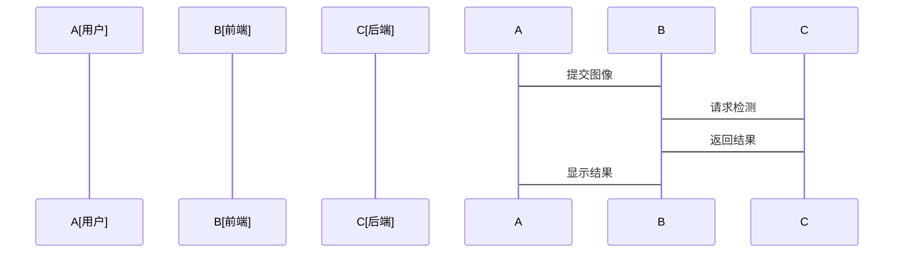

                 


# 构建企业级计算机视觉平台：从产品质检到员工安全监控

## 关键词：企业级计算机视觉，产品质检，员工安全监控，深度学习，目标检测，图像分割

## 摘要：企业级计算机视觉平台在现代制造业和安全管理中扮演着越来越重要的角色。本文从产品质检和员工安全监控两个方面详细探讨了计算机视觉技术的应用，结合实际案例，分析了系统设计和实现过程，帮助读者全面理解如何构建高效的企业级计算机视觉平台。

---

# 第1章: 背景介绍

## 1.1 计算机视觉的定义与应用领域

### 1.1.1 计算机视觉的定义
计算机视觉（Computer Vision）是人工智能领域的重要分支，旨在通过计算机模拟人类视觉系统的功能，对图像或视频进行分析和理解。它能够自动处理和解释视觉数据，提取有用的信息，如物体识别、场景理解等。

### 1.1.2 计算机视觉的主要应用领域
- **产品质检**：在制造业中，计算机视觉用于自动检测产品缺陷，提高生产效率和产品质量。
- **员工安全监控**：在企业安全领域，计算机视觉用于实时监控员工行为，预防安全事故。
- **智能交通系统**：用于交通监控、车辆识别和违章检测。
- **医疗影像分析**：辅助医生进行疾病诊断和治疗方案制定。

### 1.1.3 企业级计算机视觉平台的背景与意义
随着人工智能技术的快速发展，企业级计算机视觉平台的建设成为提升企业效率和安全的重要手段。通过自动化处理视觉数据，企业能够显著降低成本、提高生产效率，并增强安全监控能力。

---

## 1.2 企业级计算机视觉平台的必要性

### 1.2.1 企业对计算机视觉技术的需求
企业需要高效、准确的视觉处理系统，以应对复杂的生产环境和安全挑战。传统的人工质检和安全监控方式效率低下，容易出错，而计算机视觉能够提供实时、精确的解决方案。

### 1.2.2 传统质检与安全监控的局限性
- **效率低**：人工质检速度慢，容易疲劳导致误检。
- **成本高**：需要大量的人力资源，增加了企业运营成本。
- **安全性差**：人工监控难以实时发现潜在的安全隐患。

### 1.2.3 计算机视觉在企业中的应用前景
计算机视觉技术的应用前景广阔，特别是在制造业和安全管理领域。通过自动化处理图像数据，企业能够显著提升生产效率和安全水平，同时降低运营成本。

---

## 1.3 本书的核心目标与内容框架

### 1.3.1 本书的核心目标
本书旨在为企业提供构建计算机视觉平台的全面指导，涵盖从基础概念到实际应用的各个环节，帮助读者掌握如何设计和实现高效的计算机视觉系统。

### 1.3.2 本书的内容框架
- 第1章：背景介绍，分析计算机视觉的定义、应用领域及企业需求。
- 第2章：核心概念与技术基础，讲解计算机视觉的关键技术和深度学习的应用。
- 第3章：算法原理，详细分析目标检测和图像分割的算法及其数学模型。
- 第4章：系统分析与架构设计，设计企业级计算机视觉平台的系统架构和接口。
- 第5章：项目实战，从环境搭建到系统集成，详细指导读者完成项目。
- 第6章：最佳实践与小结，总结经验并展望未来发展。

### 1.3.3 本书的读者群体
本书适合企业IT技术人员、软件架构师、人工智能工程师以及对计算机视觉技术感兴趣的学生和研究人员阅读。

---

# 第2章: 计算机视觉的核心概念

## 2.1 计算机视觉的关键技术

### 2.1.1 图像处理与特征提取
图像处理是计算机视觉的基础，包括图像增强、滤波和边缘检测等技术。特征提取则是从图像中提取关键特征，如SIFT和HOG。

### 2.1.2 目标检测与识别
目标检测用于识别图像中的物体位置和类别，常用算法包括YOLO、Faster R-CNN等。目标识别则进一步确定物体的类别。

### 2.1.3 图像分割与语义理解
图像分割将图像分成多个区域，每个区域具有相似的特征。语义理解则是对分割后的区域进行语义分析，如场景理解。

---

## 2.2 深度学习在计算机视觉中的应用

### 2.2.1 深度学习的基本概念
深度学习是一种机器学习技术，通过多层神经网络模型学习数据的高层次特征。

### 2.2.2 CNN在图像处理中的作用
卷积神经网络（CNN）专门用于图像处理，通过卷积层提取空间特征，池化层降低计算复杂度。

### 2.2.3 预训练模型在计算机视觉中的应用
预训练模型如ResNet、EfficientNet等已经在大规模数据上进行训练，可以直接用于目标检测和图像分割任务。

---

## 2.3 计算机视觉的核心算法与工具

### 2.3.1 常见的目标检测算法
- **YOLO**：单阶段检测器，速度快，适合实时应用。
- **Faster R-CNN**：两阶段检测器，精度高，适合复杂场景。

### 2.3.2 常见的图像分割算法
- **U-Net**：主要用于医学图像分割，结构简单。
- **Mask R-CNN**：结合了目标检测和实例分割，精度高。

### 2.3.3 开源工具与框架
- **TensorFlow**：谷歌开发的深度学习框架。
- **PyTorch**：Facebook开发的深度学习框架。
- **OpenCV**：图像处理库，支持多种算法。

---

## 2.4 核心概念与联系

### 2.4.1 实体关系图


### 2.4.2 对比表格
| 技术          | 优点                          | 缺点                            |
|---------------|-------------------------------|----------------------------------|
| YOLO          | 速度快                        | 精度较低                        |
| Faster R-CNN  | 精度高                        | 速度较慢                        |

---

# 第3章: 算法原理

## 3.1 目标检测算法

### 3.1.1 YOLO算法原理
YOLO通过将图像划分为网格，每个网格预测物体的边界框和类别概率。其流程如下：
1. 将图像输入网络，提取特征图。
2. 对每个网格进行边界框回归和类别预测。

### 3.1.2 Faster R-CNN算法原理
Faster R-CNN分为两个阶段：
1. **RPN**：生成候选框。
2. **RoI-Align**：将候选框特征输入分类器。

### 3.1.3 数学模型
目标检测的损失函数通常包括分类损失和回归损失：
$$ L = L_{cls} + L_{reg} $$

---

## 3.2 图像分割算法

### 3.2.1 U-Net算法
U-Net主要用于医学图像分割，结构包括编码器和解码器两部分：
1. 编码器提取图像特征。
2. 解码器逐步恢复图像细节。

### 3.2.2 Mask R-CNN算法
Mask R-CNN在Faster R-CNN的基础上添加了分割分支：
1. 对每个候选框生成分割掩膜。

### 3.2.3 数学模型
分割任务的损失函数通常包括分类损失和分割损失：
$$ L = L_{cls} + L_{seg} $$

---

## 3.3 代码实现

### 3.3.1 YOLO代码示例
```python
import torch
model = torch.hub.load('ultralytics/yolov5', 'yolov5')
result = model('test.jpg')
```

### 3.3.2 Mask R-CNN代码示例
```python
import torchvision
model = torchvision.models.mask_rcnn_resnet50_fpn(pretrained=True)
input = torch.randn(1, 3, 224, 224)
output = model(input)
```

---

# 第4章: 系统分析与架构设计

## 4.1 项目背景与目标

### 4.1.1 项目背景
企业需要构建一个高效的计算机视觉平台，用于产品质检和员工安全监控。

### 4.1.2 项目目标
- 实现产品质检的自动化。
- 实现实时员工行为监控。

---

## 4.2 系统功能设计

### 4.2.1 领域模型设计


---

## 4.3 系统架构设计

### 4.3.1 分层架构设计


---

## 4.4 接口设计

### 4.4.1 API接口设计
- **输入**：图像数据
- **输出**：检测结果

---

## 4.5 系统交互设计

### 4.5.1 序列图


---

# 第5章: 项目实战

## 5.1 环境搭建

### 5.1.1 安装依赖
```bash
pip install torch torchvision
```

---

## 5.2 数据采集

### 5.2.1 代码实现
```python
import cv2
cap = cv2.VideoCapture(0)
while cap.isOpened():
    ret, frame = cap.read()
    cv2.imshow('frame', frame)
    if cv2.waitKey(1) & 0xFF == ord('q'):
        break
cap.release()
cv2.destroyAllWindows()
```

---

## 5.3 模型训练

### 5.3.1 训练代码
```python
model = torch.hub.load('ultralytics/yolov5', 'yolov5')
model.train()
```

---

## 5.4 系统集成

### 5.4.1 整体架构


---

## 5.5 项目小结

### 5.5.1 经验总结
- 数据质量对模型性能影响巨大。
- 系统设计需要考虑可扩展性和可维护性。

---

# 第6章: 最佳实践与小结

## 6.1 最佳实践

### 6.1.1 数据预处理
- 数据清洗：去除噪声数据。
- 数据增强：提升模型鲁棒性。

### 6.1.2 模型优化
- 调参：优化学习率和批量大小。
- 模型剪裁：减少计算量。

---

## 6.2 小结

通过本文的详细讲解，读者可以全面了解如何构建企业级计算机视觉平台。从背景介绍到系统设计，再到项目实战，每一步都进行了详细的指导。

---

## 6.3 注意事项

- 确保数据安全，避免隐私泄露。
- 定期更新模型，适应新场景。

---

## 6.4 拓展阅读

- 《Deep Learning》——Ian Goodfellow
- 《Computer Vision: A Modern Approach》——Richard Szeliski

---

# 结语

企业级计算机视觉平台的建设是一个复杂而重要的任务。通过本文的指导，读者可以掌握从概念到实现的整个过程，为企业的发展提供有力的技术支持。

---

# 作者

作者：AI天才研究院/AI Genius Institute  
& 禅与计算机程序设计艺术 /Zen And The Art of Computer Programming

