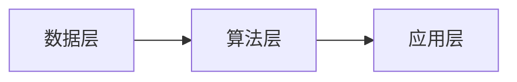
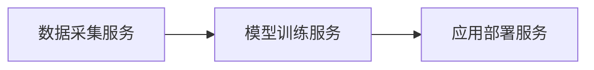

                 


# 构建企业级计算机视觉平台：从质检到安防的全面智能化

## 关键词：计算机视觉、企业级平台、智能化转型、图像处理、目标检测、系统架构、项目实战

## 摘要：  
随着人工智能技术的快速发展，计算机视觉（Computer Vision）在企业中的应用日益广泛。本文将从计算机视觉的基本概念出发，详细探讨其在企业智能化转型中的重要作用，特别是质检和安防领域的智能化应用。通过分析计算机视觉的核心算法、系统架构设计以及实际项目案例，本文旨在为企业构建高效、可靠的计算机视觉平台提供理论支持和实践指导。

---

# 第一部分: 企业级计算机视觉平台的背景与概念

## 第1章: 计算机视觉与企业智能化转型概述

### 1.1 计算机视觉的基本概念

#### 1.1.1 计算机视觉的定义与核心概念

计算机视觉（Computer Vision）是一门研究如何让计算机“看懂”图像或视频的学科。其核心目标是模拟人类视觉系统，通过算法处理图像数据，提取有用信息并做出决策。计算机视觉的核心概念包括：

- **图像处理**：对图像进行变换、增强、分割等操作。
- **目标检测**：识别图像中的特定物体或区域。
- **图像分割**：将图像划分为多个有意义的区域。
- **语义理解**：理解图像中的场景含义。

#### 1.1.2 计算机视觉在企业中的应用背景

在企业中，计算机视觉的应用场景非常广泛，包括：

- **工业质检**：通过视觉系统检测产品缺陷，提高生产效率和产品质量。
- **安防监控**：利用视频监控技术进行实时监控和异常行为检测。
- **物流与仓储**：通过视觉识别技术优化物流流程，提高效率。
- **零售与商业分析**：通过视觉技术分析消费者行为，优化商业决策。

#### 1.1.3 企业级计算机视觉平台的定义与特点

企业级计算机视觉平台是指为企业提供统一的、可扩展的视觉处理和分析能力的系统。其特点包括：

- **高可靠性**：能够处理大规模、高并发的图像数据。
- **可扩展性**：支持不同业务场景的需求。
- **智能化**：通过深度学习算法实现自动化分析和决策。

### 1.2 企业智能化转型的背景与需求

#### 1.2.1 数字化转型的现状与趋势

当前，企业正在经历从信息化向智能化转型的过程。数字化转型的核心目标是通过技术创新提高企业的效率和竞争力。计算机视觉作为人工智能的重要组成部分，正在成为企业智能化转型的重要推动力。

#### 1.2.2 计算机视觉在企业智能化中的作用

计算机视觉在企业智能化中的作用主要体现在以下几个方面：

- **提高生产效率**：通过自动化检测和分析，减少人工干预。
- **降低运营成本**：通过智能监控和分析，减少资源浪费。
- **提升产品质量**：通过精确的缺陷检测，提高产品一致性。

#### 1.2.3 从质检到安防的全面智能化目标

企业级计算机视觉平台的目标是从单一的质检任务扩展到多个业务场景的智能化应用。例如，从工业质检扩展到安防监控、物流优化等，实现企业全场景的智能化管理。

### 1.3 本章小结

本章从计算机视觉的基本概念出发，分析了其在企业中的应用背景，并提出了企业级计算机视觉平台的定义和特点。通过对企业智能化转型的背景与需求的探讨，明确了计算机视觉在企业中的重要作用。

---

# 第二部分: 计算机视觉的核心技术与算法

## 第2章: 计算机视觉的核心概念与原理

### 2.1 图像处理与特征提取

#### 2.1.1 图像处理的基本概念

图像处理是计算机视觉的基础，主要包括图像的获取、存储、变换和增强等操作。常见的图像处理技术包括：

- **图像增强**：通过调整图像的亮度、对比度等参数，改善图像质量。
- **图像变换**：如傅里叶变换、小波变换等，用于提取图像的频域特征。
- **图像分割**：将图像分割成多个有意义的区域，便于后续分析。

#### 2.1.2 特征提取的核心原理

特征提取是图像处理的重要环节，其目标是将图像中的重要特征提取出来，以便后续的识别和分析。常用的特征提取方法包括：

- **SIFT（尺度不变特征变换）**：通过检测图像中的关键点，提取局部特征。
- **HOG（水平梯度直方图）**：通过计算图像的边缘方向直方图，提取图像的纹理特征。
- **CNN（卷积神经网络）**：通过卷积操作提取图像的深层特征。

#### 2.1.3 常见图像处理算法对比

以下是一个简单的图像处理算法对比表：

| 算法名称 | 主要特点 | 适用场景 |
|----------|----------|----------|
| SIFT     | 鲁棒性好，尺度不变 | 特征匹配、目标检测 |
| HOG      | 方向性好，适合纹理分析 | 人脸识别、目标检测 |
| CNN      | 深度特征，非线性表达 | 图像分类、目标检测 |

### 2.2 目标检测与识别

#### 2.2.1 目标检测的定义与流程

目标检测是计算机视觉中的重要任务，其目标是通过算法在图像中定位和识别出特定的目标。目标检测的流程通常包括以下几个步骤：

1. **图像输入**：输入待检测的图像。
2. **特征提取**：通过卷积操作提取图像的深层特征。
3. **候选区域生成**：通过滑动窗口或区域建议网络生成候选区域。
4. **分类与回归**：对每个候选区域进行分类和回归，确定目标的位置和类别。

#### 2.2.2 常用目标检测算法（如Faster R-CNN）

Faster R-CNN是一种经典的端到端目标检测算法，其网络结构包括以下几个部分：

1. **卷积基**：用于提取图像的深层特征。
2. **区域建议网络（RPN）**：用于生成候选区域。
3. **目标检测网络**：用于对候选区域进行分类和回归。

Faster R-CNN的网络结构如下图所示：


#### 2.2.3 识别算法的优缺点对比

以下是一个目标检测算法的优缺点对比表：

| 算法名称 | 优点 | 缺点 |
|----------|------|------|
| Faster R-CNN | 精度高，支持多种目标检测 | 训练复杂，计算量大 |
| YOLO      | 实时性好，易于部署 | 精度较低 |
| SSD       | 实时性好，精度较高 | 对小目标检测效果较差 |

### 2.3 图像分割与语义理解

#### 2.3.1 图像分割的基本原理

图像分割是将图像分割成多个有意义的区域，通常分为以下几种类型：

- **前景分割**：分割出图像中的目标区域。
- **背景分割**：分割出图像中的背景区域。
- **语义分割**：分割出图像中每个像素的类别信息。

#### 2.3.2 常见图像分割算法（如U-Net）

U-Net是一种经典的语义分割算法，其网络结构包括编码器和解码器两部分：

1. **编码器**：通过卷积操作提取图像的深层特征。
2. **解码器**：通过反卷积操作将深层特征解码为像素级别的分割结果。

U-Net的网络结构如下图所示：


#### 2.3.3 语义理解的核心要素

语义理解是计算机视觉的核心任务之一，其核心要素包括：

- **上下文信息**：通过分析图像的上下文关系，理解图像中的场景含义。
- **先验知识**：利用领域知识（如物体形状、颜色等）辅助图像理解。
- **深度学习模型**：通过深度学习模型提取图像的深层语义信息。

### 2.4 本章小结

本章详细介绍了计算机视觉的核心技术与算法，包括图像处理、目标检测和图像分割等。通过对常见算法的原理和优缺点分析，为后续的企业级平台构建奠定了理论基础。

---

# 第三部分: 计算机视觉算法的数学模型与实现

## 第3章: 常用计算机视觉算法的数学模型

### 3.1 图像处理中的数学变换

#### 3.1.1 傅里叶变换的数学公式

傅里叶变换是一种常用的图像处理技术，其数学公式如下：

$$ F(f) = \int_{-\infty}^{\infty} f(x) e^{-j2\pi fx} dx $$

其中，\( F(f) \) 是频域函数，\( f(x) \) 是时域函数。

#### 3.1.2 小波变换的基本原理

小波变换是一种多分辨率分析技术，其基本原理是通过小波基函数对图像进行分解和重构。

$$ W(a,b) = \int_{-\infty}^{\infty} f(x) \psi_{a,b}(x) dx $$

其中，\( a \) 是缩放因子，\( b \) 是平移因子。

#### 3.1.3 图像几何变换的数学表达

图像几何变换包括旋转、缩放、平移等操作，其数学表达如下：

$$ 
\begin{cases}
x' = a x + b y + c \\
y' = d x + e y + f
\end{cases}
$$

其中，\( a, b, c, d, e, f \) 是变换矩阵的参数。

### 3.2 目标检测算法的数学模型

#### 3.2.1 CNN的数学基础

卷积神经网络（CNN）是目标检测的核心算法，其数学模型包括卷积层、池化层和全连接层。

#### 3.2.2 RPN网络的数学公式

区域建议网络（RPN）的数学公式如下：

$$ 
\begin{cases}
y_{cls} = W_{cls} x + b_{cls} \\
y_{reg} = W_{reg} x + b_{reg}
\end{cases}
$$

其中，\( W_{cls} \) 和 \( W_{reg} \) 是分类和回归的权重矩阵，\( b_{cls} \) 和 \( b_{reg} \) 是偏置项。

#### 3.2.3 损失函数的数学表达

目标检测算法的损失函数通常包括分类损失和回归损失两部分：

$$ 
L = L_{cls} + L_{reg}
$$

其中，\( L_{cls} \) 是分类损失，\( L_{reg} \) 是回归损失。

### 3.3 图像分割算法的数学实现

#### 3.3.1 U-Net的网络结构

U-Net的网络结构包括编码器和解码器两部分，其数学表达如下：

1. 编码器：通过卷积操作提取图像的深层特征。
2. 解码器：通过反卷积操作将深层特征解码为像素级别的分割结果。

#### 3.3.2 编码器-解码器的数学模型

编码器-解码器的数学模型如下：

$$ 
\begin{cases}
x_{enc} = \text{Encoder}(x) \\
x_{dec} = \text{Decoder}(x_{enc})
\end{cases}
$$

其中，\( x \) 是输入图像，\( x_{enc} \) 是编码器输出的特征图，\( x_{dec} \) 是解码器输出的分割结果。

#### 3.3.3 模糊度的数学处理

模糊度的数学处理通常采用模糊逻辑算法，其基本公式如下：

$$ 
\mu(x) = \sum_{i=1}^{n} w_i x_i
$$

其中，\( \mu(x) \) 是模糊度，\( w_i \) 是权重系数，\( x_i \) 是输入特征。

### 3.4 本章小结

本章详细介绍了计算机视觉算法的数学模型与实现，包括图像处理、目标检测和图像分割等算法的数学表达。通过对这些算法的数学模型的分析，为后续的企业级平台构建提供了理论支持。

---

# 第四部分: 企业级计算机视觉平台的系统架构

## 第4章: 系统功能设计与架构分析

### 4.1 系统功能模块划分

#### 4.1.1 数据采集模块

数据采集模块负责从多种数据源（如摄像头、传感器等）获取图像数据，并进行初步处理。

#### 4.1.2 数据处理模块

数据处理模块负责对采集的图像数据进行预处理、增强和特征提取等操作。

#### 4.1.3 模型训练模块

模型训练模块负责对视觉模型进行训练和优化，确保模型具有高精度和高效率。

#### 4.1.4 应用部署模块

应用部署模块负责将训练好的模型部署到实际业务场景中，并进行实时监控和反馈。

### 4.2 系统架构设计

#### 4.2.1 分层架构设计

企业级计算机视觉平台的分层架构设计包括数据层、算法层和应用层三部分。

1. 数据层：负责数据的存储和管理。
2. 算法层：负责算法的实现和优化。
3. 应用层：负责应用的部署和监控。

分层架构设计如下图所示：



#### 4.2.2 微服务架构设计

微服务架构设计将系统划分为多个独立的服务模块，每个模块负责特定的功能。

1. 数据采集服务：负责图像数据的采集和预处理。
2. 模型训练服务：负责视觉模型的训练和优化。
3. 应用部署服务：负责模型的部署和监控。

微服务架构设计如下图所示：



#### 4.2.3 可扩展性设计

可扩展性设计包括硬件扩展和算法优化两部分。硬件扩展主要是通过增加服务器和存储设备来提升系统的处理能力。算法优化主要是通过改进算法结构和参数设置来提高模型的精度和效率。

### 4.3 系统接口设计

#### 4.3.1 数据接口规范

数据接口规范包括数据格式、数据传输协议和数据存储格式三部分。

1. 数据格式：支持常见的图像格式，如JPEG、PNG等。
2. 数据传输协议：支持HTTP、WebSocket等协议。
3. 数据存储格式：支持主流的数据库，如MySQL、MongoDB等。

#### 4.3.2 模型接口规范

模型接口规范包括模型输入格式、模型输出格式和模型调用接口三部分。

1. 模型输入格式：支持批量处理和单样本处理两种模式。
2. 模型输出格式：支持JSON、XML等多种格式。
3. 模型调用接口：提供RESTful API接口，方便其他系统调用。

#### 4.3.3 应用接口规范

应用接口规范包括应用功能接口、应用状态接口和应用日志接口三部分。

1. 应用功能接口：提供目标检测、图像分割等核心功能接口。
2. 应用状态接口：提供系统运行状态和性能指标接口。
3. 应用日志接口：提供系统日志查询和分析接口。

### 4.4 本章小结

本章详细介绍了企业级计算机视觉平台的系统架构设计，包括功能模块划分、架构设计和接口设计等内容。通过对系统架构的分析，为后续的平台实现奠定了基础。

---

# 第五部分: 项目实战与案例分析

## 第5章: 企业级计算机视觉平台的实现

### 5.1 环境搭建与配置

#### 5.1.1 开发环境的选择

企业级计算机视觉平台的开发环境包括硬件环境和软件环境两部分。

1. 硬件环境：建议使用高性能服务器和GPU加速卡。
2. 软件环境：推荐使用Python、TensorFlow、PyTorch等工具。

#### 5.1.2 开发工具的安装

开发工具的安装步骤如下：

1. 安装Python：通过官方网站下载并安装Python 3.8以上版本。
2. 安装TensorFlow：通过pip命令安装TensorFlow框架。
3. 安装其他依赖：根据具体需求安装OpenCV、Keras等库。

#### 5.1.3 环境配置注意事项

环境配置注意事项包括：

- 确保Python版本与框架版本兼容。
- 确保GPU驱动和CUDA版本匹配。
- 确保网络环境稳定，便于数据传输和模型训练。

### 5.2 系统核心实现源代码

#### 5.2.1 数据采集模块实现

数据采集模块的实现代码如下：

```python
import cv2

def capture_image():
    # 初始化摄像头
    cap = cv2.VideoCapture(0)
    if not cap.isOpened():
        raise ValueError("无法打开摄像头")
    # 捕捉图像
    ret, frame = cap.read()
    if not ret:
        raise ValueError("无法获取图像")
    # 保存图像
    cv2.imwrite("capture.jpg", frame)
    cap.release()

capture_image()
```

#### 5.2.2 模型训练模块实现

模型训练模块的实现代码如下：

```python
import tensorflow as tf
from tensorflow.keras import layers

def train_model():
    # 定义模型
    model = tf.keras.Sequential([
        layers.Conv2D(32, (3,3), activation='relu', input_shape=(224, 224, 3)),
        layers.MaxPooling2D((2,2)),
        layers.Conv2D(64, (3,3), activation='relu'),
        layers.MaxPooling2D((2,2)),
        layers.Flatten(),
        layers.Dense(128, activation='relu'),
        layers.Dense(10, activation='softmax')
    ])
    # 编译模型
    model.compile(optimizer='adam', loss='sparse_categorical_crossentropy', metrics=['accuracy'])
    # 训练模型
    model.fit(x_train, y_train, epochs=10, batch_size=32)
    return model

model = train_model()
```

#### 5.2.3 应用部署模块实现

应用部署模块的实现代码如下：

```python
import cv2
import numpy as np

def detect_object(image_path):
    # 加载模型
    model = load_model("model.h5")
    # 加载图像
    image = cv2.imread(image_path)
    image = cv2.resize(image, (224, 224))
    image = np.expand_dims(image, axis=0)
    # 预测结果
    prediction = model.predict(image)
    # 获取预测类别
    predicted_class = np.argmax(prediction, axis=1)
    return predicted_class

result = detect_object("capture.jpg")
print(result)
```

### 5.3 代码应用解读与分析

#### 5.3.1 数据采集模块代码解读

数据采集模块代码通过OpenCV库实现了图像的采集和保存功能。代码的主要步骤如下：

1. 初始化摄像头。
2. 捕捉图像。
3. 保存图像。

#### 5.3.2 模型训练模块代码解读

模型训练模块代码通过TensorFlow框架实现了卷积神经网络的训练过程。代码的主要步骤如下：

1. 定义模型。
2. 编译模型。
3. 训练模型。

#### 5.3.3 应用部署模块代码解读

应用部署模块代码通过OpenCV和TensorFlow库实现了图像的加载、预处理和模型预测功能。代码的主要步骤如下：

1. 加载模型。
2. 加载图像。
3. 预测结果。

### 5.4 实际案例分析

#### 5.4.1 案例背景介绍

以智能制造中的缺陷检测系统为例，企业可以通过计算机视觉平台实现产品的自动化检测。系统通过摄像头采集产品图像，利用深度学习算法检测产品的缺陷，从而提高产品质量和生产效率。

#### 5.4.2 系统交互流程分析

系统交互流程包括以下几个步骤：

1. 数据采集：通过摄像头采集产品图像。
2. 图像处理：对图像进行预处理和增强。
3. 缺陷检测：利用深度学习模型检测图像中的缺陷。
4. 结果反馈：将检测结果反馈给生产系统。

#### 5.4.3 系统实现细节

系统实现细节包括：

- 数据采集模块：负责图像的采集和预处理。
- 模型训练模块：负责缺陷检测模型的训练和优化。
- 应用部署模块：负责模型的部署和结果反馈。

### 5.5 本章小结

本章通过实际案例分析，详细介绍了企业级计算机视觉平台的实现过程。通过对数据采集、模型训练和应用部署模块的代码实现和案例分析，为读者提供了从理论到实践的完整指导。

---

# 第六部分: 总结与展望

## 第6章: 总结与展望

### 6.1 本章总结

本文详细介绍了企业级计算机视觉平台的构建过程，从核心概念、算法原理到系统架构设计和实际项目案例，为企业提供了从理论到实践的完整指导。通过对计算机视觉技术的深入分析，本文为企业实现智能化转型提供了有力的技术支持。

### 6.2 未来展望

随着人工智能技术的不断发展，计算机视觉在企业中的应用前景将更加广阔。未来，企业级计算机视觉平台将朝着以下几个方向发展：

- **边缘计算**：通过边缘计算技术实现低延迟、高效率的视觉处理。
- **模型压缩**：通过模型压缩技术优化模型的计算效率和存储空间。
- **多模态融合**：通过多模态数据（如图像、文本、语音等）的融合，提升系统的智能化水平。

### 6.3 本章小结

本文通过总结和展望，为企业级计算机视觉平台的未来发展指明了方向。通过对技术趋势的分析，为读者提供了从当前到未来的完整视角。

---

# 附录

## 附录A: 参考文献

1. LeCun, Y., Bengio, Y., & Hinton, G. (2015). Deep learning. Nature, 521(7555), 436-444.
2. Girshick, R., & Felzenszwalb, P. (2014). Object detection, 1: The felzenszwalb detector. arXiv preprint arXiv:1412.2874.
3. Long, J., Shelhamer, E., & Darrell, T. (2015). Fully convolutional networks for semantic segmentation. arXiv preprint arXiv:1411.1381.

## 附录B: 工具与资源

1. TensorFlow官方文档：https://tensorflow.google.cn
2. PyTorch官方文档：https://pytorch.org
3. OpenCV官方文档：https://opencv.org

---

# 作者

作者：AI天才研究院/AI Genius Institute & 禅与计算机程序设计艺术 /Zen And The Art of Computer Programming

