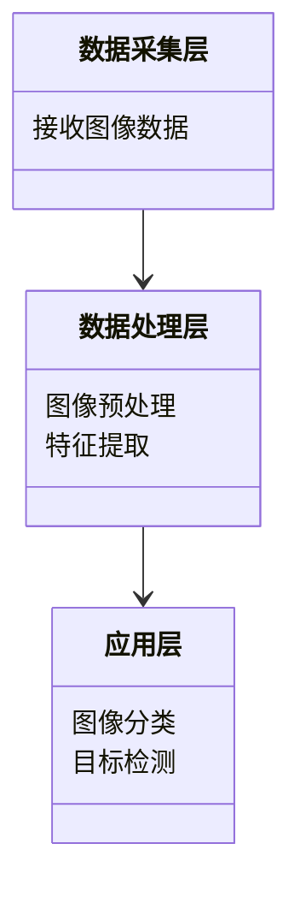
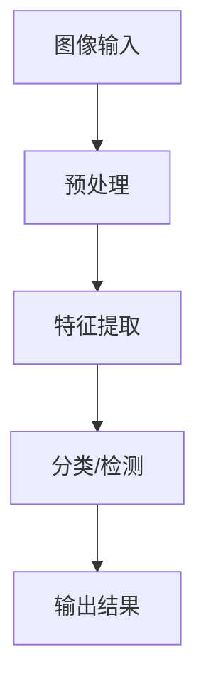
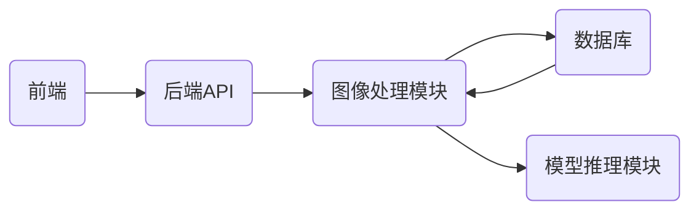

                 


# 构建企业级计算机视觉平台：从质量控制到安全监管的全面应用

## 关键词：企业级计算机视觉平台、质量控制、安全监管、深度学习、目标检测、图像分割、系统架构

## 摘要：  
企业级计算机视觉平台是将计算机视觉技术应用于企业质量管理与安全监管的重要工具。本文从计算机视觉的核心技术出发，详细阐述了企业级计算机视觉平台的系统架构、算法原理、项目实现及最佳实践，帮助读者全面理解并构建高效的计算机视觉平台。

---

# 第一部分：引言

## 第1章：计算机视觉平台的背景与意义

### 1.1 计算机视觉的定义与应用领域
计算机视觉（Computer Vision）是指通过计算机对图像或视频进行处理和理解，模拟人类视觉系统的技术。其主要应用领域包括：
- **工业自动化**：如产品质量检测、缺陷识别。
- **智能安防**：如人脸识别、行为分析。
- **医疗健康**：如医学图像分析、疾病诊断。
- **自动驾驶**：如目标检测、场景理解。

构建企业级计算机视觉平台，能够显著提高企业的生产效率和产品质量，同时降低人工成本。

### 1.2 企业级计算机视觉平台的核心价值
- **提高生产效率**：自动化处理大量图像数据，减少人工操作。
- **降低人工成本**：通过自动化检测和监控，减少对大量人工劳动力的依赖。
- **提升产品质量**：通过精准的图像分析，确保产品符合质量标准。

### 1.3 本书的结构与目标
本书将从基础到高级，系统性地讲解企业级计算机视觉平台的构建过程，内容涵盖：
- 计算机视觉的核心技术。
- 系统架构设计。
- 算法原理与实现。
- 项目实战与最佳实践。

---

# 第二部分：计算机视觉基础

## 第2章：计算机视觉的核心技术

### 2.1 图像处理基础
图像处理是计算机视觉的基础，主要包括以下步骤：
- **图像采集**：通过摄像头或传感器获取图像数据。
- **图像预处理**：如去噪、锐化、对比度调整。
- **图像分割**：将图像分割为有意义的区域。

#### 图像分割的实现步骤（mermaid流程图）
```mermaid
graph TD
    A[图像输入] -> B[去噪] -> C[边缘检测] -> D[区域分割] -> E[输出分割结果]
```

### 2.2 深度学习在计算机视觉中的应用
深度学习，特别是卷积神经网络（CNN），在计算机视觉中取得了突破性进展。其核心步骤如下：
1. **特征提取**：通过卷积层提取图像的低级和高级特征。
2. **分类与检测**：通过全连接层和目标检测算法（如YOLO）进行分类和定位。

#### 卷积神经网络（CNN）的数学模型
CNN的核心在于卷积操作，其数学表示为：
$$ y = \sum_{i=1}^{k} w_{i} \cdot x_{i} + b $$
其中，$w$ 是权重，$x$ 是输入特征，$b$ 是偏置。

### 2.3 计算机视觉的主流算法
主流的计算机视觉算法包括：
- **目标检测**：如YOLO、Faster R-CNN。
- **图像分割**：如U-Net、FCN。
- **人脸识别**：如FaceNet、DeepFace。

---

# 第三部分：企业级计算机视觉平台的核心概念

## 第3章：计算机视觉平台的系统架构

### 3.1 系统架构设计
企业级计算机视觉平台的架构设计需要考虑以下几个方面：
- **分层架构**：将系统分为数据采集层、数据处理层和应用层。
- **微服务架构**：将功能模块化，便于扩展和维护。
- **高可用性**：通过负载均衡和容灾设计确保系统的稳定性。

#### 分层架构设计（mermaid类图）


### 3.2 数据流与处理流程
数据从图像采集设备进入系统，经过预处理、特征提取、分类等步骤，最终输出分析结果。

#### 数据流与处理流程（mermaid流程图）


### 3.3 系统功能模块
- **图像采集模块**：负责获取图像数据。
- **图像处理模块**：对图像进行预处理和特征提取。
- **图像分析模块**：执行分类、检测等任务。

---

# 第四部分：算法原理与实现

## 第4章：计算机视觉算法的数学模型

### 4.1 卷积神经网络（CNN）的数学模型
CNN通过卷积操作提取图像特征，其数学模型如下：
$$ y = \sum_{i=1}^{k} w_{i} \cdot x_{i} + b $$

#### YOLO目标检测算法的数学模型
YOLO通过回归方法直接预测边界框和类别概率，其损失函数为：
$$ \text{Loss} = \lambda_{\text{xy}}(x-\hat{x})^2 + \lambda_{wh}(w-\hat{w})^2 + \lambda_{conf}(p-\hat{p})^2 $$

### 4.2 图像分割算法的数学模型
U-Net通过跳跃连接实现精确的像素级分割，其损失函数为：
$$ \text{Loss} = \sum_{i=1}^{H} \sum_{j=1}^{W} \alpha (1 - y_i^j) \cdot \text{dice}(y_i^j, \hat{y}_i^j) $$

---

# 第五部分：系统分析与架构设计

## 第5章：企业级计算机视觉平台的系统分析

### 5.1 问题场景介绍
- **质量控制场景**：如工业品缺陷检测。
- **安全监管场景**：如智能安防监控。

### 5.2 系统功能设计
- **图像采集**：支持多种图像采集设备。
- **数据存储**：使用数据库存储图像和分析结果。
- **数据处理**：实现图像预处理和特征提取。

#### 系统架构设计（mermaid架构图）


---

# 第六部分：项目实战

## 第6章：企业级计算机视觉平台的实现

### 6.1 环境安装
安装必要的依赖：
```bash
pip install numpy matplotlib tensorflow opencv-python
```

### 6.2 系统核心实现
实现图像分类的Python代码示例：
```python
import tensorflow as tf
from tensorflow.keras import layers

model = tf.keras.Sequential([
    layers.Conv2D(32, (3,3), activation='relu', input_shape=(224, 224, 3)),
    layers.MaxPooling2D((2,2)),
    layers.Conv2D(64, (3,3), activation='relu'),
    layers.MaxPooling2D((2,2)),
    layers.Flatten(),
    layers.Dense(64, activation='relu'),
    layers.Dense(10, activation='softmax')
])

model.compile(optimizer='adam', loss='sparse_categorical_crossentropy', metrics=['accuracy'])
model.fit(x_train, y_train, epochs=10)
```

### 6.3 实际案例分析
以工业品缺陷检测为例，通过模型训练和优化，提升检测的准确率。

---

# 第七部分：最佳实践

## 第7章：系统优化与维护

### 7.1 小结
- 企业级计算机视觉平台的构建需要结合算法、系统架构和实际应用场景。
- 深度学习算法（如CNN、YOLO）是实现高质量视觉分析的核心。

### 7.2 注意事项
- 数据质量对模型性能影响重大，需确保数据的多样性和代表性。
- 系统架构设计需考虑扩展性和维护性，避免技术债务积累。

### 7.3 拓展阅读
推荐学习以下内容：
- 《深度学习》—— Ian Goodfellow
- 《计算机视觉：算法与应用》—— Richard Szeliski

---

作者：AI天才研究院/AI Genius Institute & 禅与计算机程序设计艺术 /Zen And The Art of Computer Programming

---

以上是《构建企业级计算机视觉平台：从质量控制到安全监管的全面应用》的技术博客文章，希望对您有所帮助！

