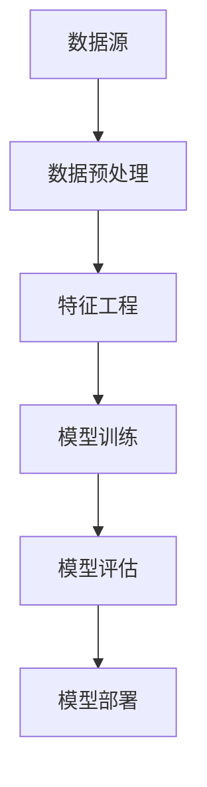

                 

# 企业级预测性分析平台：多维度业务预测

> 关键词：企业级预测性分析平台，预测性分析，机器学习，数据科学，业务预测，系统架构设计，预测模型部署

> 摘要：本文将详细介绍如何构建一个企业级预测性分析平台，涵盖从数据准备到模型部署的完整流程，深入分析多维度业务预测的核心概念、算法原理和系统架构设计。通过实际案例分析和项目实战，帮助读者掌握构建高效预测性分析平台的技巧与最佳实践。

---

# 第一部分: 企业级预测性分析平台概述

## 第1章: 预测性分析平台的背景与意义

### 1.1 预测性分析的基本概念
#### 1.1.1 预测性分析的定义
预测性分析是一种利用历史数据和机器学习算法，预测未来可能发生的事件或趋势的技术。其核心目标是通过数据分析和建模，为企业决策提供数据支持。

#### 1.1.2 预测性分析的核心目标
- **预测未来趋势**：基于历史数据，预测未来可能的结果。
- **优化决策**：通过数据驱动的预测，帮助企业做出更明智的决策。
- **风险控制**：提前识别潜在风险，降低损失。

#### 1.1.3 预测性分析在企业中的价值
- **提升效率**：通过自动化预测，减少人工干预，提高效率。
- **数据驱动决策**：利用数据科学方法，确保决策的科学性和准确性。
- **竞争优势**：通过精准预测，赢得市场先机。

### 1.2 企业级预测性分析的背景
#### 1.2.1 数据驱动决策的兴起
随着大数据技术的普及，企业开始重视数据的价值，希望通过数据驱动的方式优化业务流程。

#### 1.2.2 企业级预测性分析的应用场景
- **销售预测**：预测未来销售额，优化库存管理。
- **风险评估**：评估客户违约风险，控制信贷风险。
- **市场趋势预测**：预测市场趋势，制定营销策略。

#### 1.2.3 预测性分析对企业竞争力的影响
通过预测性分析，企业可以更快速地响应市场变化，优化资源配置，提升竞争力。

### 1.3 本书的核心目标
#### 1.3.1 构建企业级预测性分析平台的目标
本文旨在通过系统化的讲解，帮助读者掌握构建企业级预测性分析平台的完整流程，包括数据准备、模型选择、系统架构设计和部署等。

#### 1.3.2 本书的读者群体
- 数据科学家
- 机器学习工程师
- 企业IT架构师
- 业务分析师

#### 1.3.3 本书的结构安排
- **第1章**：介绍预测性分析的基本概念和背景。
- **第2章**：讲解预测性分析的核心概念和算法。
- **第3章**：详细分析预测性分析的算法原理。
- **第4章**：探讨企业级预测性分析平台的系统架构设计。
- **第5章**：通过实际案例，讲解如何构建预测性分析平台。
- **第6章**：总结最佳实践和注意事项。

---

# 第二部分: 预测性分析的核心概念与联系

## 第2章: 预测性分析的核心概念

### 2.1 预测性分析的核心原理
#### 2.1.1 数据预处理与特征工程
数据预处理是预测性分析的基础，包括数据清洗、特征提取和特征变换。

#### 2.1.2 模型训练与评估
通过机器学习算法训练模型，并使用评估指标（如准确率、召回率）对模型性能进行评估。

#### 2.1.3 模型部署与应用
将训练好的模型部署到生产环境，提供实时预测服务。

### 2.2 预测性分析的实体关系图

### 2.3 预测性分析的关键算法
#### 2.3.1 线性回归
线性回归是一种用于预测连续型变量的算法，常用公式为：
$$ y = \beta_0 + \beta_1x + \epsilon $$

#### 2.3.2 决策树
决策树是一种基于树状结构进行分类或回归的算法，适用于复杂场景。

#### 2.3.3 随机森林
随机森林是一种基于决策树的集成学习算法，通过组合多个决策树模型提高预测准确性。

#### 2.3.4 支持向量机
支持向量机（SVM）是一种用于分类和回归的算法，适用于高维数据。

#### 2.3.5 神经网络
神经网络是一种模拟人脑神经元的算法，适用于复杂非线性关系的预测。

---

## 第3章: 预测性分析的算法原理

### 3.1 线性回归算法
#### 3.1.1 线性回归的数学模型
$$ y = \beta_0 + \beta_1x + \epsilon $$

#### 3.1.2 线性回归的实现步骤
1. 数据准备
2. 模型训练
3. 模型评估
4. 模型部署

#### 3.1.3 线性回归的优缺点
- 优点：简单易懂，计算速度快。
- 缺点：只能处理线性关系，对异常值敏感。

### 3.2 决策树算法
#### 3.2.1 决策树的数学模型
决策树通过构建树状结构，将数据划分为不同的区域。

#### 3.2.2 决策树的实现步骤
1. 数据准备
2. 模型训练
3. 模型剪枝
4. 模型评估

#### 3.2.3 决策树的优缺点
- 优点：易于解释，适用于复杂数据。
- 缺点：容易过拟合，计算复杂度高。

---

# 第四部分: 企业级预测性分析平台的系统架构设计

## 第4章: 系统架构设计

### 4.1 整体架构设计

### 4.2 数据层设计
- 数据源：数据库、API接口等。
- 数据预处理：清洗、转换、归一化。

### 4.3 模型层设计
- 模型训练：选择合适的算法，训练模型。
- 模型评估：使用评估指标对模型性能进行评估。

### 4.4 接口层设计
- API接口：提供模型调用接口，供其他系统调用。
- 接口文档：详细说明接口的使用方法。

### 4.5 应用层设计
- 用户界面：提供友好的用户界面，方便用户操作。
- 报告生成：生成预测报告，供决策参考。

---

## 第5章: 项目实战——构建销售预测平台

### 5.1 项目背景
通过构建销售预测平台，帮助企业优化库存管理，提升销售预测的准确性。

### 5.2 数据准备
#### 5.2.1 数据来源
- 历史销售数据
- 市场数据
- 客户数据

#### 5.2.2 数据预处理
- 数据清洗：处理缺失值、异常值。
- 特征提取：提取有用的特征，如时间特征、客户特征等。

### 5.3 模型选择与训练
#### 5.3.1 模型选择
- 线性回归：适用于简单的线性关系。
- 随机森林：适用于复杂的非线性关系。

#### 5.3.2 模型训练
- 使用训练数据训练模型，调整模型参数，优化模型性能。

### 5.4 模型部署与应用
#### 5.4.1 模型部署
- 将训练好的模型部署到生产环境，提供实时预测服务。

#### 5.4.2 模型应用
- 提供销售预测报告，优化库存管理，制定营销策略。

---

## 第6章: 最佳实践与小结

### 6.1 最佳实践
- 数据质量是预测性分析的核心，确保数据的准确性和完整性。
- 模型选择要根据业务需求和数据特点，选择合适的算法。
- 模型部署要考虑系统的可扩展性和可维护性。

### 6.2 小结
通过本文的讲解，读者可以系统地掌握构建企业级预测性分析平台的完整流程，从数据准备到模型部署，再到实际应用，全面了解预测性分析的核心概念和实践技巧。

### 6.3 注意事项
- 数据隐私和安全问题需要高度重视。
- 模型的持续监控和优化是确保预测准确性的重要环节。

### 6.4 拓展阅读
- 《机器学习实战》
- 《数据科学导论》
- 《系统架构设计的艺术》

---

作者：AI天才研究院/AI Genius Institute & 禅与计算机程序设计艺术 /Zen And The Art of Computer Programming

