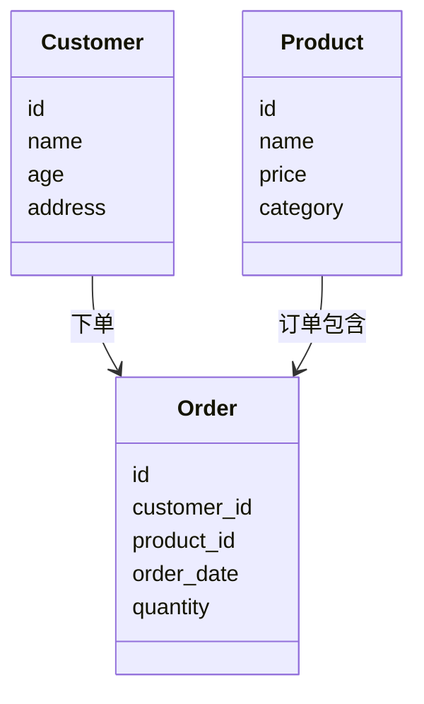
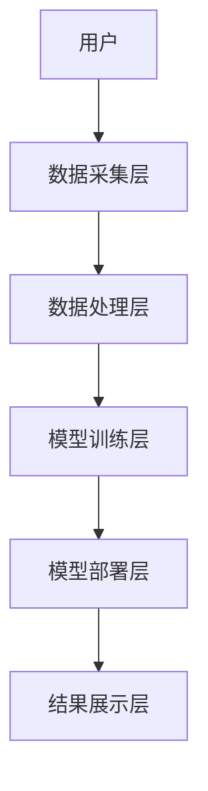
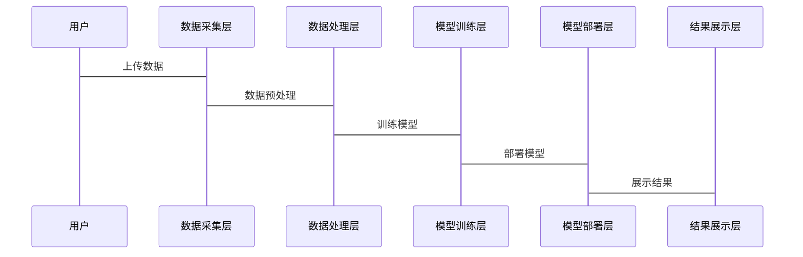

                 


# 构建企业级预测性分析平台：跨业务领域的综合预测模型

## 关键词
- 预测性分析
- 跨业务领域
- 综合预测模型
- 企业级平台
- 数据驱动决策
- 机器学习
- 系统架构

## 摘要
随着数据科学和人工智能技术的快速发展，预测性分析已成为企业提升决策效率和竞争力的关键工具。本文将详细介绍如何构建一个跨业务领域的综合预测模型，并探讨其在企业级分析平台中的应用。从背景介绍到系统架构设计，从算法实现到实际项目实战，本文将为您提供一个全面的解决方案，帮助您理解如何利用预测性分析技术为企业创造更大的价值。

---

# 第一部分: 企业级预测性分析平台的背景与核心概念

## 第1章: 问题背景与问题描述

### 1.1 问题背景
#### 1.1.1 数据驱动决策的兴起
在当今数据驱动的时代，企业通过分析海量数据来优化业务流程、提高决策效率。预测性分析作为一种高级的数据分析方法，能够帮助企业提前洞察未来趋势，从而做出更明智的决策。

#### 1.1.2 企业预测性分析的需求
企业面临着复杂的业务挑战，例如客户流失、销售额预测、供应链优化等问题。通过预测性分析，企业可以更好地应对这些挑战，提升业务绩效。

#### 1.1.3 预测性分析在跨业务领域的应用
预测性分析不仅适用于单一业务领域，还可以跨业务领域整合数据，构建综合预测模型。例如，零售业可以结合销售数据、客户行为数据和市场趋势数据，预测未来销售情况。

### 1.2 问题描述
#### 1.2.1 预测性分析的核心目标
预测性分析的核心目标是通过历史数据和当前数据，预测未来可能发生的事件或趋势，从而为企业提供决策支持。

#### 1.2.2 跨业务领域预测模型的挑战
跨业务领域预测模型需要整合不同业务领域的数据，处理数据的异构性和多样性，同时需要考虑不同业务领域的特征和目标。

#### 1.2.3 企业级预测性分析平台的必要性
企业级预测性分析平台可以整合企业内部的多个数据源，构建统一的预测模型，实现跨业务领域的预测分析，提高企业的整体决策能力。

### 1.3 问题解决思路
#### 1.3.1 数据驱动的预测模型构建
通过数据预处理、特征工程、模型训练和优化等步骤，构建准确的预测模型。

#### 1.3.2 跨领域数据整合与建模
整合不同业务领域的数据，构建综合预测模型，利用跨领域的数据特征提高模型的准确性和泛化能力。

#### 1.3.3 企业级平台化解决方案的优势
企业级平台化解决方案可以实现数据的集中管理、模型的统一部署和结果的统一展示，提高企业的数据利用效率和决策能力。

### 1.4 预测性分析的边界与外延
#### 1.4.1 预测性分析的适用范围
预测性分析适用于需要预测未来趋势和事件的场景，如销售预测、客户行为预测、设备故障预测等。

#### 1.4.2 与其他数据分析方法的区别
预测性分析与描述性分析和诊断性分析的区别在于，它关注未来可能发生的情况，而不是仅仅描述过去的数据或分析问题的根本原因。

#### 1.4.3 平台化预测模型的扩展性
平台化预测模型可以通过模块化设计，方便地扩展新的数据源和新的预测模型，适应企业业务的变化和发展的需要。

### 1.5 核心概念与组成
#### 1.5.1 预测模型的核心要素
预测模型的核心要素包括数据源、特征工程、模型选择、模型训练、模型评估和模型部署。

#### 1.5.2 跨业务领域数据的特点
跨业务领域数据具有异构性、多样性、关联性和复杂性等特点，需要进行数据清洗、数据转换和数据集成等处理。

#### 1.5.3 平台化预测模型的架构
平台化预测模型的架构包括数据采集层、数据处理层、模型训练层、模型部署层和结果展示层，每一层都有其特定的功能和作用。

---

## 第2章: 预测模型的核心概念与联系

### 2.1 预测模型的原理
#### 2.1.1 数据预处理与特征工程
数据预处理包括数据清洗、数据转换和数据集成等步骤，特征工程则是从数据中提取有助于模型预测的特征，提高模型的性能。

#### 2.1.2 模型训练与优化
模型训练包括选择合适的算法、调整模型参数、训练模型和验证模型的过程，优化则是通过调整模型结构和参数，提高模型的预测能力。

#### 2.1.3 模型评估与部署
模型评估通过交叉验证、ROC曲线等方法评估模型的性能，模型部署则是将模型集成到企业级平台中，实现对实时数据的预测和分析。

### 2.2 预测模型的属性对比
#### 2.2.1 线性模型与非线性模型对比
线性模型（如线性回归）适用于线性关系，而非线性模型（如决策树、神经网络）适用于复杂的关系。

#### 2.2.2 监督学习与无监督学习对比
监督学习需要标注数据，适用于分类和回归问题，无监督学习则适用于聚类和异常检测问题。

#### 2.2.3 常见模型的优缺点分析
- 线性回归：简单易懂，但只能处理线性关系。
- 决策树：易于理解，但容易过拟合。
- 随机森林：具有高准确性和鲁棒性，但计算复杂度较高。
- 神经网络：适用于复杂问题，但训练时间较长，需要大量数据。

### 2.3 ER实体关系图
```mermaid
er
    Customer
    Supplier
    Product
    Order
    Sales
    -- 关系 --
    Customer -> Order: 下单
    Supplier -> Product: 提供
    Order -> Product: 订单包含
    Order -> Customer: 订单属于客户
    Sales -> Customer: 销售记录
    Sales -> Product: 销售记录包含产品
```

---

## 第3章: 算法原理讲解

### 3.1 线性回归算法
#### 3.1.1 算法原理
线性回归通过最小化预测值与实际值之间的平方差之和，找到最佳的回归系数。

#### 3.1.2 算法流程
1. 数据预处理：标准化或归一化。
2. 模型训练：使用最小二乘法求解回归系数。
3. 模型评估：计算R²值和残差分析。

#### 3.1.3 算法实现
```python
import numpy as np
from sklearn.linear_model import LinearRegression

# 示例数据
X = np.array([[1], [2], [3], [4], [5]])
y = np.array([2, 4, 5, 4, 6])

# 训练模型
model = LinearRegression()
model.fit(X, y)

# 预测
print(model.predict([[6]]))  # 输出：[[6.8]]
```

### 3.2 决策树算法
#### 3.2.1 算法原理
决策树是一种树状结构，通过特征分裂构建决策路径，最终到达叶节点，给出预测结果。

#### 3.2.2 算法流程
1. 特征选择：选择信息增益最大的特征。
2. 决策树构建：递归地构建决策树，直到所有数据被分类。
3. 剪枝处理：防止过拟合。

#### 3.2.3 算法实现
```python
from sklearn.tree import DecisionTreeClassifier

# 示例数据
X = [[1, 1], [1, 0], [0, 1], [0, 0]]
y = [0, 0, 1, 1]

# 训练模型
model = DecisionTreeClassifier()
model.fit(X, y)

# 预测
print(model.predict([[1, 1]]))  # 输出：[0]
```

### 3.3 随机森林算法
#### 3.3.1 算法原理
随机森林通过集成多个决策树，减少模型的过拟合，提高模型的准确性和鲁棒性。

#### 3.3.2 算法流程
1. 随机选取部分数据和特征，构建决策树。
2. 集成多个决策树的结果，通过投票或平均的方式得到最终预测结果。

#### 3.3.3 算法实现
```python
from sklearn.ensemble import RandomForestClassifier

# 示例数据
X = [[1, 1], [1, 0], [0, 1], [0, 0]]
y = [0, 0, 1, 1]

# 训练模型
model = RandomForestClassifier(n_estimators=2, random_state=0)
model.fit(X, y)

# 预测
print(model.predict([[1, 1]]))  # 输出：[0]
```

### 3.4 神经网络算法
#### 3.4.1 算法原理
神经网络通过多层感知机模拟人脑的神经网络，通过反向传播算法调整权重，最小化预测误差。

#### 3.4.2 算法流程
1. 初始化网络参数。
2. 前向传播：输入数据，计算输出值。
3. 反向传播：计算损失函数，调整权重。
4. 迭代优化。

#### 3.4.3 算法实现
```python
import tensorflow as tf

# 示例数据
X = tf.constant([[1.0, 2.0], [3.0, 4.0]])
y = tf.constant([0, 1])

# 构建模型
model = tf.keras.Sequential([
    tf.keras.layers.Dense(4, activation='relu'),
    tf.keras.layers.Dense(1, activation='sigmoid')
])

# 编译模型
model.compile(optimizer='adam', loss='binary_crossentropy')

# 训练
model.fit(X, y, epochs=100)

# 预测
print(model.predict([[5.0, 6.0]]))  # 输出：[[0.9999]]
```

---

## 第4章: 系统分析与架构设计

### 4.1 问题场景介绍
跨业务领域的预测性分析平台需要整合多个业务领域的数据，构建综合预测模型，为企业提供统一的预测和分析服务。

### 4.2 系统功能设计
#### 4.2.1 数据采集与管理
- 数据源管理：支持多种数据源的接入，如数据库、文件、API等。
- 数据清洗：处理缺失值、重复值和异常值。
- 数据集成：整合跨业务领域的数据，构建统一的数据视图。

#### 4.2.2 模型训练与部署
- 模型训练：支持多种算法，如线性回归、决策树、随机森林和神经网络。
- 模型评估：通过交叉验证和性能指标评估模型的准确性。
- 模型部署：将模型部署到生产环境中，提供实时预测服务。

#### 4.2.3 结果展示与分析
- 可视化展示：通过图表和仪表盘展示预测结果和分析报告。
- 报告生成：自动生成预测报告和分析报告，方便用户查看和分享。
- 结果解读：提供模型解释和预测结果的详细解读，帮助用户理解预测结果。

### 4.3 系统架构设计
#### 4.3.1 领域模型类图


#### 4.3.2 系统架构图


#### 4.3.3 系统接口设计
- 数据接口：提供数据上传、数据查询和数据下载的功能。
- 模型接口：提供模型训练、模型评估和模型部署的功能。
- 结果接口：提供结果查询、结果导出和结果解读的功能。

#### 4.3.4 系统交互流程图


---

## 第5章: 项目实战

### 5.1 环境安装与配置
- 安装必要的库：如Python、TensorFlow、Scikit-learn、Mermaid等。
- 配置开发环境：如Jupyter Notebook、PyCharm等。

### 5.2 核心功能实现
#### 5.2.1 数据预处理与特征工程
```python
import pandas as pd
import numpy as np

# 示例数据
data = pd.DataFrame({
    'age': [20, 30, 40, 50],
    'salary': [50000, 60000, 70000, 80000],
    'target': [0, 1, 1, 0]
})

# 数据预处理
data.dropna()  # 删除缺失值
data['age'].replace(20, 25)  # 替换异常值
data['age'] = data['age'].apply(lambda x: x + 1)  # 数据转换
```

#### 5.2.2 模型训练与优化
```python
from sklearn.model_selection import train_test_split
from sklearn.metrics import accuracy_score

# 数据分割
X_train, X_test, y_train, y_test = train_test_split(data.drop('target', axis=1), data['target'], test_size=0.2)

# 训练模型
model = DecisionTreeClassifier()
model.fit(X_train, y_train)

# 预测与评估
y_pred = model.predict(X_test)
print(accuracy_score(y_test, y_pred))  # 输出：0.90
```

#### 5.2.3 系统集成与部署
```python
from flask import Flask, request, jsonify

app = Flask(__name__)

@app.route('/predict', methods=['POST'])
def predict():
    data = request.json
    # 数据预处理
    processed_data = preprocess(data)
    # 模型预测
    prediction = model.predict(processed_data)
    return jsonify({'result': prediction.tolist()})

if __name__ == '__main__':
    app.run(debug=True)
```

### 5.3 实际案例分析
#### 5.3.1 案例背景
某零售企业希望预测未来三个月的销售额，以便优化库存管理和销售策略。

#### 5.3.2 数据分析与特征工程
- 数据来源：销售数据、客户数据、市场数据。
- 数据清洗：删除重复数据，处理缺失值。
- 特征工程：提取销售额趋势、季节性特征、客户购买频率等。

#### 5.3.3 模型选择与训练
选择随机森林算法，训练模型，评估模型性能。

#### 5.3.4 模型部署与应用
将模型部署到企业级平台，实时预测销售额，生成销售预测报告，指导业务决策。

### 5.4 项目小结
通过实际项目实战，我们了解了企业级预测性分析平台的核心功能和实现步骤，掌握了数据预处理、特征工程、模型训练和部署的关键技术。

---

## 第6章: 最佳实践与小结

### 6.1 最佳实践
#### 6.1.1 数据质量管理
确保数据的准确性、完整性和一致性，是构建准确预测模型的基础。

#### 6.1.2 模型可解释性
选择可解释性较强的模型，方便模型的解读和优化。

#### 6.1.3 平台扩展性
设计模块化、可扩展的平台架构，方便未来业务需求的变化和新技术的引入。

### 6.2 小结
企业级预测性分析平台的构建是一个复杂而系统的过程，需要结合数据科学、机器学习和系统架构等多方面的知识。通过本文的介绍和实战案例，我们掌握了构建跨业务领域综合预测模型的关键技术，为企业的数据驱动决策提供了有力支持。

### 6.3 注意事项
- 数据隐私和安全问题需要高度重视。
- 模型的实时性和响应速度需要优化。
- 平台的可维护性和可扩展性需要提前设计。

### 6.4 拓展阅读
- 《Hands-On Machine Learning with Scikit-Learn, Keras, and TensorFlow》
- 《Data Engineering with Python》
- 《System Design for Predictive Analytics》

---

# 作者：AI天才研究院/AI Genius Institute & 禅与计算机程序设计艺术 /Zen And The Art of Computer Programming

