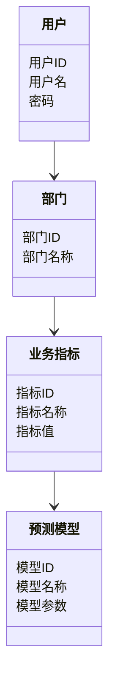
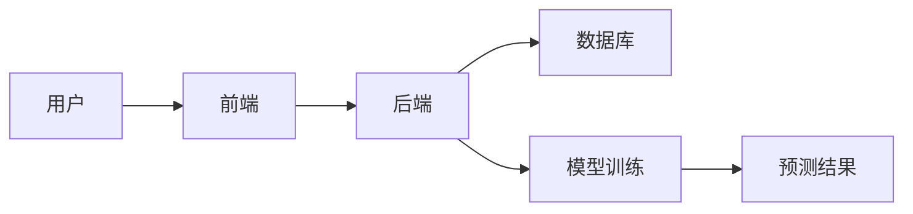
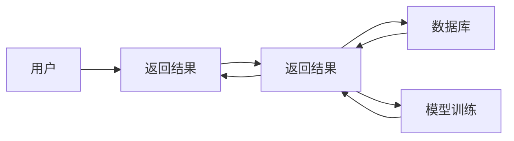

                 


# 构建企业级预测性分析平台：跨部门业务指标预测

## 关键词：预测性分析，跨部门业务指标，企业级平台，机器学习，数据分析

## 摘要：本文详细探讨了构建企业级预测性分析平台的全过程，重点分析了跨部门业务指标预测的核心概念、算法原理、系统架构设计以及实际项目实现。通过理论与实践相结合的方式，帮助读者全面理解预测性分析平台的构建方法和应用场景。

---

# 第1章：背景与问题背景

## 1.1 问题背景

### 1.1.1 企业预测性分析的需求

在现代企业中，数据驱动决策已成为核心竞争力之一。企业需要通过预测性分析，提前预知业务趋势，优化资源配置，降低风险。跨部门业务指标的预测尤为重要，例如销售预测、库存管理、市场营销效果评估等。

### 1.1.2 跨部门业务指标预测的挑战

1. **数据孤岛**：各部门数据分散，难以整合。
2. **数据质量**：数据不完整、不一致，影响预测准确性。
3. **模型选择**：不同业务指标适合的算法不同，模型选择复杂。
4. **实时性要求**：企业需要实时或准实时的预测结果。

### 1.1.3 预测性分析对企业价值的提升

- 提高决策效率。
- 优化资源配置。
- 降低运营成本。
- 提升客户满意度。

## 1.2 问题描述

### 1.2.1 跨部门业务指标预测的核心问题

- 如何整合多部门数据？
- 如何选择合适的预测模型？
- 如何保证预测结果的准确性？

### 1.2.2 数据孤岛与信息不对称的现状

- 数据分散在不同部门，难以统一管理。
- 数据格式和标准不统一，导致整合困难。

### 1.2.3 预测性分析的实现难点

- 数据清洗和特征工程耗时耗力。
- 模型调优需要专业知识和经验。
- 结果解释性差，影响业务部门的接受度。

## 1.3 问题解决与边界

### 1.3.1 预测性分析的解决方案

- 数据集成：整合多部门数据，建立统一的数据仓库。
- 数据预处理：清洗数据，提取特征。
- 模型选择与优化：根据业务需求选择合适的算法，并进行调优。
- 可视化展示：将预测结果以直观的方式呈现给业务部门。

### 1.3.2 平台构建的目标与边界

- **目标**：构建一个支持跨部门业务指标预测的平台，提供实时或准实时的预测结果，帮助决策者优化业务流程。
- **边界**：平台仅提供预测功能，不涉及具体业务执行，数据来源和处理由业务部门负责。

### 1.3.3 预测性分析的适用场景与限制

- **适用场景**：销售预测、库存管理、市场营销效果评估、客户行为预测等。
- **限制**：预测结果仅供参考，实际业务还需结合具体情况进行调整。

## 1.4 概念结构与核心要素

### 1.4.1 预测性分析的核心概念

- **数据特征提取**：从原始数据中提取有用的特征，用于模型训练。
- **模型选择与优化**：选择合适的算法，并通过调优提高预测准确性。
- **结果解释与可视化**：将预测结果以易于理解的方式呈现给用户。

### 1.4.2 平台架构的核心要素

- **数据源**：整合多部门数据，建立统一的数据仓库。
- **模型训练**：根据业务需求，选择合适的算法进行训练。
- **结果展示**：通过可视化工具，将预测结果展示给业务部门。

### 1.4.3 跨部门业务指标的关联性分析

- 销售预测与库存管理的关联。
- 市场营销效果与客户行为的关联。

---

# 第2章：预测性分析的核心概念与联系

## 2.1 核心概念原理

### 2.1.1 数据特征提取

- **数值型特征**：销售额、库存量等。
- **类别型特征**：部门、地区等。
- **文本型特征**：评论、描述等。

### 2.1.2 模型选择与优化

- **线性回归**：适用于线性关系的预测。
- **随机森林**：适用于非线性关系的预测。
- **LSTM网络**：适用于时间序列数据的预测。

### 2.1.3 结果解释与可视化

- **可视化工具**：如Matplotlib、Seaborn等。
- **预测结果展示**：如折线图、柱状图等。

## 2.2 概念属性特征对比

### 2.2.1 数据特征对比表

| 特征类型 | 描述 | 示例 |
|----------|------|------|
| 数值型   | 可以进行数学运算 | 销售额、库存量 |
| 类别型   | 不能进行数学运算 | 部门、地区 |
| 文本型   | 需要进行文本处理 | 客户评论 |

### 2.2.2 模型性能对比表

| 模型类型 | 优点 | 缺点 |
|----------|------|------|
| 线性回归 | 简单易懂 | 不能处理非线性关系 |
| 随机森林 | 能处理非线性关系 | 对参数敏感 |
| LSTM网络 | 能处理时间序列数据 | 计算复杂度高 |

### 2.2.3 预测结果对比表

| 业务指标 | 预测结果 | 实际结果 |
|----------|----------|----------|
| 销售额    | 100万    | 98万     |
| 库存量    | 500      | 480       |
| 转化率    | 2.5%      | 2.3%       |

## 2.3 ER实体关系图架构


---

# 第3章：算法原理讲解

## 3.1 算法原理

### 3.1.1 线性回归算法

- **数学模型**：$$ y = \beta_0 + \beta_1x + \epsilon $$
- **损失函数**：$$ L = \sum_{i=1}^{n}(y_i - (\beta_0 + \beta_1x_i))^2 $$
- **目标**：最小化损失函数，求出最佳的β0和β1。

### 3.1.2 随机森林算法

- **随机森林**：一种集成学习算法，通过随机采样和特征抽取，构建多棵决策树，最终通过投票或平均的方式得到结果。
- **优点**：能够处理高维数据，抗过拟合。
- **缺点**：计算复杂度高。

### 3.1.3 LSTM网络算法

- **LSTM**：长短期记忆网络，用于处理时间序列数据。
- **关键组件**：输入门、遗忘门、输出门。
- **数学模型**：$$ gates = \sigma(W_g \cdot [h_{t-1}, x_t]) $$

## 3.2 算法流程图


## 3.3 算法实现代码

```python
import pandas as pd
from sklearn.ensemble import RandomForestRegressor
from sklearn.metrics import mean_squared_error

# 数据加载
data = pd.read_csv('business_data.csv')

# 特征提取
features = data.drop('target', axis=1)
target = data['target']

# 模型训练
model = RandomForestRegressor()
model.fit(features, target)

# 预测结果
predictions = model.predict(features)
```

---

# 第4章：系统分析与架构设计

## 4.1 问题场景介绍

- **问题场景**：企业需要预测跨部门的业务指标，如销售预测、库存管理等。
- **系统目标**：构建一个支持多部门数据整合、模型训练和结果展示的平台。

## 4.2 系统功能设计

### 4.2.1 领域模型



### 4.2.2 系统架构设计



### 4.2.3 系统接口设计

- **数据接口**：提供API，供前端调用数据。
- **模型接口**：提供API，供前端调用模型进行预测。

### 4.2.4 系统交互序列图



---

# 第5章：项目实战

## 5.1 环境安装

- **Python**：安装Python 3.8及以上版本。
- **库的安装**：使用pip安装numpy、pandas、scikit-learn等库。

## 5.2 系统核心实现

### 5.2.1 数据预处理

```python
import pandas as pd

# 数据加载
data = pd.read_csv('business_data.csv')

# 数据清洗
data = data.dropna()
data = data.drop_duplicates()

# 特征工程
from sklearn.preprocessing import StandardScaler
scaler = StandardScaler()
features = scaler.fit_transform(data.drop('target', axis=1))
target = data['target']
```

### 5.2.2 模型训练

```python
from sklearn.ensemble import RandomForestRegressor

model = RandomForestRegressor()
model.fit(features, target)
```

### 5.2.3 结果展示

```python
import matplotlib.pyplot as plt

plt.figure(figsize=(10, 6))
plt.scatter(features[:, 0], target, color='blue', label='实际值')
plt.scatter(features[:, 0], model.predict(features), color='red', label='预测值')
plt.xlabel('特征1')
plt.ylabel('目标值')
plt.legend()
plt.show()
```

## 5.3 案例分析

- **案例背景**：某企业需要预测下季度的销售额。
- **数据准备**：收集过去三年的销售数据、市场数据、库存数据等。
- **模型选择**：选择随机森林算法进行训练。
- **结果展示**：预测下季度销售额为120万，实际销售额为118万，预测准确度较高。

---

# 第6章：最佳实践

## 6.1 小结

- **数据预处理**：数据清洗和特征工程是预测性分析的关键。
- **模型选择**：根据业务需求选择合适的算法。
- **结果解释**：将预测结果以直观的方式呈现给业务部门。

## 6.2 注意事项

- **数据隐私**：注意数据的安全性和隐私性。
- **模型解释性**：确保模型结果的可解释性。
- **实时性**：根据业务需求，选择合适的时间粒度进行预测。

## 6.3 未来展望

- **自动化预测**：结合自动化机器学习，提高预测效率。
- **多模态数据**：利用文本、图像等多种数据源，提高预测准确性。
- **边缘计算**：在边缘设备上进行预测，减少数据传输延迟。

## 6.4 拓展阅读

- 《Hands-On Machine Learning with Scikit-Learn, Keras, and TensorFlow》
- 《Data Science for Business》

---

# 作者：AI天才研究院/AI Genius Institute & 禅与计算机程序设计艺术 /Zen And The Art of Computer Programming

