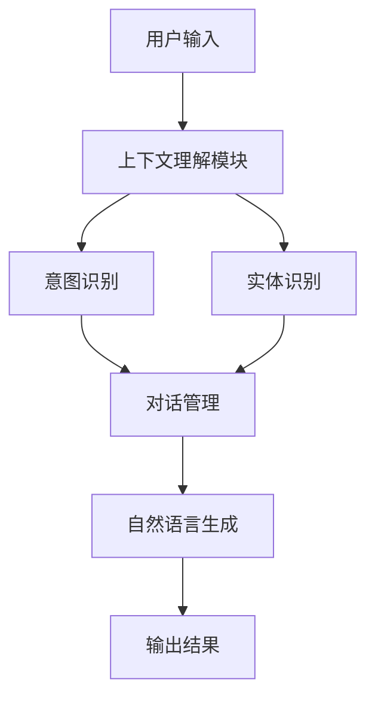
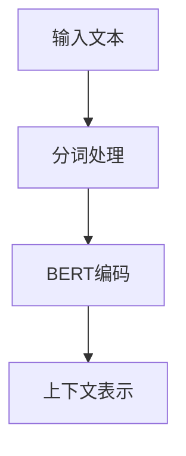
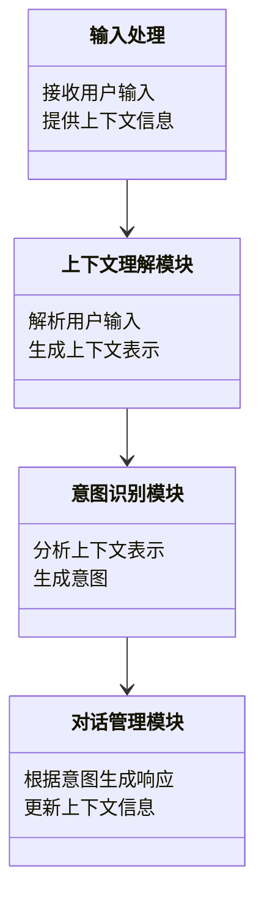

                 


# 构建具有上下文理解能力的AI Agent

> 关键词：AI Agent, 上下文理解, 深度学习, 自然语言处理, 对话系统, 系统架构设计, 项目实战

> 摘要：本文将详细探讨如何构建一个具有上下文理解能力的AI Agent。通过分析上下文理解的核心概念、算法原理、系统架构设计以及项目实战，我们将一步步构建一个能够理解上下文的AI Agent。本文将从背景介绍开始，逐步深入，最终实现一个具备上下文理解能力的AI Agent。

---

## 第一部分: 背景介绍

### 第1章: 上下文理解与AI Agent概述

#### 1.1 问题背景与问题描述

当前，随着人工智能技术的快速发展，AI Agent（智能体）在各个领域的应用越来越广泛。然而，现有的AI Agent在处理复杂场景时，往往缺乏对上下文的理解能力，导致其在实际应用中表现不够理想。例如，在对话系统中，AI Agent无法有效处理多轮对话中的上下文信息，导致对话体验较差。

#### 1.2 上下文理解的核心概念

上下文理解是指AI Agent能够理解当前对话或任务的背景信息，包括用户的历史输入、意图、情感等因素。这种理解能力使得AI Agent能够更好地适应复杂场景，提供更智能的服务。

#### 1.3 AI Agent的基本概念与分类

AI Agent是一种能够感知环境并采取行动以实现目标的智能实体。根据功能和应用场景的不同，AI Agent可以分为多种类型，如基于规则的AI Agent、基于机器学习的AI Agent等。

---

## 第二部分: 核心概念与联系

### 第2章: 上下文理解的核心概念与联系

#### 2.1 核心概念原理

上下文理解的基本原理是通过自然语言处理技术，提取用户输入中的关键信息，并结合历史对话记录，生成有意义的上下文表示。

#### 2.2 核心概念属性特征对比

| 特征         | 上下文理解                | 传统NLP             |
|--------------|--------------------------|---------------------|
| 输入          | 多轮对话历史             | 单次文本输入         |
| 输出          | 上下文表示                | 文本处理结果         |
| 技术          | 基于深度学习的模型        | 基于规则或统计模型    |

#### 2.3 ER实体关系图架构



---

## 第三部分: 算法原理

### 第3章: 上下文理解的算法原理

#### 3.1 算法原理概述

上下文理解的核心算法包括文本表示学习、序列建模等技术。常用的模型包括Transformer、BERT等。

#### 3.2 算法实现细节

以下是基于BERT模型的上下文理解实现流程：

1. 对用户输入进行分词处理。
2. 将分词后的文本输入BERT模型进行编码。
3. 提取模型的隐藏层表示，生成上下文表示。

#### 3.3 算法流程图



---

## 第四部分: 系统架构设计

### 第4章: 系统架构设计

#### 4.1 系统功能设计

系统功能包括输入处理、上下文理解、意图识别、对话管理等模块。

#### 4.2 系统架构设计图



---

## 第五部分: 项目实战

### 第5章: 项目实战

#### 5.1 环境安装

安装必要的Python库：

```bash
pip install transformers
pip install torch
pip install numpy
```

#### 5.2 核心实现代码

```python
from transformers import BertTokenizer, BertModel
import torch

tokenizer = BertTokenizer.from_pretrained('bert-base-uncased')
model = BertModel.from_pretrained('bert-base-uncased')

def contextual_understanding(text):
    inputs = tokenizer(text, return_tensors='pt')
    outputs = model(**inputs)
    return outputs.last_hidden_state
```

#### 5.3 案例分析

假设用户输入为“我今天想吃 pizza”，系统将生成上下文表示，并识别用户的意图是“订餐”。

---

## 第六部分: 总结与展望

### 第6章: 总结与展望

#### 6.1 总结

本文详细介绍了如何构建一个具有上下文理解能力的AI Agent，从背景介绍到系统架构设计，再到项目实战，全面覆盖了构建过程中的关键点。

#### 6.2 展望

未来，随着深度学习技术的不断发展，上下文理解能力的AI Agent将更加智能化，能够处理更复杂多样的场景。

---

## 作者信息

作者：AI天才研究院/AI Genius Institute & 禅与计算机程序设计艺术 /Zen And The Art of Computer Programming

---

以上是《构建具有上下文理解能力的AI Agent》的技术博客文章的完整内容，希望对您有所帮助！

