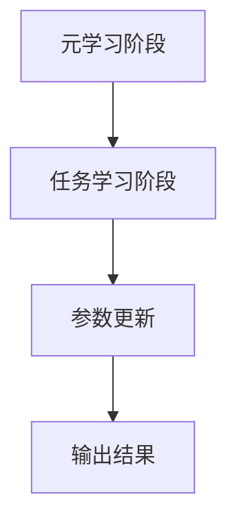
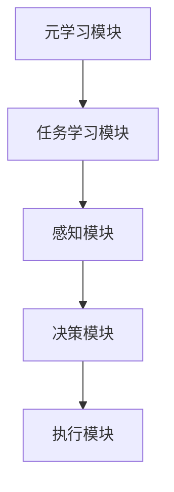

                 


# 构建具有元学习能力的AI Agent

> 关键词：元学习，AI Agent，机器学习，算法原理，系统架构，项目实战

> 摘要：  
本文将详细探讨如何构建一个具有元学习能力的AI Agent。通过分析元学习的核心概念、算法原理、系统架构以及实际项目实现，我们将一步步揭示如何让AI Agent具备自主学习和适应复杂环境的能力。从基础理论到实际应用，本文将为读者提供一个全面的视角。

---

## 第一部分: 元学习与AI Agent的背景与概念

### 第1章: 元学习与AI Agent概述

#### 1.1 元学习的背景与问题背景
人工智能（AI）技术的快速发展使得AI Agent在各个领域的应用越来越广泛。然而，传统的机器学习方法在面对多样化的任务和动态变化的环境中往往显得力不从心。例如，在自然语言处理中，预训练模型虽然在特定任务上表现优异，但需要针对每个新任务进行大量的数据训练，这不仅耗时，而且需要大量的计算资源。

**问题背景：**  
元学习的目标是通过学习如何学习，使得AI Agent能够快速适应新的任务和环境。与传统的监督学习不同，元学习关注的是如何在有限的数据和时间内，快速掌握新任务的规律。这种能力在现实场景中尤为重要，例如在医疗领域，AI Agent需要快速适应不同患者的病情，或者在自动驾驶中，快速应对各种突发情况。

#### 1.2 元学习的核心概念与问题描述
元学习的核心在于“学习如何学习”。它通过优化一个更高层次的策略，使得AI Agent能够在新任务中快速调整参数，而无需重新训练整个模型。具体来说，元学习算法通常包含两个阶段：元学习阶段和任务学习阶段。

**问题描述：**  
在元学习阶段，AI Agent学习如何在多个任务之间切换，优化其参数更新策略。在任务学习阶段，当遇到新任务时，AI Agent能够快速调整其参数，以适应当前任务的需求。这种双层优化的结构使得元学习在解决复杂问题时表现出色。

#### 1.3 元学习与AI Agent的核心要素
AI Agent的核心组成包括感知、决策和执行模块。元学习通过优化感知和决策模块的参数更新策略，使得AI Agent能够更快地适应新任务。具体来说，元学习算法需要解决以下关键问题：

- **快速适应性：** 如何在有限的数据和时间内，快速掌握新任务的规律。
- **通用性：** 如何在多个任务之间共享学习成果，减少重复学习的开销。
- **可解释性：** 如何让AI Agent的学习过程更加透明，便于人类理解和干预。

---

## 第二部分: 元学习的核心概念与联系

### 第2章: 元学习的原理与机制

#### 2.1 元学习的原理
元学习的原理可以简单理解为“学习如何学习”。其核心在于优化一个更高层次的策略，使得AI Agent能够在新任务中快速调整参数。以下是一个简化的流程：

1. **元学习阶段：** 优化参数更新策略，使得在遇到新任务时能够快速调整。
2. **任务学习阶段：** 利用元学习得到的策略，快速优化当前任务的参数。

**数学模型：**  
元学习的目标函数通常可以表示为：
$$
\min_{\theta} \mathbb{E}_{\tau \sim P_{\text{task}}} \left[ \mathcal{L}_{\text{meta}}(\theta, \tau) \right]
$$
其中，$\theta$ 是元学习阶段的参数，$\mathcal{L}_{\text{meta}}$ 是元损失函数，用于衡量在多个任务上的表现。

#### 2.2 元学习与AI Agent的关系
元学习通过优化参数更新策略，显著提升了AI Agent的适应能力。例如，在自然语言处理中，元学习可以让AI Agent快速掌握多种语言的翻译任务，而不需要为每种语言重新训练模型。

**对比分析：**  
与传统机器学习相比，元学习的核心优势在于其快速适应能力和通用性。以下是一个对比表格：

| 特性         | 传统机器学习 | 元学习       |
|--------------|--------------|--------------|
| 数据需求     | 高           | 较低          |
| 适应性       | 低           | 高           |
| 任务切换     | 需要重新训练  | 可快速调整    |

#### 2.3 元学习的核心概念对比表
以下是元学习与传统学习的对比：

| 概念         | 元学习       | 传统学习     |
|--------------|--------------|--------------|
| 学习目标     | 学习如何学习 | 完成特定任务 |
| 参数优化     | 双层优化     | 单层优化     |
| 适应性       | 高           | 低           |

---

## 第三部分: 元学习的算法原理与数学模型

### 第3章: 元学习算法的原理与流程

#### 3.1 元学习算法的原理
元学习算法的核心在于双层优化。以下是一个简化的流程图：



#### 3.2 元学习算法的数学模型
元学习的目标函数通常包含两部分：元损失和任务损失。以下是一个简化的数学公式：

$$
\mathcal{L}_{\text{meta}}(\theta) = \mathbb{E}_{\tau \sim P_{\text{task}}} \left[ \mathcal{L}_{\text{task}}(\phi, \tau) \right]
$$

其中，$\phi$ 是任务学习阶段的参数，$\mathcal{L}_{\text{task}}$ 是任务损失函数。

#### 3.3 元学习算法的Python实现
以下是一个简单的元学习算法实现示例：

```python
import torch

def meta_learning_update(theta, phi, task_loss_fn):
    # 元学习阶段优化theta
    optimizer_meta = torch.optim.Adam([theta], lr=1e-3)
    optimizer_meta.zero_grad()
    # 任务学习阶段优化phi
    optimizer_task = torch.optim.Adam([phi], lr=1e-2)
    optimizer_task.zero_grad()
    
    # 计算任务损失
    loss_task = task_loss_fn(phi)
    # 反向传播并更新phi
    loss_task.backward()
    optimizer_task.step()
    # 计算元损失
    loss_meta = task_loss_fn(theta)
    loss_meta.backward()
    optimizer_meta.step()
    
    return theta, phi
```

---

## 第四部分: 元学习的系统分析与架构设计

### 第4章: 元学习系统的分析与设计

#### 4.1 系统应用场景
元学习系统可以应用于多个领域，例如：

- **自然语言处理：** 多语言翻译、文本生成。
- **计算机视觉：** 多任务图像分割、目标检测。
- **机器人控制：** 快速适应新环境。

#### 4.2 系统架构设计
以下是一个简化的系统架构图：



---

## 第五部分: 项目实战

### 第5章: 项目实现与分析

#### 5.1 环境安装与配置
以下是一个简单的环境安装示例：

```bash
pip install torch matplotlib numpy
```

#### 5.2 核心代码实现
以下是一个元学习算法的实现示例：

```python
import torch
import torch.nn as nn

class MetaLearningModel(nn.Module):
    def __init__(self, input_size, meta_dim):
        super(MetaLearningModel, self).__init__()
        self.meta_layer = nn.Linear(input_size, meta_dim)
        self.task_layer = nn.Linear(meta_dim, input_size)
    
    def forward(self, x, meta_params=None):
        # 元学习阶段的参数更新
        if meta_params is not None:
            x = torch.mm(x, meta_params)
        # 任务学习阶段的前向传播
        x = torch.relu(self.meta_layer(x))
        x = torch.mm(x, self.task_layer.weight)
        return x

model = MetaLearningModel(input_size=10, meta_dim=5)
```

---

## 第六部分: 最佳实践与总结

### 第6章: 最佳实践与未来方向

#### 6.1 小结
元学习通过双层优化的机制，显著提升了AI Agent的适应能力和通用性。本文详细探讨了元学习的核心概念、算法原理、系统架构以及项目实现，为读者提供了一个全面的视角。

#### 6.2 注意事项
在实际应用中，需要注意以下几点：

1. **数据质量：** 元学习对数据的质量要求较高，需要确保数据的多样性和代表性。
2. **计算资源：** 元学习通常需要大量的计算资源，尤其是在优化双层参数时。
3. **模型复杂度：** 需要注意模型的复杂度，避免过拟合。

#### 6.3 拓展阅读
- 建议阅读相关论文，例如《Meta-Learning for Universal Sentence Encoders》和《Learning to learn by gradient descent by gradient descent》。

---

## 作者

作者：AI天才研究院（AI Genius Institute） & 禅与计算机程序设计艺术（Zen And The Art of Computer Programming）

---

通过本文的详细讲解，我们希望能够帮助读者更好地理解元学习的核心思想，并将其应用于实际的AI Agent开发中。

