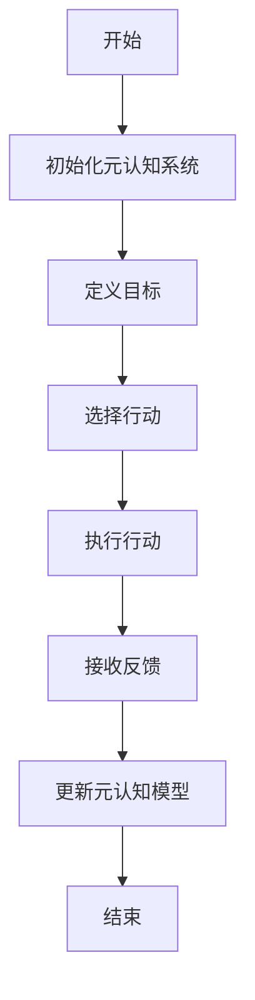
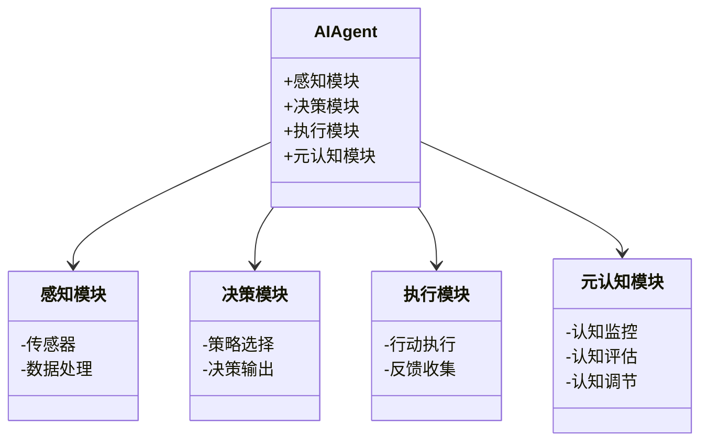
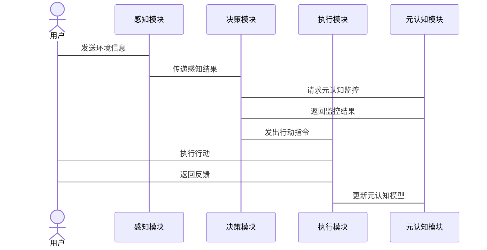

                 


# 《构建具有元认知能力的AI Agent》

## 关键词：元认知能力、AI Agent、强化学习、系统架构设计、数学模型

## 摘要：  
本文深入探讨了构建具有元认知能力的AI Agent的核心概念、算法原理、系统架构设计以及实际应用。通过分析元认知能力的定义、原理及其在AI Agent中的作用，结合强化学习和元学习等算法，详细阐述了如何设计和实现一个具备元认知能力的AI Agent。本文还通过实际案例展示了元认知能力在AI Agent中的应用，并对未来的研究方向进行了展望。

---

## 第一部分: 元认知与AI Agent概述

## 第1章: 元认知与AI Agent的背景介绍

### 1.1 元认知的定义与特点

#### 1.1.1 元认知的定义  
元认知（Metacognition）是指对自身认知过程的认知和调控能力，包括对思维过程的监控、评估和调节。元认知的核心在于“认知之上的认知”，即个体能够意识到自己的认知状态，并采取相应的策略来优化认知过程。

#### 1.1.2 元认知的核心属性  
- **监控性**：元认知能够监控自身的认知过程，识别当前的认知状态。  
- **调控性**：元认知能够根据认知状态调整策略，优化认知过程。  
- **反思性**：元认知能够对认知结果进行反思，总结经验教训。  

#### 1.1.3 元认知与认知的关系  
元认知与认知是相互依存的关系：认知是元认知的基础，元认知则是认知的优化器。元认知通过监控和调节认知过程，提升认知的效率和准确性。

### 1.2 AI Agent的基本概念

#### 1.2.1 AI Agent的定义  
AI Agent（人工智能代理）是指能够感知环境、自主决策并采取行动以实现目标的智能实体。AI Agent可以是软件程序、机器人或其他智能系统。

#### 1.2.2 AI Agent的分类  
AI Agent可以根据智能水平分为以下几类：  
1. **反应式AI Agent**：基于当前感知做出反应，没有内部状态。  
2. **认知式AI Agent**：具备复杂认知能力，能够规划、推理和学习。  
3. **混合式AI Agent**：结合反应式和认知式的特点，具备更强的适应性和智能性。  

#### 1.2.3 AI Agent的核心功能  
- **感知能力**：通过传感器或数据输入感知环境。  
- **决策能力**：基于感知信息做出决策。  
- **行动能力**：根据决策结果采取行动。  

### 1.3 元认知能力在AI Agent中的作用

#### 1.3.1 元认知能力的定义  
在AI Agent中，元认知能力是指AI Agent能够监控自身的认知过程，并根据监控结果调整决策策略的能力。

#### 1.3.2 元认知能力如何提升AI Agent的智能性  
元认知能力通过以下方式提升AI Agent的智能性：  
1. **优化决策过程**：元认知能够监控决策过程，识别潜在错误，并进行调整。  
2. **增强学习能力**：元认知能够评估学习效果，并根据评估结果优化学习策略。  
3. **提高适应性**：元认知能够根据环境变化动态调整AI Agent的行为模式。  

#### 1.3.3 元认知能力在AI Agent中的应用场景  
- **智能助手**：元认知能力使智能助手能够更好地理解用户需求，优化交互流程。  
- **自动驾驶**：元认知能力使自动驾驶系统能够动态调整驾驶策略，应对复杂交通环境。  
- **智能推荐系统**：元认知能力使推荐系统能够根据用户反馈优化推荐策略。  

---

## 第2章: 元认知与AI Agent的核心概念与联系

### 2.1 元认知能力的原理

#### 2.1.1 元认知的层次结构  
元认知的层次结构可以分为三个层次：  
1. **元认知知识**：关于认知过程的知识，例如“如何有效记忆”。  
2. **元认知体验**：对具体认知过程的感受和评价，例如“我记住了这个信息”。  
3. **元认知调控**：对认知过程的监控和调节，例如“我需要调整记忆策略”。  

#### 2.1.2 元认知的实现机制  
元认知的实现机制包括以下步骤：  
1. **认知监控**：实时监控认知过程。  
2. **认知评估**：评估认知过程的有效性。  
3. **认知调节**：根据评估结果调整认知策略。  

#### 2.1.3 元认知与AI Agent的结合  
元认知与AI Agent的结合体现在以下几个方面：  
- **自我监控**：AI Agent能够监控自身的决策过程。  
- **自我评估**：AI Agent能够评估自身的决策效果。  
- **自我优化**：AI Agent能够根据评估结果优化决策策略。  

### 2.2 元认知能力与AI Agent的关系

#### 2.2.1 元认知能力如何影响AI Agent的决策过程  
元认知能力通过以下方式影响AI Agent的决策过程：  
1. **决策监控**：元认知能力实时监控决策过程，识别潜在错误。  
2. **决策评估**：元认知能力评估决策结果的有效性。  
3. **决策优化**：元认知能力根据评估结果优化决策策略。  

#### 2.2.2 元认知能力如何优化AI Agent的学习过程  
元认知能力通过以下方式优化AI Agent的学习过程：  
1. **学习监控**：元认知能力监控学习过程，识别学习瓶颈。  
2. **学习评估**：元认知能力评估学习效果，确定改进方向。  
3. **学习优化**：元认知能力根据评估结果优化学习策略。  

#### 2.2.3 元认知能力如何增强AI Agent的适应性  
元认知能力通过以下方式增强AI Agent的适应性：  
1. **环境适应**：元认知能力使AI Agent能够根据环境变化动态调整行为模式。  
2. **任务适应**：元认知能力使AI Agent能够根据任务需求优化决策策略。  
3. **自我适应**：元认知能力使AI Agent具备自我改进的能力，不断提升智能水平。  

### 2.3 元认知能力与AI Agent的实体关系图

```mermaid
er
actor: 用户
agent: AI Agent
metacognition: 元认知系统
goal: 目标
action: 行动
feedback: 反馈
```

---

## 第3章: 元认知能力的算法原理

### 3.1 元认知能力的数学模型

#### 3.1.1 元认知模型的构建  
元认知模型的构建需要考虑以下因素：  
1. **认知状态**：包括当前的认知目标、认知策略等。  
2. **认知结果**：包括认知过程的输出结果。  
3. **元认知调控**：根据认知结果调整认知策略。  

#### 3.1.2 元认知模型的数学表达  
元认知模型的数学表达可以表示为：  
$$ M = f(C, R) $$  
其中，$C$ 表示认知状态，$R$ 表示认知结果，$f$ 表示元认知调控函数。  

#### 3.1.3 元认知模型的优化算法  
元认知模型的优化算法可以采用以下步骤：  
1. **初始化元认知系统**：定义元认知系统的目标和初始状态。  
2. **定义认知过程**：明确认知过程的具体步骤。  
3. **定义元认知调控规则**：制定根据认知结果调整认知策略的规则。  
4. **执行认知过程**：根据元认知调控规则，执行认知过程并生成认知结果。  
5. **评估认知结果**：根据评估结果优化元认知调控规则。  

### 3.2 元认知能力的实现算法

#### 3.2.1 基于强化学习的元认知算法  
基于强化学习的元认知算法通过以下步骤实现：  
1. **定义状态空间**：状态空间包括当前的认知状态和环境状态。  
2. **定义动作空间**：动作空间包括可能采取的认知策略。  
3. **定义奖励函数**：奖励函数根据认知结果的优劣给予奖励或惩罚。  
4. **执行强化学习**：通过不断试错，优化认知策略以最大化累积奖励。  

#### 3.2.2 基于元学习的元认知算法  
基于元学习的元认知算法通过以下步骤实现：  
1. **定义元学习任务**：元学习任务包括多个不同的学习任务。  
2. **初始化元学习模型**：定义元学习模型的初始参数。  
3. **执行元学习**：通过优化元学习模型的参数，使模型能够快速适应新任务。  
4. **应用到具体任务**：将优化后的元学习模型应用于具体认知任务。  

#### 3.2.3 元认知算法的实现步骤  
元认知算法的实现步骤如下：  
1. **初始化元认知系统**：定义元认知系统的目标和初始状态。  
2. **定义认知过程**：明确认知过程的具体步骤。  
3. **定义元认知调控规则**：制定根据认知结果调整认知策略的规则。  
4. **执行认知过程**：根据元认知调控规则，执行认知过程并生成认知结果。  
5. **评估认知结果**：根据评估结果优化元认知调控规则。  

### 3.3 元认知算法的流程图



---

## 第4章: 元认知能力与AI Agent的系统架构设计

### 4.1 系统架构概述

#### 4.1.1 系统整体架构  
元认知能力与AI Agent的系统架构包括以下模块：  
1. **感知模块**：负责感知环境信息。  
2. **决策模块**：负责制定决策策略。  
3. **执行模块**：负责执行决策行动。  
4. **元认知模块**：负责监控和调节认知过程。  

#### 4.1.2 系统功能  
- **感知功能**：通过传感器或数据输入感知环境。  
- **决策功能**：基于感知信息制定决策策略。  
- **执行功能**：根据决策结果采取行动。  
- **元认知功能**：监控和调节认知过程，优化决策策略。  

#### 4.1.3 系统架构的类图  


#### 4.1.4 系统架构的交互流程图  


---

## 第5章: 元认知能力与AI Agent的项目实战

### 5.1 项目介绍

#### 5.1.1 项目背景  
本项目旨在通过构建一个具备元认知能力的AI Agent，展示元认知能力在实际应用中的价值。  

#### 5.1.2 项目目标  
1. 实现一个具备元认知能力的AI Agent。  
2. 通过具体案例展示元认知能力在AI Agent中的应用。  
3. 验证元认知能力对AI Agent智能性提升的效果。  

### 5.2 系统核心实现源代码

#### 5.2.1 环境安装  
- Python 3.8 或更高版本  
- 安装必要的Python库：numpy、pandas、matplotlib、scikit-learn  

#### 5.2.2 代码实现

##### 1. 元认知模块实现
```python
class MetaCognition:
    def __init__(self):
        self认知状态 = {}
    
    def 监控认知过程(self, 认知过程):
        self认知状态['监控'] = 认知过程
    
    def 评估认知结果(self, 认知结果):
        self认知状态['评估'] = 认知结果
    
    def 调节认知策略(self, 调节策略):
        self认知状态['调节'] = 调节策略
```

##### 2. AI Agent实现
```python
class AIAgent:
    def __init__(self):
        self感知模块 = 感知模块()
        self决策模块 = 决策模块()
        self执行模块 = 执行模块()
        self元认知模块 = MetaCognition()
    
    def 执行任务(self, 任务):
        self感知模块.感知环境()
        self决策模块.制定决策()
        self元认知模块.监控认知过程(self决策模块.决策过程)
        self元认知模块.评估认知结果(self决策模块.决策结果)
        self元认知模块.调节认知策略(self决策模块.调节策略)
        self执行模块.执行行动(self决策模块.决策行动)
        self执行模块.收集反馈()
```

##### 3. 具体实现代码
```python
# 元认知模块实现
class MetaCognition:
    def __init__(self):
        self.认知状态 = {}
    
    def 监控认知过程(self, 认知过程):
        self.认知状态['监控'] = 认知过程
    
    def 评估认知结果(self, 认知结果):
        self.认知状态['评估'] = 认知结果
    
    def 调节认知策略(self, 调节策略):
        self.认知状态['调节'] = 调节策略

# AI Agent实现
class AIAgent:
    def __init__(self):
        self.感知模块 = 感知模块()
        self.决策模块 = 决策模块()
        self.执行模块 = 执行模块()
        self.元认知模块 = MetaCognition()
    
    def 执行任务(self, 任务):
        self.感知模块.感知环境()
        self.决策模块.制定决策()
        self.元认知模块.监控认知过程(self.决策模块.决策过程)
        self.元认知模块.评估认知结果(self.决策模块.决策结果)
        self.元认知模块.调节认知策略(self.决策模块.调节策略)
        self.执行模块.执行行动(self.决策模块.决策行动)
        self.执行模块.收集反馈()

# 具体实现代码
if __name__ == "__main__":
    agent = AIAgent()
    agent.执行任务("完成特定任务")
```

### 5.3 代码应用解读与分析

#### 5.3.1 代码功能解读  
1. **元认知模块**：负责监控和调节认知过程。  
2. **AI Agent**：整合感知、决策、执行和元认知模块，实现具备元认知能力的AI Agent。  

#### 5.3.2 代码实现过程  
1. 初始化AI Agent。  
2. 执行任务：感知环境、制定决策、监控和调节认知过程、执行行动、收集反馈。  

#### 5.3.3 代码运行结果  
- 元认知模块能够实时监控认知过程，并根据监控结果调节认知策略。  
- AI Agent能够根据环境变化动态调整行为模式，提升智能性。  

### 5.4 案例分析与详细讲解

#### 5.4.1 案例背景  
假设我们正在开发一个智能助手AI Agent，希望它能够根据用户的反馈动态调整推荐策略。  

#### 5.4.2 案例实现  
1. 初始化元认知模块。  
2. 感知模块接收用户的输入。  
3. 决策模块根据用户输入制定推荐策略。  
4. 元认知模块监控决策过程，并根据决策结果调节推荐策略。  
5. 执行模块根据优化后的推荐策略向用户推荐相关内容。  

#### 5.4.3 案例结果  
- 元认知模块能够根据用户反馈优化推荐策略，提高推荐的准确性。  
- AI Agent能够根据用户需求动态调整推荐策略，提升用户体验。  

### 5.5 项目小结  
通过本项目的实现，我们验证了元认知能力在AI Agent中的应用价值。元认知能力能够显著提升AI Agent的智能性和适应性，使其能够更好地应对复杂环境和任务需求。

---

## 第6章: 总结与展望

### 6.1 总结

#### 6.1.1 元认知能力的核心价值  
元认知能力通过监控和调节认知过程，显著提升了AI Agent的智能性和适应性。  

#### 6.1.2 元认知能力的实现方法  
通过强化学习和元学习等算法，我们成功实现了具备元认知能力的AI Agent。  

#### 6.1.3 元认知能力的应用前景  
元认知能力在智能助手、自动驾驶、智能推荐系统等领域具有广泛的应用前景。  

### 6.2 未来展望

#### 6.2.1 元认知能力的进一步优化  
未来，我们可以进一步优化元认知模型，使其更加智能化和自适应化。  

#### 6.2.2 元认知能力的跨领域应用  
元认知能力可以应用于更多领域，例如教育、医疗、金融等，推动智能化的深入发展。  

#### 6.2.3 元认知能力的伦理与安全问题  
随着元认知能力的广泛应用，我们需要关注其伦理和安全问题，确保其健康发展。  

---

## 作者：AI天才研究院/AI Genius Institute & 禅与计算机程序设计艺术 /Zen And The Art of Computer Programming

