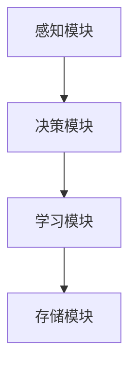

                 


# 构建具有可解释性强化学习能力的AI Agent

## 关键词：强化学习，可解释性AI，AI Agent，系统架构设计，算法实现

## 摘要：本文详细探讨了构建具有可解释性强化学习能力的AI Agent的关键技术与方法。从基础概念到系统架构设计，再到算法实现和项目实战，本文为读者提供了全面的指导，帮助他们理解和应用可解释性强化学习技术，打造透明、可信且高效的AI代理系统。

---

# 第1章: 可解释性强化学习概述

## 1.1 强化学习的基本概念

### 1.1.1 强化学习的定义
强化学习（Reinforcement Learning, RL）是一种机器学习范式，其中智能体（Agent）通过与环境交互来学习如何采取一系列行动以最大化累积的奖励。智能体通过试错的方式探索环境，逐步优化其策略。

### 1.1.2 强化学习的核心要素
| 核心要素 | 描述 |
|----------|------|
| 状态（State） | 环境在某一时刻的观测，表示智能体所处的环境状况。 |
| 动作（Action） | 智能体在给定状态下可以执行的操作。 |
| 奖励（Reward） | 环境对智能体执行动作的反馈，通常以数值形式表示，用于指导智能体的行为。 |
| 策略（Policy） | 定义智能体在给定状态下选择动作的概率分布。 |
| 价值函数（Value Function） | 表示在某一状态下采取某种动作后的预期累积奖励。 |

### 1.1.3 强化学习的应用场景
强化学习广泛应用于机器人控制、游戏AI、自动驾驶等领域。例如，DeepMind的AlphaGo通过强化学习在围棋领域取得了突破性进展。

## 1.2 可解释性AI的必要性

### 1.2.1 AI可解释性的定义
可解释性AI（Explainable AI, XAI）指的是AI系统的行为能够被人类理解和解释。在医疗、金融等领域，可解释性是信任和合规的关键。

### 1.2.2 可解释性在强化学习中的重要性
强化学习的决策过程通常是黑箱操作，缺乏透明性。可解释性强化学习通过揭示策略背后的逻辑，增强系统的可信度。

### 1.2.3 可解释性AI的挑战与机遇
- **挑战**：复杂强化学习算法的可解释性难以实现。
- **机遇**：可解释性AI推动了更透明和可信的AI系统的发展。

## 1.3 AI Agent的基本概念

### 1.3.1 AI Agent的定义
AI Agent是一种智能实体，能够感知环境、自主决策并执行动作，以实现特定目标。

### 1.3.2 AI Agent的分类
| 分类 | 描述 |
|------|------|
| 感知型Agent | 主要依赖感知信息进行决策，如自动驾驶中的感知系统。 |
| 行动型Agent | 主要通过执行动作与环境交互，如工业机器人。 |
| 学习型Agent | 具备学习能力，能够通过经验优化决策，如强化学习Agent。 |

### 1.3.3 AI Agent与人类交互的特点
- **自主性**：AI Agent能够自主决策，无需外部干预。
- **反应性**：能够实时感知环境变化并做出反应。
- **目标导向性**：所有行为均以实现特定目标为导向。

## 1.4 本章小结
本章介绍了强化学习的基本概念、可解释性AI的必要性以及AI Agent的基本概念，为后续章节奠定了基础。

---

# 第2章: 可解释性强化学习的核心原理

## 2.1 强化学习的基本原理

### 2.1.1 状态、动作、奖励的定义
- **状态**：智能体所处的环境状态，如在迷宫中的位置。
- **动作**：智能体在给定状态下可执行的操作，如“向右移动”。
- **奖励**：环境对智能体动作的反馈，如“到达目标状态”时获得+1奖励。

### 2.1.2 Q-learning算法的基本原理
Q-learning是一种经典的强化学习算法，通过更新Q表（Q-Table）来学习最优策略。

### 2.1.3 策略梯度方法的简介
策略梯度方法直接优化策略，通过计算梯度更新参数，寻找最优策略。

## 2.2 可解释性强化学习的实现方法

### 2.2.1 状态空间的简化
通过减少状态空间的复杂性，使策略更容易理解和解释。

### 2.2.2 动作空间的可解释性
设计简洁的动作空间，确保每个动作的含义清晰明确。

### 2.2.3 奖励函数的设计原则
- **简洁性**：奖励函数应简洁明了，避免复杂的计算。
- **一致性**：奖励函数应一致，避免歧义。
- **可解释性**：奖励函数应反映任务的核心目标。

## 2.3 可解释性强化学习的数学模型

### 2.3.1 Q-learning的数学公式
$$ Q(s, a) = Q(s, a) + \alpha [r + \gamma \max Q(s', a') - Q(s, a)] $$
其中：
- $s$：当前状态
- $a$：当前动作
- $r$：获得的奖励
- $s'$：下一个状态
- $\alpha$：学习率
- $\gamma$：折扣因子

### 2.3.2 策略梯度方法的数学推导
策略梯度方法的目标是最优化策略$\pi$，使得：
$$ J(\pi) = \mathbb{E}_{s,a}[\log \pi(a|s) Q(s,a)] $$
其中，$Q(s,a)$是动作值函数。

## 2.4 本章小结
本章深入探讨了强化学习的基本原理和可解释性强化学习的实现方法，为后续章节的算法实现奠定了基础。

---

# 第3章: 基于可解释性的强化学习算法

## 3.1 DQN算法的改进

### 3.1.1 DQN算法的基本结构
DQN通过使用经验回放和目标网络，避免了传统Q-learning算法的不稳定问题。

### 3.1.2 可解释性改进的DQN算法
通过简化动作空间和优化奖励函数，提高DQN算法的可解释性。

### 3.1.3 改进算法的数学推导
改进后的DQN算法更新公式为：
$$ Q(s, a) = Q(s, a) + \alpha [r + \gamma \max Q(s', a') - Q(s, a)] $$

## 3.2 基于策略梯度的可解释性强化学习

### 3.2.1 策略梯度方法的基本原理
策略梯度方法直接优化策略，通过梯度上升找到最优策略。

### 3.2.2 可解释性策略梯度的设计
通过限制动作空间和优化奖励函数，提高策略梯度方法的可解释性。

### 3.2.3 算法实现的详细步骤
1. 初始化策略参数$\theta$。
2. 采样动作$a$并执行。
3. 计算梯度$\nabla_\theta J(\theta)$。
4. 更新策略参数$\theta = \theta + \alpha \nabla_\theta J(\theta)$。

## 3.3 算法实现的代码示例

### 3.3.1 环境的安装与配置
```python
pip install gym
```

### 3.3.2 算法实现的Python代码
```python
import gym
import numpy as np

class Agent:
    def __init__(self, env):
        self.env = env
        self.Q = np.zeros((env.observation_space.n, env.action_space.n))
    
    def choose_action(self, state, epsilon=0.1):
        if np.random.random() < epsilon:
            return np.random.randint(self.env.action_space.n)
        return np.argmax(self.Q[state])
    
    def update_Q(self, state, action, reward, next_state):
        self.Q[state, action] += 0.1 * (reward + 0.95 * np.max(self.Q[next_state]) - self.Q[state, action])

if __name__ == "__main__":
    env = gym.make('FrozenLake-v1')
    agent = Agent(env)
    for _ in range(1000):
        state = env.reset()
        done = False
        while not done:
            action = agent.choose_action(state)
            next_state, reward, done, _ = env.step(action)
            agent.update_Q(state, action, reward, next_state)
            state = next_state
```

### 3.3.3 代码的详细解读与分析
- **Agent类**：定义了AI Agent的基本结构，包含Q表和动作选择方法。
- **choose_action方法**：根据当前状态选择动作，epsilon用于探索与利用的平衡。
- **update_Q方法**：更新Q表，基于当前状态、动作、奖励和下一个状态。

## 3.4 本章小结
本章详细介绍了可解释性强化学习算法的实现，包括DQN和策略梯度方法的改进，以及具体的Python代码实现。

---

# 第4章: 可解释性AI Agent的系统架构设计

## 4.1 系统功能设计

### 4.1.1 系统功能模块划分
- **感知模块**：负责感知环境状态。
- **决策模块**：负责选择动作。
- **学习模块**：负责更新策略。

### 4.1.2 每个模块的功能描述
- **感知模块**：通过传感器获取环境信息。
- **决策模块**：基于当前状态和策略选择最优动作。
- **学习模块**：根据奖励更新策略参数。

### 4.1.3 系统功能的实现流程
1. 感知模块获取环境状态。
2. 决策模块根据状态选择动作。
3. 执行动作并获得奖励。
4. 学习模块根据奖励更新策略。

## 4.2 系统架构设计

### 4.2.1 系统架构图


### 4.2.2 系统接口设计
- **输入接口**：感知模块接收环境状态。
- **输出接口**：决策模块输出动作。
- **反馈接口**：学习模块接收奖励并更新策略。

### 4.2.3 系统交互流程
1. 感知模块接收环境状态。
2. 决策模块根据状态选择动作。
3. 动作执行并获得奖励。
4. 学习模块根据奖励更新策略。

## 4.3 本章小结
本章详细描述了可解释性AI Agent的系统架构设计，包括功能模块划分、架构图和交互流程。

---

# 第5章: 项目实战

## 5.1 环境安装与配置

### 5.1.1 安装必要的库
```bash
pip install gym numpy matplotlib
```

### 5.1.2 配置环境参数
设置环境的观察空间和动作空间。

## 5.2 系统核心实现源代码

### 5.2.1 感知模块实现
```python
class Perception:
    def __init__(self, env):
        self.env = env
    
    def get_state(self):
        return self.env.observe()
```

### 5.2.2 决策模块实现
```python
class Decision:
    def __init__(self, state_space, action_space):
        self.Q = np.zeros((state_space, action_space))
    
    def choose_action(self, state):
        return np.argmax(self.Q[state])
```

### 5.2.3 学习模块实现
```python
class Learning:
    def __init__(self, gamma=0.95, alpha=0.1):
        self.gamma = gamma
        self.alpha = alpha
    
    def update(self, Q, state, action, reward, next_state):
        Q[state, action] += self.alpha * (reward + self.gamma * np.max(Q[next_state]) - Q[state, action])
```

### 5.2.4 系统集成代码
```python
class AI_Agent:
    def __init__(self, env):
        self.perception = Perception(env)
        self.decision = Decision(env.observation_space, env.action_space)
        self.learning = Learning()
    
    def run_episode(self):
        state = self.perception.get_state()
        while True:
            action = self.decision.choose_action(state)
            next_state, reward, done = env.step(action)
            self.learning.update(self.decision.Q, state, action, reward, next_state)
            state = next_state
            if done:
                break
```

## 5.3 代码应用解读与分析
- **Perception类**：负责获取环境状态。
- **Decision类**：基于Q表选择动作。
- **Learning类**：更新Q表，实现强化学习。
- **AI_Agent类**：集成各模块，协调运行。

## 5.4 实际案例分析和详细讲解剖析
以迷宫导航任务为例，展示AI Agent如何通过强化学习找到最优路径。

## 5.5 项目小结
本章通过实际项目展示了可解释性强化学习AI Agent的实现过程，包括环境配置、模块实现和系统集成。

---

# 第6章: 最佳实践与总结

## 6.1 最佳实践 tips

### 6.1.1 设计可解释性强化学习系统的注意事项
- 简化状态和动作空间。
- 设计清晰的奖励函数。
- 使用可解释性算法，如改进的DQN和策略梯度方法。

### 6.1.2 系统架构设计的关键点
- 明确模块划分。
- 确保模块之间的良好交互。
- 选择合适的通信机制。

## 6.2 小结
本章总结了可解释性强化学习AI Agent的设计与实现的关键点，为读者提供了实际应用中的指导。

## 6.3 注意事项
- 避免过度复杂的算法设计。
- 定期验证系统的可解释性。
- 及时优化系统性能。

## 6.4 拓展阅读
推荐相关书籍和论文，进一步深入学习可解释性强化学习技术。

---

# 作者：AI天才研究院/AI Genius Institute & 禅与计算机程序设计艺术 /Zen And The Art of Computer Programming

---

希望这篇文章能够帮助读者全面理解构建具有可解释性强化学习能力的AI Agent的关键技术与方法。通过系统的理论讲解和实际项目案例，读者可以掌握如何设计和实现透明、可信且高效的AI代理系统。

