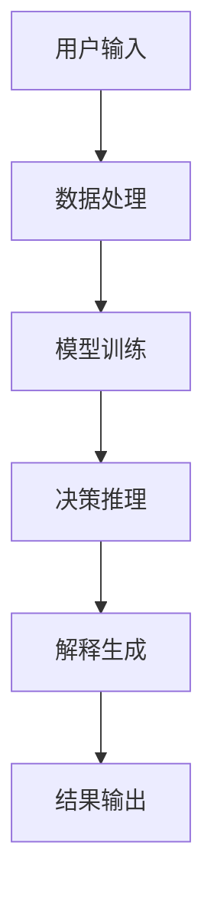

                 


# 构建具有可解释性的AI Agent决策系统

> 关键词：可解释性AI，AI Agent，决策系统，机器学习，可解释性模型

> 摘要：随着人工智能技术的快速发展，AI Agent在各个领域的应用越来越广泛。然而，AI Agent的决策过程往往缺乏透明性和可解释性，这使得人们对其决策结果的信任度降低。本文将详细探讨如何构建一个具有可解释性的AI Agent决策系统，从理论基础到实际应用，逐步解析其核心原理和实现方法。通过本文的学习，读者将能够理解可解释性AI Agent的重要性，并掌握构建此类系统的关键技术。

---

## 第1章: 可解释性AI Agent决策系统背景介绍

### 1.1 问题背景与定义

#### 1.1.1 问题背景
随着人工智能技术的快速发展，AI Agent（智能体）在金融、医疗、交通等领域得到了广泛应用。然而，AI Agent的决策过程往往基于复杂的算法模型，导致决策结果缺乏透明性，用户难以理解其背后的逻辑。这种不透明性不仅影响了用户的信任度，还可能引发法律和伦理问题。

#### 1.1.2 可解释性AI Agent的定义
可解释性AI Agent是一种能够清晰解释其决策过程和结果的智能体。与传统AI Agent不同，可解释性AI Agent不仅能够执行任务，还能提供决策的依据和逻辑，使得用户能够理解并信任其决策结果。

#### 1.1.3 问题解决目标
构建可解释性AI Agent决策系统的目标是实现以下几点：
1. 提供决策的透明性，使用户能够理解AI Agent的决策逻辑。
2. 确保AI Agent的决策符合伦理和法律要求。
3. 提高用户对AI Agent决策的信任度。

#### 1.1.4 边界与外延
可解释性AI Agent的边界主要集中在决策过程的透明化和解释能力的实现上。其外延则涉及多种技术手段，如规则推理、模型解释性增强等。

#### 1.1.5 核心要素组成
可解释性AI Agent的核心要素包括：
1. **决策模型**：用于生成决策结果。
2. **解释生成模块**：用于解释决策过程和结果。
3. **用户交互界面**：用于展示解释信息。

### 1.2 可解释性AI Agent的特点

#### 1.2.1 可解释性的重要性
可解释性是提升AI Agent可信度的关键因素。通过提供可解释的决策过程，用户能够理解AI Agent的行为，从而增强信任感。

#### 1.2.2 AI Agent的核心功能
AI Agent的核心功能包括：
1. 感知环境：通过传感器或其他数据源获取信息。
2. 决策：基于获取的信息生成决策。
3. 行动：执行决策结果。

#### 1.2.3 可解释性与决策透明度
可解释性与决策透明度密切相关。通过提供详细的决策过程和逻辑，AI Agent能够实现更高的透明度，从而增强用户信任。

#### 1.2.4 与传统AI Agent的区别
传统AI Agent通常注重结果的准确性，而可解释性AI Agent则在决策过程中加入了透明性和解释性，使得用户能够理解其决策逻辑。

### 1.3 可解释性AI Agent的应用场景

#### 1.3.1 金融领域
在金融领域，可解释性AI Agent可以用于信用评估、投资决策等领域。通过提供决策的解释，银行和投资者能够更好地理解AI的决策逻辑。

#### 1.3.2 医疗领域
在医疗领域，可解释性AI Agent可以用于疾病诊断、治疗方案推荐等。医生和患者需要理解AI的决策逻辑，以确保诊断和治疗的准确性。

#### 1.3.3 智能客服
智能客服系统通过可解释性AI Agent，能够更好地理解用户需求，并提供合理的解决方案。用户可以通过解释信息理解AI的推荐逻辑。

#### 1.3.4 自动驾驶
在自动驾驶领域，可解释性AI Agent可以用于路径规划和决策。通过提供决策的解释，驾驶员和监管机构能够理解AI的决策逻辑，从而确保自动驾驶的安全性。

### 1.4 本章小结
本章介绍了可解释性AI Agent的背景、定义、特点以及应用场景。通过这些内容，读者可以理解构建可解释性AI Agent决策系统的重要性和必要性。

---

## 第2章: 可解释性AI Agent的核心概念与联系

### 2.1 核心概念原理

#### 2.1.1 可解释性模型的原理
可解释性模型通过规则推理、特征重要性分析等方法，生成可理解的解释信息。这些解释信息能够帮助用户理解AI Agent的决策逻辑。

#### 2.1.2 AI Agent的决策机制
AI Agent的决策机制通常包括感知、推理和行动三个阶段。可解释性AI Agent通过记录和解释这些阶段的信息，提供透明的决策过程。

#### 2.1.3 可解释性与决策透明度
可解释性是实现决策透明度的关键手段。通过提供详细的决策过程和逻辑，可解释性AI Agent能够实现更高的透明度。

### 2.2 核心概念对比表

| 对比维度 | 可解释性模型 | 不可解释性模型 |
|----------|--------------|----------------|
| 解释能力 | 高            | 低              |
| 透明度   | 高            | 低              |
| 用户信任 | 高            | 低              |
| 应用场景 | 金融、医疗等 | 图像识别、语音识别等 |

### 2.3 ER实体关系图

```mermaid
er
  actor: 用户
  agent: AI Agent
  decision: 决策
  explanation: 解释
  rule: 规则
  relation 用户 --> 决策
  relation 决策 --> 解释
  relation 解释 --> 用户
  relation AI Agent --> 决策
  relation 规则 --> 解释
```

### 2.4 本章小结
本章通过对比分析和ER图，详细讲解了可解释性AI Agent的核心概念和其与传统AI Agent的区别。

---

## 第3章: 可解释性AI Agent的算法原理

### 3.1 可解释性模型的算法原理

#### 3.1.1 基于规则的可解释性方法
基于规则的可解释性方法通过构建规则库，生成可理解的解释信息。例如，使用决策树模型生成规则解释。

#### 3.1.2 基于模型的可解释性技术
基于模型的可解释性技术包括LIME（Local Interpretable Model-agnostic Explanations）和SHAP（SHapley Additive exPlanations）等方法。这些方法通过局部解释模型，生成可理解的解释信息。

#### 3.1.3 可解释性增强算法
可解释性增强算法通过对模型进行修改或训练，提高其可解释性。例如，通过简化神经网络结构，使其更容易被解释。

### 3.2 可解释性模型的数学公式

#### 3.2.1 LIME解释方法
LIME通过局部线性近似，生成可解释的解释模型。其数学公式如下：
$$
f(x) \approx \sum_{i=1}^{n} \beta_i x_i
$$

#### 3.2.2 SHAP值计算
SHAP值通过计算每个特征对决策结果的贡献，生成解释信息。其数学公式如下：
$$
\text{SHAP}(i) = \phi_i = \mathbb{E}_{P(X)}[f(X) - \mathbb{E}_{P(Y|X=i)}f(Y)]
$$

---

## 第4章: 可解释性AI Agent的数学模型

### 4.1 可解释性模型的数学基础

#### 4.1.1 线性回归模型
线性回归模型是一种简单且可解释性强的模型。其数学公式为：
$$
y = \beta_0 + \beta_1x_1 + \beta_2x_2 + \cdots + \beta_nx_n
$$

#### 4.1.2 树模型
树模型（如决策树）通过构建树状结构，生成可理解的解释信息。其解释逻辑基于特征的分裂路径。

### 4.2 可解释性模型的公式推导

#### 4.2.1 逻辑回归的可解释性
逻辑回归模型的输出概率公式为：
$$
P(y=1|x) = \frac{e^{\beta_0 + \beta_1x_1}}{1 + e^{\beta_0 + \beta_1x_1}}
$$

#### 4.2.2 决策树的解释
决策树的解释基于特征的分裂点，例如：
$$
\text{如果 } x_1 > 0.5 \text{，则预测结果为1}
$$

---

## 第5章: 可解释性AI Agent的系统设计

### 5.1 系统分析与架构设计

#### 5.1.1 问题场景介绍
在构建可解释性AI Agent系统时，需要考虑数据输入、模型训练、决策推理和解释生成等多个环节。

#### 5.1.2 系统功能设计
系统功能包括数据输入、模型训练、决策推理和解释生成。

#### 5.1.3 系统架构设计
系统架构包括数据层、模型层、推理层和解释层。

#### 5.1.4 系统接口设计
系统接口包括数据输入接口、模型调用接口和解释输出接口。

#### 5.1.5 系统交互流程
系统交互流程包括用户输入、模型推理、解释生成和结果输出。

### 5.2 系统架构设计图



---

## 第6章: 可解释性AI Agent的项目实战

### 6.1 环境安装与配置

#### 6.1.1 环境要求
需要安装Python、TensorFlow、LIME等库。

#### 6.1.2 环境配置
安装必要的Python包：
```bash
pip install numpy pandas scikit-learn lime
```

### 6.2 核心代码实现

#### 6.2.1 数据预处理
```python
import pandas as pd
data = pd.read_csv('data.csv')
```

#### 6.2.2 模型训练
```python
from sklearn.tree import DecisionTreeClassifier
model = DecisionTreeClassifier().fit(X, y)
```

#### 6.2.3 解释生成
```python
from lime.lime_tabular import LimeTabular
explainer = LimeTabular()
explanation = explainer.explain_instance(X, y, model.predict_proba)
```

### 6.3 代码解读与分析

#### 6.3.1 数据预处理
读取数据并进行必要的预处理，确保数据适合模型训练。

#### 6.3.2 模型训练
使用决策树模型进行训练，生成可解释的决策树结构。

#### 6.3.3 解释生成
通过LIME库生成解释信息，帮助用户理解模型的决策逻辑。

### 6.4 实际案例分析

#### 6.4.1 案例背景
以信用评分系统为例，构建可解释性AI Agent，用于评估用户的信用风险。

#### 6.4.2 解释结果
通过LIME解释，用户可以看到每个特征对信用评分的具体影响。

### 6.5 项目小结
通过本章的实战，读者可以掌握可解释性AI Agent的实现方法，并能够在实际项目中应用这些技术。

---

## 第7章: 总结与展望

### 7.1 最佳实践
在构建可解释性AI Agent时，建议优先选择可解释性强的模型，并结合规则推理和特征重要性分析，提高系统的透明度。

### 7.2 本章小结
本文详细介绍了可解释性AI Agent的背景、核心概念、算法原理、数学模型和系统设计，并通过实战案例展示了其具体实现方法。

### 7.3 注意事项
在实际应用中，需要注意可解释性与模型性能之间的平衡，避免过度追求可解释性而牺牲模型的准确性。

### 7.4 拓展阅读
建议读者进一步学习LIME和SHAP等可解释性技术，并探索其在不同领域的应用。

---

## 作者：AI天才研究院/AI Genius Institute & 禅与计算机程序设计艺术 /Zen And The Art of Computer Programming

---

以上是《构建具有可解释性的AI Agent决策系统》的完整目录和部分章节内容。希望本文能够为读者提供清晰的思路和实用的技术指导，帮助他们理解并掌握构建可解释性AI Agent的核心方法。

