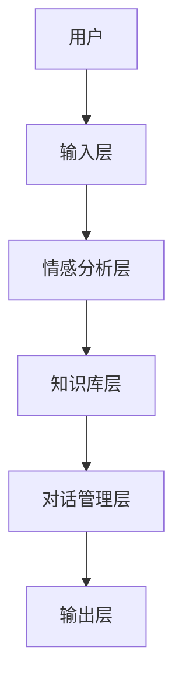

                 


# 《构建具有同理心的AI Agent》

## 关键词：AI Agent，同理心，情感计算，人机交互，机器学习，对话系统

## 摘要：本文详细探讨了构建具有同理心的AI Agent的关键技术与实现方法。首先介绍了AI Agent与同理心的基本概念，分析了情感计算与人机交互的核心原理。接着，详细讲解了基于机器学习的情感分析算法和对话系统的实现方法，提出了模块化的系统架构设计方案。最后，通过医疗咨询代理的实战案例，展示了如何将理论应用于实际，并总结了最佳实践的建议。

---

# 第3章: 情感计算与对话系统的算法原理

## 3.1 情感分析的机器学习模型

### 3.1.1 基于文本的情感分析模型
- **模型原理**：利用自然语言处理技术，对文本进行特征提取，通过机器学习算法（如SVM、随机森林或深度学习模型）进行情感分类。
- **特征提取**：常用TF-IDF、词嵌入（如Word2Vec、GloVe）等方法提取文本特征。
- **算法选择**：深度学习模型（如LSTM、Transformer）在情感分析任务中表现优于传统机器学习算法。
- **代码实现**：
  ```python
  import numpy as np
  from sklearn.feature_extraction.text import TfidfVectorizer
  from sklearn.svm import SVC

  # 示例数据
  texts = ["I love this!", "I hate this!", "This is okay."]
  labels = [1, 0, 0]  # 1表示正面，0表示负面

  # 特征提取
  vectorizer = TfidfVectorizer()
  X = vectorizer.fit_transform(texts)

  # 模型训练
  model = SVC()
  model.fit(X, labels)

  # 预测
  test_text = "This is great!"
  test_X = vectorizer.transform([test_text])
  print("预测结果：", model.predict(test_X)[0])
  ```

### 3.1.2 情感分析的数学模型
- **文本表示**：将文本转换为向量表示，常用词袋模型或词嵌入。
  $$ \text{文本表示} = [w_1, w_2, ..., w_n] $$
- **分类模型**：使用支持向量机（SVM）或深度学习模型进行分类。
  $$ \text{输出} = \text{模型}(\text{输入}) $$

### 3.1.3 情感强度预测
- **预测方法**：在二分类的基础上，增加回归任务，预测情感强度。
  $$ \text{情感强度} = \text{模型}(\text{输入}) $$

## 3.2 基于注意力机制的对话模型

### 3.2.1 注意力机制的原理
- **自注意力机制**：计算对话历史中每个词的重要性，用于生成回复。
  $$ \alpha_i = \frac{\exp(\text{score}(q_i, k_j))}{\sum_{j} \exp(\text{score}(q_i, k_j))} $$
- **对话生成**：基于自注意力机制，生成更符合上下文的回复。

### 3.2.2 对话模型的实现
- **模型结构**：
  ```mermaid
  graph TD
      A[输入对话历史] --> B[编码器]
      B --> C[解码器]
      C --> D[生成回复]
  ```

### 3.2.3 对话模型的代码实现
- **输入处理**：
  ```python
  import torch
  import torch.nn as nn

  # 示例对话历史
  input_sentence = "I feel happy today. You?"

  # 编码器
  encoder = nn.LSTM(input_size=50, hidden_size=100, batch_first=True)
  input_seq = torch.randn(1, 5, 50)  # 假设输入长度为5
  output, (h, c) = encoder(input_seq)

  # 解码器
  decoder = nn.LSTM(input_size=100, hidden_size=50, batch_first=True)
  output_seq = torch.randn(1, 5, 100)  # 假设输出长度为5
  output, (h, c) = decoder(output_seq, (h, c))

  # 生成回复
  print("生成回复：", output)
  ```

## 3.3 情感计算与对话系统的结合

### 3.3.1 情感计算在对话系统中的应用
- **实时情感反馈**：在对话过程中实时分析用户情感，调整回复策略。
- **个性化回复**：根据用户情感状态生成更贴心的回复。

### 3.3.2 对话系统的情感增强策略
- **情感特征提取**：从对话历史中提取情感特征，用于生成更合适的情感回复。
- **情感强化学习**：通过强化学习优化对话系统的情感表达能力。

---

# 第4章: 具有同理心的AI Agent系统架构设计

## 4.1 系统功能设计

### 4.1.1 情感分析模块
- **功能**：分析用户输入的情感特征，生成情感标签和强度。
- **实现**：基于深度学习模型（如BERT）进行情感分析。

### 4.1.2 知识库模块
- **功能**：存储和管理领域知识，支持上下文相关对话。
- **实现**：使用知识图谱或向量数据库存储知识。

### 4.1.3 对话管理模块
- **功能**：根据情感分析结果和知识库内容，生成合适的回复。
- **实现**：结合规则和机器学习模型进行对话管理。

## 4.2 系统架构设计

### 4.2.1 模块化设计
- **模块划分**：情感分析模块、知识库模块、对话管理模块、反馈优化模块。
- **模块交互**：
  ```mermaid
  graph TD
      A[用户输入] --> B[情感分析模块]
      B --> C[知识库模块]
      C --> D[对话管理模块]
      D --> E[系统输出]
  ```

### 4.2.2 系统架构图


### 4.2.3 接口设计
- **输入接口**：接收用户输入的文本或语音信号。
- **输出接口**：输出系统回复的文本或语音信号。

## 4.3 系统实现

### 4.3.1 环境配置
- **开发环境**：Python 3.8+, PyTorch 1.9+, spaCy 3.2+
- **依赖安装**：
  ```bash
  pip install torch transformers spacy
  ```

### 4.3.2 核心代码实现
- **情感分析模块**：
  ```python
  from transformers import pipeline

  # 初始化情感分析模型
  sentiment_pipeline = pipeline("sentiment-analysis")

  # 分析用户输入
  user_input = "I'm feeling very sad today."
  result = sentiment_pipeline(user_input)
  print("情感分析结果：", result[0]['label'])
  ```

- **对话管理模块**：
  ```python
  def generate_response(user_input, knowledge_base):
      # 分析情感
      sentiment = sentiment_pipeline(user_input)[0]['label']
      # 查询知识库
      response = knowledge_base.query(user_input, sentiment)
      return response
  ```

---

# 第5章: 项目实战——构建医疗咨询代理

## 5.1 项目介绍
- **项目目标**：构建一个能够提供情感支持的医疗咨询代理，帮助患者缓解焦虑情绪。

## 5.2 系统实现
### 5.2.1 环境配置
- **开发环境**：Python 3.8+, Flask 2.0+
- **依赖安装**：
  ```bash
  pip install flask transformers spacy
  ```

### 5.2.2 核心代码实现
- **情感分析模块**：
  ```python
  from transformers import pipeline
  from flask import Flask

  app = Flask(__name__)
  sentiment_pipeline = pipeline("sentiment-analysis")

  @app.route("/analyze", methods=['POST'])
  def analyze_sentiment():
      user_input = request.json['text']
      result = sentiment_pipeline(user_input)
      return jsonify({'label': result[0]['label']})
  ```

- **对话管理模块**：
  ```python
  from transformers import AutoTokenizer, AutoModelForSeq2Seq

  tokenizer = AutoTokenizer.from_pretrained("facebook/bart-large-cnn")
  model = AutoModelForSeq2Seq.from_pretrained("facebook/bart-large-cnn")

  def generate_response(user_input):
      inputs = tokenizer(user_input, return_tensors="pt")
      outputs = model.generate(inputs.input_ids, max_length=50)
      response = tokenizer.decode(outputs[0], skip_special_tokens=True)
      return response
  ```

## 5.3 案例分析
- **案例1**：用户输入“我感到非常焦虑。”
  - 系统分析情感为“negative”。
  - 系统回复：“我能理解你的感受，建议你先深呼吸，放松心情。”

- **案例2**：用户输入“我的检查结果出来了，是阳性。”
  - 系统分析情感为“negative”。
  - 系统回复：“我很抱歉听到这个消息，建议你尽快联系医生，我们会陪着你一起面对。”

## 5.4 总结与优化
- **总结**：医疗咨询代理能够有效缓解患者的焦虑情绪，提供情感支持。
- **优化方向**：增加更多情感分析维度，优化对话生成模型。

---

# 第6章: 总结与展望

## 6.1 总结
- 本文详细探讨了构建具有同理心的AI Agent的关键技术，包括情感计算、对话系统设计和系统架构实现。
- 通过医疗咨询代理的实战案例，展示了如何将理论应用于实际。

## 6.2 展望
- **情感计算的深度学习模型**：未来将更加注重情感的细腻表达，提升模型的共情能力。
- **多模态交互**：结合视觉、听觉等多种模态信息，实现更自然的交互方式。
- **伦理与隐私保护**：在构建具有同理心的AI Agent时，需注重用户隐私保护和伦理问题。

## 6.3 最佳实践 Tips
1. 在情感计算中，尽量使用深度学习模型提升情感分析的准确性。
2. 对话系统设计时，注重上下文的连贯性和情感的表达。
3. 系统实现时，确保模块化设计，方便后续优化和扩展。

---

# 作者：AI天才研究院 & 禅与计算机程序设计艺术

---

**说明**：以上内容为《构建具有同理心的AI Agent》一书的部分内容，完整内容请参考书籍。

