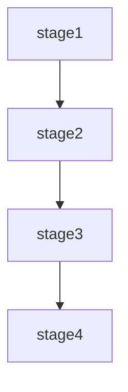
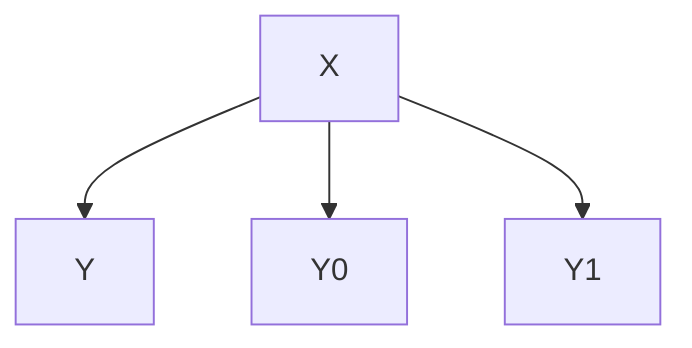
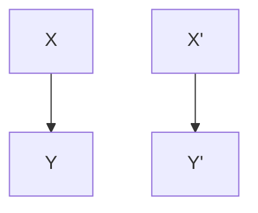
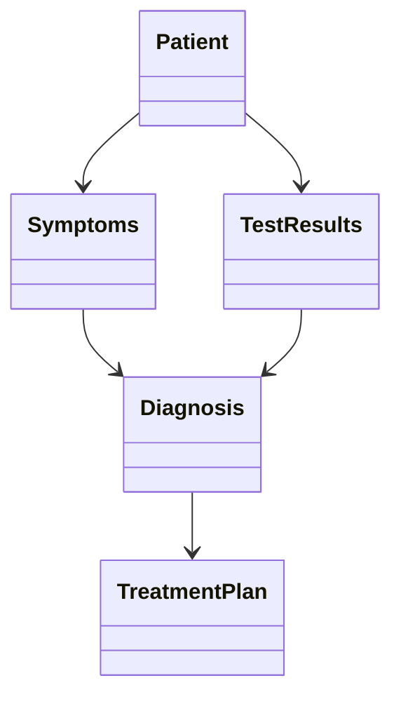
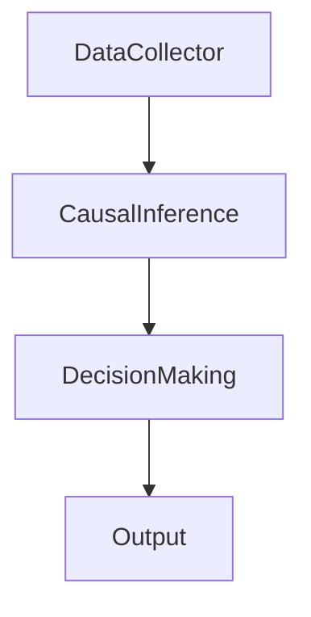
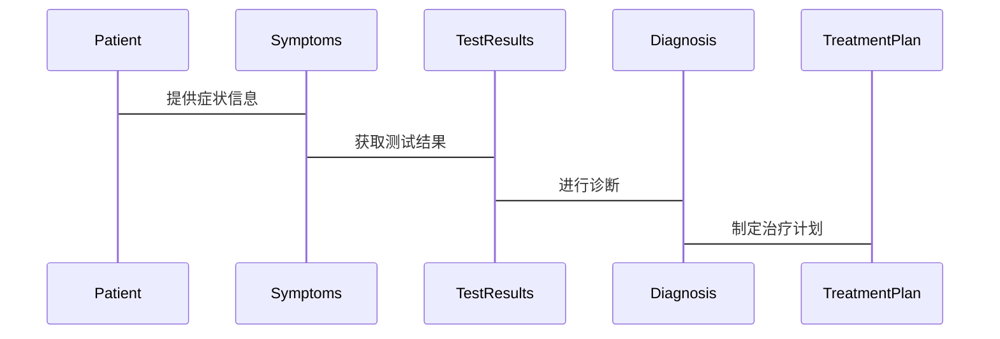
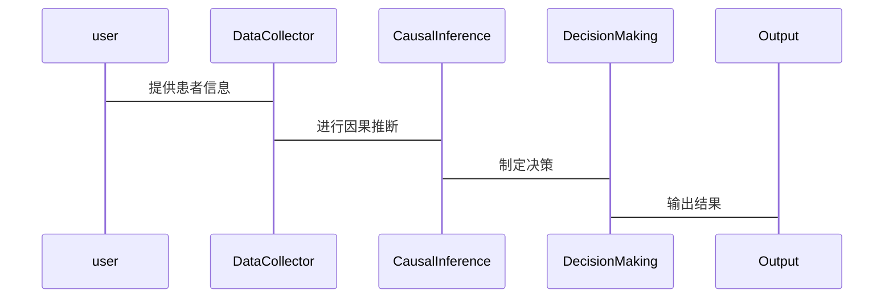

                 


# 构建具有因果推断与决策能力的AI Agent

> 关键词：因果推断、决策能力、AI Agent、机器学习、人工智能

> 摘要：本文深入探讨了如何构建具备因果推断与决策能力的AI Agent。通过分析因果推断的基本原理、决策能力的核心要素，结合具体的算法实现和系统架构设计，展示了如何将因果推断应用于实际的AI Agent决策过程中。文章从背景介绍、核心概念、算法原理、系统架构、项目实战到最佳实践，全面系统地阐述了构建具有因果推断与决策能力的AI Agent的方法和步骤。

---

## 第1章: 背景介绍与问题背景

### 1.1 问题背景

#### 1.1.1 当前AI技术的发展现状

人工智能（AI）技术近年来取得了显著的进展，尤其是在机器学习、深度学习和自然语言处理等领域。然而，大多数现有的AI系统仍然依赖于统计相关性，缺乏真正的因果理解。例如，在医疗诊断、金融投资和自动驾驶等领域，AI系统需要做出复杂的决策，而不仅仅是基于相关性的预测。

#### 1.1.2 传统AI与现代AI的对比

- **传统AI**：基于规则和逻辑推理，缺乏对复杂现实世界的适应能力。
- **现代AI**：依赖于数据驱动的方法，如机器学习和深度学习，能够处理大量数据并从中提取模式。

#### 1.1.3 因果推断与决策能力的重要性

因果推断是理解“为什么”现象发生的根本原因，而不仅仅是观察到相关性。在决策过程中，因果推断可以帮助AI Agent更好地理解行动的后果，并做出更合理的决策。

### 1.2 问题描述

#### 1.2.1 AI Agent的核心目标

AI Agent的目标是通过感知环境并采取行动，以实现特定的目标。为了实现这一目标，AI Agent需要具备理解因果关系的能力，以便在复杂的环境中做出最优决策。

#### 1.2.2 因果推断与决策能力的定义

- **因果推断**：识别变量之间的因果关系，理解一个变量的变化如何影响另一个变量。
- **决策能力**：基于因果关系，选择最优行动方案的能力。

#### 1.2.3 当前AI Agent在决策中的局限性

现有的AI系统大多基于相关性分析，无法真正理解因果关系。这导致在某些情况下，AI Agent可能会做出看似合理但实际无效的决策。

### 1.3 问题解决

#### 1.3.1 引入因果推断的必要性

因果推断可以帮助AI Agent理解行动的后果，从而做出更合理的决策。

#### 1.3.2 通过因果推断提升决策能力的方法

- 建立因果图模型，分析变量之间的因果关系。
- 使用反事实推理，评估不同决策的后果。

#### 1.3.3 解决问题的边界与外延

因果推断的应用范围广泛，但需要考虑数据质量和模型的准确性。在实际应用中，需要明确问题的边界，避免过度推广。

### 1.4 概念结构与核心要素

#### 1.4.1 因果推断的基本概念

因果推断涉及因果关系的识别和建模，通常使用因果图（如有向无环图，DAG）来表示变量之间的关系。

#### 1.4.2 决策能力的构成要素

决策能力包括目标设定、信息处理、因果推理和行动选择等部分。

#### 1.4.3 核心概念之间的关系

因果推断和决策能力是相辅相成的，因果推断为决策提供理论基础，而决策能力则是因果推断的应用。

### 1.5 本章小结

本章介绍了因果推断与决策能力在AI Agent中的重要性，分析了当前AI技术的局限性，并提出了通过因果推断提升决策能力的必要性。

---

## 第2章: 因果推断与决策能力的核心概念

### 2.1 因果推断的基本原理

#### 2.1.1 因果关系的定义

因果关系是指一个事件（原因）导致另一个事件（结果）发生的必然联系。

#### 2.1.2 随机变量与条件概率

随机变量是具有随机性的变量，条件概率是指在给定某些条件下，某一事件发生的概率。

#### 2.1.3 因果图模型的构建

因果图（Causal Graph）通过有向边表示变量之间的因果关系。例如，以下代码定义了一个简单的因果图：


### 2.2 决策能力的核心原理

#### 2.2.1 决策树的基本概念

决策树是一种树状结构，用于表示可能的决策路径。例如，以下代码定义了一个简单的决策树：

```mermaid
graph TD
    root -> left {选择左分支}
    root -> right {选择右分支}
    left -> leaf1 {叶子节点1}
    right -> leaf2 {叶子节点2}
```

#### 2.2.2 状态转移模型的构建

状态转移模型描述了系统状态之间的转移过程。例如，以下代码定义了一个简单的状态转移模型：


#### 2.2.3 多阶段决策过程的分析

多阶段决策过程需要考虑不同阶段的决策对最终结果的影响。例如，以下代码定义了一个多阶段决策过程：



### 2.3 因果推断与决策能力的联系

#### 2.3.1 因果推断在决策中的作用

因果推断帮助AI Agent理解不同行动的后果，从而做出更合理的决策。

#### 2.3.2 决策能力对因果推断的反馈影响

决策能力的提升可以反过来增强因果推断的准确性。

#### 2.3.3 两者结合的数学模型

以下是一个简单的数学模型，展示了因果推断与决策能力的结合：

$$ P(Y|do(X)) = \frac{P(Y,X|Pa)}{P(X|Pa)} $$

其中，$Y$ 是结果变量，$X$ 是处理变量，$Pa$ 是潜在结果。

### 2.4 核心概念对比与ER实体关系图

#### 2.4.1 因果推断与相关性分析的对比

因果推断关注的是因果关系，而相关性分析关注的是变量之间的关联。以下是一个简单的对比表格：

| 比较维度 | 因果推断 | 相关性分析 |
|----------|----------|------------|
| 目标     | 理解因果关系 | 描述变量之间的关联 |
| 方法     | 构建因果图 | 计算相关系数 |

#### 2.4.2 决策能力与预测能力的对比

决策能力需要考虑因果关系，而预测能力仅基于相关性。以下是一个对比表格：

| 比较维度 | 决策能力 | 预测能力 |
|----------|----------|-----------|
| 关注点   | 因果关系 | 相关关系 |
| 方法     | 构建决策树 | 建立回归模型 |

#### 2.4.3 ER实体关系图展示

以下是一个简单的ER实体关系图，展示了因果推断与决策能力之间的关系：

```mermaid
erDiagram
    Customer [od] {1} -- {1} Order
    Order [o] {1} -- {m} Product
    Customer [o] {1} -- {m} Product
```

### 2.5 本章小结

本章详细讲解了因果推断与决策能力的核心概念，分析了它们的原理、联系以及与相关概念的对比。

---

## 第3章: 因果推断与决策能力的算法原理

### 3.1 因果推断的算法原理

#### 3.1.1 潜在结果框架

潜在结果框架（Potential Outcome Framework）是因果推断的基础，它假设每个个体在不同的处理下会有不同的潜在结果。例如，以下代码定义了一个潜在结果框架：



#### 3.1.2 反事实推理

反事实推理（Counterfactual Reasoning）是通过假设相反的情况来推断因果关系。例如，以下代码展示了反事实推理的过程：



#### 3.1.3 因果图模型的构建与算法实现

因果图模型的构建需要识别变量之间的因果关系，并使用算法（如DO-前缀）进行推断。例如，以下代码展示了因果图模型的构建过程：


### 3.2 决策能力的算法实现

#### 3.2.1 决策树算法

决策树算法是一种常用的决策方法，包括ID3、C4.5和C5.0等算法。例如，以下代码展示了一个决策树的实现：

```python
from sklearn.tree import DecisionTreeClassifier

# 创建决策树模型
model = DecisionTreeClassifier()
# 训练模型
model.fit(X_train, y_train)
# 预测结果
y_pred = model.predict(X_test)
```

#### 3.2.2 状态转移模型的构建

状态转移模型可以通过马尔可夫决策过程（MDP）进行构建。例如，以下代码展示了一个简单的马尔可夫决策过程：

```python
import numpy as np

# 定义状态和动作
states = ['s1', 's2', 's3']
actions = ['a1', 'a2']

# 定义转移概率
transition_probabilities = {
    ('s1', 'a1'): {'s2': 0.7, 's3': 0.3},
    ('s2', 'a2'): {'s1': 0.5, 's3': 0.5},
    # 更多转移概率定义...
}
```

### 3.3 算法实现的数学模型

#### 3.3.1 因果推断的数学模型

因果推断的数学模型通常涉及潜在结果和处理变量。例如，以下公式展示了因果效应的估计：

$$ \text{ATE} = E[Y_{do(X=1)} - Y_{do(X=0)}] $$

#### 3.3.2 决策树算法的数学模型

决策树算法基于信息论中的熵和信息增益进行分裂。例如，以下公式展示了信息增益的计算：

$$ \text{信息增益} = H(Y) - H(Y|X) $$

### 3.4 算法实现的代码示例

#### 3.4.1 因果推断的代码实现

以下是一个简单的因果推断代码示例：

```python
from causalnex因果推断 import do_graph
from causalnex.utils import get_model_ready_data

# 创建因果图
graph = do_graph.DoGraph()
graph.add_var('X')
graph.add_var('Y')
graph.add_var('Z')
graph.add_edge('X', 'Y')
graph.add_edge('Z', 'Y')

# 进行因果推断
model = get_model_ready_data(graph, data)
```

#### 3.4.2 决策树算法的代码实现

以下是一个决策树算法的代码示例：

```python
from sklearn.tree import DecisionTreeClassifier

# 创建数据集
X = [[1, 1], [1, 0], [0, 1], [0, 0]]
y = [0, 0, 1, 1]

# 创建并训练模型
model = DecisionTreeClassifier()
model.fit(X, y)

# 预测结果
print(model.predict([[1, 1]]))  # Output: [0]
```

### 3.5 本章小结

本章详细讲解了因果推断与决策能力的算法原理，包括潜在结果框架、反事实推理、决策树算法和状态转移模型的实现。

---

## 第4章: 系统架构设计

### 4.1 问题场景介绍

本章将介绍如何设计一个具备因果推断与决策能力的AI Agent系统。例如，考虑一个医疗诊断系统，AI Agent需要根据患者的症状和测试结果，诊断出可能的疾病并推荐治疗方案。

### 4.2 系统功能设计

#### 4.2.1 领域模型设计

领域模型描述了系统的功能模块和交互流程。例如，以下代码展示了领域模型的类图：



#### 4.2.2 功能模块划分

系统功能模块包括数据采集、因果推理、决策制定和结果输出等部分。例如，以下代码展示了功能模块的划分：



### 4.3 系统架构设计

#### 4.3.1 系统架构设计

系统架构设计需要考虑模块的交互和数据流。例如，以下代码展示了系统的架构设计：


#### 4.3.2 系统接口设计

系统接口设计需要定义模块之间的交互接口。例如，以下代码展示了系统的接口设计：



### 4.4 系统交互设计

#### 4.4.1 交互流程设计

系统交互设计需要考虑用户的操作流程。例如，以下代码展示了交互流程设计：



#### 4.4.2 交互界面设计

交互界面设计需要考虑用户的体验。例如，以下代码展示了交互界面设计：

```mermaid
ui
    inputField
    button
    outputField

    inputField -> button: 用户输入信息
    button -> outputField: 显示结果
```

### 4.5 本章小结

本章详细讲解了具备因果推断与决策能力的AI Agent系统的架构设计，包括功能模块划分、系统架构、接口设计和交互设计。

---

## 第5章: 项目实战

### 5.1 项目介绍

本章将通过一个具体的项目案例，展示如何构建具备因果推断与决策能力的AI Agent。例如，考虑一个医疗诊断系统，AI Agent需要根据患者的症状和测试结果，诊断出可能的疾病并推荐治疗方案。

### 5.2 环境配置

#### 5.2.1 系统环境

需要安装Python、相关机器学习库（如scikit-learn、xgboost）和因果推断库（如causalnex）。

#### 5.2.2 数据集准备

需要准备相关的医疗数据，包括患者的症状、测试结果和诊断结果。

### 5.3 系统核心实现

#### 5.3.1 因果推断实现

以下是一个简单的因果推断实现代码示例：

```python
from causalnex因果推断 import do_graph
from causalnex.utils import get_model_ready_data

# 创建因果图
graph = do_graph.DoGraph()
graph.add_var('X')
graph.add_var('Y')
graph.add_var('Z')
graph.add_edge('X', 'Y')
graph.add_edge('Z', 'Y')

# 进行因果推断
model = get_model_ready_data(graph, data)
```

#### 5.3.2 决策树实现

以下是一个决策树实现的代码示例：

```python
from sklearn.tree import DecisionTreeClassifier

# 创建并训练模型
model = DecisionTreeClassifier()
model.fit(X_train, y_train)

# 预测结果
y_pred = model.predict(X_test)
```

### 5.4 案例分析与结果解读

通过实际案例分析，展示因果推断与决策能力在医疗诊断中的应用。例如，诊断出患者的症状可能是由某种疾病引起的，并推荐相应的治疗方案。

### 5.5 本章小结

本章通过实际项目案例，展示了如何构建具备因果推断与决策能力的AI Agent系统，并详细讲解了实现过程和结果解读。

---

## 第6章: 最佳实践与总结

### 6.1 小结

本章总结了全文的主要内容，强调了因果推断与决策能力在AI Agent中的重要性。

### 6.2 注意事项

在实际应用中，需要注意数据质量、模型准确性和伦理问题。

### 6.3 拓展阅读

推荐一些相关的书籍和论文，供读者进一步学习。

### 6.4 本章小结

本章总结了全文的主要内容，并提出了进一步研究的方向。

---

## 作者信息

作者：AI天才研究院/AI Genius Institute & 禅与计算机程序设计艺术 /Zen And The Art of Computer Programming

---

# 结语

通过本文的详细讲解，读者可以系统地理解如何构建具备因果推断与决策能力的AI Agent。从背景介绍到算法实现，再到项目实战，本文为读者提供了全面的知识体系和实践指导。希望本文能够为相关领域的研究和应用提供有价值的参考。

