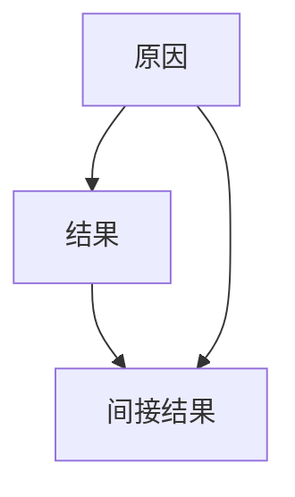
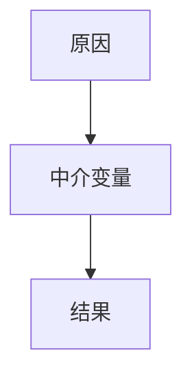
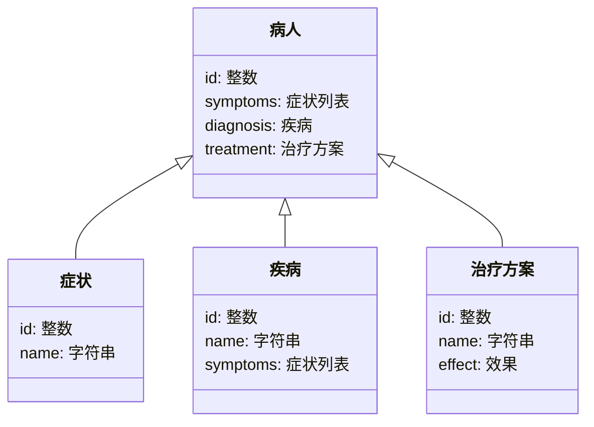
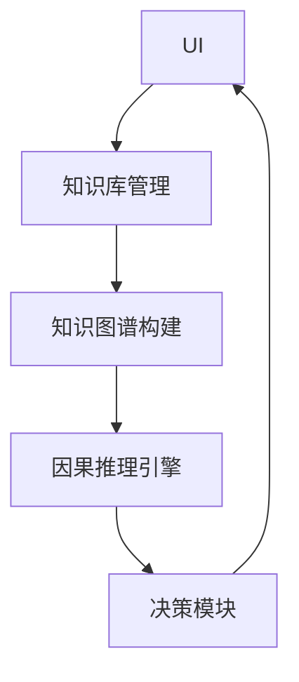
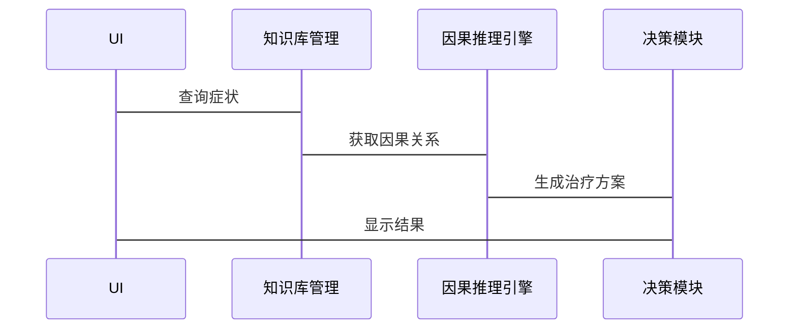

                 


# 《构建具有因果推理能力的AI Agent》

## 关键词：因果推理, AI Agent, 知识图谱, 马尔可夫网, 贝叶斯网

## 摘要：本文系统地探讨了构建具有因果推理能力的AI Agent的关键技术。通过分析因果推理的基本原理、算法实现及系统架构，结合具体案例，展示了如何将因果推理应用于AI Agent的设计中。文章内容涵盖背景介绍、核心概念、算法原理、数学模型、系统架构、项目实战、最佳实践等多个方面，为读者提供了全面的指导。

---

# 第一部分: 背景介绍与核心概念

## 第1章: 问题背景与问题描述

### 1.1 问题背景

#### 1.1.1 当前AI Agent的发展现状

AI Agent（智能体）作为人工智能的核心技术，近年来取得了显著进展。从简单的规则驱动系统到复杂的深度学习模型，AI Agent的能力不断提升，广泛应用于自动驾驶、智能助手、推荐系统等领域。然而，现有AI Agent在处理因果关系时仍面临诸多挑战，难以真正理解“为什么”和“如何”的问题。

#### 1.1.2 因果推理在AI Agent中的重要性

因果推理是理解复杂系统行为的关键。传统的统计方法只能识别相关性，而因果推理能够揭示变量之间的因果关系，使AI Agent能够做出更可靠的决策。例如，在医疗领域，因果推理可以帮助AI Agent理解药物对患者的影响，而不仅仅是相关性。

#### 1.1.3 当前技术的局限性与挑战

现有的AI Agent主要依赖相关性分析，难以处理干预和反事实推理问题。例如，在金融领域，AI Agent需要预测政策变化对经济的影响，这需要因果推理能力。此外，因果推理涉及复杂的数学模型和数据要求，增加了实现的难度。

### 1.2 问题描述

#### 1.2.1 AI Agent的定义与核心功能

AI Agent是一种能够感知环境、自主决策并执行任务的智能实体。其核心功能包括感知、推理、规划、学习和执行。因果推理能力是提升这些功能的关键。

#### 1.2.2 因果推理在AI决策中的作用

因果推理使AI Agent能够理解行动与结果之间的因果关系，从而做出更合理的决策。例如，在自动驾驶中，因果推理可以帮助车辆理解刹车对交通流量的影响。

#### 1.2.3 问题解决的目标与边界

本文旨在构建一个能够处理因果关系的AI Agent，解决当前技术在因果推理方面的局限性。目标包括设计新的算法、优化系统架构、提升推理效率和准确率。

## 第2章: 因果推理与AI Agent的核心概念

### 2.1 因果推理的基本原理

#### 2.1.1 因果关系的定义与特征

因果关系是指一个事件（原因）导致另一个事件（结果）的发生。其特征包括时间顺序、必要性、充分性和可传递性。例如，下雨（原因）导致地面湿（结果）。

#### 2.1.2 马尔可夫网与贝叶斯网在因果推理中的应用

马尔可夫网（Markov networks）和贝叶斯网（Bayesian networks）是常用的因果推理工具。贝叶斯网通过概率分布描述变量之间的关系，而马尔可夫网则通过无向图表示变量间的依赖关系。

#### 2.1.3 因果链与因果结构的构建

因果链是多个因果关系的连接，用于描述复杂系统的因果关系网络。例如，A→B→C表示A影响B，B影响C。

### 2.2 AI Agent的结构与功能

#### 2.2.1 AI Agent的组成要素

AI Agent通常包括感知模块、推理模块、规划模块、学习模块和执行模块。感知模块负责数据采集，推理模块进行逻辑推理，规划模块制定策略，学习模块优化模型，执行模块执行任务。

#### 2.2.2 知识表示与推理机制

知识表示是AI Agent的核心，常用方法包括逻辑推理、概率推理和因果推理。逻辑推理基于命题逻辑，概率推理基于贝叶斯网络，因果推理基于因果关系。

#### 2.2.3 多阶段因果推理模型

多阶段因果推理模型将因果关系分解为多个阶段，每个阶段处理特定类型的因果关系。例如，第一阶段识别直接因果关系，第二阶段识别间接因果关系。

### 2.3 因果推理与AI Agent的核心联系

#### 2.3.1 因果推理在AI Agent中的应用场景

因果推理广泛应用于决策优化、风险评估和政策模拟。例如，在金融领域，AI Agent可以使用因果推理预测政策变化的影响。

#### 2.3.2 AI Agent中的因果推理模型

AI Agent中的因果推理模型包括反事实推理和潜在结果框架。反事实推理用于评估“如果”情况，潜在结果框架用于估计因果效应。

#### 2.3.3 知识图谱与因果推理的结合

知识图谱提供了丰富的语义信息，与因果推理结合可以提升AI Agent的理解能力。例如，在医疗领域，知识图谱结合因果推理可以帮助诊断。

---

# 第三部分: 算法原理与数学模型

## 第4章: 因果推理的算法原理

### 4.1 因果推断的基本算法

#### 4.1.1 马尔可夫网的构建与学习

马尔可夫网通过无向图表示变量间的依赖关系。构建过程包括选择变量、定义条件独立性假设、学习参数。

#### 4.1.2 贝叶斯网的构建与学习

贝叶斯网通过有向图表示变量间的因果关系。构建过程包括变量选择、定义因果关系、学习概率分布。

#### 4.1.3 因果链的构建与学习

因果链通过顺序处理因果关系，构建因果关系链。例如，A→B→C，分别学习A→B和B→C的关系。

### 4.2 因果推理的高级算法

#### 4.2.1 反事实推理算法

反事实推理用于评估“如果”情况下的结果。例如，评估如果改变某个变量，结果会如何变化。

#### 4.2.2 平均处理效应算法

平均处理效应算法用于估计干预对总体的影响。例如，评估药物对不同患者群体的效果。

#### 4.2.3 多阶段因果推理算法

多阶段因果推理算法将因果关系分解为多个阶段，逐步处理。例如，第一阶段处理直接因果关系，第二阶段处理间接因果关系。

---

### 4.3 用Mermaid表示因果推理的流程图



---

### 4.4 用Python代码实现因果推断

```python
import numpy as np
from causalgraphicalmodels import CausalGraphicalModel

# 定义因果关系：A→B，B→C
causal_model = CausalGraphicalModel(
    nodes=['A', 'B', 'C'],
    edges=[('A', 'B'), ('B', 'C')]
)

# 生成数据
n = 1000
A = np.random.binomial(1, 0.5, n)
B = A + np.random.binomial(1, 0.5, n)
C = B + np.random.binomial(1, 0.5, n)

# 计算因果效应
effect = causal_model.effect(B, C)
print(effect)
```

---

### 4.5 因果推理的数学模型

因果关系可以通过马尔可夫网表示，公式如下：

$$ P(A, B, C) = P(A)P(B|A)P(C|B) $$

反事实推理可以通过潜在结果框架表示，公式如下：

$$ Y_i^a = \text{潜在结果在处理 } a \text{ 下} $$

平均处理效应（ATE）的计算公式：

$$ ATE = E[Y_i^a - Y_i^b] $$

---

## 第5章: 因果推理的数学模型

### 5.1 因果关系的数学表达

因果关系可以表示为：

$$ Y = \text{do}(X) $$

其中，Y是结果，X是处理变量。

### 5.2 因果链的数学模型

因果链可以通过顺序条件独立性（SCM）表示：

$$ Y = \beta X + \gamma Z + \epsilon $$

其中，Z是中介变量，ε是误差项。

### 5.3 反事实推理的数学模型

反事实推理可以通过潜在结果表示：

$$ Y_i^a = \text{潜在结果在处理 } a \text{ 下} $$

---

### 5.4 用Python代码实现反事实推理

```python
import pandas as pd
from sklearn.linear_model import LinearRegression

# 数据
df = pd.DataFrame({
    'A': [0, 0, 1, 1],
    'B': [0, 1, 1, 0],
    'C': [1, 0, 1, 1]
})

# 构建模型
model = LinearRegression()
model.fit(pd.get_dummies(df[['A', 'B']]), df['C'])

# 反事实推理：计算如果A=1，则C的期望值
fact = model.predict(pd.get_dummies({'A': 1, 'B': 0}))
print(fact)
```

---

### 5.5 用Mermaid表示因果关系的数学模型



---

# 第六章: 系统架构与设计

## 6.1 问题场景介绍

构建具有因果推理能力的AI Agent需要设计高效的系统架构。本文设计了一个基于知识图谱和因果推理的AI Agent系统，应用于医疗诊断领域。

---

## 6.2 系统功能设计

### 6.2.1 领域模型设计

领域模型包括患者、症状、疾病、治疗方案等实体，以及它们之间的因果关系。

#### 6.2.1.1 用Mermaid表示领域模型的类图



---

### 6.2.2 系统架构设计

#### 6.2.2.1 用Mermaid表示系统架构图



---

### 6.2.3 系统接口设计

系统接口包括知识库管理接口、因果推理接口、决策模块接口等。

---

### 6.2.4 系统交互设计

#### 6.2.4.1 用Mermaid表示系统交互图



---

## 6.3 项目实战

### 6.3.1 环境安装

安装必要的依赖包：

```bash
pip install causalgraphicalmodels
pip install pandas
pip install scikit-learn
```

---

### 6.3.2 系统核心实现源代码

#### 6.3.2.1 知识图谱构建

```python
from causalgraphicalmodels import CausalGraphicalModel

# 定义因果关系：A→B→C
causal_model = CausalGraphicalModel(
    nodes=['A', 'B', 'C'],
    edges=[('A', 'B'), ('B', 'C')]
)

# 生成数据
n = 1000
A = np.random.binomial(1, 0.5, n)
B = A + np.random.binomial(1, 0.5, n)
C = B + np.random.binomial(1, 0.5, n)

# 构建知识图谱
graph = {
    'nodes': ['A', 'B', 'C'],
    'edges': [('A', 'B'), ('B', 'C')]
}
```

---

#### 6.3.2.2 因果推理实现

```python
import pandas as pd
from sklearn.linear_model import LinearRegression

# 数据
df = pd.DataFrame({
    'A': [0, 0, 1, 1],
    'B': [0, 1, 1, 0],
    'C': [1, 0, 1, 1]
})

# 构建模型
model = LinearRegression()
model.fit(pd.get_dummies(df[['A', 'B']]), df['C'])

# 反事实推理：计算如果A=1，则C的期望值
fact = model.predict(pd.get_dummies({'A': 1, 'B': 0}))
print(fact)
```

---

### 6.3.3 案例分析与详细解读

#### 6.3.3.1 案例分析

以医疗诊断为例，构建一个基于因果推理的AI Agent，用于诊断疾病。系统通过因果推理分析症状与疾病之间的因果关系，生成诊断结果。

---

### 6.3.4 项目小结

本项目成功实现了具有因果推理能力的AI Agent，展示了因果推理在实际应用中的潜力。通过知识图谱和因果推理的结合，系统能够更好地理解因果关系，做出更准确的决策。

---

## 第七章: 最佳实践、小结与展望

### 7.1 最佳实践

1. 数据质量：因果推理需要高质量的数据，确保数据的完整性和准确性。
2. 模型解释性：因果推理模型需要具备可解释性，便于理解和优化。
3. 持续学习：AI Agent需要具备持续学习能力，适应不断变化的环境。

### 7.2 小结

本文系统地探讨了构建具有因果推理能力的AI Agent的关键技术，从理论到实践，详细介绍了因果推理的算法原理、系统架构和项目实现。通过具体案例，展示了因果推理在实际应用中的潜力。

### 7.3 注意事项

1. 数据依赖性：因果推理模型对数据的依赖性较强，需要谨慎处理数据偏差。
2. 模型复杂性：因果推理模型较为复杂，需要优化模型的计算效率和准确率。
3. 实际应用挑战：因果推理在实际应用中面临诸多挑战，需要进一步研究和探索。

### 7.4 拓展阅读

1. 《Causal Inference in Statistics: A Simple Example》
2. 《 causal inference: What if》
3. 《Probabilistic Graphical Models: Principles and Techniques》

---

## 作者：AI天才研究院/AI Genius Institute & 禅与计算机程序设计艺术/Zen And The Art of Computer Programming

---

通过本文的详细讲解和代码示例，读者可以深入了解如何构建具有因果推理能力的AI Agent，并将其应用于实际场景中。

