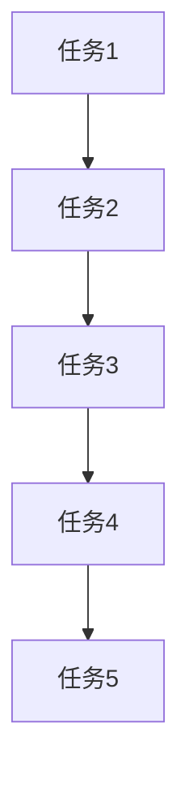
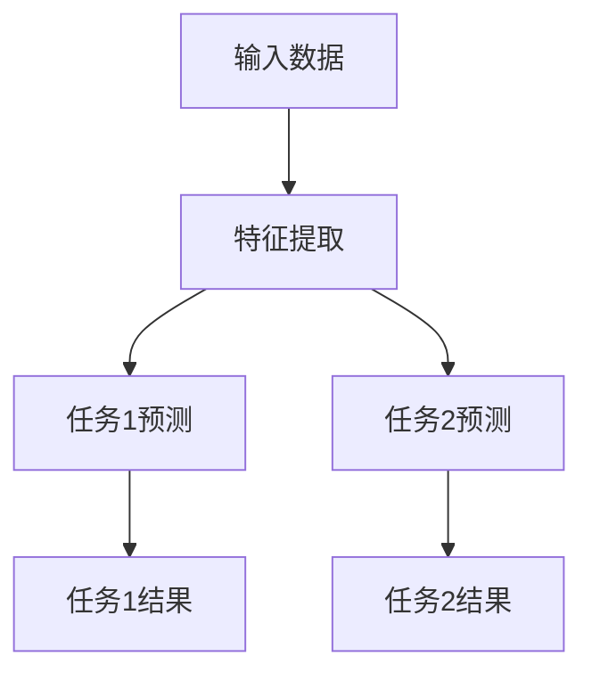
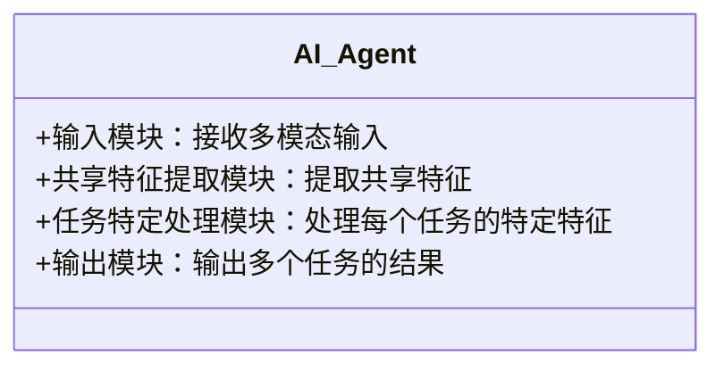
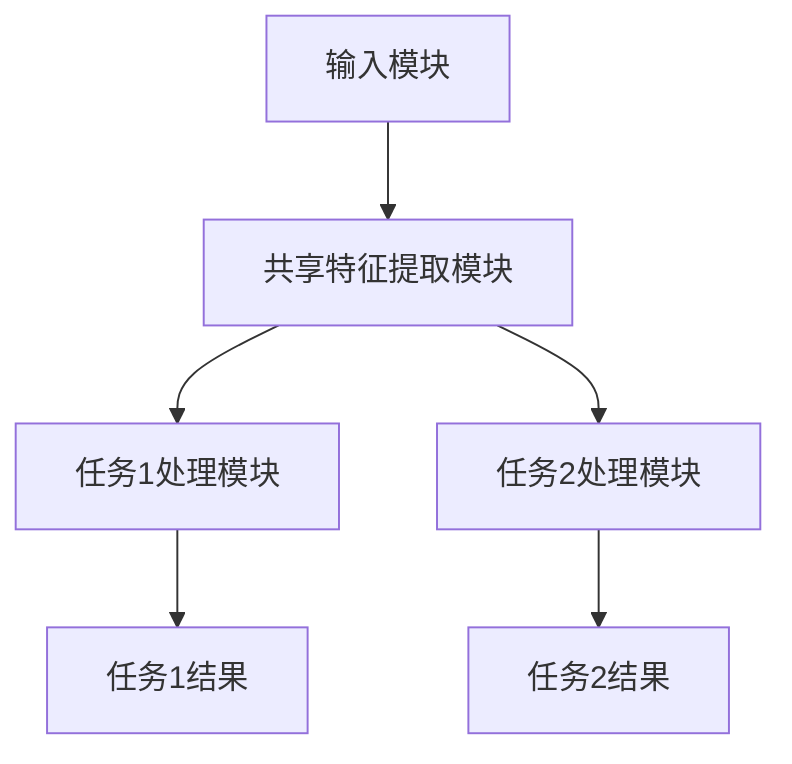
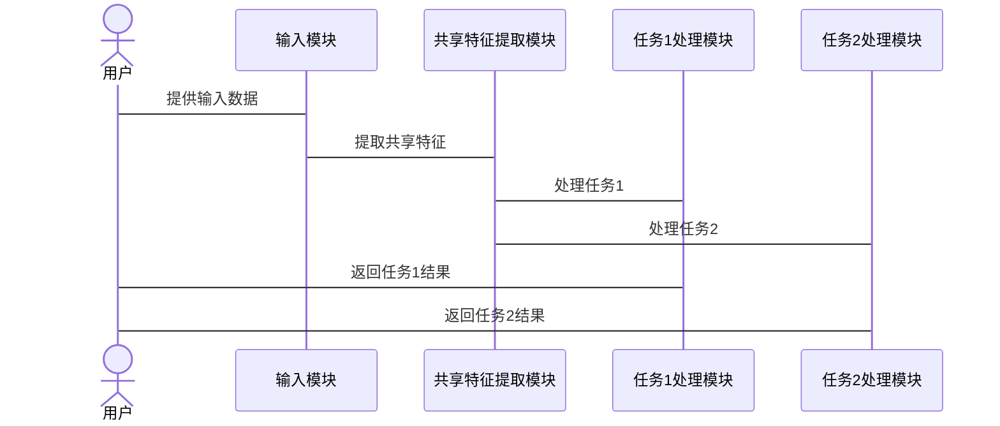

                 


# 构建具有多任务学习能力的AI Agent

> 关键词：多任务学习，AI Agent，算法原理，系统架构，项目实战

> 摘要：本文深入探讨了构建具有多任务学习能力的AI Agent的方法，从基本概念到算法实现，再到系统架构和项目实战，全面解析了多任务学习在AI Agent中的应用。通过详细分析和实例演示，为读者提供了从理论到实践的完整指南。

---

# 第一部分: 多任务学习与AI Agent概述

## 第1章: 多任务学习与AI Agent背景介绍

### 1.1 多任务学习的基本概念

#### 1.1.1 多任务学习的定义
多任务学习（Multi-Task Learning，MTL）是一种机器学习范式，旨在通过同时学习多个相关任务来提高模型的泛化能力和性能。与单任务学习不同，MTL允许模型在共享的表示空间中同时优化多个目标函数。

#### 1.1.2 多任务学习的核心要素
- **共享特征**：多个任务共享部分特征，以提高模型的泛化能力。
- **任务间依赖**：任务之间可能存在相关性，可以通过多任务学习来利用这种关系。
- **联合优化**：通过同时优化多个任务的目标函数，提升整体性能。

#### 1.1.3 多任务学习的应用场景
- 自然语言处理（NLP）：如文本分类、情感分析、机器翻译等。
- 计算机视觉（CV）：如图像分类、目标检测、语义分割等。
- 机器人控制：如路径规划、物体识别、动作控制等。

### 1.2 AI Agent的基本概念

#### 1.2.1 AI Agent的定义
AI Agent（智能体）是指在环境中能够感知并自主行动以实现目标的实体。AI Agent可以是软件程序、机器人或其他智能系统。

#### 1.2.2 AI Agent的分类
- **简单反射型**：基于当前感知直接行动，不依赖内部状态。
- **基于模型型**：利用环境模型进行规划和决策。
- **目标驱动型**：基于目标驱动行动，具有明确的目标导向。

#### 1.2.3 多任务学习在AI Agent中的作用
多任务学习使AI Agent能够同时处理多个任务，提升其在复杂环境中的适应性和灵活性。

### 1.3 多任务学习与AI Agent的结合

#### 1.3.1 多任务学习如何提升AI Agent的能力
- **提升效率**：通过共享特征，减少训练数据的需求。
- **增强泛化能力**：在多个任务之间共享知识，提升模型的鲁棒性。
- **复杂环境处理**：能够同时处理多种任务，应对复杂场景。

#### 1.3.2 多任务学习在AI Agent中的应用案例
- 多人游戏中的AI Agent：同时进行路径规划、目标识别和策略制定。
- 智能音箱：同时处理语音识别、意图理解和任务执行。

#### 1.3.3 多任务学习与传统AI Agent的区别
- **任务处理能力**：多任务学习使AI Agent能够同时处理多个任务，而传统AI Agent通常专注于单一任务。
- **模型复杂度**：多任务学习模型通常更复杂，但具有更强的泛化能力。

## 第2章: 多任务学习的核心概念与联系

### 2.1 多任务学习的原理

#### 2.1.1 多任务学习的基本原理
多任务学习通过共享参数，使得模型在多个任务之间共享知识，从而提高整体性能。其核心在于优化多个任务的目标函数，同时保持参数共享。

#### 2.1.2 多任务学习的核心算法
- **MTL（Multi-Task Learning）**：通过共享参数，同时优化多个任务的目标函数。
- **MCD（Multi-Constraint Disjoint）**：将任务划分为不同的子任务，分别进行优化。
- **HAT（Hierarchical Attention）**：通过层次化注意力机制，关注不同任务的关键特征。

#### 2.1.3 多任务学习的优缺点
- **优点**：
  - 提高模型的泛化能力。
  - 减少训练数据的需求。
  - 提升模型的效率。
- **缺点**：
  - 任务间可能存在冲突，影响模型的性能。
  - 参数共享可能导致某些任务的性能下降。

### 2.2 多任务学习与单任务学习的对比

#### 2.2.1 任务目标的差异
- 单任务学习：专注于单一任务的目标函数。
- 多任务学习：同时优化多个任务的目标函数。

#### 2.2.2 模型结构的差异
- 单任务学习：模型结构简单，专注于单一任务。
- 多任务学习：模型结构复杂，通常包含共享层和任务特定层。

#### 2.2.3 性能评估的差异
- 单任务学习：仅评估单一任务的性能。
- 多任务学习：需要同时评估多个任务的性能，通常采用联合评估指标。

### 2.3 多任务学习的ER实体关系图



---

# 第二部分: 多任务学习算法原理

## 第3章: 多任务学习算法原理

### 3.1 多任务学习的主流算法

#### 3.1.1 MTL（Multi-Task Learning）

##### 3.1.1.1 MTL的基本原理
MTL通过共享参数，同时优化多个任务的目标函数。模型的共享层将特征提取到共享空间，任务特定层处理每个任务的特定特征。

##### 3.1.1.2 MTL的优缺点
- **优点**：
  - 参数共享，减少训练数据的需求。
  - 提高模型的泛化能力。
- **缺点**：
  - 任务间可能存在冲突，影响模型性能。

##### 3.1.1.3 MTL的流程图



##### 3.1.1.4 MTL的数学模型

$$ L_{total} = \lambda_1 L_1 + \lambda_2 L_2 + ... + \lambda_n L_n $$

其中，$L_{total}$ 是总的损失函数，$\lambda_i$ 是任务 $i$ 的权重，$L_i$ 是任务 $i$ 的损失函数。

### 3.2 多任务学习算法的流程图


### 3.3 算法实现代码

```python
import torch
import torch.nn as nn

class MultiTaskModel(nn.Module):
    def __init__(self, input_size, output_size1, output_size2):
        super(MultiTaskModel, self).__init__()
        self.shared_layer = nn.Linear(input_size, 64)
        self.task1_layer = nn.Linear(64, output_size1)
        self.task2_layer = nn.Linear(64, output_size2)
    
    def forward(self, x):
        x = self.shared_layer(x)
        output1 = self.task1_layer(x)
        output2 = self.task2_layer(x)
        return output1, output2

# 示例用法
input_size = 100
output_size1 = 10
output_size2 = 5
model = MultiTaskModel(input_size, output_size1, output_size2)
input_data = torch.randn(32, input_size)
output1, output2 = model(input_data)
print("输出1的形状:", output1.shape)
print("输出2的形状:", output2.shape)
```

---

## 第4章: 算法实现与数学模型

### 4.1 算法实现细节

#### 4.1.1 模型结构
- **共享层**：提取共享特征。
- **任务特定层**：处理每个任务的特定特征。

#### 4.1.2 损失函数
$$ L_{total} = \lambda_1 L_1 + \lambda_2 L_2 + ... + \lambda_n L_n $$

其中，$\lambda_i$ 是任务 $i$ 的权重，$L_i$ 是任务 $i$ 的损失函数。

#### 4.1.3 优化目标
最小化总的损失函数 $L_{total}$，以优化模型参数。

### 4.2 数学公式详细推导

#### 4.2.1 多任务学习的数学模型
$$ f(x) = W_{shared} x + b_{shared} $$
$$ g_i(f(x)) = W_{task_i} f(x) + b_{task_i} $$

其中，$W_{shared}$ 和 $b_{shared}$ 是共享层的权重和偏置，$W_{task_i}$ 和 $b_{task_i}$ 是任务 $i$ 的特定层的权重和偏置。

#### 4.2.2 多任务学习的优化目标
$$ \min_{W, b} \sum_{i=1}^{n} \lambda_i L_i(W, b) $$

其中，$W$ 和 $b$ 是模型的参数，$\lambda_i$ 是任务 $i$ 的权重。

### 4.3 算法实现代码

```python
import torch
import torch.nn as nn
import torch.optim as optim

class MultiTaskModel(nn.Module):
    def __init__(self, input_size, output_size1, output_size2):
        super(MultiTaskModel, self).__init__()
        self.shared_layer = nn.Linear(input_size, 64)
        self.task1_layer = nn.Linear(64, output_size1)
        self.task2_layer = nn.Linear(64, output_size2)
    
    def forward(self, x):
        x = self.shared_layer(x)
        output1 = self.task1_layer(x)
        output2 = self.task2_layer(x)
        return output1, output2

# 示例用法
input_size = 100
output_size1 = 10
output_size2 = 5
model = MultiTaskModel(input_size, output_size1, output_size2)
input_data = torch.randn(32, input_size)
criterion = nn.CrossEntropyLoss()
optimizer = optim.Adam(model.parameters(), lr=0.001)

outputs = model(input_data)
loss1 = criterion(outputs[0], torch.randint(0, output_size1, (32,)))
loss2 = criterion(outputs[1], torch.randint(0, output_size2, (32,)))
total_loss = loss1 + loss2

optimizer.zero_grad()
total_loss.backward()
optimizer.step()
```

---

## 第5章: 系统分析与架构设计方案

### 5.1 系统需求分析

#### 5.1.1 问题场景介绍
设计一个多任务学习的AI Agent，能够同时处理多个任务，如语音识别、情感分析和目标检测。

#### 5.1.2 系统功能需求
- **输入处理**：接收多模态输入（如文本和图像）。
- **任务处理**：同时处理多个任务（如分类、检测）。
- **结果输出**：输出多个任务的结果。

### 5.2 系统架构设计

#### 5.2.1 系统功能设计



#### 5.2.2 系统架构设计图



#### 5.2.3 系统接口设计
- **输入接口**：接收多模态输入数据。
- **输出接口**：输出多个任务的结果。

#### 5.2.4 系统交互设计



### 5.3 系统实现代码

```python
class AI_Agent:
    def __init__(self):
        self.shared_layer = nn.Linear(100, 64)
        self.task1_layer = nn.Linear(64, 10)
        self.task2_layer = nn.Linear(64, 5)
    
    def forward(self, x):
        x = self.shared_layer(x)
        output1 = self.task1_layer(x)
        output2 = self.task2_layer(x)
        return output1, output2

agent = AI_Agent()
input_data = torch.randn(32, 100)
output1, output2 = agent(input_data)
print("任务1输出:", output1.shape)
print("任务2输出:", output2.shape)
```

---

## 第6章: 项目实战

### 6.1 环境安装

#### 6.1.1 安装依赖
```bash
pip install torch
pip install matplotlib
pip install numpy
```

#### 6.1.2 环境配置
```bash
conda create -n multitask_ai_agent python=3.8
conda activate multitask_ai_agent
```

### 6.2 系统核心实现

#### 6.2.1 多任务模型实现

```python
import torch
import torch.nn as nn

class MultiTaskModel(nn.Module):
    def __init__(self, input_size, output_size1, output_size2):
        super(MultiTaskModel, self).__init__()
        self.shared_layer = nn.Linear(input_size, 64)
        self.task1_layer = nn.Linear(64, output_size1)
        self.task2_layer = nn.Linear(64, output_size2)
    
    def forward(self, x):
        x = self.shared_layer(x)
        output1 = self.task1_layer(x)
        output2 = self.task2_layer(x)
        return output1, output2
```

#### 6.2.2 训练代码

```python
model = MultiTaskModel(100, 10, 5)
criterion = nn.CrossEntropyLoss()
optimizer = optim.Adam(model.parameters(), lr=0.001)

for epoch in range(100):
    inputs = torch.randn(32, 100)
    labels1 = torch.randint(0, 10, (32,))
    labels2 = torch.randint(0, 5, (32,))
    
    optimizer.zero_grad()
    outputs = model(inputs)
    loss1 = criterion(outputs[0], labels1)
    loss2 = criterion(outputs[1], labels2)
    total_loss = loss1 + loss2
    total_loss.backward()
    optimizer.step()
    
    print(f"Epoch {epoch+1}: Loss = {total_loss.item()}")
```

### 6.3 功能实现与测试

#### 6.3.1 功能实现
训练完成后，模型能够同时处理两个任务：任务1和任务2。

#### 6.3.2 测试代码

```python
model.eval()
test_inputs = torch.randn(8, 100)
with torch.no_grad():
    outputs = model(test_inputs)
    print("任务1输出:", outputs[0].shape)
    print("任务2输出:", outputs[1].shape)
```

### 6.4 案例分析

#### 6.4.1 案例介绍
设计一个多任务对话系统，能够同时进行语义理解和意图识别。

#### 6.4.2 案例分析
通过多任务学习，模型能够在对话中同时理解用户的语义和识别意图，提升对话系统的性能。

### 6.5 项目小结

---

## 第7章: 最佳实践与总结

### 7.1 最佳实践

#### 7.1.1 参数调节
- 根据任务的重要性调整权重 $\lambda_i$。
- 通过交叉验证选择合适的超参数。

#### 7.1.2 模型选择
- 根据任务需求选择合适的模型结构。
- 使用预训练模型提升性能。

#### 7.1.3 数据处理
- 确保数据的平衡性和多样性。
- 使用数据增强技术提高模型的鲁棒性。

### 7.2 小结

### 7.3 注意事项

#### 7.3.1 任务间冲突
- 任务间可能存在冲突，需合理调整权重和模型结构。

#### 7.3.2 数据量
- 多任务学习需要足够的数据支持，否则可能导致性能下降。

### 7.4 拓展阅读

#### 7.4.1 推荐书籍
- 《Deep Learning》—— Ian Goodfellow
- 《Hands-On Machine Learning with Scikit-Learn, Keras, and TensorFlow》—— Aurélien Géron

#### 7.4.2 推荐论文
- "A Convolutional Neural Network for Paraphrase Detection" —— Yoon Kim
- "Attention Is All You Need" —— Vaswani et al.

---

# 小结

通过本文的详细讲解，读者可以深入了解构建具有多任务学习能力的AI Agent的方法。从基本概念到算法实现，再到系统架构和项目实战，全面解析了多任务学习在AI Agent中的应用。希望本文能为读者提供从理论到实践的完整指南，帮助他们在实际应用中更好地构建和优化多任务学习模型。

---

# 作者

作者：AI天才研究院/AI Genius Institute  
禅与计算机程序设计艺术/Zen And The Art of Computer Programming

