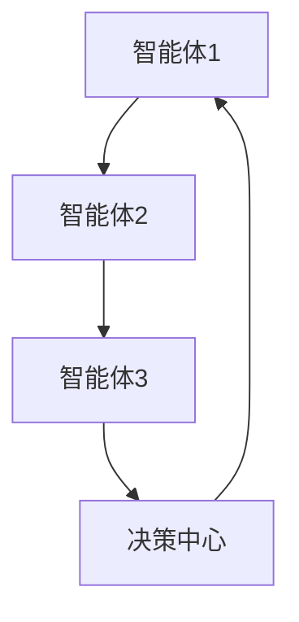

                 


# 《构建具有多智能体协同决策能力的系统》

## 关键词：
多智能体系统、协同决策、一致性算法、分布式系统、系统架构

## 摘要：
本文系统地探讨了构建具有多智能体协同决策能力的系统的各个方面。从背景介绍到核心概念，从算法原理到系统架构，再到项目实战和最佳实践，本文为读者提供了全面的指导。通过详细讲解多智能体协同决策的理论基础和实际应用，帮助读者理解并掌握如何设计和实现高效的多智能体协同决策系统。

---

# 第一部分：多智能体协同决策系统概述

## 第1章：多智能体协同决策系统背景介绍

### 1.1 问题背景
#### 1.1.1 单一智能体决策的局限性
单一智能体在面对复杂问题时，由于信息获取的局限性和计算能力的限制，难以做出最优决策。

#### 1.1.2 多智能体协同决策的需求
在现实世界中，许多问题需要多个智能体协同工作，例如交通管理、机器人协作、分布式计算等。

#### 1.1.3 多智能体协同决策的应用场景
- 智能交通系统：多个交通灯、车辆、行人协同决策。
- 分布式计算：多个计算节点协同完成任务。
- 机器人协作：多个机器人协同完成复杂任务。

### 1.2 问题描述
#### 1.2.1 多智能体协同决策的核心问题
如何实现多个智能体之间的信息共享、行为协调和决策一致性。

#### 1.2.2 多智能体之间的信息交互问题
智能体之间的信息传递需要高效、可靠，同时需要处理信息冲突和不确定性。

#### 1.2.3 多智能体协同决策的挑战与难点
- 信息不对称：不同智能体掌握的信息不同。
- 行为协调：如何确保智能体的行为一致。
- 决策优化：如何实现全局最优。

### 1.3 问题解决
#### 1.3.1 多智能体协同决策的解决方案
- 分布式计算：通过分布式算法实现智能体之间的协同。
- 协同决策算法：通过一致性算法、博弈论等方法实现决策协调。

#### 1.3.2 多智能体协同决策的实现方法
- 基于一致性算法：通过不断迭代实现全局一致。
- 基于分布式计算：通过消息传递实现协同。

#### 1.3.3 多智能体协同决策的优化策略
- 系统架构优化：通过合理的系统架构设计提高效率。
- 算法优化：通过改进算法减少计算开销。

### 1.4 边界与外延
#### 1.4.1 多智能体协同决策的边界条件
- 智能体数量：系统支持的智能体数量。
- 信息范围：智能体之间共享的信息范围。
- 决策范围：智能体的决策权限和范围。

#### 1.4.2 多智能体协同决策的外延范围
- 智能体类型：从简单智能体到复杂智能体。
- 问题规模：从局部问题到全局问题。
- 应用场景：从简单场景到复杂场景。

#### 1.4.3 多智能体协同决策与其他技术的关系
- 分布式计算：多智能体协同决策的基础。
- 协作机器人技术：多智能体协同决策的应用。
- 人工智能：多智能体协同决策的核心技术。

### 1.5 核心要素组成
#### 1.5.1 多智能体的核心要素
- 智能体：独立的决策单元。
- 信息共享：智能体之间的信息传递。
- 行为协调：智能体之间的行为一致。

#### 1.5.2 协同决策的关键要素
- 决策模型：描述智能体的决策规则。
- 信息模型：描述智能体之间的信息共享方式。
- 协调机制：描述智能体之间的行为协调方式。

#### 1.5.3 系统架构的核心要素
- 系统架构设计：系统的整体结构。
- 组件设计：系统的各个功能模块。
- 接口设计：系统各个模块之间的接口。

---

## 第2章：多智能体协同决策的核心概念与联系

### 2.1 多智能体系统的基本概念
#### 2.1.1 智能体的定义与特征
智能体是一个能够感知环境并采取行动以实现目标的实体。

#### 2.1.2 多智能体系统的定义
多智能体系统是由多个智能体组成的系统，智能体之间通过信息共享和行为协调完成任务。

#### 2.1.3 多智能体系统的特点
- 分布式：智能体独立运行。
- 协作性：智能体之间协作完成任务。
- 自适应性：智能体能够根据环境变化调整行为。

### 2.2 多智能体协同决策的核心概念
#### 2.2.1 协同决策的定义
协同决策是多个智能体通过信息共享和行为协调共同完成决策的过程。

#### 2.2.2 多智能体协同决策的原理
智能体通过信息共享和行为协调，共同完成决策任务。

#### 2.2.3 多智能体协同决策的目标
实现全局最优决策，同时保证智能体之间的行为一致。

### 2.3 多智能体协同决策的核心联系
#### 2.3.1 智能体之间的信息交互
智能体之间通过信息共享实现协同决策。

#### 2.3.2 智能体之间的行为协调
智能体之间通过行为协调实现一致的行动。

#### 2.3.3 智能体之间的决策协同
智能体之间通过决策协同实现全局最优。

### 2.4 多智能体协同决策的实体关系图


---

## 第3章：多智能体协同决策的算法原理

### 3.1 多智能体协同决策算法概述
#### 3.1.1 一致性算法
一致性算法是一种通过不断迭代实现系统内数据一致的算法。

#### 3.1.2 分布式算法
分布式算法是一种在分布式系统中实现特定目标的算法。

#### 3.1.3 博弈论模型
博弈论模型是一种通过分析智能体之间的博弈关系实现决策优化的模型。

### 3.2 一致性算法
#### 3.2.1 一致性算法的基本原理
通过不断迭代更新数据，使所有智能体的数据达到一致。

#### 3.2.2 一致性算法的实现步骤
1. 初始化数据。
2. 迭代更新数据。
3. 检查数据一致性。
4. 确保数据一致。

#### 3.2.3 一致性算法的数学模型
$$ \text{数据一致性} = \sum_{i=1}^{n} (x_i - x_{i-1}) $$

### 3.3 分布式算法
#### 3.3.1 分布式算法的基本原理
通过消息传递实现智能体之间的协同。

#### 3.3.2 分布式算法的实现步骤
1. 初始化智能体。
2. 消息传递。
3. 处理消息。
4. 返回结果。

#### 3.3.3 分布式算法的数学模型
$$ \text{消息传递} = \sum_{i=1}^{m} (message_i) $$

### 3.4 博弈论模型
#### 3.4.1 博弈论模型的基本原理
通过分析智能体之间的博弈关系实现决策优化。

#### 3.4.2 博弈论模型的实现步骤
1. 定义博弈规则。
2. 分析博弈关系。
3. 选择最优策略。

#### 3.4.3 博弈论模型的数学模型
$$ \text{博弈结果} = \max_{i} ( payoff_i ) $$

### 3.5 算法流程图


---

## 第4章：多智能体协同决策的系统分析与架构设计

### 4.1 系统分析
#### 4.1.1 问题场景介绍
智能交通系统中，多个交通灯、车辆、行人协同决策。

#### 4.1.2 系统功能设计
- 信息采集：智能体采集环境信息。
- 信息共享：智能体之间共享信息。
- 行为协调：智能体之间协调行为。

#### 4.1.3 系统功能需求
- 高效性：快速响应。
- 可靠性：准确决策。
- 可扩展性：支持更多智能体。

### 4.2 系统架构设计
#### 4.2.1 系统架构设计概述
系统由多个智能体组成，智能体之间通过信息共享和行为协调完成任务。

#### 4.2.2 系统架构图


#### 4.2.3 系统接口设计
- 智能体接口：智能体之间的接口。
- 决策中心接口：决策中心与其他智能体的接口。

#### 4.2.4 系统交互流程
1. 智能体采集信息。
2. 智能体之间共享信息。
3. 智能体协调行为。
4. 决策中心做出决策。

### 4.3 系统功能实现
#### 4.3.1 系统功能实现概述
通过实现信息共享和行为协调，实现多智能体协同决策。

#### 4.3.2 系统功能实现步骤
1. 初始化系统。
2. 智能体采集信息。
3. 智能体共享信息。
4. 智能体协调行为。
5. 决策中心做出决策。

### 4.4 系统交互流程图


---

## 第5章：多智能体协同决策的项目实战

### 5.1 项目介绍
#### 5.1.1 项目背景
智能交通系统中，多个交通灯、车辆、行人协同决策。

#### 5.1.2 项目目标
实现多智能体协同决策，优化交通流量。

### 5.2 系统核心实现
#### 5.2.1 环境安装
安装必要的软件和库，例如Python、分布式计算库等。

#### 5.2.2 系统核心代码实现
```python
# 初始化
agents = [Agent1, Agent2, Agent3]

# 信息共享
for agent in agents:
    agent.share_info()

# 行为协调
for agent in agents:
    agent.coordinate_behavior()

# 决策中心
decision_center = DecisionCenter(agents)
decision_center.make_decision()
```

#### 5.2.3 代码解读与分析
- 初始化智能体。
- 智能体之间共享信息。
- 智能体协调行为。
- 决策中心做出决策。

### 5.3 项目小结
#### 5.3.1 项目总结
通过实现多智能体协同决策，优化了交通流量。

#### 5.3.2 经验总结
- 系统架构设计的重要性。
- 算法优化的必要性。

---

## 第6章：多智能体协同决策的最佳实践

### 6.1 小结
#### 6.1.1 核心要点总结
多智能体协同决策的核心在于信息共享和行为协调。

#### 6.1.2 经验总结
- 系统架构设计的重要性。
- 算法优化的必要性。

### 6.2 注意事项
#### 6.2.1 系统设计注意事项
- 确保系统可扩展性。
- 确保系统可靠性。

#### 6.2.2 算法实现注意事项
- 确保算法高效性。
- 确保算法正确性。

### 6.3 拓展阅读
#### 6.3.1 推荐书籍
- 《分布式系统》
- 《博弈论》

#### 6.3.2 推荐论文
- 《Multi-agent System》
- 《Consensus Algorithm》

---

## 作者：AI天才研究院/AI Genius Institute & 禅与计算机程序设计艺术/Zen And The Art of Computer Programming

---

### 总结：
通过以上目录大纲，我们可以看到构建多智能体协同决策系统的复杂性和系统性。从理论到实践，从系统架构到算法实现，每一步都需要仔细设计和优化。希望本文能够为读者提供清晰的指导，帮助他们理解和实现多智能体协同决策系统。

