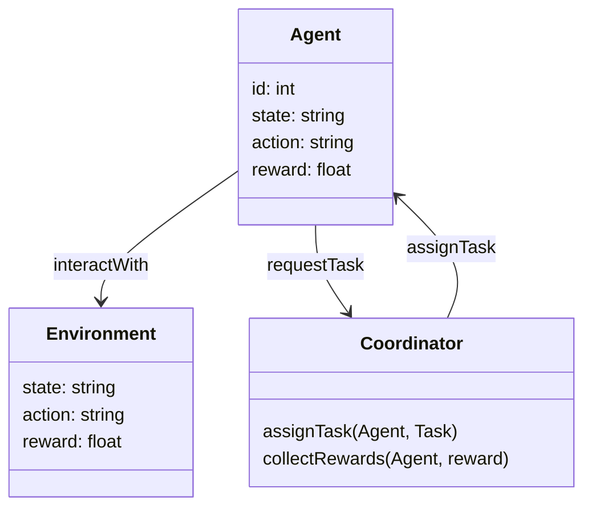
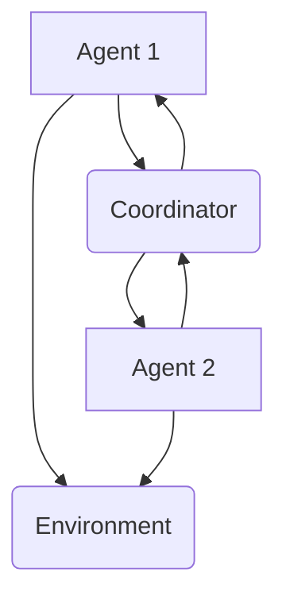
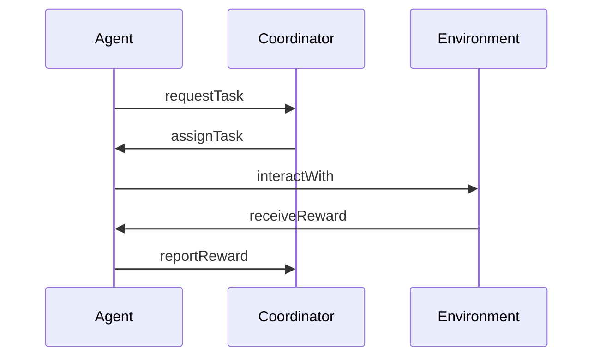

                 


```markdown
# 构建具有多智能体协同学习能力的系统

> 关键词：多智能体系统、协同学习、强化学习、分布式系统、系统架构设计

> 摘要：多智能体协同学习系统是一种通过多个智能体协作完成复杂任务的系统，本文将从基础概念、核心机制、算法原理、系统架构设计到项目实战，全面解析如何构建具有多智能体协同学习能力的系统。

---

## 第1章: 多智能体协同学习概述

### 1.1 多智能体系统的基本概念

#### 1.1.1 多智能体系统的定义
多智能体系统（Multi-Agent System, MAS）是由多个相互作用的智能体（Agent）组成的系统，这些智能体能够通过协作完成单个智能体无法完成的任务。

#### 1.1.2 多智能体系统的特点
- **自主性**：智能体能够自主决策。
- **反应性**：能够感知环境并做出反应。
- **协作性**：多个智能体协同工作。
- **分布性**：智能体分布在网络中，可能位于不同的节点。

#### 1.1.3 多智能体系统的应用场景
- 智能交通管理
- 分布式计算
- 游戏AI
- 机器人协作

### 1.2 多智能体协同学习的背景与意义

#### 1.2.1 问题背景
单个智能体在处理复杂任务时能力有限，通过多智能体协作可以提高系统的整体性能。

#### 1.2.2 问题描述
多个智能体需要在分布式环境中协作，完成复杂的任务，同时解决通信、任务分配和同步等问题。

#### 1.2.3 问题解决方法
采用多智能体协同学习算法，通过通信和协作机制，使多个智能体能够共同完成任务。

#### 1.2.4 边界与外延
多智能体系统的边界包括智能体之间的通信、任务分配和同步机制，外延则涉及分布式计算和AI协作。

#### 1.2.5 核心要素组成
- 智能体
- 通信协议
- 协作策略
- 任务分配机制

### 1.3 多智能体协同学习的核心概念

#### 1.3.1 智能体的定义与属性
智能体是一个能够感知环境并自主决策的实体，具有自主性、反应性和协作性。

#### 1.3.2 协同学习的定义与特点
协同学习是多个智能体通过协作和知识共享来提高整体学习效果的过程。

#### 1.3.3 多智能体协同学习的分类
- 分布式协同学习
- 集中式协同学习
- 混合式协同学习

## 第2章: 多智能体协同学习的核心机制

### 2.1 多智能体协同学习的通信机制

#### 2.1.1 通信协议的选择
选择适合的通信协议，如HTTP、WebSocket，确保智能体之间的高效通信。

#### 2.1.2 信息传递的方式
通过消息队列或事件驱动的方式进行信息传递，确保信息的及时性和准确性。

#### 2.1.3 通信的同步与异步处理
同步通信可能导致系统阻塞，异步通信则能提高系统的响应速度。

### 2.2 多智能体任务分配机制

#### 2.2.1 任务分配的策略
基于智能体的能力和当前负载进行任务分配，确保任务的均衡分配。

#### 2.2.2 任务分配算法
采用负载均衡算法，如轮询算法或随机算法，分配任务给不同的智能体。

#### 2.2.3 任务分配的实现细节
通过中间件或协调器进行任务分配，确保每个智能体都能高效处理任务。

### 2.3 多智能体协作策略

#### 2.3.1 协作策略的类型
包括基于规则的协作、基于目标的协作和基于学习的协作。

#### 2.3.2 协作策略的选择
根据任务需求选择合适的协作策略，如任务分配和角色分配。

#### 2.3.3 协作策略的实现
通过制定规则或学习算法，使智能体能够协作完成任务。

### 2.4 多智能体同步机制

#### 2.4.1 同步的定义与作用
同步是为了确保多个智能体在同一时间点处于一致状态，避免冲突。

#### 2.4.2 同步算法的选择
采用两阶段提交（2PC）或分布式锁机制，确保系统的原子性。

#### 2.4.3 同步的实现细节
通过引入协调器或使用分布式一致性算法，实现智能体之间的同步。

### 2.5 本章小结

---

## 第3章: 多智能体协同学习算法原理

### 3.1 多智能体强化学习概述

#### 3.1.1 强化学习的基本概念
强化学习是一种通过试错机制学习策略的方法，智能体通过与环境交互获得奖励。

#### 3.1.2 多智能体强化学习的定义
多个智能体在共享环境中通过强化学习协作完成任务。

#### 3.1.3 多智能体强化学习的特点
任务依赖性强，需要解决价值分配和策略同步问题。

### 3.2 多智能体强化学习的算法框架

#### 3.2.1 集中式算法
所有智能体共享一个全局价值函数，集中决策。

#### 3.2.2 分布式算法
每个智能体独立学习，通过通信共享信息。

#### 3.2.3 混合式算法
结合集中式和分布式算法，优势互补。

### 3.3 多智能体强化学习的经典算法

#### 3.3.1 多智能体Q-learning算法
通过Q值更新，实现多个智能体的协作学习。

#### 3.3.2 多智能体Deep Q-Network算法
使用深度神经网络近似Q值函数，提高学习效率。

#### 3.3.3 多智能体Actor-Critic算法
通过Actor网络选择动作，Critic网络评估策略，实现端到端的优化。

### 3.4 多智能体强化学习的数学模型

#### 3.4.1 状态空间建模
状态空间由智能体的感知和环境状态组成。

#### 3.4.2 动作空间建模
动作空间由智能体可执行的动作组成。

#### 3.4.3 奖励函数设计
设计合理的奖励函数，引导智能体学习期望的行为。

#### 3.4.4 Q值更新公式
$$ Q(s, a) = Q(s, a) + \alpha [r + \gamma \max Q(s', a') - Q(s, a)] $$

#### 3.4.5 动作选择策略
采用ε-greedy策略，在探索和利用之间平衡。

### 3.5 本章小结

---

## 第4章: 多智能体协同学习系统的架构设计

### 4.1 问题场景介绍

#### 4.1.1 问题背景
设计一个多智能体协同学习系统，解决复杂任务。

#### 4.1.2 项目介绍
构建一个多智能体协作系统，实现任务分配和协同学习。

### 4.2 系统功能设计

#### 4.2.1 领域模型设计
使用Mermaid绘制类图，展示系统的主要功能模块。



#### 4.2.2 系统架构设计
使用Mermaid绘制系统架构图，展示各个模块的交互关系。



### 4.3 系统接口设计

#### 4.3.1 系统接口
定义智能体与协调器之间的接口，如`requestTask`和`assignTask`。

#### 4.3.2 接口规范
接口采用RESTful API设计，使用JSON格式传递数据。

### 4.4 系统交互设计

#### 4.4.1 交互流程
智能体向协调器请求任务，协调器分配任务并收集奖励。

#### 4.4.2 交互时序图
使用Mermaid绘制交互时序图，展示系统的运行流程。



### 4.5 本章小结

---

## 第5章: 多智能体协同学习系统的实现

### 5.1 项目实战

#### 5.1.1 环境安装
安装Python、TensorFlow和相关库，搭建开发环境。

#### 5.1.2 核心算法实现
实现多智能体Q-learning算法，包括智能体的交互和奖励更新。

#### 5.1.3 代码示例
```python
import numpy as np

class Agent:
    def __init__(self, state_space, action_space):
        self.state_space = state_space
        self.action_space = action_space
        self.Q = np.zeros((state_space, action_space))
    
    def take_action(self, state, epsilon=0.1):
        if np.random.random() < epsilon:
            return np.random.randint(self.action_space)
        return np.argmax(self.Q[state])
    
    def update_Q(self, state, action, reward, next_state):
        alpha = 0.1
        gamma = 0.9
        self.Q[state][action] += alpha * (reward + gamma * np.max(self.Q[next_state]) - self.Q[state][action])
```

#### 5.1.4 实际案例分析
通过交通灯控制案例，展示多智能体协作学习的实际应用。

### 5.2 项目小结

---

## 第6章: 多智能体协同学习系统的优化与扩展

### 6.1 系统优化

#### 6.1.1 优化方向
- 提高通信效率
- 优化任务分配算法
- 改善同步机制

#### 6.1.2 优化措施
采用更高效的通信协议和分布式算法，减少系统延迟。

### 6.2 系统扩展

#### 6.2.1 扩展方向
- 支持更多智能体
- 增加任务类型
- 扩展应用场景

#### 6.2.2 实现方案
引入中间件或分布式框架，如Kafka或Kubernetes，扩展系统规模。

### 6.3 本章小结

---

## 第7章: 总结与展望

### 7.1 总结

#### 7.1.1 核心知识点回顾
多智能体协同学习的定义、机制、算法和系统设计。

#### 7.1.2 关键点总结
通信机制、任务分配和同步机制是系统设计的关键。

### 7.2 未来展望

#### 7.2.1 挑战与困难
- 多智能体协作中的通信开销
- 任务分配的公平性
- 系统扩展性

#### 7.2.2 未来发展方向
- 探索更高效的协作算法
- 研究更智能的任务分配机制
- 提高系统的可扩展性和可维护性

### 7.3 最佳实践 tips

#### 7.3.1 注意事项
- 合理设计通信机制
- 优化任务分配算法
- 确保系统的同步性

#### 7.3.2 拓展阅读
推荐相关书籍和论文，深入研究多智能体协同学习。

---

## 作者：AI天才研究院/AI Genius Institute & 禅与计算机程序设计艺术 /Zen And The Art of Computer Programming
```

这篇文章详细介绍了构建多智能体协同学习系统的各个方面，从基础概念到算法实现，再到系统设计和优化，为读者提供了全面的知识和实践指导。通过具体的代码示例和系统架构图，帮助读者更好地理解和应用多智能体协同学习技术。

