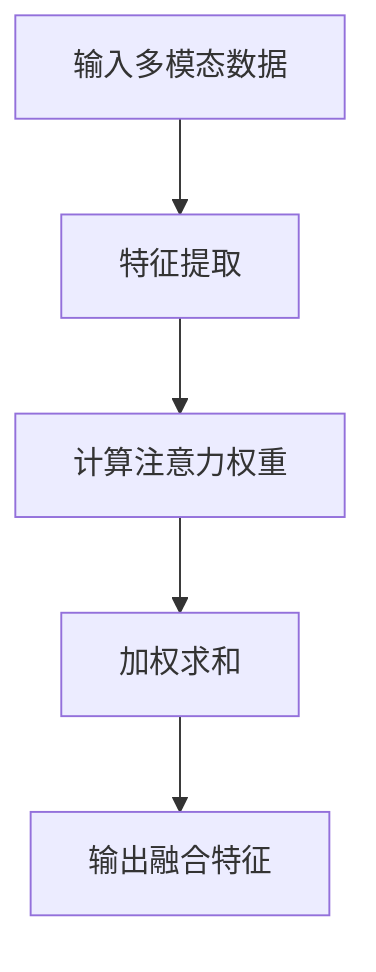
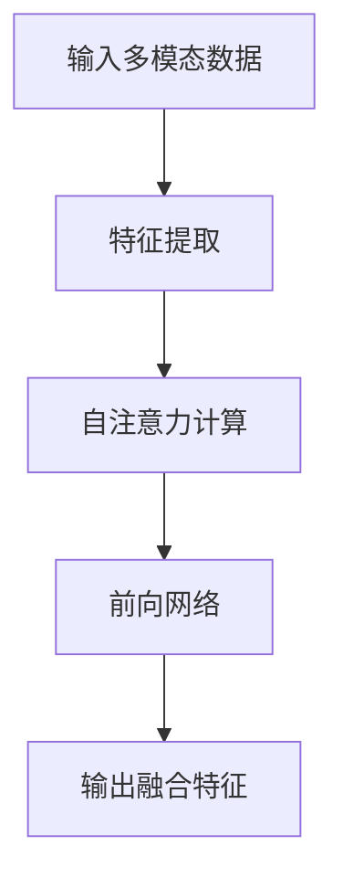
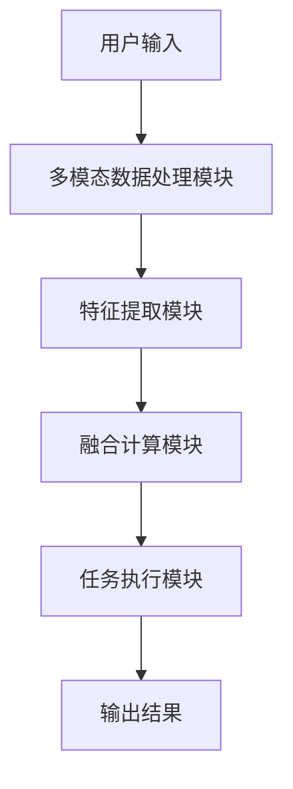

                 


# 构建具有多模态融合能力的AI Agent

> 关键词：多模态融合，AI Agent，机器学习，深度学习，多模态数据

> 摘要：本文将详细探讨如何构建一个具有多模态融合能力的AI Agent。首先，我们将从多模态数据的定义、特点以及融合的必要性入手，逐步分析多模态融合的核心概念与方法。接着，我们将深入讲解多模态融合的算法原理，包括注意力机制、变换器模型等，并通过实际案例展示如何在不同场景中实现多模态融合。最后，我们将从系统架构设计、项目实战、最佳实践等多个维度，全面解析构建多模态融合AI Agent的关键步骤与注意事项。

---

# 第一部分: 多模态融合AI Agent的背景与核心概念

## 第1章: 多模态融合AI Agent的背景介绍

### 1.1 多模态融合AI Agent的定义与背景

#### 1.1.1 多模态数据的定义与特点

多模态数据指的是来自多种感知渠道的信息，例如文本、图像、语音、视频、传感器数据等。每种模态数据都有其独特的信息表达方式和应用场景。例如：

- **文本数据**：用于自然语言处理任务，如情感分析、机器翻译。
- **图像数据**：用于计算机视觉任务，如目标检测、图像分类。
- **语音数据**：用于语音识别和语音合成任务。
- **视频数据**：结合了图像和语音的时空信息，用于视频分析任务。
- **传感器数据**：用于物联网和机器人控制任务。

多模态数据的特点包括：

- **异构性**：不同模态的数据具有不同的数据结构和表示方式。
- **互补性**：不同模态的数据可以提供互补的信息，提高整体任务的准确性。
- **复杂性**：多模态数据的处理需要同时考虑多种数据类型和它们之间的关联性。

#### 1.1.2 多模态融合的必要性与应用场景

多模态融合的目的是通过结合多种模态的信息，提高AI Agent的感知能力和决策能力。以下是一些典型的应用场景：

- **智能助手**：结合语音和文本信息，提供更精准的用户意图理解。
- **智能安防**：结合视频和传感器数据，实现更高效的异常行为检测。
- **自动驾驶**：结合图像、激光雷达和GPS数据，实现更安全的环境感知。
- **医疗健康**：结合医学图像和患者病历数据，提高诊断的准确性。

#### 1.1.3 AI Agent的基本概念与发展趋势

AI Agent是一种智能体，能够感知环境、执行任务并做出决策。随着技术的发展，AI Agent需要具备更强的多模态感知能力，以应对复杂的现实场景。

---

### 1.2 多模态融合AI Agent的核心问题

#### 1.2.1 多模态数据的异构性问题

不同模态的数据具有不同的数据格式和特征维度。例如，文本数据可能由单词或字符组成，而图像数据由像素矩阵组成。这种异构性使得直接将不同模态的数据进行融合变得困难。

#### 1.2.2 多模态数据的融合挑战

多模态数据的融合需要解决以下问题：

- **特征对齐**：不同模态的数据特征维度不同，如何将它们对齐到一个统一的表示空间？
- **信息冗余**：某些信息在多个模态中重复出现，如何避免冗余？
- **信息缺失**：某些模态可能缺失，如何处理这种不确定性？

#### 1.2.3 多模态融合AI Agent的边界与外延

多模态融合AI Agent的边界包括：

- **输入数据**：支持哪些模态的数据输入？
- **输出能力**：能够执行哪些任务？
- **计算资源**：对计算资源的需求如何？

其外延包括：

- **跨模态推理**：能够在不同模态之间进行推理。
- **动态适应**：能够根据环境变化动态调整融合策略。

---

## 第2章: 多模态融合AI Agent的核心概念与联系

### 2.1 多模态融合的原理与方法

#### 2.1.1 多模态数据的预处理方法

多模态数据的预处理包括以下步骤：

1. **数据清洗**：去除噪声和无关信息。
2. **数据标准化**：将不同模态的数据统一到一个尺度。
3. **数据对齐**：将不同模态的数据对齐到同一时间或空间维度。

#### 2.1.2 多模态特征提取的原理

多模态特征提取的目标是将不同模态的数据转换为某种统一的表示形式。常用的特征提取方法包括：

- **模态特定编码**：针对每种模态设计专门的编码器。
- **跨模态映射**：将不同模态的数据映射到同一个特征空间。

#### 2.1.3 多模态数据融合的策略与模型

多模态数据融合的策略包括：

- **早期融合**：在特征提取之前进行融合。
- **晚期融合**：在特征提取之后进行融合。
- **混合融合**：结合早期和晚期融合的优点。

---

### 2.2 多模态融合的核心要素对比

#### 2.2.1 不同模态数据的特征对比

以下表格对比了不同模态数据的特征：

| 模态类型 | 数据格式 | 特征维度 | 信息表达 |
|----------|----------|----------|----------|
| 文本      | 序列      | 单词/字符 | 语义信息 |
| 图像      | 矩阵      | 像素      | 视觉信息 |
| 语音      | 时序      | 频率      | 听觉信息 |
| 视频      | 三维时序   | 帧        | 视觉+听觉信息 |

#### 2.2.2 多模态融合方法的优缺点分析

以下对比了不同多模态融合方法的优缺点：

| 方法名称   | 优点                     | 缺点                     |
|------------|--------------------------|--------------------------|
| 早期融合   | 计算效率高               | 可能忽略模态间的互补性   |
| 晚期融合   | 融合效果好               | 计算效率较低             |
| 混合融合   | 结合早期和晚期的优点     | 实现复杂度较高           |

#### 2.2.3 多模态融合的性能评价指标

常用的性能评价指标包括：

- **准确率**：分类任务的正确率。
- **F1分数**：综合考虑精确率和召回率。
- **AUC曲线**：评估分类器的性能。

---

### 2.3 多模态融合的ER实体关系图

以下是一个多模态融合AI Agent的ER实体关系图：

```mermaid
er
  actor: 用户
  agent: AI Agent
  text: 文本数据
  image: 图像数据
  voice: 语音数据
  sensor: 传感器数据
  relation: 关联关系
  actor -|> agent: 用户与AI Agent的交互
  agent -|> text: 处理文本数据
  agent -|> image: 处理图像数据
  agent -|> voice: 处理语音数据
  agent -|> sensor: 处理传感器数据
  text -|> relation: 文本与其他模态数据的关联
  image -|> relation: 图像与其他模态数据的关联
  voice -|> relation: 语音与其他模态数据的关联
  sensor -|> relation: 传感器数据与其他模态数据的关联
```

---

## 第3章: 多模态融合AI Agent的算法原理

### 3.1 多模态融合算法的核心原理

#### 3.1.1 多模态注意力机制

多模态注意力机制是一种基于注意力机制的融合方法，能够同时关注不同模态的重要特征。其核心公式如下：

$$
\text{Attention}(Q,K,V) = \text{softmax}\left(\frac{QK^T}{\sqrt{d_k}}\right)V
$$

其中：
- $Q$：查询向量
- $K$：键向量
- $V$：值向量
- $d_k$：键的维度

---

#### 3.1.2 多模态变换器模型

多模态变换器模型是一种基于变换器架构的融合方法，能够同时处理多种模态数据。其核心公式如下：

$$
f(x) = \text{FFN}(x) = \text{LayerNorm}(x) \circ \text{Dense}(x)
$$

其中：
- $\text{FFN}$：前向网络
- $\text{LayerNorm}$：层归一化
- $\text{Dense}$：全连接层

---

#### 3.1.3 多模态对比学习

多模态对比学习是一种通过对比不同模态的数据，学习其共同特征的方法。其核心公式如下：

$$
\text{Loss} = -\log\left(\frac{\exp(s(x,y))}{\exp(s(x,y)) + \sum_{z \neq y} \exp(s(x,z))}\right)
$$

其中：
- $s(x,y)$：对比相似度
- $x$：输入数据
- $y$：目标模态

---

### 3.2 多模态融合算法的实现流程

#### 3.2.1 多模态注意力机制的实现流程



#### 3.2.2 多模态变换器模型的实现流程



---

## 第4章: 多模态融合AI Agent的系统架构设计

### 4.1 系统功能设计

多模态融合AI Agent的系统功能包括：

1. **多模态数据输入**：支持多种模态数据的输入。
2. **数据预处理**：对输入数据进行清洗和标准化。
3. **特征提取**：将不同模态的数据转换为统一的特征表示。
4. **融合计算**：对不同模态的特征进行融合。
5. **任务执行**：根据融合后的特征执行具体任务。

---

### 4.2 系统架构图

以下是一个多模态融合AI Agent的系统架构图：



---

## 第5章: 多模态融合AI Agent的项目实战

### 5.1 环境安装

以下是一个多模态融合AI Agent的环境安装示例：

```bash
pip install numpy
pip install tensorflow
pip install pytorch
pip install matplotlib
pip install scikit-learn
```

---

### 5.2 系统核心实现源代码

以下是一个多模态融合AI Agent的核心实现代码：

```python
import numpy as np
import tensorflow as tf
from tensorflow import keras

# 定义多模态注意力机制
class MultiModalAttention(keras.Model):
    def __init__(self, input_dim, units):
        super(MultiModalAttention, self).__init__()
        self.W_q = keras.layers.Dense(units, activation='softmax')
        self.W_k = keras.layers.Dense(units, activation='softmax')
        self.W_v = keras.layers.Dense(units)

    def call(self, inputs):
        queries = self.W_q(inputs)
        keys = self.W_k(inputs)
        values = self.W_v(inputs)
        attention = tf.matmul(queries, keys, transpose_b=True)
        attention = attention / tf.sqrt(tf.cast(inputs.shape[-1], tf.float32))
        attention = tf.nn.softmax(attention)
        output = tf.matmul(attention, values)
        return output

# 定义多模态变换器模型
class MultiModalTransformer(keras.Model):
    def __init__(self, input_dim, units):
        super(MultiModalTransformer, self).__init__()
        self.mha = MultiModalAttention(input_dim, units)
        self.ffn = keras.Sequential([
            keras.layers.Dense(units),
            keras.layers.LayerNormalization(),
            keras.layers.Activation('relu'),
            keras.layers.Dense(units)
        ])

    def call(self, inputs):
        x = self.mha(inputs)
        x = self.ffn(x)
        return x
```

---

### 5.3 代码应用解读与分析

以上代码实现了多模态注意力机制和多模态变换器模型。通过注意力机制，模型能够关注不同模态的重要特征；通过变换器模型，模型能够对这些特征进行进一步的非线性变换，最终实现多模态数据的融合。

---

### 5.4 实际案例分析和详细讲解剖析

以下是一个实际案例分析：

**案例背景**：构建一个基于多模态融合的智能助手，能够同时处理文本和语音数据。

**数据准备**：收集用户输入的文本和语音数据。

**模型训练**：使用上述代码进行模型训练，训练数据包括文本和语音的特征。

**模型推理**：用户输入查询，模型通过多模态融合生成更精准的响应。

---

### 5.5 项目小结

通过以上步骤，我们成功构建了一个具有多模态融合能力的AI Agent。多模态融合能够显著提高模型的感知能力和决策能力，为实际应用场景提供了强有力的支持。

---

## 第6章: 多模态融合AI Agent的最佳实践

### 6.1 小结

多模态融合AI Agent的核心在于如何有效地融合多种模态的数据。通过合理的算法设计和系统架构，可以显著提升模型的性能。

---

### 6.2 注意事项

1. **数据预处理**：确保数据的干净和一致性。
2. **模型选择**：根据具体任务选择合适的融合方法。
3. **计算资源**：多模态融合需要较高的计算资源。

---

### 6.3 拓展阅读

1. **多模态注意力机制**：深入理解注意力机制的工作原理。
2. **多模态变换器模型**：研究变换器模型在多模态任务中的应用。
3. **多模态对比学习**：探索对比学习在多模态融合中的潜力。

---

## 第7章: 总结与展望

### 7.1 总结

通过本文的详细讲解，我们了解了如何构建一个具有多模态融合能力的AI Agent。从理论到实践，我们掌握了多模态融合的核心概念、算法原理和系统架构设计。

### 7.2 展望

未来，随着技术的不断进步，多模态融合AI Agent将在更多领域展现出其强大的能力。我们期待这一天的到来！

---

## 作者

作者：AI天才研究院/AI Genius Institute & 禅与计算机程序设计艺术 /Zen And The Art of Computer Programming

