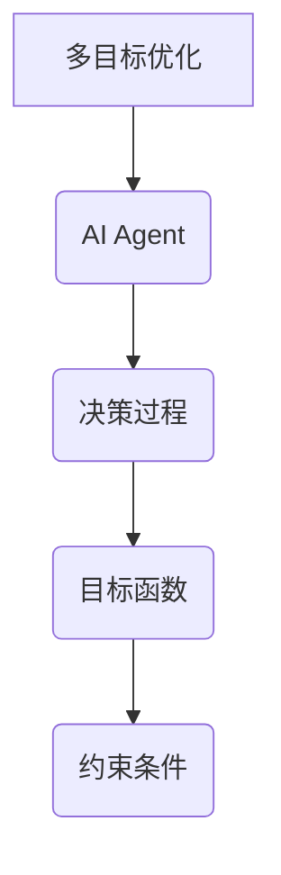
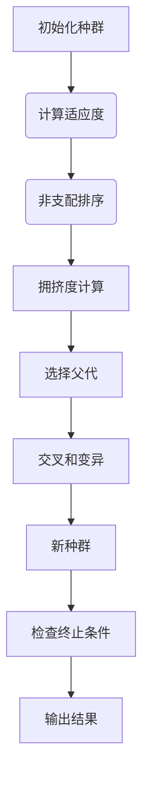
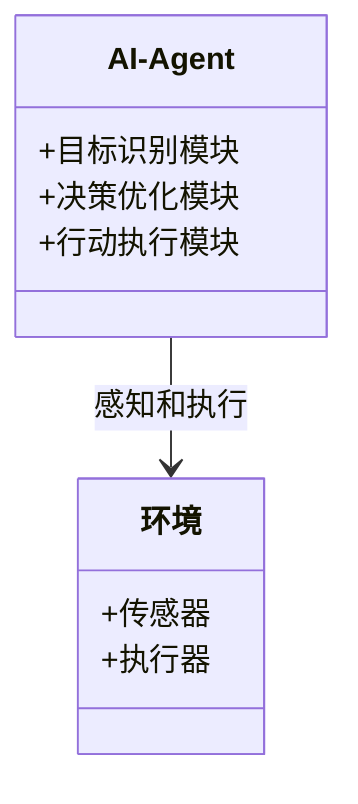
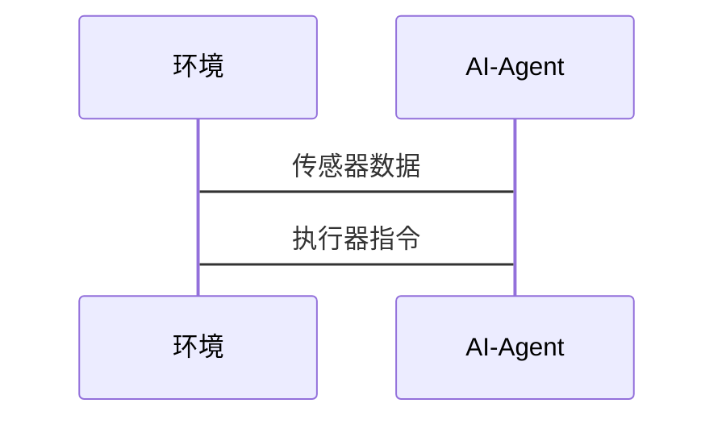

                 


# 构建具有多目标优化能力的AI Agent

## 关键词：多目标优化、AI Agent、算法原理、系统架构、项目实战

## 摘要：本文详细探讨了构建具有多目标优化能力的AI Agent的方法，从背景介绍到算法原理，再到系统架构和项目实战，全面分析了如何在复杂场景中实现多目标优化与AI Agent的结合。文章通过详细的数学模型、算法流程图和代码示例，帮助读者理解并掌握构建此类AI Agent的核心技术。

---

# 第一部分: 背景介绍

# 第1章: 多目标优化与AI Agent概述

## 1.1 多目标优化的定义与特点

### 1.1.1 多目标优化的定义
多目标优化（Multi-Objective Optimization, MOO）是指在多个相互冲突的目标下，寻找最优解的过程。与单目标优化不同，MOO需要在多个目标之间找到平衡点，通常以 Pareto 最优解集的形式呈现。

### 1.1.2 多目标优化的核心特点
1. **目标多样性**：存在多个相互冲突的目标。
2. **Pareto最优性**： Pareto最优解是指在不改善一个目标的情况下，无法改善另一个目标的解。
3. **解集的非支配性**：每个解都不被其他解支配。

### 1.1.3 多目标优化与单目标优化的对比
| 对比维度 | 单目标优化 | 多目标优化 |
|----------|------------|------------|
| 目标数量 | 单个目标    | 多个目标    |
| 解空间    | 点          | 集合        |
| 解的评估  | 明确         | 多目标评估   |

## 1.2 AI Agent的基本概念

### 1.2.1 AI Agent的定义
AI Agent（人工智能代理）是指在计算机系统中，能够感知环境并采取行动以实现目标的实体。Agent 可以是软件程序，也可以是物理机器人。

### 1.2.2 AI Agent的核心特点
1. **自主性**：能够在没有外部干预的情况下运行。
2. **反应性**：能够感知环境并做出实时反应。
3. **目标导向性**：所有行为都以实现目标为导向。

### 1.2.3 AI Agent与传统程序的区别
| 对比维度 | 传统程序     | AI Agent      |
|----------|--------------|---------------|
| 行为驱动 | 预定义指令   | 动态响应环境   |
| 学习能力 | 无            | 可有学习能力   |
| 目标导向 | 无            | 明确目标导向   |

## 1.3 多目标优化在AI Agent中的应用背景

### 1.3.1 多目标优化的必要性
在现实场景中，AI Agent往往需要在多个目标之间权衡，例如自动驾驶需要在速度、安全性和能耗之间找到平衡。

### 1.3.2 AI Agent在复杂场景中的挑战
复杂场景通常涉及多个目标，例如自动驾驶需要考虑速度、安全性和能耗。

### 1.3.3 多目标优化与AI Agent的结合
通过多目标优化，AI Agent可以在复杂场景中找到最优或近似最优的解决方案。

## 1.4 本章小结
本章介绍了多目标优化和AI Agent的基本概念，并探讨了它们在复杂场景中的结合。多目标优化为AI Agent提供了在多个目标之间平衡的能力，而AI Agent则为多目标优化提供了动态的应用场景。

---

# 第二部分: 核心概念与联系

# 第2章: 多目标优化与AI Agent的核心概念

## 2.1 多目标优化的数学模型

### 2.1.1 多目标优化的数学表达
$$ \text{目标函数：} f(x) = (f_1(x), f_2(x), ..., f_n(x)) $$
其中，\( x \) 是决策变量，\( f_i(x) \) 是第 \( i \) 个目标函数。

### 2.1.2 约束条件
$$ \text{约束：} g_i(x) \leq 0, i = 1, 2, ..., m $$
其中，\( g_i(x) \) 是第 \( i \) 个约束条件。

## 2.2 AI Agent的决策模型

### 2.2.1 AI Agent的决策过程
1. **感知环境**：通过传感器或其他方式获取环境信息。
2. **目标识别**：识别需要优化的目标。
3. **决策优化**：通过多目标优化算法找到最优解。
4. **行动执行**：根据最优解执行行动。

### 2.2.2 多目标优化在决策中的作用
多目标优化帮助AI Agent在多个目标之间找到平衡点，从而做出最优决策。

### 2.2.3 多目标优化与AI Agent的结合方式
1. **嵌入式优化**：将多目标优化算法嵌入AI Agent的决策模块中。
2. **外部优化**：在AI Agent之外单独进行多目标优化，再将结果传递给AI Agent。

## 2.3 多目标优化与AI Agent的关系图（Mermaid流程图）



## 2.4 本章小结
本章详细讲解了多目标优化与AI Agent的核心概念，并通过流程图展示了它们之间的关系。多目标优化为AI Agent提供了决策优化的能力，而AI Agent则为多目标优化提供了应用场景。

---

# 第三部分: 算法原理讲解

# 第3章: 多目标优化算法原理

## 3.1 常见多目标优化算法

### 3.1.1 NSGA-II算法
NSGA-II（Non-dominated Sorting Genetic Algorithm II）是一种经典的多目标优化算法，由Deb等人提出。

### 3.1.2 MOEA/D算法
MOEA/D（Multi-objective Evolutionary Algorithm based on Decomposition）是一种基于分解的多目标优化算法。

### 3.1.3 其他多目标优化算法
包括Pareto Front-based算法、层次化算法等。

## 3.2 NSGA-II算法流程图（Mermaid）



## 3.3 NSGA-II算法的Python实现示例

```python
import random

def objective_function(x):
    # 定义目标函数
    f1 = x[0]**2 + x[1]**2
    f2 = (x[0] - 1)**2 + (x[1] - 1)**2
    return [f1, f2]

def nsga_ii():
    # 初始化种群
    population = [[random.uniform(0, 1), random.uniform(0, 1)] for _ in range(10)]
    
    # 计算适应度
    for x in population:
        obj = objective_function(x)
        print(f"f1={obj[0]}, f2={obj[1]}")

nsga_ii()
```

## 3.4 数学模型

### 3.4.1 NSGA-II的核心思想
NSGA-II通过非支配排序和拥挤度计算来维护Pareto最优解集。

### 3.4.2 NSGA-II的适应度计算
$$ f(x) = (f_1(x), f_2(x), ..., f_n(x)) $$

### 3.4.3 非支配排序
在非支配排序中，如果一个解在所有目标上都不劣于另一个解，则它支配另一个解。

## 3.5 本章小结
本章详细讲解了NSGA-II算法的原理和实现，并通过Python代码示例展示了算法的应用。多目标优化算法为AI Agent提供了强大的决策优化能力。

---

# 第四部分: 系统架构与设计

# 第4章: AI Agent的系统架构设计

## 4.1 问题场景介绍
考虑一个自动驾驶场景，AI Agent需要在速度、安全性和能耗之间进行优化。

## 4.2 系统功能设计

### 4.2.1 领域模型（Mermaid类图）



### 4.2.2 系统架构设计（Mermaid架构图）


## 4.3 系统接口设计

### 4.3.1 输入接口
- 传感器数据：来自环境的感知信息。

### 4.3.2 输出接口
- 执行器指令：AI Agent的决策结果。

## 4.4 系统交互流程（Mermaid序列图）



## 4.5 本章小结
本章通过领域模型和架构图展示了AI Agent的系统结构，并通过序列图描述了系统交互流程。系统架构设计为AI Agent的实现提供了清晰的指导。

---

# 第五部分: 项目实战

# 第5章: 实现具有多目标优化能力的AI Agent

## 5.1 环境安装

### 5.1.1 安装Python
确保安装了Python 3.x。

### 5.1.2 安装依赖库
安装必要的库，例如`numpy`、`scipy`等。

## 5.2 系统核心实现

### 5.2.1 目标识别模块
定义需要优化的目标函数。

### 5.2.2 决策优化模块
实现多目标优化算法，例如NSGA-II。

### 5.2.3 行动执行模块
根据优化结果执行相应动作。

## 5.3 代码实现示例

```python
import numpy as np

def multi_objective_optimization():
    # 定义目标函数
    def f(x):
        return [x[0]**2 + x[1]**2, (x[0]-1)**2 + (x[1]-1)**2]

    # 初始化种群
    population = np.random.rand(10, 2)
    
    # 计算目标函数值
    for x in population:
        obj = f(x)
        print(f"f1={obj[0]}, f2={obj[1]}")

multi_objective_optimization()
```

## 5.4 代码解读与分析
- **目标函数**：定义了两个目标函数 \( f_1 \) 和 \( f_2 \)。
- **种群初始化**：随机生成10个种群个体。
- **目标函数计算**：计算每个个体的目标函数值。

## 5.5 实际案例分析
以自动驾驶为例，AI Agent需要在速度、安全性和能耗之间找到平衡点。

## 5.6 本章小结
本章通过代码示例展示了如何实现具有多目标优化能力的AI Agent，并通过实际案例分析加深了对算法的理解。

---

# 第六部分: 最佳实践与总结

# 第6章: 最佳实践与总结

## 6.1 最佳实践 tips

### 6.1.1 算法选择
根据具体场景选择合适的多目标优化算法。

### 6.1.2 参数调整
合理调整算法参数，以获得更好的优化效果。

### 6.1.3 性能优化
通过并行计算等方法优化算法性能。

## 6.2 小结
本文详细讲解了构建具有多目标优化能力的AI Agent的方法，从背景介绍到算法实现，再到系统架构设计和项目实战，为读者提供了全面的指导。

## 6.3 注意事项
- **算法选择**：根据具体场景选择合适的算法。
- **参数调整**：合理调整算法参数。
- **性能优化**：优化算法性能以提高效率。

## 6.4 拓展阅读
推荐阅读Deb的《Multi-objective Optimization Using Evolutionary Algorithms》一书，深入理解多目标优化的理论与应用。

---

# 作者：AI天才研究院 & 禅与计算机程序设计艺术

---

通过本文，读者可以系统地了解构建具有多目标优化能力的AI Agent的核心技术，并能够通过实际案例分析和代码实现，掌握相关知识。

