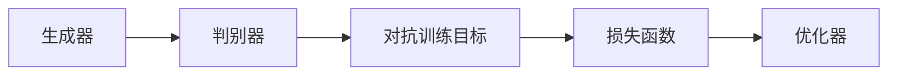
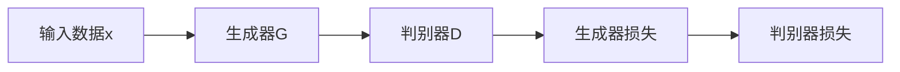
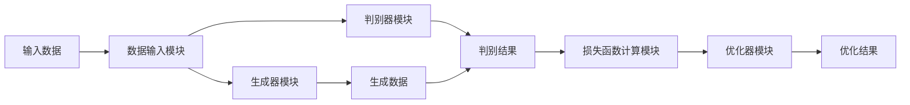
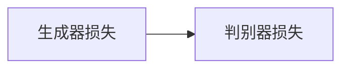

                 


# 构建具有对抗学习能力的AI Agent

## 关键词：对抗学习、生成对抗网络、AI代理、强化学习、深度学习

## 摘要：本文将详细探讨如何构建具有对抗学习能力的AI Agent，从基础概念到算法实现，再到系统架构设计，最后通过实际项目案例进行分析。我们将深入理解对抗学习的核心原理、算法实现、系统设计与优化，并提供具体的代码实现和应用案例，帮助读者掌握构建具有对抗学习能力的AI Agent的关键技术。

---

# 第一部分: 对抗学习与AI Agent基础

## 第1章: 对抗学习与AI Agent概述

### 1.1 对抗学习的基本概念

#### 1.1.1 对抗学习的定义与核心原理

对抗学习是一种通过两个或多个AI模型相互竞争来提升性能的机器学习方法。其核心思想是通过生成器和判别器的对抗过程，推动生成器生成更逼真、更符合目标分布的数据，同时判别器则试图区分真实数据和生成数据。

**生成器（Generator）**：负责生成数据，目标是欺骗判别器，使其认为生成的数据是真实的。

**判别器（Discriminator）**：负责区分真实数据和生成数据，目标是尽可能准确地区分两者。

对抗学习的核心在于两者通过零和博弈（Zero-sum Game）不断优化，最终达到纳什均衡（Nash Equilibrium）。

#### 1.1.2 AI Agent的基本概念与特点

AI Agent（智能体）是指在环境中能够感知并自主行动以实现目标的实体。AI Agent具有以下特点：

1. **自主性**：能够在没有外部干预的情况下自主决策。
2. **反应性**：能够感知环境并实时调整行为。
3. **目标导向**：具有明确的目标，并采取行动以实现目标。
4. **学习能力**：能够通过经验改进自身的性能。

#### 1.1.3 对抗学习在AI Agent中的作用

对抗学习通过引入竞争机制，使AI Agent在动态和复杂的环境中能够更好地适应和优化自身行为。例如，在游戏AI中，两个AI Agent可以通过对抗学习不断提升自己的策略和决策能力。

---

### 1.2 对抗学习的核心概念与联系

#### 1.2.1 对抗学习的核心概念原理

对抗学习的核心在于生成器和判别器之间的对抗过程。生成器的目标是最小化判别器区分生成数据和真实数据的能力，而判别器的目标是最大化区分能力。

#### 1.2.2 对抗学习与强化学习的对比分析

| 对比维度         | 对抗学习                          | 强化学习                          |
|------------------|-----------------------------------|------------------------------------|
| 学习目标         | 生成与判别                       | 最大化累积奖励                    |
| 激励机制         | 竞争关系                         | 奖励驱动                          |
| 应用场景         | 生成数据、图像生成                | 游戏、机器人控制等                 |

对抗学习与强化学习的结合为AI Agent提供了更强大的学习能力，尤其是在复杂环境中的决策和策略优化。

#### 1.2.3 对抗学习的ER实体关系图架构



---

### 1.3 对抗学习的数学模型与公式

#### 1.3.1 对抗学习的数学模型

对抗学习的核心数学模型由生成器和判别器的损失函数组成。对于生成器，目标是最小化判别器输出为假（生成数据为假）的概率，而对于判别器，目标是最大化区分真实数据和生成数据的能力。

#### 1.3.2 GAN（生成对抗网络）的核心公式

生成器的损失函数：
$$ \text{生成器损失} = \log(1 - D(G(x))) $$

判别器的损失函数：
$$ \text{判别器损失} = -[\log(D(x)) + \log(1 - D(G(x)))] $$

其中：
- \( D(x) \) 表示判别器对真实数据 \( x \) 的判断概率。
- \( G(x) \) 表示生成器生成的数据。

---

## 第2章: 对抗学习的核心算法

### 2.1 GAN算法原理

#### 2.1.1 GAN的基本结构

GAN由生成器和判别器组成，两者的对抗训练过程如下：

1. **初始化**：随机初始化生成器和判别器的参数。
2. **训练判别器**：使用真实数据和生成数据训练判别器，使其能够区分两者。
3. **训练生成器**：使用生成数据训练生成器，使其生成的数据能够欺骗判别器。
4. **迭代优化**：重复上述步骤，直到生成器和判别器的损失函数达到平衡。

#### 2.1.2 GAN的训练过程



### 2.2 WGAN算法原理

#### 2.2.1 WGAN的改进思路

Wasserstein GAN（WGAN）通过引入Wasserstein距离，解决了GAN训练过程中判别器梯度消失的问题。WGAN的核心思想是将对抗学习的目标从分类任务转换为回归任务。

#### 2.2.2 WGAN的数学公式

Wasserstein距离定义为：
$$ \text{Wasserstein距离} = \inf_{\gamma \in \Gamma} \mathbb{E}_{x \sim P, y \sim Q} [\gamma(x,y)] $$

其中，\( \Gamma \) 是所有联合分布的集合。

---

## 第3章: 对抗学习的系统设计与优化

### 3.1 系统架构设计

#### 3.1.1 系统功能设计

| 功能模块         | 描述                         |
|------------------|------------------------------|
| 数据输入模块     | 接收输入数据并进行预处理     |
| 生成器模块       | 生成符合目标分布的数据       |
| 判别器模块       | 判别数据的真实性和生成性     |
| 损失函数计算模块 | 计算生成器和判别器的损失     |
| 优化器模块       | 优化生成器和判别器的参数     |

#### 3.1.2 系统架构图



---

## 第4章: 对抗学习的项目实战

### 4.1 项目背景与目标

#### 4.1.1 项目背景

以图像生成为例，我们希望通过对抗学习训练生成器生成高质量的图像。

#### 4.1.2 项目目标

1. 实现一个简单的GAN模型。
2. 通过训练生成器和判别器，生成逼真的图像。

### 4.2 环境安装与配置

#### 4.2.1 环境安装

```bash
pip install numpy matplotlib tensorflow-gpu
```

#### 4.2.2 环境配置

```python
import numpy as np
import tensorflow as tf
```

### 4.3 核心代码实现

#### 4.3.1 生成器网络

```python
def generator():
    model = tf.keras.Sequential([
        tf.keras.layers.Dense(256, activation='relu'),
        tf.keras.layers.Dense(128, activation='relu'),
        tf.keras.layers.Dense(784, activation='sigmoid'),
    ])
    return model
```

#### 4.3.2 判别器网络

```python
def discriminator():
    model = tf.keras.Sequential([
        tf.keras.layers.Dense(256, activation='relu'),
        tf.keras.layers.Dense(128, activation='relu'),
        tf.keras.layers.Dense(1, activation='sigmoid'),
    ])
    return model
```

#### 4.3.3 对抗训练过程

```python
generator = generator()
discriminator = discriminator()

# 编译模型
generator.compile(optimizer='adam', loss='binary_crossentropy')
discriminator.compile(optimizer='adam', loss='binary_crossentropy')
```

### 4.4 实验结果与分析

#### 4.4.1 训练过程中的损失变化



---

## 第5章: 最佳实践与总结

### 5.1 最佳实践

1. **数据预处理**：确保输入数据的质量和一致性。
2. **模型调参**：合理选择生成器和判别器的网络结构和超参数。
3. **训练策略**：采用交替训练生成器和判别器的策略，避免梯度消失问题。

### 5.2 小结

通过对抗学习，我们能够构建出具有强大生成能力和适应能力的AI Agent。从算法原理到系统设计，再到项目实战，本文为读者提供了全面的指导。

### 5.3 注意事项

- 在实际应用中，需注意生成数据的质量和真实性。
- 对抗学习可能面临训练不稳定的问题，需通过合理的模型设计和训练策略进行优化。

### 5.4 拓展阅读

- 《Generative Adversarial Nets》（GAN论文）
- 《 Wasserstein Generative Adversarial Networks 》（WGAN论文）

---

# 作者：AI天才研究院/AI Genius Institute & 禅与计算机程序设计艺术 /Zen And The Art of Computer Programming

