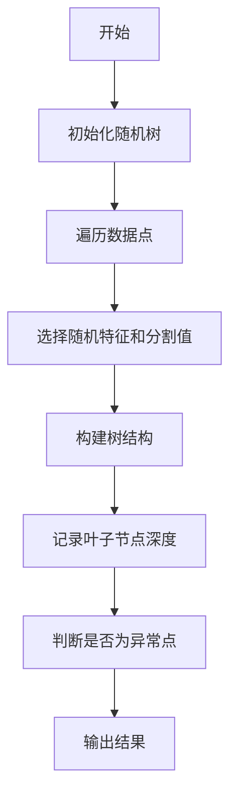
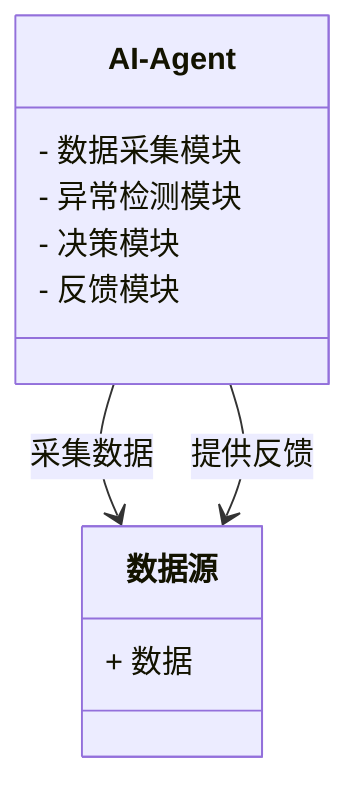
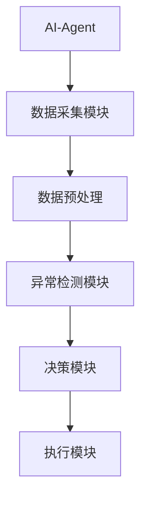

                 


# 构建具有异常检测能力的AI Agent

> 关键词：异常检测，AI Agent，机器学习，数据安全，智能系统

> 摘要：本文将详细探讨如何构建一个具有异常检测能力的AI Agent。从异常检测的基本概念到AI Agent的核心原理，从典型算法的实现到系统架构的设计，结合实际案例分析，为读者提供一个全面的解决方案。

---

## 第一部分：异常检测与AI Agent概述

### 第1章：异常检测的基本概念

#### 1.1 异常检测的定义与背景

异常检测是数据科学中的一个重要分支，旨在识别数据集中与预期模式或行为显著不同的数据点。这些异常点可能是错误、欺诈行为或潜在的安全威胁。随着数据量的爆炸式增长，异常检测在金融、医疗、网络安全等领域发挥着越来越重要的作用。

#### 1.2 AI Agent的定义与特点

AI Agent（人工智能代理）是一种能够感知环境、自主决策并执行任务的智能实体。它具备以下特点：
- **自主性**：能够在没有外部干预的情况下独立运作。
- **反应性**：能够实时感知环境变化并做出响应。
- **目标导向**：具备明确的目标，并能采取行动以实现这些目标。
- **学习能力**：能够通过数据和经验不断优化自身性能。

#### 1.3 异常检测在AI Agent中的作用

异常检测在AI Agent中的作用不可忽视。它帮助AI Agent识别异常行为，从而提高系统的安全性和可靠性。例如，在网络安全领域，AI Agent可以通过异常检测及时发现入侵行为；在金融领域，它可以识别欺诈交易。

---

### 第2章：异常检测的核心概念与联系

#### 2.1 异常检测的原理与方法

异常检测的方法可以大致分为以下几类：
1. **基于统计的方法**：通过分析数据的统计分布来识别异常点，如均值、方差等。
2. **基于机器学习的方法**：使用监督或无监督学习算法来训练模型，识别异常点。
3. **基于深度学习的方法**：利用神经网络的特征学习能力，捕捉数据中的异常模式。

#### 2.2 异常检测算法的对比分析

以下是几种常见的异常检测算法及其特点：

| 算法名称       | 特点                                   |
|----------------|--------------------------------------|
| Isolation Forest | 基于树结构，适合处理高维数据         |
| One-Class SVM   | 适用于低维数据，基于支持向量机       |
| Autoencoder    | 基于神经网络，能够捕捉数据的潜在特征   |

#### 2.3 异常检测与AI Agent的结合

在AI Agent中，异常检测通常通过以下步骤实现：
1. **数据收集**：从环境中收集相关数据。
2. **数据预处理**：清洗和标准化数据。
3. **模型训练**：使用异常检测算法训练模型。
4. **实时监控**：通过模型识别异常点并采取相应行动。

---

## 第二部分：异常检测算法原理与实现

### 第3章：异常检测算法的数学模型

#### 3.1 基于统计的异常检测模型

**多变量正态分布模型**：
假设数据服从多元正态分布，计算每个数据点的似然概率，低于某个阈值的数据点即为异常。

**数学公式**：
$$ P(x) = \frac{1}{(2\pi)^{n/2}|\Sigma|^{1/2}} \exp\left(-\frac{1}{2}(x-\mu)^T \Sigma^{-1}(x-\mu)\right) $$

其中，$\mu$ 是均值向量，$\Sigma$ 是协方差矩阵。

#### 3.2 基于机器学习的异常检测模型

**Isolation Forest算法**：
通过构建随机树，将数据点隔离到不同的叶子节点，叶子节点深度越深，数据点越可能是异常。

**流程图**：


---

## 第三部分：系统分析与架构设计

### 第4章：AI Agent的系统架构

#### 4.1 系统功能设计

AI Agent的系统功能模块包括：
- **数据采集模块**：负责收集环境数据。
- **异常检测模块**：执行异常检测算法。
- **决策模块**：根据检测结果采取行动。
- **反馈模块**：记录结果并优化模型。

**领域模型类图**：


#### 4.2 系统架构设计

**系统架构图**：


---

## 第四部分：项目实战

### 第5章：构建具有异常检测能力的AI Agent

#### 5.1 环境安装

需要安装以下库：
- Python 3.8+
- scikit-learn
- tensorflow
- numpy

#### 5.2 核心代码实现

以下是Isolation Forest算法的Python实现：

```python
from sklearn.ensemble import IsolationForest
import numpy as np

# 生成数据
X = np.random.rand(100, 2)
X[-1] = [3, 3]  # 添加异常点

# 训练模型
model = IsolationForest(random_state=42)
model.fit(X)

# 预测异常点
y_pred = model.predict(X)
print(y_pred[-1])  # 输出异常点标签
```

---

## 第五部分：总结与展望

### 第6章：总结与注意事项

#### 6.1 总结

本文详细介绍了如何构建一个具有异常检测能力的AI Agent，从理论到实践，为读者提供了全面的解决方案。通过选择合适的异常检测算法和优化系统架构，可以显著提高AI Agent的性能和安全性。

#### 6.2 注意事项

在实际应用中，需要注意以下几点：
- 数据的多样性和质量直接影响异常检测的效果。
- 需要定期更新模型，以适应环境的变化。
- 异常检测结果需要结合具体业务场景进行解释和处理。

---

### 作者

**作者：AI天才研究院/AI Genius Institute & 禅与计算机程序设计艺术 /Zen And The Art of Computer Programming**

---

通过以上步骤，我希望能够为读者提供一篇内容详实、结构清晰的技术博客文章，帮助他们理解并掌握如何构建具有异常检测能力的AI Agent。

