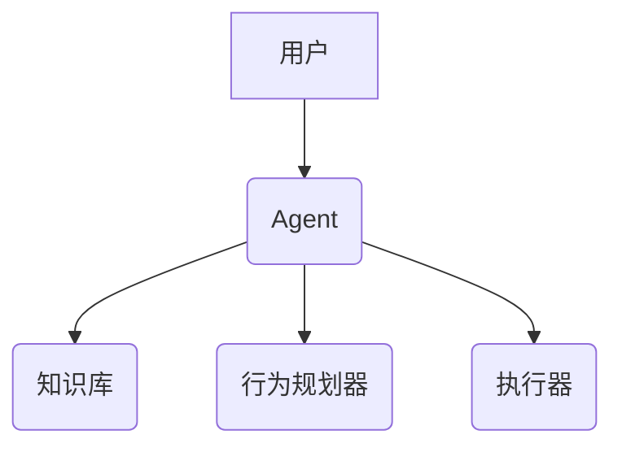

                 


# 构建具有持续优化能力的AI Agent

> 关键词：AI Agent，持续优化，强化学习，反馈机制，系统架构，项目实战

> 摘要：本文详细探讨了构建具有持续优化能力的AI Agent的各个方面，从基础概念到系统架构，再到项目实战，深入分析了其核心原理和实现方法。通过强化学习和反馈机制的结合，构建了一个能够不断优化自身行为的AI Agent系统，并通过具体案例展示了其实现过程和应用价值。

---

# 第一部分: AI Agent 的基础与背景

## 第1章: AI Agent 的基本概念与背景

### 1.1 AI Agent 的定义与核心概念

#### 1.1.1 什么是AI Agent
AI Agent（人工智能代理）是一种能够感知环境、自主决策并执行任务的智能实体。它可以是一个软件程序、机器人或其他智能系统，旨在通过与环境的交互来实现特定目标。

#### 1.1.2 AI Agent 的核心属性
- **自主性**：能够在没有外部干预的情况下自主运行。
- **反应性**：能够感知环境并实时做出反应。
- **目标导向性**：具有明确的目标，并通过行为规划实现目标。
- **学习能力**：能够通过经验改进自身的性能。

#### 1.1.3 AI Agent 的应用场景
- **智能助手**：如虚拟助手（Siri、Alexa）。
- **自动驾驶**：如自动驾驶汽车。
- **机器人**：如工业机器人或服务机器人。
- **推荐系统**：如电商平台的个性化推荐。

### 1.2 AI Agent 的发展背景

#### 1.2.1 AI 技术的演进
AI技术的发展可以分为几个阶段：
1. **符号AI阶段**：基于逻辑推理和知识库的规则系统。
2. **机器学习阶段**：基于数据的模式识别和预测。
3. **深度学习阶段**：基于神经网络的特征学习。
4. **大模型阶段**：基于Transformer架构的大语言模型。

#### 1.2.2 大模型在AI Agent 中的作用
大模型（如GPT系列）通过其强大的语言理解和生成能力，为AI Agent提供了强大的自然语言处理能力。AI Agent可以利用大模型来理解用户意图、生成自然语言回复，并进行上下文对话。

#### 1.2.3 当前AI Agent 的研究与应用现状
当前，AI Agent的研究主要集中在以下几个方面：
- **强化学习**：通过与环境的交互不断优化行为策略。
- **多智能体协作**：多个AI Agent协同完成复杂任务。
- **人机协作**：AI Agent与人类用户协作完成任务。

---

## 第2章: AI Agent 的核心概念与联系

### 2.1 AI Agent 的核心原理

#### 2.1.1 知识表示与推理
知识表示是将知识以计算机能够理解的形式存储起来。常见的知识表示方法包括：
- **符号表示**：使用符号逻辑表示知识。
- **语义网络**：通过节点和边表示概念及其关系。
- **知识图谱**：通过实体和关系构建大规模的知识网络。

#### 2.1.2 行为规划与决策
行为规划是AI Agent根据当前状态和目标，生成一系列动作以实现目标。常见的行为规划方法包括：
- **基于规则的规划**：通过预定义的规则生成动作。
- **基于搜索的规划**：通过搜索算法（如A*）生成最优路径。
- **基于模型的规划**：通过环境模型预测动作的结果。

#### 2.1.3 人机交互机制
人机交互是AI Agent与用户或环境进行信息交换的过程。常见的交互方式包括：
- **自然语言交互**：通过文本或语音进行对话。
- **图形交互**：通过图形界面进行操作。
- **命令交互**：通过命令行或按钮进行控制。

### 2.2 核心概念对比与ER实体关系图

#### 2.2.1 核心概念对比表格

| 概念       | 描述                                                                 |
|------------|----------------------------------------------------------------------|
| AI Agent   | 能够感知环境、自主决策并执行任务的智能实体。                         |
| 强化学习    | 通过与环境的交互，通过试错不断优化行为策略的学习方法。             |
| 反馈机制    | 系统根据用户反馈调整自身行为的过程。                                |
| 知识表示     | 将知识以计算机能够理解的形式存储起来。                            |
| 行为规划     | 根据当前状态和目标，生成一系列动作以实现目标。                    |

#### 2.2.2 ER实体关系图
```mermaid
er
actor(Agent, User) --> action:发起操作
Agent --> knowledge_base:存储知识
Agent --> planner:制定计划
Agent --> executor:执行操作
```

---

## 第3章: AI Agent 的持续优化机制

### 3.1 强化学习在持续优化中的应用

#### 3.1.1 强化学习的基本原理
强化学习是一种通过试错不断优化行为策略的学习方法。其核心是通过与环境的交互，获得奖励或惩罚信号，从而调整行为策略以最大化累计奖励。

#### 3.1.2 Q-learning算法在优化中的应用
Q-learning是一种经典的强化学习算法，适用于离散动作空间的环境。其更新公式为：
$$ Q(s, a) = Q(s, a) + \alpha (r + \gamma \max Q(s', a') - Q(s, a)) $$
其中：
- \( s \) 是当前状态，
- \( a \) 是动作，
- \( r \) 是奖励，
- \( \gamma \) 是折扣因子，
- \( \alpha \) 是学习率。

#### 3.1.3 策略梯度方法的实现
策略梯度方法是一种适用于连续动作空间的强化学习方法。其核心是通过优化策略参数，使得期望奖励最大化。其梯度更新公式为：
$$ \nabla \theta \log \pi_\theta(a|s) \cdot Q(s,a) $$

### 3.2 基于反馈的优化机制

#### 3.2.1 用户反馈的收集与处理
用户反馈是优化AI Agent行为的重要依据。常见的反馈类型包括：
- **显式反馈**：如评分、点赞、打赏等。
- **隐式反馈**：如点击、停留时间、购买行为等。

#### 3.2.2 基于反馈的强化学习模型
通过将用户反馈作为奖励信号，强化学习模型可以不断优化行为策略。例如，在对话系统中，用户的满意度评分可以作为奖励信号，优化对话生成策略。

#### 3.2.3 持续优化的闭环系统设计
闭环系统设计是指通过不断收集反馈、优化模型、执行新行为的循环过程。其流程如下：
1. 收集用户反馈。
2. 更新强化学习模型。
3. 执行优化后的行为。

---

## 第4章: AI Agent 的系统架构与设计

### 4.1 系统架构设计

#### 4.1.1 功能模块划分
一个典型的AI Agent系统可以划分为以下几个功能模块：
- **感知模块**：负责感知环境信息。
- **推理模块**：负责知识表示与推理。
- **规划模块**：负责行为规划与决策。
- **执行模块**：负责执行具体动作。
- **反馈模块**：负责收集用户反馈并优化系统。

#### 4.1.2 系统架构图


### 4.2 系统功能设计

#### 4.2.1 领域模型设计
领域模型是AI Agent对任务领域知识的建模。例如，在对话系统中，领域模型可以包括用户意图、对话上下文等。

#### 4.2.2 系统接口设计
系统接口是AI Agent与其他系统或用户的交互界面。例如，API接口、命令行接口或图形用户界面。

#### 4.2.3 交互流程设计
交互流程是AI Agent与用户或环境进行交互的具体步骤。例如：
1. 用户发起请求。
2. AI Agent感知请求内容。
3. AI Agent生成回复。
4. 用户反馈回复结果。
5. AI Agent根据反馈优化回复策略。

---

## 第5章: AI Agent 的算法实现与数学模型

### 5.1 算法原理讲解

#### 5.1.1 强化学习算法的数学模型
强化学习的核心是通过与环境的交互，不断优化行为策略。其数学模型包括状态空间、动作空间、奖励函数等。

#### 5.1.2 Q-learning算法的实现
Q-learning算法通过Q表存储状态-动作对的值，并通过强化学习更新Q表。例如：
- 状态空间：离散状态集合。
- 动作空间：离散动作集合。
- 奖励函数：定义每个状态-动作对的奖励值。

#### 5.1.3 策略梯度方法的数学推导
策略梯度方法通过优化策略参数，使得期望奖励最大化。其数学推导包括梯度计算和参数更新。

### 5.2 数学模型与公式

#### 5.2.1 Q-learning公式
$$ Q(s, a) = Q(s, a) + \alpha (r + \gamma \max Q(s', a') - Q(s, a)) $$

#### 5.2.2 策略梯度公式
$$ \nabla \theta \log \pi_\theta(a|s) \cdot Q(s,a) $$

---

## 第6章: 项目实战与代码实现

### 6.1 环境安装与配置

#### 6.1.1 安装Python环境
安装Python 3.8或更高版本。

#### 6.1.2 安装必要的库
安装以下库：
- `numpy`
- `tensorflow`
- `keras`

### 6.2 核

---

**作者：AI天才研究院/AI Genius Institute & 禅与计算机程序设计艺术 /Zen And The Art of Computer Programming**

---

### 项目实战与代码实现

#### 6.2.1 环境安装与配置
安装Python 3.8或更高版本，并安装以下库：
- `numpy`
- `tensorflow`
- `keras`

#### 6.2.2 系统核心实现源代码
以下是一个简单的强化学习算法实现代码：
```python
import numpy as np
import keras
from keras.models import Sequential
from keras.layers import Dense

# 定义强化学习环境
class Environment:
    def __init__(self):
        self.state_space = 4  # 状态空间维度
        self.action_space = 2  # 动作空间维度

    def get_state(self):
        # 返回当前状态
        return np.random.random(self.state_space)

    def get_reward(self, action):
        # 返回奖励值
        return np.random.randn()

# 定义强化学习算法
class Agent:
    def __init__(self, environment):
        self.env = environment
        self.model = self.build_model()

    def build_model(self):
        # 构建神经网络模型
        model = Sequential()
        model.add(Dense(8, activation='relu', input_dim=self.env.state_space))
        model.add(Dense(self.env.action_space, activation='softmax'))
        model.compile(optimizer='adam', loss='sparse_categorical_crossentropy')
        return model

    def act(self):
        # 选择动作
        state = self.env.get_state()
        prediction = self.model.predict(np.array([state]))
        action = np.argmax(prediction[0])
        return action

    def train(self, action, reward):
        # 更新模型
        state = self.env.get_state()
        target = np.zeros((1, self.env.action_space))
        target[0][action] = reward
        self.model.fit(np.array([state]), target, epochs=1, verbose=0)

# 训练AI Agent
env = Environment()
agent = Agent(env)
for _ in range(100):
    action = agent.act()
    reward = env.get_reward(action)
    agent.train(action, reward)
```

---

### 总结与展望

#### 6.3 最佳实践 tips
- 在实现AI Agent时，需要结合具体任务需求，选择合适的学习算法和系统架构。
- 在实际应用中，需要不断收集用户反馈，并根据反馈优化系统性能。
- 在系统设计时，需要考虑可扩展性和可维护性，以便后续优化和升级。

#### 6.4 小结
本文通过理论分析和实践案例，详细探讨了构建具有持续优化能力的AI Agent的各个方面。从基础概念到系统架构，再到项目实战，全面介绍了其核心原理和实现方法。

#### 6.5 注意事项
- 在实际应用中，需要考虑系统的安全性和稳定性。
- 在选择算法时，需要根据任务需求和数据规模进行权衡。
- 在优化过程中，需要平衡探索与利用，避免过早收敛。

#### 6.6 拓展阅读
- 《强化学习导论》
- 《深度学习与强化学习》
- 《AI Agent系统设计与实现》

---

**作者：AI天才研究院/AI Genius Institute & 禅与计算机程序设计艺术 /Zen And The Art of Computer Programming**

