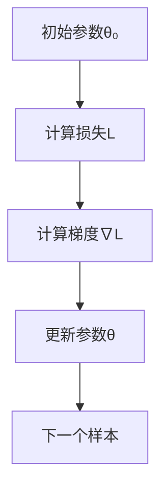
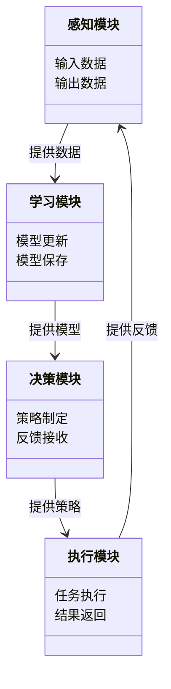

                 


# 构建具有持续学习与适应能力的AI Agent

---

## 关键词：AI Agent, 持续学习, 适应能力, 在线学习, 离线学习, 系统架构, 数学模型

---

## 摘要：  
本文深入探讨了构建具有持续学习与适应能力的AI Agent的核心概念、算法原理、系统架构及实现方法。通过分析动态环境中的学习挑战，结合在线学习与离线学习的优缺点，详细讲解了AI Agent的数学模型和优化算法。同时，本文还从系统设计的角度，提出了模块化架构和接口设计，并通过实际案例展示了如何将理论应用于实践。最终，本文为读者提供了构建高效、智能的AI Agent的全面指导。

---

## 第一部分: AI Agent的基础与背景

### 第1章: AI Agent概述

#### 1.1 AI Agent的基本概念
- **AI Agent的定义与特点**  
  AI Agent（人工智能代理）是一种能够感知环境、自主决策并执行任务的智能实体。其核心特点包括：自主性、反应性、目标导向和学习能力。
  
- **持续学习与适应能力的定义**  
  持续学习是指AI Agent能够在动态环境中不断更新知识和技能，以应对新任务和挑战；适应能力则是指AI Agent能够根据反馈调整行为策略，以提高任务执行效率。

- **AI Agent的核心要素**  
  包括感知模块、决策模块、学习模块和执行模块。这些模块协同工作，确保AI Agent能够实时感知环境、做出决策并执行任务。

#### 1.2 持续学习与适应能力的重要性
- **传统AI Agent的局限性**  
  传统AI Agent通常基于静态知识库，无法应对动态变化的环境。当环境发生变化时，AI Agent无法及时更新知识，导致任务执行效率下降。

- **持续学习与适应能力的优势**  
  持续学习使AI Agent能够实时更新知识库，适应环境变化；适应能力使AI Agent能够根据反馈调整行为策略，提高任务执行效率。

- **实际应用场景中的需求**  
  在智能客服、自动驾驶、智能推荐等领域，持续学习与适应能力是实现高效、智能决策的关键。

---

### 第2章: 持续学习与适应能力的背景

#### 2.1 问题背景分析
- **动态环境中的挑战**  
  动态环境中，环境条件不断变化，AI Agent需要快速调整策略以应对变化。

- **数据流的实时性要求**  
  在实时数据流环境中，AI Agent需要实时处理数据并做出决策。

- **知识更新的必要性**  
  知识库的静态性会导致AI Agent在面对新任务时表现不佳，因此需要持续更新知识库。

#### 2.2 问题描述与解决方案
- **问题描述**  
  在动态环境中，AI Agent需要具备持续学习与适应能力，以应对新任务和环境变化。

- **解决方案**  
  通过结合在线学习和离线学习的方法，AI Agent可以在动态环境中实时更新知识库，并根据反馈调整行为策略。

- **相关技术的现状与趋势**  
  当前，基于深度学习的持续学习算法和强化学习的适应性策略是研究的热点。

---

## 第二部分: 持续学习与适应能力的核心概念

### 第3章: 持续学习与适应能力的核心概念

#### 3.1 核心概念与原理
- **在线学习与离线学习的对比**  
  在线学习是指AI Agent在实时数据流中逐步更新模型；离线学习是指AI Agent在批量数据上进行模型优化。

- **模型更新的策略**  
  在线学习通常采用增量式更新，离线学习则采用批量更新。

- **知识表示与推理机制**  
  知识表示可以采用符号逻辑或向量空间模型，推理机制则依赖于逻辑推理或概率推理。

#### 3.2 核心概念的联系
- **持续学习与适应能力的关系**  
  持续学习为适应能力提供了知识更新的机制，而适应能力为持续学习提供了行为调整的反馈。

- **知识更新与任务执行的协同**  
  知识更新影响任务执行的效率和准确性，任务执行的结果又反过来影响知识更新的策略。

- **实时反馈与模型优化的结合**  
  实时反馈为模型优化提供了方向，模型优化为实时反馈提供了依据。

---

### 第4章: 持续学习与适应能力的数学模型

#### 4.1 持续学习的数学模型
- **在线学习的更新公式**  
  在线学习的模型更新公式可以表示为：  
  $$ \theta_{t+1} = \theta_t + \eta \cdot \nabla L(\theta_t) $$  
  其中，$\theta$ 表示模型参数，$\eta$ 表示学习率，$\nabla L$ 表示损失函数的梯度。

- **离线学习的优化算法**  
  离线学习的批量更新算法可以表示为：  
  $$ \theta_{t+1} = \theta_t - \eta \cdot \nabla L(\theta_t) $$  

- **模型权重更新的数学表达**  
  在线学习和离线学习的模型更新过程可以用 mermaid 流程图表示：



---

### 第5章: 持续学习与适应能力的算法原理

#### 5.1 在线学习算法
- **梯度下降法的在线更新**  
  在线梯度下降算法的实现步骤可以用 mermaid 序列图表示：

```mermaid
sequenceDiagram
    participant A[用户]
    participant B[模型]
    participant C[数据流]
    
    A -> B: 请求预测
    B -> C: 获取数据
    B -> B: 计算损失
    B -> B: 更新参数
    A <- B: 返回结果
```

- **随机梯度下降法的实现**  
  随机梯度下降法的代码实现如下：

```python
def online SGD(X, y, learning_rate):
    theta = np.zeros(shape=X.shape[1])
    for x, y_true in zip(X, y):
        y_pred = np.dot(x, theta)
        loss = (y_pred - y_true) ** 2
        gradient = 2 * (y_pred - y_true) * x
        theta -= learning_rate * gradient
        yield theta, loss
```

---

## 第三部分: 系统架构与设计

### 第6章: 系统架构与设计

#### 6.1 系统架构设计
- **系统功能模块划分**  
  系统主要包括感知模块、学习模块、决策模块和执行模块。

- **模块之间的关系**  
  感知模块负责数据采集，学习模块负责模型更新，决策模块负责策略制定，执行模块负责任务执行。

- **系统架构的优缺点**  
  模块化架构的优点是易于扩展和维护，缺点是模块之间的耦合性较高。

#### 6.2 系统功能设计
- **领域模型的mermaid类图**  
  下图展示了系统功能模块的类图：



---

## 第四部分: 项目实战

### 第7章: 项目实战

#### 7.1 环境配置
- **安装依赖**  
  需要安装 Python、TensorFlow 和其他相关库。

#### 7.2 系统核心实现源代码
- **在线学习代码实现**  

```python
import numpy as np

def online_learning(X, y, learning_rate=0.1):
    theta = np.zeros(X.shape[1])
    for i in range(X.shape[0]):
        x = X[i]
        y_true = y[i]
        y_pred = np.dot(x, theta)
        loss = (y_pred - y_true) ** 2
        gradient = 2 * (y_pred - y_true) * x
        theta -= learning_rate * gradient
        yield theta, loss
```

- **离线学习代码实现**  

```python
def batch_learning(X, y, learning_rate=0.1, epochs=100):
    theta = np.zeros(X.shape[1])
    for epoch in range(epochs):
        y_pred = np.dot(X, theta)
        loss = np.mean((y_pred - y) ** 2)
        gradient = 2 * np.dot(X.T, (y_pred - y)) / X.shape[0]
        theta -= learning_rate * gradient
        yield theta, loss
```

---

## 第五部分: 最佳实践与总结

### 第8章: 最佳实践与总结

#### 8.1 最佳实践
- **数据质量的重要性**  
  数据质量直接影响模型的性能，需确保数据的多样性和代表性。

- **模型更新的频率**  
  频繁的模型更新可能导致计算开销过大，需根据实际需求调整更新频率。

- **系统的可扩展性**  
  系统设计需考虑可扩展性，以便在数据量和任务复杂度增加时进行扩展。

#### 8.2 总结
本文详细探讨了构建具有持续学习与适应能力的AI Agent的核心概念、算法原理、系统架构及实现方法。通过理论与实践相结合，为读者提供了全面的指导。

---

## 作者：AI天才研究院/AI Genius Institute & 禅与计算机程序设计艺术 /Zen And The Art of Computer Programming

