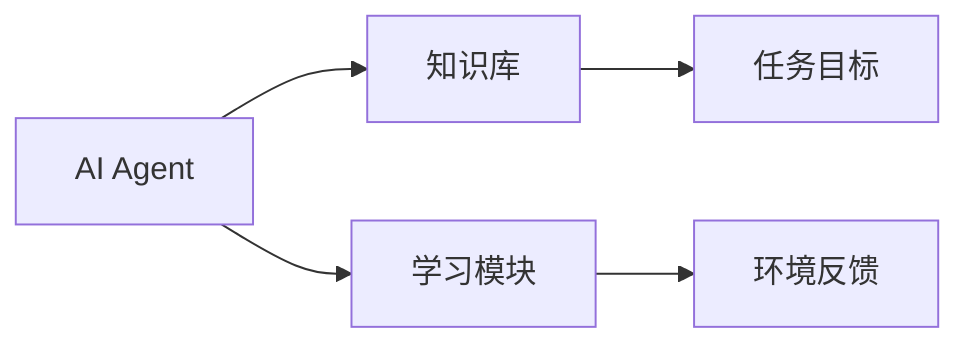
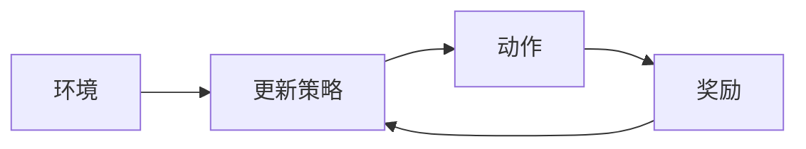
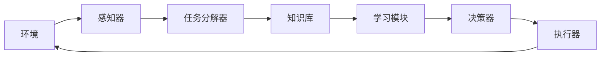

                 


# 构建具有终身学习能力的AI Agent

> **关键词**：AI Agent，终身学习，机器学习，强化学习，多任务学习，自适应系统  
> **摘要**：本文探讨如何设计和实现一个能够持续学习和适应复杂环境的AI Agent。通过分析终身学习的核心概念、算法原理、系统架构和实际案例，本文旨在为读者提供一个全面的视角，帮助他们理解并构建具有终身学习能力的AI Agent。

---

## 第一部分：构建具有终身学习能力的AI Agent基础

### 第1章：AI Agent的基本概念与背景

#### 1.1 AI Agent的定义与特点

**1.1.1 AI Agent的定义**

AI Agent（人工智能代理）是指在特定环境中能够感知并自主行动以实现目标的智能实体。AI Agent可以是软件程序、机器人或其他智能系统，其核心目标是通过与环境的交互来优化自身行为，以达到预设的目标。

**1.1.2 AI Agent的核心特点**

- **自主性**：AI Agent能够在没有外部干预的情况下自主决策。
- **反应性**：能够实时感知环境变化并做出相应的反应。
- **目标导向性**：所有行为均以实现特定目标为导向。
- **学习能力**：通过与环境的交互不断优化自身的知识和策略。

**1.1.3 终身学习能力的内涵**

终身学习能力是指AI Agent能够在不断变化的环境中，通过持续学习和知识更新，适应新的任务和挑战的能力。这种能力使得AI Agent能够从经验中学习，并将学到的知识迁移到新的任务中。

---

#### 1.2 终身学习能力的必要性

**1.2.1 AI Agent面临的动态环境挑战**

- 动态环境：环境条件不断变化，AI Agent需要能够快速适应新的情况。
- 多任务需求：在实际应用中，AI Agent可能需要同时处理多种任务。
- 不确定性：环境中的不确定性使得AI Agent必须具备灵活性和鲁棒性。

**1.2.2 终身学习能力在AI Agent中的作用**

- 提高适应性：使AI Agent能够应对动态环境中的变化。
- 增强任务处理能力：通过知识迁移和多任务学习，提升AI Agent的综合能力。
- 优化决策过程：通过持续学习，AI Agent能够做出更优的决策。

**1.2.3 传统AI与具有终身学习能力的AI Agent的区别**

- 传统AI：依赖于预训练的数据和规则，无法适应新的环境或任务。
- 终身学习AI Agent：能够通过与环境的交互不断更新知识和策略，适应新的挑战。

---

#### 1.3 当前研究进展与应用前景

**1.3.1 学术界的研究现状**

- 近年来，学术界在强化学习、迁移学习和多任务学习领域取得了显著进展。
- 研究重点逐渐从单任务学习转向终身学习和自适应学习。

**1.3.2 产业界的实践案例**

- 在机器人、自动驾驶、智能助手等领域，终身学习技术正在逐步应用。
- 例如，智能客服系统通过终身学习优化对话策略和用户需求理解。

**1.3.3 未来发展趋势**

- 终身学习技术将更加普及，成为AI Agent的核心能力。
- 多模态学习和人机协作将推动终身学习技术的进一步发展。

---

### 第2章：终身学习能力的核心概念与联系

#### 2.1 终身学习能力的核心概念

**2.1.1 知识表示与更新机制**

- 知识表示：通过符号、概率或神经网络等方式表示知识。
- 知识更新：通过在线学习或离线学习的方式更新知识库。

**2.1.2 自适应学习策略**

- 自适应策略：根据环境反馈动态调整学习策略。
- 策略优化：通过强化学习等方法优化策略。

**2.1.3 多任务学习与迁移学习**

- 多任务学习：同时学习多个任务，共享知识以提高效率。
- 迁移学习：将一个任务中学到的知识迁移到另一个任务中。

---

#### 2.2 核心概念的属性对比

**2.2.1 知识表示的可扩展性**

| 知识表示方式 | 可扩展性 |
|--------------|----------|
| 符号表示      | 较低      |
| 神经网络表示   | 较高      |

**2.2.2 学习策略的灵活性**

| 学习策略 | 灵活性 |
|----------|--------|
| 强化学习  | 高     |
| 监督学习  | 中     |

**2.2.3 多任务学习的协调性**

| 学习方式 | 协调性 |
|----------|--------|
| 平行学习  | 中     |
| 顺序学习  | 低     |

---

#### 2.3 实体关系图与架构设计



---

### 第3章：终身学习能力的算法原理

#### 3.1 基于强化学习的终身学习算法

**3.1.1 强化学习的基本原理**

强化学习是一种通过试错机制来优化决策策略的算法。AI Agent通过与环境交互，获得奖励或惩罚，从而调整自身策略以最大化累计奖励。

**3.1.2 终身学习的强化学习框架**

- 环境与动作空间：AI Agent需要在多任务环境中选择动作。
- 奖励机制：每个任务的奖励设计需要考虑任务之间的关联性。

**3.1.3 算法流程图**



---

#### 3.2 迁移学习与多任务学习算法

**3.2.1 迁移学习的基本原理**

迁移学习是一种将一个任务中学到的知识迁移到另一个任务中的方法。通过共享特征或参数，可以减少新任务的学习时间。

**3.2.2 多任务学习的核心思想**

多任务学习通过同时学习多个任务，共享知识以提高学习效率和泛化能力。

**3.2.3 算法实现代码示例**

```python
import torch
import torch.nn as nn

class MultiTaskModel(nn.Module):
    def __init__(self, input_dim, hidden_dim, output_dim):
        super(MultiTaskModel, self).__init__()
        self.shared = nn.Linear(input_dim, hidden_dim)
        self.task1 = nn.Linear(hidden_dim, output_dim)
        self.task2 = nn.Linear(hidden_dim, output_dim)

    def forward(self, x):
        x = self.shared(x)
        out1 = self.task1(x)
        out2 = self.task2(x)
        return out1, out2
```

---

#### 3.3 算法实现代码解读

- **输入处理**：输入数据经过共享层提取特征。
- **任务特定层**：每个任务都有独立的输出层，用于生成任务特定的输出。
- **反向传播**：多个任务的损失函数共同优化共享层和任务特定层。

---

**公式解析**：

- **共享层输出**：$$ h = \text{shared}(x) $$
- **任务1输出**：$$ y_1 = \text{task1}(h) $$
- **任务2输出**：$$ y_2 = \text{task2}(h) $$

---

**流程总结**：

1. **输入数据**：经过共享层提取特征。
2. **特征提取**：共享层将输入转换为中间特征。
3. **任务输出**：每个任务特定层基于中间特征生成输出。
4. **损失计算**：计算每个任务的损失并反向传播。
5. **参数优化**：优化共享层和任务特定层的参数。

---

## 第四章：系统分析与架构设计方案

### 4.1 系统功能设计

**功能需求分析**：

- **环境感知**：AI Agent需要感知环境的状态。
- **任务分解**：将复杂任务分解为多个子任务。
- **知识更新**：根据反馈更新知识库。
- **策略优化**：优化决策策略以提高任务成功率。

---

### 4.2 系统架构设计

**系统架构图**：



---

### 4.3 系统接口设计

- **感知器接口**：接收环境状态信息。
- **执行器接口**：发送动作指令到环境。
- **知识库接口**：存储和检索知识。
- **学习模块接口**：接收反馈并更新知识。

---

### 4.4 系统交互流程


---

## 第五章：项目实战

### 5.1 环境搭建

**工具安装**：

- **Python**：确保安装了最新版本的Python。
- **深度学习框架**：安装TensorFlow或PyTorch。
- **依赖管理**：使用pip安装所需库。

**代码实现**：

```python
import torch
import torch.nn as nn
import torch.optim as optim

class LifelongLearningAgent:
    def __init__(self, input_dim, hidden_dim, output_dim):
        self.model = MultiTaskModel(input_dim, hidden_dim, output_dim)
        self.optimizer = optim.Adam(self.model.parameters(), lr=0.001)
        self.criterion = nn.MSELoss()

    def forward(self, x):
        return self.model(x)

    def backward(self, outputs, labels):
        loss = self.criterion(outputs, labels)
        loss.backward()
        self.optimizer.step()
        return loss.item()
```

---

### 5.2 核心代码实现

**模型训练**：

```python
agent = LifelongLearningAgent(input_dim=10, hidden_dim=20, output_dim=5)
for epoch in range(100):
    inputs = ...  # 输入数据
    labels = ...  # 标签
    outputs = agent.forward(inputs)
    loss = agent.backward(outputs, labels)
    print(f"Epoch {epoch}, Loss: {loss}")
```

---

### 5.3 案例分析与总结

**案例分析**：

- **任务1**：图像分类任务。
- **任务2**：语音识别任务。
- **任务3**：自然语言处理任务。

**总结**：

通过多任务学习，AI Agent能够同时处理多种任务，并通过知识迁移提高学习效率。终身学习能力使得AI Agent能够不断优化自身能力，适应新的挑战。

---

## 第六章：最佳实践与小结

### 6.1 最佳实践

- **数据多样性**：确保训练数据的多样性，以提高模型的泛化能力。
- **任务关联性**：选择具有较强关联性的任务，以提高知识迁移的效果。
- **在线学习**：采用在线学习机制，使AI Agent能够实时更新知识。

---

### 6.2 小结

本文详细探讨了构建具有终身学习能力的AI Agent的关键技术，包括核心概念、算法原理、系统架构和实际案例。通过这些内容，读者可以理解并掌握如何设计和实现一个能够持续学习和适应复杂环境的AI Agent。

---

## 第七章：注意事项与拓展阅读

### 7.1 注意事项

- **计算资源**：终身学习算法通常需要大量的计算资源。
- **算法选择**：根据具体任务选择合适的算法和模型。
- **数据质量**：数据质量和多样性对模型性能有重要影响。

---

### 7.2 拓展阅读

- **强化学习**：深入学习强化学习的理论与实践。
- **多任务学习**：研究多任务学习的最新进展与应用。
- **知识图谱**：探索知识图谱在终身学习中的应用。

---

**作者：AI天才研究院/AI Genius Institute & 禅与计算机程序设计艺术 /Zen And The Art of Computer Programming**

