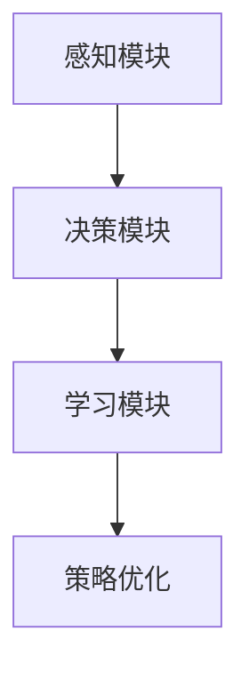

                 


# 构建具有自主学习能力的AI Agent

> 关键词：AI Agent，自主学习，强化学习，深度学习，人工智能，系统架构

> 摘要：本文详细探讨了构建具有自主学习能力的AI Agent的理论基础、算法实现、系统设计及实际应用。从基础概念到复杂算法，从系统架构到项目实战，全面解析了AI Agent的自主学习能力的构建过程。文章内容涵盖强化学习、监督学习、混合学习等多种学习方式，并结合实际案例，深入分析了AI Agent在不同场景下的应用与优化。

---

## 第一部分: 构建具有自主学习能力的AI Agent基础

### 第1章: AI Agent与自主学习概述

#### 1.1 AI Agent的基本概念
AI Agent（智能体）是指在环境中能够感知并自主行动以实现目标的实体。它可以是一个软件程序、机器人或其他智能系统。AI Agent的核心特征包括自主性、反应性、目标导向性和社会性。

自主学习AI Agent是一种能够在没有外部监督的情况下，通过与环境的交互主动学习和改进自身行为的智能体。它能够根据反馈不断调整策略，优化决策过程。

#### 1.2 自主学习的背景与现状
自主学习AI Agent的背景可以追溯到人工智能的起源。随着计算能力的提升和大数据技术的发展，自主学习AI Agent逐渐从理论走向实践。当前，自主学习AI Agent已在游戏AI、机器人控制、推荐系统等领域取得显著进展。

#### 1.3 自主学习与传统AI的区别
传统AI主要依赖于规则和预定义的逻辑，而自主学习AI Agent能够通过经验不断优化自身的策略。传统AI无法适应环境的变化，而自主学习AI Agent能够在动态环境中自适应地调整行为。

---

### 第2章: 自主学习AI Agent的核心概念与原理

#### 2.1 自主学习的核心概念
- **知识表示**：通过状态、动作和奖励等概念描述环境中的信息。
- **状态空间**：所有可能的状态的集合，AI Agent通过感知环境获得当前状态。
- **动作空间**：AI Agent在给定状态下可以执行的所有可能动作。

#### 2.2 自主学习的原理
- **强化学习**：通过与环境的交互，AI Agent学习如何采取最优动作以获得最大累计奖励。
- **监督学习**：通过标签数据，AI Agent学习输入与输出之间的映射关系。
- **混合学习**：结合强化学习和监督学习的优势，提升AI Agent的学习能力。

#### 2.3 自主学习与传统AI的区别
- 传统AI依赖于规则和逻辑推理，而自主学习AI Agent通过经验优化策略。
- 传统AI无法适应环境变化，而自主学习AI Agent能够动态调整行为。

---

## 第二部分: 自主学习AI Agent的算法与数学模型

### 第3章: 自主学习算法原理

#### 3.1 强化学习算法
- **Q-learning算法**：通过更新Q值表学习状态-动作对的最优值。
- **Deep Q-Network (DQN)算法**：结合深度学习和Q-learning，提升学习效率。
- **Policy Gradient方法**：直接优化策略，而非值函数。

#### 3.2 监督学习算法
- **线性回归**：用于简单的回归任务。
- **支持向量机**：用于分类任务。
- **神经网络**：用于复杂的非线性任务。

#### 3.3 混合学习算法
- **强化学习与监督学习的结合**：利用监督学习数据初始化策略，再通过强化学习优化。

---

### 第4章: 数学模型与公式

#### 4.1 强化学习的数学模型
- **Q-learning公式**
$$ Q(s,a) = Q(s,a) + \alpha (r + \gamma \max Q(s',a') - Q(s,a)) $$
- **Value函数**
$$ V(s) = \max_a Q(s,a) $$

#### 4.2 监督学习的数学模型
- **线性回归公式**
$$ y = \theta x + \epsilon $$
- **神经网络的损失函数**
$$ L = \frac{1}{2} (y_{\text{pred}} - y_{\text{true}})^2 $$

---

## 第三部分: 自主学习AI Agent的系统架构与实现

### 第5章: 系统架构设计

#### 5.1 系统功能设计
- **感知模块**：通过传感器或数据接口获取环境信息。
- **决策模块**：基于当前状态和历史经验，选择最优动作。
- **学习模块**：通过强化学习或监督学习优化策略。

#### 5.2 系统架构图


---

### 第6章: 项目实战

#### 6.1 环境安装
- 安装Python和相关库（如TensorFlow、Keras）。
- 安装Mermaid工具用于绘制图表。

#### 6.2 核心实现代码
```python
import numpy as np

class AI_Agent:
    def __init__(self, state_space, action_space):
        self.state_space = state_space
        self.action_space = action_space
        self.Q_table = np.zeros((state_space, action_space))

    def感知环境(self, state):
        return state

    def选择动作(self, state, epsilon=0.1):
        if np.random.random() < epsilon:
            return np.random.randint(self.action_space)
        return np.argmax(self.Q_table[state])

    def更新Q表(self, state, action, reward, next_state):
        self.Q_table[state, action] += 0.1 * (reward + 0.9 * np.max(self.Q_table[next_state]) - self.Q_table[state, action])

if __name__ == "__main__":
    agent = AI_Agent(5, 3)
    state = 0
    action = agent选择动作(state)
    reward = 1
    next_state = 1
    agent更新Q表(state, action, reward, next_state)
```

---

### 第7章: 最佳实践与未来展望

#### 7.1 小结
构建具有自主学习能力的AI Agent需要结合强化学习、监督学习等多种算法，并通过合理的系统架构设计实现。

#### 7.2 注意事项
- 确保环境与算法的匹配性。
- 定期优化策略以适应环境变化。

#### 7.3 未来展望
随着深度学习和强化学习的进一步发展，自主学习AI Agent将在更多领域展现出强大的应用潜力。

---

## 作者：AI天才研究院 & 禅与计算机程序设计艺术

--- 

以上是《构建具有自主学习能力的AI Agent》的技术博客文章的详细内容，涵盖了从基础概念到实际应用的各个方面。希望对您有所帮助！

