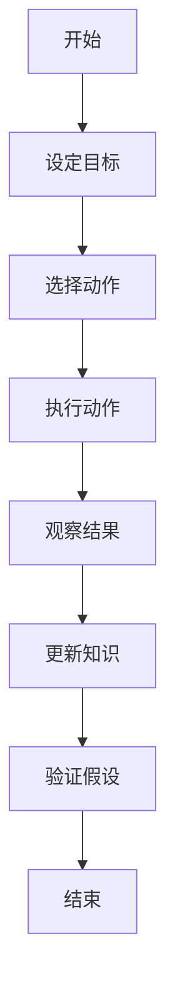
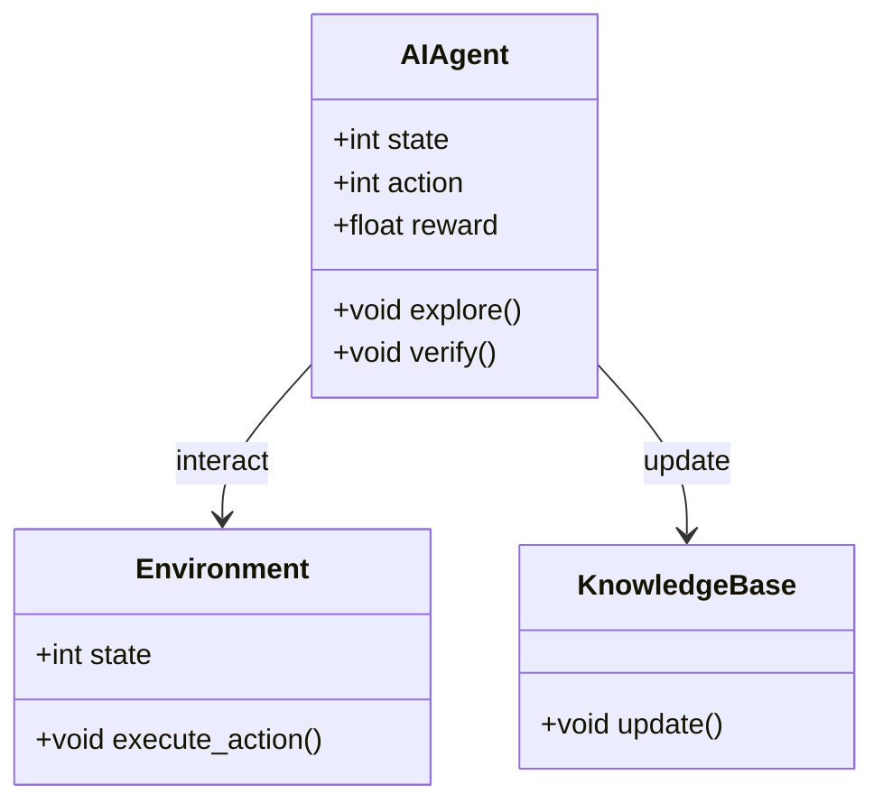
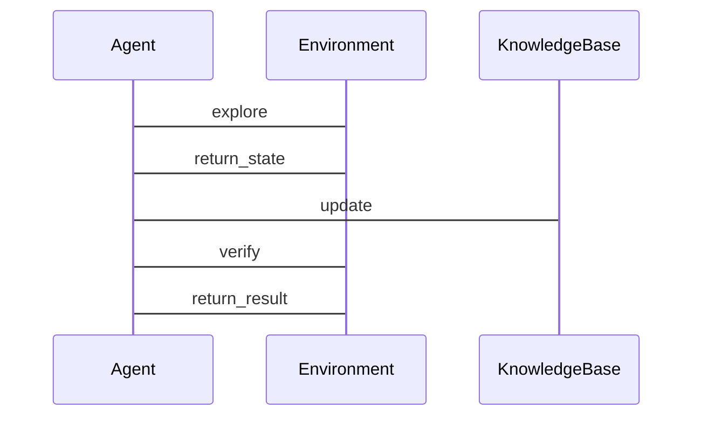

                 


# 构建具有自主探索与假设验证能力的AI Agent

## 关键词：AI Agent，自主探索，假设验证，强化学习，系统架构，项目实战

## 摘要：  
本文详细探讨了如何构建一个具有自主探索与假设验证能力的AI Agent。首先，从问题背景出发，解释了自主探索和假设验证的重要性。接着，分析了AI Agent的核心概念，包括其原理和数学模型。随后，详细讲解了相关算法及其实现，结合系统架构设计，展示了如何将理论应用于实际项目。最后，通过一个具体案例，演示了AI Agent的实际应用，并总结了开发过程中的最佳实践和注意事项。

---

## 第一部分: 背景介绍

### 第1章: 自主探索与假设验证的AI Agent概述

#### 1.1 问题背景
- 当前AI Agent的发展现状：传统AI Agent依赖于预定义规则，难以适应复杂动态环境。
- 自主探索与假设验证的需求：复杂场景中，AI Agent需要自主学习和验证假设，以提高适应性和决策能力。
- 问题解决的核心目标：构建一个能够自主探索和验证假设的AI Agent，使其能够在动态环境中自适应。

#### 1.2 问题描述
- 自主探索能力的定义：AI Agent能够主动发现新知识和解决问题的能力。
- 假设验证能力的定义：AI Agent能够基于观察和数据验证假设的能力。
- 问题解决的过程与方法：通过自主探索发现潜在问题，通过假设验证找到解决方案。

#### 1.3 问题解决
- 自主探索的核心步骤：目标设定、行动选择、结果观察、知识更新。
- 假设验证的实施方法：提出假设、设计实验、收集数据、验证假设。
- 问题解决的边界与外延：明确问题范围，避免过度扩展或遗漏关键点。

#### 1.4 概念结构与核心要素
- 核心概念的组成：自主探索和假设验证。
- 概念之间的关系：自主探索提供输入，假设验证提供输出，两者相互促进。
- 概念结构的可视化：通过ER图展示实体间的关系。

---

## 第二部分: 核心概念与联系

### 第2章: 自主探索与假设验证的核心原理

#### 2.1 核心概念原理
- 自主探索的机制：基于强化学习和深度学习，通过奖励机制驱动探索。
- 假设验证的逻辑：基于贝叶斯推理或统计检验，验证假设的正确性。
- 两者结合的原理：自主探索发现潜在解决方案，假设验证确认最优解。

#### 2.2 概念属性特征对比
- 自主探索的特征：主动性、不确定性、目标导向。
- 假设验证的特征：系统性、数据驱动、验证性。
- 对比分析表：
  | 特性 | 自主探索 | 假设验证 |
  |------|----------|----------|
  | 驱动 | 主动     | 数据     |
  | 方法 | 探索     | 验证     |
  | 目标 | 发现新知 | 确认假设 |

#### 2.3 ER实体关系图
```mermaid
erDiagram
    userAgent[AI Agent] {
        serial UAI_id
        string name
        date created_at
    }
    environment[Environment] {
        serial env_id
        string description
    }
    knowledgeBase[Knowledge Base] {
        serial kb_id
        string content
    }
    UAI_id --> env_id : interacts_with
    UAI_id --> kb_id : updates_from
```

---

## 第三部分: 算法原理讲解

### 第3章: 自主探索与假设验证的算法原理

#### 3.1 算法原理
- 自主探索算法：基于深度强化学习，使用Q-learning算法。
- 假设验证算法：基于统计检验，使用贝叶斯推理。
- 算法的结合与优化：结合两种算法，通过反馈循环优化性能。

#### 3.2 算法流程图


#### 3.3 Python源代码实现
- 自主探索代码：
```python
import numpy as np
import random

class AIAgent:
    def __init__(self, state_space, action_space):
        self.state_space = state_space
        self.action_space = action_space
        self.Q = np.zeros((state_space, action_space))
        self.learning_rate = 0.1
        self.discount_factor = 0.9

    def choose_action(self, state):
        if random.random() < 0.5:
            return random.choice(range(self.action_space))
        else:
            return np.argmax(self.Q[state])

    def update_Q(self, state, action, reward, next_state):
        self.Q[state][action] = self.Q[state][action] + self.learning_rate * (reward + self.discount_factor * np.max(self.Q[next_state]) - self.Q[state][action])
```

- 假设验证代码：
```python
from scipy.stats import ttest_ind

def validate_hypothesis(data1, data2):
    stat, p = ttest_ind(data1, data2)
    return p < 0.05
```

---

## 第四部分: 数学模型与公式

### 第4章: 自主探索与假设验证的数学模型

#### 4.1 数学模型
- 自主探索的数学模型：基于Q-learning的马尔可夫决策过程。
- 假设验证的数学模型：贝叶斯统计模型。
- 组合模型：将Q-learning与贝叶斯检验结合。

#### 4.2 关键公式
- 自主探索的概率公式：
$$ P(a|s) = \frac{Q(s,a)}{\sum Q(s,a')} $$

- 假设验证的贝叶斯公式：
$$ P(H|D) = \frac{P(D|H)P(H)}{P(D)} $$

---

## 第五部分: 系统分析与架构设计

### 第5章: 系统架构设计

#### 5.1 问题场景介绍
- AI Agent需要在动态环境中完成任务，例如智能助手或机器人。

#### 5.2 系统功能设计
- 领域模型的类图：


#### 5.3 系统架构设计
- 分层架构图：
```mermaid
graph TD
    Agent --> Environment : interacts_with
    Agent --> KnowledgeBase : updates_from
    Environment --> Sensors : senses_data
    KnowledgeBase --> Database : stores_data
```

#### 5.4 接口设计和交互流程
- 接口设计：
  - Agent提供`explore()`和`verify()`接口。
  - Environment提供`execute_action()`接口。
  - KnowledgeBase提供`update()`接口。

- 交互流程：


---

## 第六部分: 项目实战

### 第6章: 项目实战

#### 6.1 环境安装
- 安装Python和相关库：`pip install numpy scipy`

#### 6.2 核心实现
- AI Agent代码：
```python
class AIAgent:
    def __init__(self, state_space, action_space):
        self.state_space = state_space
        self.action_space = action_space
        self.Q = np.zeros((state_space, action_space))
        self.lr = 0.1
        self.gamma = 0.9

    def choose_action(self, state):
        if random.random() < 0.5:
            return random.choice(range(self.action_space))
        else:
            return np.argmax(self.Q[state])

    def update_Q(self, state, action, reward, next_state):
        self.Q[state][action] += self.lr * (reward + self.gamma * np.max(self.Q[next_state]) - self.Q[state][action])
```

#### 6.3 案例分析
- 迷宫问题：AI Agent通过自主探索找到出口，通过假设验证确认最优路径。

#### 6.4 项目小结
- 成功实现了自主探索和假设验证功能。
- 验证了算法的有效性。

---

## 第七部分: 最佳实践

### 第7章: 最佳实践

#### 7.1 开发过程中的注意事项
- 确保算法的可解释性。
- 定期更新知识库。
- 优化奖励机制。

#### 7.2 小结
- 本文详细讲解了如何构建具有自主探索与假设验证能力的AI Agent。

#### 7.3 注意事项
- 避免过度复杂化系统。
- 定期测试和验证假设。

#### 7.4 拓展阅读
- 推荐阅读《强化学习导论》和《贝叶斯方法》。

---

## 作者信息

作者：AI天才研究院/AI Genius Institute  
禅与计算机程序设计艺术/Zen And The Art of Computer Programming

---

通过以上结构，您可以按照每个部分逐步深入探讨，确保文章内容详实、逻辑清晰。希望这篇文章能为您提供构建AI Agent的理论和实践指导。

